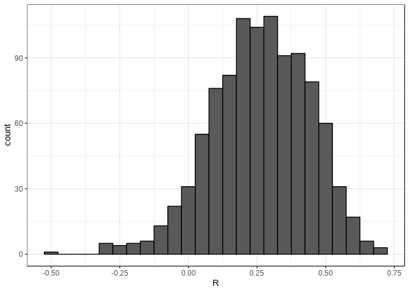

Linear Regression - Introduction to Regression
================

Introduction
============

In the **Introduction to Regression** section, you will learn the basics of linear regression.

After completing this section, you will be able to:

        * Understand how Galton developed linear regression.
        * Calculate and interpret the sample correlation.
        * Stratify a dataset when appropriate.
        * Understand what a bivariate normal distribution is.
        * Explain what the term variance explained means.
        * Interpret the two regression lines.

This section has three parts: **Baseball as a Motivating Example, Correlation**, and **Stratification and Variance Explained**.

Motivating Example: Moneyball
-----------------------------

As motivation for this course, we will make reference to the Oaklands beisball team, in 2002 they changed the way to make the team using statistics.

The library to use is `Lahman` library.

**Sabermetrics**: The approach of using data to predict what outcomes best.

In this course in order to simplify things, we will focus on predicting scoring runs, we will ignore other metrics, but they are important as well.

Approach divided on:

    1. To Determine which recorded player specific statistics predict runs.
    2. To Examine if players were undervalued based on what our first analysis predicts.

Baseball Basics
---------------

We will distill the sport to the basic knowledge one needs to know to effectively attack the data science challenge.

    * Goal: Score more runs.
    * 9 baters, after the 9th bats, start over the first again.
    * Plate Apperance (PA): Each time a batter go to the plate to bat, it is called
      - The plate appearance ends with a binary outcome-- 
          + you either make an out, that's a failure and sit back down, or 
          + you don't, that's a success and you get to run around the bases and potentially score a run.  
    * 9 innings, that is 9 tries to score for each team
      - each inning is completed after 3 outs.
      
      

When you bat you want to hit the ball hard. If you hit it hard enough, it's a home run, the best possible outcome as you get at least one automatic run. But sometimes, due to chance, you hit the ball very hard and a defender catches it, which makes it an out, a failure. In contrast, sometimes you hit the ball softly but it lands just in the right place. You get a hit which is a success. The fact that there is chance involved hints at why probability models will be involved in all this. Now there are several ways to succeed. Understanding this distinction will be important for our analysis. When you hit the ball you want to pass as many bases as possible. There are four bases with the fourth one called home plate. Home plate is where you start, where you try to hit. So the bases form a cycle. If you get home, you score a run.

Ways to succeed:

    * Base on balls (BB)
    * Single
    * Double (X2B)
    * Triple (X3B)
    * Home run (HR)

Other points to consider

    * Steal the base, There is also the option when you are on a base.  
    * Batting average, is considered the most important offensive statistic.
      - Defined as H/AB
      - Hit (H), when the batter hit the ball
      - At bat (AB), when the batter goes to the plate.
      - The current average is between 20% - 38%
        + In the baseball jergon, if a batter has batting average of 25%, it's refered to as "batting 250"
      - It is important to note that this metrics ignores (BB), also outs when the player tries to steal a base.

### Question

    * Can we use data science to determine if it's better to pay for BB ir SB?

We must be aware that some runs are also team work, so if we hire a player, stealing bases may not be as good as in the previous team if the team members are not helping on this. *So We also need to check the team statistics too.*

Bases on Balls or Stolen Bases
------------------------------

### Do teams that hit more home runs score more runs?

The visualization of choice when exploring the relationship between two variables like home runs and runs is a *scatter plot*

#### Home runs vs Runs

**We can see there is a strong corelation between those variables**

``` r
library(Lahman)
library(dplyr)
library(ggplot2)
library(dslabs)
data(LahmanData)
ds_theme_set()
Teams %>% filter(yearID %in% 1961:2001)  %>%
  mutate(HR_per_game = HR/G, R_per_game = R/G) %>%
  ggplot(aes(HR_per_game,R_per_game)) + 
  geom_point(alpha = 0.5)
```

 **Slope = 1.845**

#### Stolen bases vs Runs

Now taking a look at the stolen bases per game vs runs per game.
**We can see there is weak corelation between those variables**

``` r
Teams %>% filter(yearID %in% 1961:2001) %>%
  mutate(SB_per_game = SB/G, R_per_game = R/G) %>%
  ggplot(aes(SB_per_game, R_per_game)) +
  geom_point(alpha = 0.5)
```

 **Slope = 0.278**

#### Bases on balls vs Runs

Now checking the relationship between bases on balls vs runs.

It tends to a strong corelation, but not as strong as Home runs v Runs.

``` r
Teams %>% filter(yearID %in% 1961:2001) %>%
  mutate(BB_per_game = BB/G, R_per_game = R/G) %>%
  ggplot(aes(BB_per_game, R_per_game)) +
  geom_point(alpha = 0.5)
```

 **Slope 0.735**

### Confounding

We know that, by definition, home runs cause runs, because when you hit a home run, at least one run will score. Now it could be that home runs also cause the bases on balls. If you understand the game, you will agree with me that that could be the case. So it might appear that a base on ball is causing runs, when in fact, it's home runs that's causing both. This is called **confounding**.

An important concept you will learn about. Linear regression will help us parse all this out and quantify the associations. This will then help us determine what players to recruit. Specifically, we will try to predict things like how many more runs will the team score if we increase the number of bases on balls but keep the home runs fixed. Regression will help us answer this question, as well.

Correlation Comprehension Check
-------------------------------

### Correlation

There is a relationship between Correlation and Linear Regression, in old days a question was tried to be answer:

    * How much of a son's height can I predict with the parents height?

The information is located on: *HistData* dataset.

``` r
library(HistData)
data("GaltonFamilies")
galton_heights <- GaltonFamilies %>%
  filter(childNum == 1 && gender == "male") %>%
  select(father, childHeight) %>%
  rename( son= childHeight)
```

Since both distributions, father and son's heights, are *approximated to normal distribution*, we can use two averages and two standard deviations as summaries.

``` r
galton_heights %>% summarize(mean(father), sd(father), mean(son), sd(son))
```

    ##   mean(father) sd(father) mean(son)  sd(son)
    ## 1     69.19711   2.476479  66.74593 3.579251

But we are not able to see the relationship between the father and the son heights, as can be seen here:

``` r
galton_heights %>%
  ggplot(aes(father,son)) +
  geom_point(alpha = 0.5)
```


**The correlation coefficient is the data that can describe this relationship**

### Correlation Coefficient

**Correlation coefficient** is defined for a list of pairs.


from the formula mu\_x and mu\_y are the averages of the corresponding dataset set. and sigma\_X and sigma\_y are the standard deviation.

**rho is the correlation**, and it is the greek letter for r, *that stands for regression*.

If x and y are unrelated, then the product of these two quantities will be positive. That happens when they are both positive or when they are both negative as often as they will be negative. That happens when one is positive and the other is negative, or the other way around. One is negative and the other one is positive. This will average to about 0.
**The correlation is this average.** And therefore, unrelated variables will have a correlation of about 0. If instead the quantities vary together, then we are averaging mostly positive products. Because they're going to be either positive times positive or negative times negative. And we get a positive correlation. If they vary in opposite directions, we get a negative correlation. **Another thing to know is that we can show mathematically that the correlation is always between negative 1 and 1.**

When you have a perfect correlation, for instance, comparing one list to itself, you can get this formula. 

**The correlation between father and sons' height is about 0.5** **NOTE: The dataset downloaded is getting different results than the ones in the course, **

``` r
galton_heights %>% summarise(cor(father,son))
```

    ##   cor(father, son)
    ## 1        0.2660385

We saw what the data looks like when the correlation is 0.5. To see what data looks like for other values of rho, here are six examples of pairs with correlations ranging from negative 0.9 to 0.99. When the correlation is negative, we see that they go in opposite direction. As x increases, y decreases. When the correlation gets either closer to 1 or negative 1, we see the clot of points getting thinner and thinner. When the correlation is 0, we just see a big circle of points. End of transcript. Skip to the start.

### Sample Correlation is a Random Variable

**Reminder about random variability.** In most data science applications, we do not observe the population, but rather a sample. As with the average and standard deviation, the sample correlation is the most commonly used estimate of the population correlation. This implies that the correlation we compute and use as a summary is a random variable. As an illustration, let's assume that the 179 pairs of fathers and sons is our entire population. A less fortunate geneticist can only afford to take a random sample of 25 pairs. The sample correlation for this random sample can be computed using this code.

``` r
set.seed(0)
R <- sample_n(galton_heights, 25, replace= TRUE) %>%
  summarize(cor(father,son))
```

Here, the variable R is the random variable. We can run a monte-carlo simulation to see the distribution of this random variable. Here, we recreate R 1000 times, and plot its histogram.

``` r
B <- 1000
N <- 25
R <- replicate(B, {
  sample_n(galton_heights, N, replace = TRUE) %>%
    summarize(r=cor(father,son)) %>% .$r
})

data.frame(R) %>% ggplot(aes(R)) +
  geom_histogram(binwidth = 0.05, color="black")
```



We see that the expected value is the population correlation, the mean of these Rs is 0.5, and that it has a relatively high standard error relative to its size, SD 0.147.

``` r
mean(R) #the example from course was expecting 0.501
```

    ## [1] 0.2636484

``` r
sd(R) #The exercise result expected was .147
```

    ## [1] 0.1779981

This is something to keep in mind when interpreting correlations. It is a random variable, and it can have a pretty large standard error.

**Also note that because the sample correlation is an average of independent draws, the Central Limit Theorem actually applies.**

Therefore, for a large enough sample size N, the distribution of these Rs is approximately normal. 

The expected value we know is the population correlation. The standard deviation is somewhat more complex to derive, but this is the actual formula here. In our example, N equals to 25, does not appear to be large enough to make the approximation a good one, as we see in this ggplot.


Stratification and Variance Explained
-------------------------------------

### Anscombe's quartet/stratification

**Correlation is not always a good summary of the relationship between two variables.**

For example you can see the following data sets, refered as *Anscombe's quarter*


*All those have correlations of 0.82*

**Correlation is only meaningful in a particular context.**

To help us understand when it is that correlation is meaningful as a summary statistic, we'll try to predict the son's height using the father's height. This will help motivate and define linear regression.

We start by demonstrating how correlation can be useful for prediction. Suppose we are asked to guess the height of a randomly selected son. Because of the distribution of the son height is approximately normal, we know that the average height of 70.5 inches is a value with the highest proportion and would be the prediction with the chances of minimizing the error. But what if we are told that the father is 72 inches? Do we still guess 70.5 inches for the son? *The father is taller than average*, specifically he is 1.14 standard deviations taller than the average father. So shall we predict that the son is also 1.14 standard deviations taller than the average son? *It turns out that this would be an overestimate*. To see this, we look at all the sons with fathers who are about 72 inches. *We do this by stratifying the father's side.* We call this a *conditional average*, since we are computing the average son height conditioned on the father being 72 inches tall.

A challenge when using this approach in practice is that we don't have many fathers that are exactly 72. In our data set, we only have eight. If we change the number to 72.5, we would only have one father who is that height. This would result in averages with large standard errors, and they won't be useful for prediction for this reason. But for now, what we'll do is we'll take an approach of creating strata of fathers with very similar heights. Specifically, we will round fathers' heights to the nearest inch. This gives us the following prediction for the son of a father that is approximately 72 inches tall. We can use this code and get our answer, which is 71.84.

``` r
conditional_avg <- galton_heights %>% 
  filter(round(father) == 72) %>%
  summarize(avg = mean(son)) %>% .$avg
conditional_avg
```

    ## [1] 68.21194

**Note: in the exercise from the course, the result was 71.84.**

This is 0.54 standard deviations larger than the average son, a smaller number than the 1.14 standard deviations taller that the father was above the average father. Stratification followed by box plots lets us see the distribution of each group. Here is that plot.

``` r
galton_heights %>% mutate(father_strata = factor(round(father))) %>%
  ggplot(aes(father_strata, son)) +
  geom_boxplot() +
  geom_point()
```


We can see that the centers of these groups are increasing with height, not surprisingly. The means of each group appear to follow a linear relationship. We can make that plot like this, with this code.

``` r
galton_heights %>% 
  mutate(father = round(father)) %>%
  group_by(father) %>%
  summarize(son_conditional_avg = mean(son)) %>%
  ggplot(aes(father, son_conditional_avg)) +
  geom_point()
```


See the plot and notice that this appears to follow a line. **The slope of this line appears to be about 0.5,** which happens to be the correlation between father and son heights. This is not a coincidence. To see this connection, let's plot the standardized heights against each other, son versus father, with a line that has a slope equal to the correlation. Here's the code, Here's a plot.

``` r
r <- galton_heights %>% summarize(r = cor(father,son)) %>% .$r
galton_heights %>%
  mutate(father = round(father)) %>%
  group_by(father) %>%
  summarize(son = mean(son)) %>%
  mutate(z_father = scale(father), z_son = scale(son)) %>%
  ggplot(aes(z_father, z_son)) +
  geom_point() +
  geom_abline(intercept = 0, slope = r)
```


This line is what we call the regression line. In a later video, we will describe Galton's theoretical justification for using this line to estimate conditional means. Here, we define it and compute it for the data at hand. **The regression line for two variables, x and y, tells us that for every standard deviation sigma x increase above the average mu x.** For x, y grows rho standard deviations sigma y above the average mu y. **The formula for the regression line is therefore this one.** 

*If there's perfect correlation, we predict an increase that is the same number of SDs.*

*If there's zero correlation, then we don't use x at all for the prediction of y.*

*For values between 0 and 1, the prediction is somewhere in between. If the correlation is negative, we predict a reduction, instead of an increase.*

It is because when the correlation is positive but lower than the one, that we predict something closer to the mean, that we call this regression. The son regresses to the average height. In fact, the title of Galton's paper was "Regression Towards Mediocrity in Hereditary Stature." Note that if we write this in the standard form of a line, y equals b plus mx, where b is the intercept and m is the slope,


the regression line has slope rho times sigma y, divided by sigma x, and intercept mu y, minus mu x, times the slope.


**So if we standardize the variable so they have average 0 and standard deviation 1.** Then the regression line has intercept 0 and slope equal to the correlation rho. Let's look at the original data, father son data, and add the regression line. We can compute the intercept and the slope using the formulas we just derived.

``` r
mu_x <- mean(galton_heights$father)
mu_y <- mean(galton_heights$son)
s_x <- sd(galton_heights$father)
s_y <- sd(galton_heights$son)
r <- cor(galton_heights$father, galton_heights$son)
m <- r * s_y / s_x
b <- mu_y - m * mu_x
```

Here's a code to make the plot with the regression line.

``` r
galton_heights %>% 
  ggplot(aes(father, son)) +
  geom_point(alpha = 0.5) +
  geom_abline(intercept = b, slope = m)
```


If we plot the data in standard units, then, as we discussed, the regression line as intercept 0 and slope rho.

``` r
galton_heights %>% ggplot(aes(scale(father), scale(son))) +
  geom_point(alpha = 0.5) +
  geom_abline(intercept = 0, slope = r)
```


Here's the code to make that plot. We started this discussion by saying that we wanted to use the conditional means to predict the heights of the sons. But then we realized that there were very few data points in each strata. When we did this approximation of rounding off the height of the fathers, we found that these conditional means appear to follow a line. And we ended up with the regression line. **So the regression line gives us the prediction.** An advantage of using the regression line is that we used all the data to estimate just two parameters, the slope and the intercept. This makes it much more stable. **When we do conditional means, we had fewer data points, which made the estimates have a large standard error,and therefore be unstable.** So this is going to give us a much more stable prediction using the regression line. However, are we justified in using the regression line to predict? Galton gives us the answer.

### Bivariate Normal Distribution

Correlation and the regression line are widely used summary statistics. But it is often misused or misinterpreted. As \[INAUDIBLE\] example provided \[INAUDIBLE\] example of data sets in which summarizing with a correlation would be a mistake. But we also see it in the media and in scientific literature as well. The main way we motivate the use of correlation involve what is called the **bivariate normal distribution**. When a pair of random variables is approximated by a bivariate normal distribution, the scatterplot looks like ovals, like American footballs. They can be thin. That's when they have high correlation. All the way up to a circle shape when they have no correlation. We saw some examples previously. Here they are again. *A more technical way to define the bivariate normal distribution is the following.* First, this distribution is defined for pairs. So we have two variables, x and y. And they have paired values. *They are going to be bivariate normally distributed if the following happens.*

**If x is a normally distributed random variable, and y is also a normally distributed random variable-- and for any grouping of x that we can define, say, with x being equal to some predetermined value, which we call here in this formula little x-- then the y's in that group are approximately normal as well. If this happens, then**

     * the pair is approximately bivariate normal.

When we fix x in this way, we then refer to the resulting distribution of the y's in the group-- defined by setting x in this way-- as the conditional distribution of y given x. We write the notation like this for the conditional distribution and the conditional expectation.


**If we think the height data is well-approximated by the bivariate normal distribution, then we should see the normal approximation hold for each grouping.** Here, we stratify the son height by the standardized father heights and see that the assumption appears to hold. Here's the code that gives us the desired plot.

``` r
galton_heights %>% mutate(z_father = round((father - mean(father))/sd(father))) %>%
  filter(z_father %in% -2:2) %>%
  ggplot() +
  stat_qq(aes(sample=son)) +
  facet_wrap(~z_father)
```


Now, we come back to defining correlation. Galton showed-- using mathematical statistics-- that **when two variables follow a bivariate normal distribution, then for any given x the expected value of the y in pairs for which x is set at that value is mu y plus rho x minus mu x divided by sigma x times sigma y.**


Note that this is a line with slope rho times sigma y divided by sigma x


and intercept mu y minus n times mu x.


And therefore, **this is the same as the regression line we saw in a previous video.** That can be written like this.


So in summary, if our data is approximately bivariate, then the conditional expectation -- which is the best prediction for y given that we know the value of x-- is given by the regression line.

### Variance Explained

The theory we've been describing also tells us that the standard deviation of the conditional distribution that we described in a previous video is Var of Y given X equals sigma y times the square root of 1 minus rho squared.


This is where statements like x explains such and such percent of the variation in y comes from. **Note that the variance of y is sigma squared.** That's where we start. If we condition on x, then the variance goes down to 1 minus rho squared times sigma squared y.


So from there, we can compute how much the variance has gone down. It has gone down by rho squared times 100%. **So the correlation and the amount of variance explained are related to each other.** But it is **important** to remember that **the variance explained statement only makes sense when the data is approximated by a bivariate normal distribution.**

### There are Two Regression Lines

We computed a regression line to predict the son's height from the father's height. We used these calculations-- the code where we calculated all values (ln 484)-- to get the slope and the intercept. This gives us the function that the conditional expectation of y given x is 35.7 plus 0.5 times x.


So, what if we wanted to predict the father's height based on the son's? It is important to know that this is **not determined by computing the inverse function of what we just saw**, which would be this equation here.


We need to compute the expected value of x given y. This gives us another regression function altogether, with slope and intercept computed like this.


So now we get that the expected value of x given y, or the expected value of the father's height given the son's height, is equal to 34 plus 0.5 y, a different regression line.

``` r
m <- r * s_x / s_y
b <- mu_x - m * mu_y
```

So in summary, it's important to remember that the regression line comes from computing expectations, and these give you two different lines, depending on if you compute the expectation of y given x or x given y.


