Linear Regression - Linear Models
================

Linear Models
=============

Linear Models Overview
----------------------

In the Linear Models section, you will learn how to do linear regression.

After completing this section, you will be able to:

      * Use multivariate regression to adjust for confounders.
      * Write linear models to describe the relationship between two or more variables.
      * Calculate the least squares estimates for a regression model using the lm function.
      * Understand the differences between tibbles and data frames.
      * Use the do function to bridge R functions and the tidyverse.
      * Use the tidy, glance, and augment functions from the broom package.
      * Apply linear regression to measurement error models.

This section has four parts: Introduction to Linear Models, Least Squares Estimates, Tibbles, do, and broom, and Regression and Baseball.

Introduction to Linear Models
-----------------------------

### Confunding: are BBs more preditive?

In a previous video, we found that the slope of the regression line for predicting runs from bases on balls was 0.735. So, does this mean that if we go and higher low salary players with many bases on balls that increases the number of walks per game by 2 for our team? Our team will score 1.47 more runs per game? **We are again reminded that association is not causation.** The data does provide strong evidence that a team with 2 more bases on balls per game than *the average team scores 1.47 more runs per game*, but this does not mean that bases on balls are the cause. **If we do compute the regression line slope for singles, we get 0.449, a lower value.** Note that a single gets you to first base just like a base on ball. Those that know a little bit more about baseball will tell you that with a single, runners that are on base have a better chance of scoring than with a base on balls. So, how can base on balls be more predictive of runs? The reason this happens is because of confounding. **Note the correlation between homeruns, bases on balls, and singles.**

``` r
library(dplyr)
library(dslabs)
library(Lahman)
library(ggplot2)
ds_theme_set()
data(LahmanData)
Teams %>% filter(yearID %in% 1961:2001) %>%
  mutate(Singles = (H-HR-X2B-X3B)/G, BB=BB/G, HR = HR/G) %>%
  summarize(cor(BB,HR), cor(Singles,HR),cor(BB,Singles))
```

    ##   cor(BB, HR) cor(Singles, HR) cor(BB, Singles)
    ## 1   0.4039125       -0.1738404      -0.05605071

We see that the correlation between bases on balls and homeruns is quite high compared to the other two pairs. It turns out that pitchers, afraid of homeruns, will sometimes avoid throwing strikes to homerun hitters. As a result, homerun hitters tend to have more bases on balls. Thus, a team with many homeruns will also have more bases on balls than average, and as a result, **it may appear that bases on balls cause runs. But it is actually the homeruns that caused the runs. In this case, we say that bases on balls are confounded with homeruns.** But could it be that bases on balls still help? To find out, we somehow have to adjust for the homerun effect. Regression can help with this.

### Stratification and Multivariate Regression

To try to determine if bases on balls is still useful for creating runs, a **first approach is to keep home runs fixed at a certain value and then examine the relationship between runs and bases on balls.** As we did when we stratified fathers by rounding to the closest inch, here, **we can stratify home runs per game to the closest 10th.** We filtered our strata with few points. We use this code to generate an informative data set.

``` r
dat <- Teams %>% filter(yearID %in% 1961:2001) %>%
  mutate(HR_strata = round(HR/G,1),
         BB_per_game = BB/G,
         R_per_game = R/G) %>%
  filter(HR_strata >= 0.4 & HR_strata <= 1.2)
```

And then, we can make a scatter plot for each strata. A scatterplot of runs versus bases on balls. This is what it looks like.

``` r
dat %>% ggplot(aes(BB_per_game, R_per_game)) +
  geom_point(alpha = 0.5) +
  geom_smooth(method = "lm") +
  facet_wrap(~HR_strata)
```


**Remember that the regression slope for predicting runs with bases on balls when we ignore home runs was 0.735.** But once we stratify by home runs, these slopes are substantially reduced. We can actually see what the slopes are by using this code. We stratify by home run and then compute the slope using the formula that we showed you previously.

``` r
dat %>% group_by(HR_strata) %>%
  summarize(slope= cor(BB_per_game, R_per_game)*sd(R_per_game)/sd(BB_per_game))
```

    ## # A tibble: 9 x 2
    ##   HR_strata slope
    ##       <dbl> <dbl>
    ## 1       0.4 0.734
    ## 2       0.5 0.566
    ## 3       0.6 0.412
    ## 4       0.7 0.285
    ## 5       0.8 0.365
    ## 6       0.9 0.261
    ## 7       1   0.511
    ## 8       1.1 0.454
    ## 9       1.2 0.440

These values are closer to the slope we obtained from singles, which is 0.449. Which is more consistent with our intuition. Since both singles and bases on ball get us to first base, they should have about the same predictive power. Now, although our understanding of the application-- our understanding of baseball-- tells us that home runs cause bases on balls and not the other way around, we can still check if, after stratifying by base on balls, we still see a home run effect or if it goes down. We use the same code that we just used for bases on balls. But now, we swap home runs for bases on balls to get this plot.

``` r
dat <- Teams %>% filter(yearID %in% 1961:2001) %>%
  mutate(BB_strata = round(BB/G,1),
         HR_per_game = HR/G,
         R_per_game = R/G) %>%
  filter(BB_strata >= 2.8 & BB_strata <= 3.9)

dat %>% ggplot(aes(HR_per_game,R_per_game)) +
  geom_point(alpha = 0.5) +
  geom_smooth(method = "lm") +
  facet_wrap(~BB_strata)
```

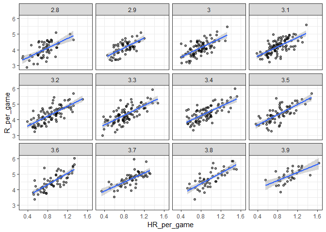

In this case, the slopes are the following.

``` r
dat %>% group_by(BB_strata) %>%
  summarize(slope = cor(HR_per_game,R_per_game)*sd(R_per_game)/sd(HR_per_game))
```

    ## # A tibble: 12 x 2
    ##    BB_strata slope
    ##        <dbl> <dbl>
    ##  1       2.8  1.53
    ##  2       2.9  1.57
    ##  3       3    1.52
    ##  4       3.1  1.49
    ##  5       3.2  1.58
    ##  6       3.3  1.56
    ##  7       3.4  1.48
    ##  8       3.5  1.63
    ##  9       3.6  1.83
    ## 10       3.7  1.45
    ## 11       3.8  1.70
    ## 12       3.9  1.30

You can see they are all around 1.5, 1.6, 1.7. So they do not change that much from the original slope estimate, which was 1.84. Regardless, it seems that if we stratify by home runs, we have an approximately bivariate normal distribution for runs versus bases on balls. Similarly, if we stratify by bases on balls, we have an approximately normal bivariate distribution for runs versus home runs. So what do we do? It is somewhat complex to be computing regression lines for each strata. We're essentially fitting this model that you can see in this equation with the slopes for x1 changing for different values of x2 and vice versa.

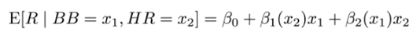

Here, x1 is bases on balls. And x2 are home runs. Is there an easier approach? **Note that if we take random variability into account, the estimated slopes by strata don't appear to change that much.** If these slopes are in fact the same, this implies that this function beta 1 of x2 and the other function beta 2 of x1 are actually constant.

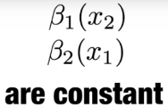

Which, in turn, implies that the expectation of runs condition on home runs and bases on balls can be written in this simpler model.

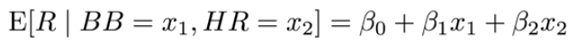

This model implies that if the number of home runs is fixed, **we observe a linear relationship between runs and bases on balls.** And that the slope of that relationship does not depend on the number of home runs. **Only the slope changes as the home runs increase.** The same is true if we swap home runs and bases on balls. In this analysis, **referred to as multivariate regression, we say that the bases on balls slope beta 1 is adjusted for the home run effect. If this model is correct, then confounding has been accounted for.** But how do we estimate beta 1 and beta 2 from the data? For this, we'll learn about linear models and least squares estimates.

### Linear Models

Since Galton's original development, regression has become one of the most widely used tools in data science. One reason for this has to do with the fact that **regression permits us to find relationships between two variables while adjusting for others**, as we have just shown for bases on balls and home runs. **This has been particularly popular in fields where randomized experiments are hard to run,** such as economics and epidemiology. \*\* When we're not able to randomly assign each individual to a treatment or control group, confounding is particularly prevalent.** For example, consider estimating the effect of any fast foods on life expectancy using data collected from a random sample of people in some jurisdiction. Fast food consumers are more likely to be smokers, drinkers, and have lower incomes. Therefore, a naive regression model may lead to an overestimate of a negative health effect of fast foods. So how do we adjust for confounding in practice? We can use regression. ** We have described how, if data is by very normal, then the conditional expectation follow a regression line, that the conditional expectation as a line is not an extra assumption, but rather a result derived from the assumption, that they are approximately by very normal.\*\*
However, **in practice it is common to explicitly write down a model that describes the relationship between two or more variables using what is called a linear model.** We know that linear here does not refer to lines exclusively, but rather to the fact that the conditional expectation is a linear combination of known quantities. Any combination that multiplies them by a constant and then adds them up with, perhaps, a shift.

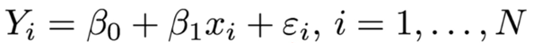

For example, 2 plus 3x minus 4y plus 5z is a linear combination of x, y, and z. So beta 0 plus beta 1x1, plus beta 2x 2 is a linear combination of x1 and x2. The simplest linear model is a constant beta 0. The second simplest is a line, beta 0 plus beta 1x. For Galton's data, we would denote and observe fathers' heights with x1 through xn. Then we model end son heights we are trying to predict with the following model. Here, the little xi's are the father's heights, which are fixed not random, due to the conditioning. We've conditioned on these values. And then Yi big Yi is the random son's height that we want to predict. We further assume that the errors that are denoted with the Greek letter for E, epsilon, epsilon i, are independent from each other, have expected value 0, and the standard deviation, which is usually called sigma, does not depend on i. It's the same for every individual. We know the xi, but to have a useful model for prediction, we need beta 0 and beta 1. We estimate these from the data. Once we do, we can predict the sons' heights from any father's height, x. Note that if we further assume that the epsilons are normally distributed, then this model is exactly the same one we derived earlier for the bivariate normal distribution. A somewhat nuanced difference is that in the first approach, we assumed the data was a bivariate normal, and the linear model was derived, not assumed. In practice, linear models are just assumed without necessarily assuming normality. The distribution of the epsilons is not specified. But nevertheless, **if your data is bivariate normal, the linear model that we just showed holds.** **If your data is not bivariate normal, then you will need to have other ways of justifying the model.** One reason linear models are popular is that **they are interpretable.** In the case of Galton's data, we can interpret the data like this. Due to inherited genes, the son's height prediction grows by beta 1 for each inch we increase the father's height x. Because not all sons with fathers of height x are of equal height, we need the term epsilon, which explains the remaining variability. This remaining variability includes the mother's genetic effect, environmental factors, and other biological randomness. Note that given how we wrote the model, *the intercept beta 0 is not very interpretable, as it is the predicted height of a son with a father with no height.* **Due to regression to the mean, the prediction will usually be a bit larger than 0, which is really not very interpretable.** To make the intercept parameter more interpretable, **we can rewrite the model slightly in the following way.**

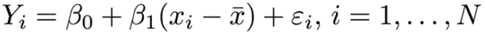

Here, we have changed xi to xi minus the average height x bar. We have centered our covariate xi. In this case, beta 0, the intercept, would be the predicted height for the average father for the case where xi equals x bar.

Least Squares Estimates
-----------------------

### Least Squares Estimates (LSE)

For linear models to be useful, we have to estimate the unknown parameters, the betas. **The standard approach in science is to find the values that minimize the distance of the fitted model to the data.** To quantify, this **we use the least squares equation.** For Galton's data, we would write something like this.

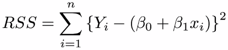

This quantity is called the Residual Sum of Squares, RSS. Once we find the values that minimize the RSS, we call the values the **Least Squares Estimate, LSE,** and denote them, in this case, with beta 0 hat and beta 1 hat. Let's write the function that computes the RSS for any pair of values, beta 0 and beta 1, for our heights data.

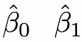

It would look like this.

``` r
rss <- function(beta0, beta1, data){
   resid <- galton_heights$son - (beta0+beta1*galton_heights$father)
   return(sum(resid^2))
}
```

So for any pair of values, we get an RSS. So **this is a three-dimensional plot with beta 1 and beta 2, and x and y and the RSS as a z.** To find the minimum, you would have to look at this three-dimensional plot. Here, we're just going to make a two-dimensional version by keeping beta 0 fixed at 25. So it will be a function of the RSS as a function of beta 1. We can use this code to produce this plot.

``` r
library(HistData)
```

    ## Warning: package 'HistData' was built under R version 3.5.2

``` r
data("GaltonFamilies")
galton_heights <- GaltonFamilies %>%
  filter(childNum == 1 && gender == "male") %>%
  select(father, childHeight) %>%
  rename( son= childHeight)


beta1 = seq( 0, 1, len=nrow(galton_heights))
results <- data.frame(beta1 = beta1,
              rss = sapply(beta1, rss, beta0=25))
results %>% ggplot(aes(beta1, rss)) + geom_line() +
geom_line(aes(beta1,rss), col=2)
```

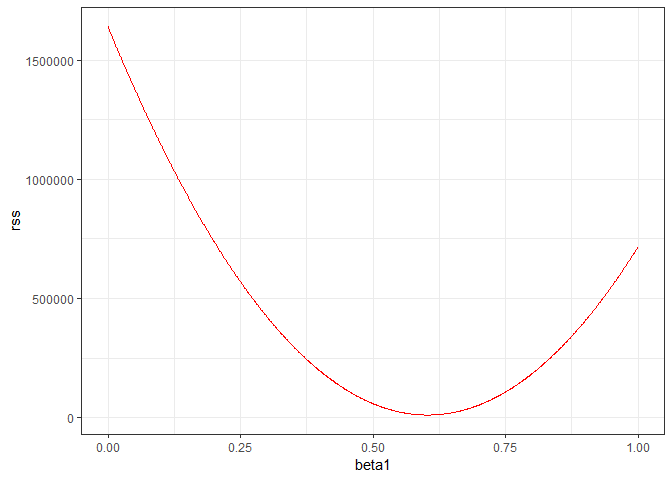

``` r
beta1 = seq( 0, 1, len=nrow(galton_heights))
results <- data.frame(beta1 = beta1,
              rss = sapply(beta1, rss, beta0=36))
results %>% ggplot(aes(beta1, rss)) + geom_line() +
geom_line(aes(beta1,rss), col=2)
```

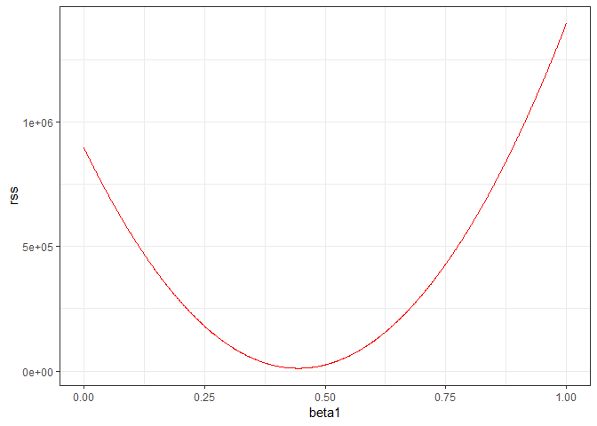

*Expected by the exercise* 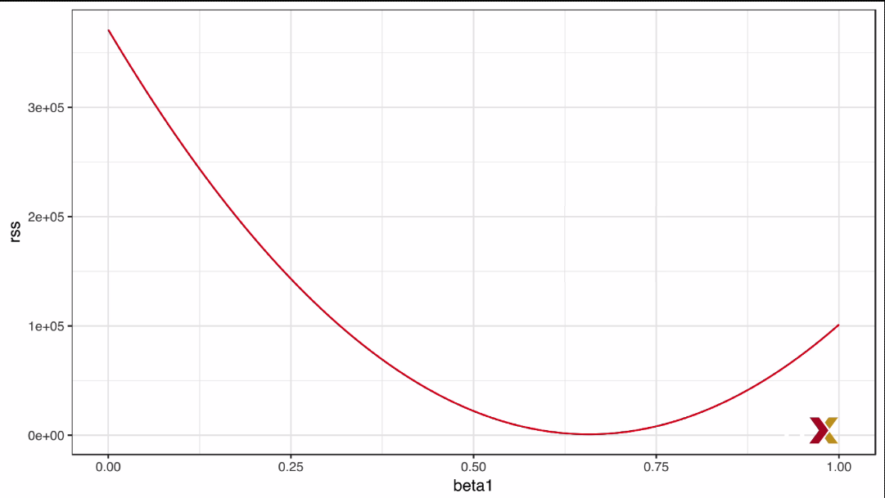

**We can see a clear minimum for beta 1 at around 0.65.** So you could see how we would pick the least squares estimates. However, **this minimum is for beta 1 when beta 0 is fixed at 25. But we don't know if that's the minimum for beta 0.** We don't know if 25 karma 0.65 minimizes the equation across all pairs. **We could use trial and error, but it's really not going to work here.** Instead we will use **calculus.** We'll take the **partial derivatives, set them equal to 0, and solve for beta 1 and beta 0.** Of course, if we have many parameters, these equations can get rather complex. But there are functions in R that do these calculations for us. We will learn these soon. To learn the mathematics behind this, you can consult the book on linear models.

### The lm Function

**In r, we can obtain the least squares estimates using the lm function.** To fit the following model where Yi is the son's height and Xi is the father height,

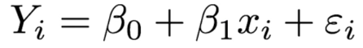

we would write the following piece of code.

``` r
fit <- lm(son ~ father, data = galton_heights)
fit
```

    ## 
    ## Call:
    ## lm(formula = son ~ father, data = galton_heights)
    ## 
    ## Coefficients:
    ## (Intercept)       father  
    ##     40.1393       0.3845

This gives us the least squares estimates, which we can see in the output of r. The general way we use lm is by using the tilde character to let lm know which is the value we're predicting that's on the left side of the tilde, and which variables we're using to predict-- those will be on the right side of the tilde. The intercept is added automatically to the model. So you don't have to include it when you write it. The object fit that we just computed includes more information about the least squares fit. We can use the function summary to extract more of this information, like this.

``` r
summary(fit)
```

    ## 
    ## Call:
    ## lm(formula = son ~ father, data = galton_heights)
    ## 
    ## Residuals:
    ##      Min       1Q   Median       3Q      Max 
    ## -10.2856  -2.7374  -0.2275   2.6763  11.9454 
    ## 
    ## Coefficients:
    ##             Estimate Std. Error t value Pr(>|t|)    
    ## (Intercept) 40.13929    3.15991  12.703   <2e-16 ***
    ## father       0.38451    0.04564   8.425   <2e-16 ***
    ## ---
    ## Signif. codes:  0 '***' 0.001 '**' 0.01 '*' 0.05 '.' 0.1 ' ' 1
    ## 
    ## Residual standard error: 3.452 on 932 degrees of freedom
    ## Multiple R-squared:  0.07078,    Adjusted R-squared:  0.06978 
    ## F-statistic: 70.99 on 1 and 932 DF,  p-value: < 2.2e-16

To understand some of the information included in this summary, we need to remember that the LSE are random variables. Mathematical statistics gives us some ideas of the distribution of these random variables. And we'll learn some of that next.

Exercise: *Run a linear model in R predicting the number of runs per game based on the number of bases on balls and the number of home runs. Remember to first limit your data to 1961-2001.*

``` r
head(Teams) ## Reload the Teams dataset before procedding
```

    ##   yearID lgID teamID franchID divID Rank  G Ghome  W  L DivWin WCWin LgWin
    ## 1   1871   NA    BS1      BNA  <NA>    3 31    NA 20 10   <NA>  <NA>     N
    ## 2   1871   NA    CH1      CNA  <NA>    2 28    NA 19  9   <NA>  <NA>     N
    ## 3   1871   NA    CL1      CFC  <NA>    8 29    NA 10 19   <NA>  <NA>     N
    ## 4   1871   NA    FW1      KEK  <NA>    7 19    NA  7 12   <NA>  <NA>     N
    ## 5   1871   NA    NY2      NNA  <NA>    5 33    NA 16 17   <NA>  <NA>     N
    ## 6   1871   NA    PH1      PNA  <NA>    1 28    NA 21  7   <NA>  <NA>     Y
    ##   WSWin   R   AB   H X2B X3B HR BB SO SB CS HBP SF  RA  ER  ERA CG SHO SV
    ## 1  <NA> 401 1372 426  70  37  3 60 19 73 NA  NA NA 303 109 3.55 22   1  3
    ## 2  <NA> 302 1196 323  52  21 10 60 22 69 NA  NA NA 241  77 2.76 25   0  1
    ## 3  <NA> 249 1186 328  35  40  7 26 25 18 NA  NA NA 341 116 4.11 23   0  0
    ## 4  <NA> 137  746 178  19   8  2 33  9 16 NA  NA NA 243  97 5.17 19   1  0
    ## 5  <NA> 302 1404 403  43  21  1 33 15 46 NA  NA NA 313 121 3.72 32   1  0
    ## 6  <NA> 376 1281 410  66  27  9 46 23 56 NA  NA NA 266 137 4.95 27   0  0
    ##   IPouts  HA HRA BBA SOA   E DP    FP                    name
    ## 1    828 367   2  42  23 225 NA 0.838    Boston Red Stockings
    ## 2    753 308   6  28  22 218 NA 0.829 Chicago White Stockings
    ## 3    762 346  13  53  34 223 NA 0.814  Cleveland Forest Citys
    ## 4    507 261   5  21  17 163 NA 0.803    Fort Wayne Kekiongas
    ## 5    879 373   7  42  22 227 NA 0.839        New York Mutuals
    ## 6    747 329   3  53  16 194 NA 0.845  Philadelphia Athletics
    ##                           park attendance BPF PPF teamIDBR teamIDlahman45
    ## 1          South End Grounds I         NA 103  98      BOS            BS1
    ## 2      Union Base-Ball Grounds         NA 104 102      CHI            CH1
    ## 3 National Association Grounds         NA  96 100      CLE            CL1
    ## 4               Hamilton Field         NA 101 107      KEK            FW1
    ## 5     Union Grounds (Brooklyn)         NA  90  88      NYU            NY2
    ## 6     Jefferson Street Grounds         NA 102  98      ATH            PH1
    ##   teamIDretro
    ## 1         BS1
    ## 2         CH1
    ## 3         CL1
    ## 4         FW1
    ## 5         NY2
    ## 6         PH1

``` r
dat1 <- Teams %>% filter(yearID %in% 1961:2001) %>%
  mutate(BB_per_game = BB/G, R_per_game = R/G, HR_per_game = HR/G)
head(dat1)
```

    ##   yearID lgID teamID franchID divID Rank   G Ghome  W  L DivWin WCWin
    ## 1   1961   AL    BAL      BAL  <NA>    3 163    82 95 67   <NA>  <NA>
    ## 2   1961   AL    BOS      BOS  <NA>    6 163    82 76 86   <NA>  <NA>
    ## 3   1961   AL    CHA      CHW  <NA>    4 163    81 86 76   <NA>  <NA>
    ## 4   1961   NL    CHN      CHC  <NA>    7 156    78 64 90   <NA>  <NA>
    ## 5   1961   NL    CIN      CIN  <NA>    1 154    77 93 61   <NA>  <NA>
    ## 6   1961   AL    CLE      CLE  <NA>    5 161    81 78 83   <NA>  <NA>
    ##   LgWin WSWin   R   AB    H X2B X3B  HR  BB   SO  SB CS HBP SF  RA  ER
    ## 1     N     N 691 5481 1393 227  36 149 581  902  39 30  NA NA 588 526
    ## 2     N     N 729 5508 1401 251  37 112 647  847  56 36  NA NA 792 687
    ## 3     N     N 765 5556 1475 216  46 138 550  612 100 40  NA NA 726 653
    ## 4     N     N 689 5344 1364 238  51 176 539 1027  35 25  NA NA 800 689
    ## 5     Y     N 710 5243 1414 247  35 158 423  761  70 33  NA NA 653 575
    ## 6     N     N 737 5609 1493 257  39 150 492  720  34 11  NA NA 752 665
    ##    ERA CG SHO SV IPouts   HA HRA BBA SOA   E  DP    FP              name
    ## 1 3.22 54  21 33   4413 1226 109 617 926 126 173 0.980 Baltimore Orioles
    ## 2 4.29 35   6 30   4326 1472 167 679 831 143 140 0.977    Boston Red Sox
    ## 3 4.06 39   3 33   4344 1491 158 498 814 128 138 0.980 Chicago White Sox
    ## 4 4.48 34   6 25   4155 1492 165 465 755 183 175 0.970      Chicago Cubs
    ## 5 3.78 46  12 40   4110 1300 147 500 829 134 124 0.977   Cincinnati Reds
    ## 6 4.15 35  12 23   4329 1426 178 599 801 139 142 0.977 Cleveland Indians
    ##                park attendance BPF PPF teamIDBR teamIDlahman45 teamIDretro
    ## 1  Memorial Stadium     951089  96  96      BAL            BAL         BAL
    ## 2    Fenway Park II     850589 102 103      BOS            BOS         BOS
    ## 3     Comiskey Park    1146019  99  97      CHW            CHA         CHA
    ## 4     Wrigley Field     673057 101 104      CHC            CHN         CHN
    ## 5     Crosley Field    1117603 102 101      CIN            CIN         CIN
    ## 6 Cleveland Stadium     725547  97  98      CLE            CLE         CLE
    ##   BB_per_game R_per_game HR_per_game
    ## 1    3.564417   4.239264   0.9141104
    ## 2    3.969325   4.472393   0.6871166
    ## 3    3.374233   4.693252   0.8466258
    ## 4    3.455128   4.416667   1.1282051
    ## 5    2.746753   4.610390   1.0259740
    ## 6    3.055901   4.577640   0.9316770

``` r
runs <- lm(R_per_game ~ BB_per_game+HR_per_game, data = dat1)
runs
```

    ## 
    ## Call:
    ## lm(formula = R_per_game ~ BB_per_game + HR_per_game, data = dat1)
    ## 
    ## Coefficients:
    ## (Intercept)  BB_per_game  HR_per_game  
    ##      1.7444       0.3874       1.5611

``` r
## Result 0.3874 (from the exercise on the page it was rounded to: 0.39)
```

### LSE are Random Variables

The LSE are derived from the data, Y1 through Yn, which are random. This implies that our estimates are random variables. To see this, we can run a Monte Carlo simulation in which we assume that the son and father height data that we have defines an entire population. And we're going to take random samples of size 50 and compute the regression slope coefficient for each one. We write this code, which gives us several estimates of the regression slope.

``` r
B <- 1000
N <- 50
lse <- replicate(B, {
  sample_n(galton_heights, N, replace = TRUE) %>%
    lm(son ~ father, data = .) %>% .$coef
})
lse <- data.frame(beta_0 = lse[1,], beta_1 = lse[2,])
```

We can see the variability of the estimates by plotting their distribution.

``` r
library(gridExtra)
```

    ## Warning: package 'gridExtra' was built under R version 3.5.2

``` r
p1 <- lse %>% ggplot(aes(beta_0)) + geom_histogram(binwidth = 5, color = 'black')
p2 <- lse %>% ggplot(aes(beta_1)) + geom_histogram(binwidth = 0.1, color = 'black')
grid.arrange(p1,p2,ncol=2)
```

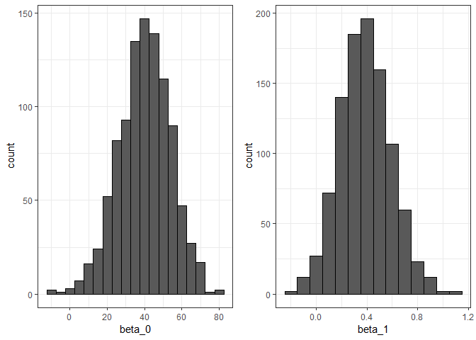

Here you can see the histograms of the estimated beta 0's and the estimated beta 1's. **The reason these look normal is because the central limit theorem applies here as well.** For large enough N, the least squares estimates will be approximately normal with expected value beta 0 and beta 1 respectively. The **standard errors are a bit complicated to compute, but mathematical theory does allow us to compute them**, and they are included in the summary provided by the lm function. Here are the estimated standard errors for one of our simulated data sets.

``` r
sample_n(galton_heights, N, replace = TRUE) %>%
  lm(son ~ father, data = .) %>% summary()
```

    ## 
    ## Call:
    ## lm(formula = son ~ father, data = .)
    ## 
    ## Residuals:
    ##      Min       1Q   Median       3Q      Max 
    ## -10.1758  -2.5199  -0.2525   2.5332   6.9549 
    ## 
    ## Coefficients:
    ##             Estimate Std. Error t value Pr(>|t|)   
    ## (Intercept)  36.8890    13.2305   2.788  0.00757 **
    ## father        0.4307     0.1919   2.244  0.02945 * 
    ## ---
    ## Signif. codes:  0 '***' 0.001 '**' 0.01 '*' 0.05 '.' 0.1 ' ' 1
    ## 
    ## Residual standard error: 3.703 on 48 degrees of freedom
    ## Multiple R-squared:  0.09498,    Adjusted R-squared:  0.07612 
    ## F-statistic: 5.037 on 1 and 48 DF,  p-value: 0.02945

You could see them at the second column in the coefficients table. You can see that the standard errors estimates reported by the summary function are closed, so the standard errors that we obtain from our Monte Carlo simulation.

``` r
lse %>% summarize(se_0 = sd(beta_0), se_1 = sd(beta1))
```

    ##      se_0      se_1
    ## 1 13.9108 0.2891392

The summary function also reports t-statistics-- this is the t value column-- and p-values. This is the Pr bigger than absolute value of t column. The t-statistic is not actually based on the central limit theorem, but rather on the assumption that the epsilons follow a normal distribution. Under this assumption, mathematical theory tells us that the LSE divided by their standard error, which we can see here and here, follow a t distribution with N minus p degrees of freedom, with p the number of parameters in our model, which in this case is 2.

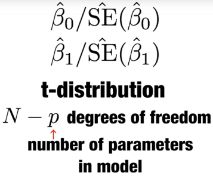

The 2p values are testing the null hypothesis that beta 0 is 0 and beta 1 is 0 respectively. Note that as we described previously, for large enough N, the central limit works, and the t distribution becomes almost the same as a normal distribution. **So if either you assume the errors are normal and use the t distribution or if you assume that N is large enough to use the central limit theorem, you can construct confidence intervals for your parameters.** We know here that although we will not show examples in this video, hypothesis testing for regression models is very commonly used in, for example, epidemiology and economics, to make statements such as the effect of A and B was statistically significant after adjusting for X, Y, and Z. **But it's very important to note that several assumptions-- we just described some of them-- have to hold for these statements to hold.**

### Advanced Note on LSE

Although interpretation is not straight-forward, it is also useful to know that the LSE can be strongly correlated, which can be seen using this code:

``` r
lse %>% summarize(cor(beta_0, beta_1))
```

    ##   cor(beta_0, beta_1)
    ## 1           -0.999358

However, the correlation depends on how the predictors are defined or transformed.

Here we standardize the father heights, which changes xi to xi - x\_hat

``` r
B <- 1000
N <- 50
lse <- replicate(B, {
      sample_n(galton_heights, N, replace = TRUE) %>%
      mutate(father = father - mean(father)) %>%
      lm(son ~ father, data = .) %>% .$coef 
})
```

Observe what happens to the correlation in this case:

``` r
cor(lse[1,], lse[2,]) 
```

    ## [1] 0.001198755

### Predicted Variable are Random Variables

Once we fit our model, we can obtain predictions of y by plugging the estimates into the regression model. For example, if the father's height is x, then our prediction for y-- which we'll denote with a \[? hat ?\] on top of the y-- for the son's height will be the following.

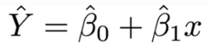

We're just plugging in beta-- the estimated betas into the equation. If we plot y hat versus x, we'll see the regression line. Note that the prediction y hat is also a random variable, and mathematical theory tells us what the standard errors are. If we assume the errors are normal or have a large enough sample size to use the Central Limit Theorem, we can construct confidence intervals for our predictions, as well. In fact, the ggplot layer geom underscore smooth, when we set method equals to lm-- we've previously shown this for several plots-- plots confidence intervals around the predicted y hat. Let's look at an example with this code.

``` r
galton_heights %>% ggplot(aes(son, father)) +
  geom_point() +
  geom_smooth(method = "lm")
```

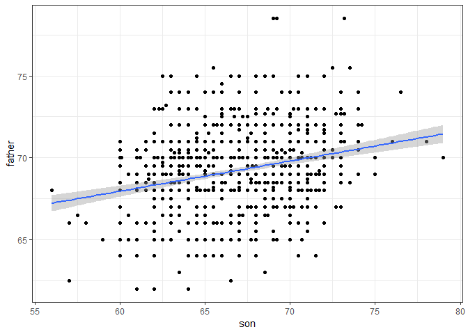

You can see the regression line. Those are the predictions, and you see a band around them. Those are the confidence intervals. The R function predict takes an lm object as input and returns these predictions. We can see it here in this code which produces this plot,

``` r
galton_heights %>%
  mutate(Y_hat = predict(lm(son ~ father, data = .))) %>%
  ggplot(aes(father, Y_hat)) +
  geom_line()
```

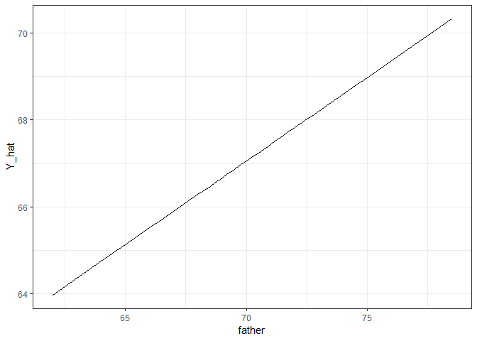

and if requested the standard errors and other information from which we can construct confidence intervals can be obtained from the predict function. You can see it by running this code.

``` r
fit <- galton_heights %>% lm(son ~ father, data  = .)
Y_hat <- predict(fit, se.fit = TRUE)
names(Y_hat)
```

    ## [1] "fit"            "se.fit"         "df"             "residual.scale"

Tibbles, do, and broom
----------------------

### Advanced dplyr: Tibbles

Let's go back to baseball. In a previous example, we estimated the regression lines to predict runs from bases and balls in different home run strata. We first constructed a data frame similar to this.

``` r
dat <- Teams %>% filter(yearID %in% 1961:2001) %>%
  mutate(HR = round(HR/G, 1),
         BB = BB/G,
         R = R/G) %>%
  select(HR,BB,R) %>%
  filter(HR >= 0.4 & HR <= 1.2)
```

Then, to compute the regression line in each strata, since we didn't know the lm function back then, we used the formula directly like this.

``` r
dat %>% group_by(HR) %>%
  summarize(slope = cor(BB,R)*sd(R)/sd(BB))
```

    ## # A tibble: 9 x 2
    ##      HR slope
    ##   <dbl> <dbl>
    ## 1   0.4 0.734
    ## 2   0.5 0.566
    ## 3   0.6 0.412
    ## 4   0.7 0.285
    ## 5   0.8 0.365
    ## 6   0.9 0.261
    ## 7   1   0.511
    ## 8   1.1 0.454
    ## 9   1.2 0.440

We argued that the slopes are similar and that the differences were perhaps due to random variation. To provide a more rigorous defense of the slopes being the same, which is what led to our multivariate regression model, we could compute confidence intervals for each slope. We have not learned the formula for this, but the lm function provides enough information to construct them. **First, note that if we try to use the lm function to get the estimated slope like this, we don't get what we want.**

``` r
dat %>% group_by(HR) %>%
  lm(R ~ BB, data = .) %>%
  .$coef
```

    ## (Intercept)          BB 
    ##   2.1986073   0.6377959

**The lm function ignored the group\_by.** *This is expected, because lm is not part of the tidyverse and does not know how to handle the outcome of group\_by which is a group tibble.* We're going to describe tibbles in some details now. When summarize receives the output of group\_by, it somehow knows which rows of the table go with which groups. But where is this information stored in the data frame? Let's write some code to see the output of a group\_by call.

``` r
dat %>% group_by(HR) %>% head()
```

    ## # A tibble: 6 x 3
    ## # Groups:   HR [5]
    ##      HR    BB     R
    ##   <dbl> <dbl> <dbl>
    ## 1   0.9  3.56  4.24
    ## 2   0.7  3.97  4.47
    ## 3   0.8  3.37  4.69
    ## 4   1.1  3.46  4.42
    ## 5   1    2.75  4.61
    ## 6   0.9  3.06  4.58

Note that there are no columns with the information needed to define the groups. But if you look closely at the output, you notice the line "A tibble, 6 by 3." We can learn the class of the return object using this line of code, and we see that the class is a "tbl."

``` r
dat %>%  group_by(HR) %>% class()
```

    ## [1] "grouped_df" "tbl_df"     "tbl"        "data.frame"

This is pronounced "tibble." It is also a tbl\_df. This is equivalent to tibble. **The tibble is a special kind of data frame.** We have seen them before, because tidyverse functions such as group\_by and also summarize always return this type of data frame. **The group\_by function returns a special kind of tibble, the grouped tibble.** We will say more about the grouped tibbles later. **Note that the manipulation verbs, select, filter, mutate, and arrange, don't necessarily return tibbles.** They preserve the class of the input. If they receive a regular data frame, they return a regular data frame. If they receive a tibble, they return a tibble. **But tibbles are the default data frame for the tidyverse.** Tibbles are very similar to data frames. *You can think of them as modern versions of data frames.* Next, we're going to describe briefly three important differences.

### Tibbles: Differences from Data Frames

In this video, we're going to describe some of the main differences between tibbles and data frames. First, the print method for tibble is much more readable than that of a data frame. To see this, type teams on your console after loading the Baseball Lahman Database.

``` r
head(Teams)
```

    ##   yearID lgID teamID franchID divID Rank  G Ghome  W  L DivWin WCWin LgWin
    ## 1   1871   NA    BS1      BNA  <NA>    3 31    NA 20 10   <NA>  <NA>     N
    ## 2   1871   NA    CH1      CNA  <NA>    2 28    NA 19  9   <NA>  <NA>     N
    ## 3   1871   NA    CL1      CFC  <NA>    8 29    NA 10 19   <NA>  <NA>     N
    ## 4   1871   NA    FW1      KEK  <NA>    7 19    NA  7 12   <NA>  <NA>     N
    ## 5   1871   NA    NY2      NNA  <NA>    5 33    NA 16 17   <NA>  <NA>     N
    ## 6   1871   NA    PH1      PNA  <NA>    1 28    NA 21  7   <NA>  <NA>     Y
    ##   WSWin   R   AB   H X2B X3B HR BB SO SB CS HBP SF  RA  ER  ERA CG SHO SV
    ## 1  <NA> 401 1372 426  70  37  3 60 19 73 NA  NA NA 303 109 3.55 22   1  3
    ## 2  <NA> 302 1196 323  52  21 10 60 22 69 NA  NA NA 241  77 2.76 25   0  1
    ## 3  <NA> 249 1186 328  35  40  7 26 25 18 NA  NA NA 341 116 4.11 23   0  0
    ## 4  <NA> 137  746 178  19   8  2 33  9 16 NA  NA NA 243  97 5.17 19   1  0
    ## 5  <NA> 302 1404 403  43  21  1 33 15 46 NA  NA NA 313 121 3.72 32   1  0
    ## 6  <NA> 376 1281 410  66  27  9 46 23 56 NA  NA NA 266 137 4.95 27   0  0
    ##   IPouts  HA HRA BBA SOA   E DP    FP                    name
    ## 1    828 367   2  42  23 225 NA 0.838    Boston Red Stockings
    ## 2    753 308   6  28  22 218 NA 0.829 Chicago White Stockings
    ## 3    762 346  13  53  34 223 NA 0.814  Cleveland Forest Citys
    ## 4    507 261   5  21  17 163 NA 0.803    Fort Wayne Kekiongas
    ## 5    879 373   7  42  22 227 NA 0.839        New York Mutuals
    ## 6    747 329   3  53  16 194 NA 0.845  Philadelphia Athletics
    ##                           park attendance BPF PPF teamIDBR teamIDlahman45
    ## 1          South End Grounds I         NA 103  98      BOS            BS1
    ## 2      Union Base-Ball Grounds         NA 104 102      CHI            CH1
    ## 3 National Association Grounds         NA  96 100      CLE            CL1
    ## 4               Hamilton Field         NA 101 107      KEK            FW1
    ## 5     Union Grounds (Brooklyn)         NA  90  88      NYU            NY2
    ## 6     Jefferson Street Grounds         NA 102  98      ATH            PH1
    ##   teamIDretro
    ## 1         BS1
    ## 2         CH1
    ## 3         CL1
    ## 4         FW1
    ## 5         NY2
    ## 6         PH1

**And you will see a very, very long list of columns and rows. It's barely readable.** Teams is a data frame with many rows and columns. That's why you see that. Nevertheless, the output just shows everything wraps around and is hard to read. It is so bad that we don't even print it here. We'll let you print it on your own screen. Now if you convert this data frame to a tibble data frame, the output is much more readable. Here's an example.

``` r
as_tibble(Teams)
```

    ## # A tibble: 2,835 x 48
    ##    yearID lgID  teamID franchID divID  Rank     G Ghome     W     L DivWin
    ##     <int> <fct> <fct>  <fct>    <chr> <int> <int> <int> <int> <int> <chr> 
    ##  1   1871 NA    BS1    BNA      <NA>      3    31    NA    20    10 <NA>  
    ##  2   1871 NA    CH1    CNA      <NA>      2    28    NA    19     9 <NA>  
    ##  3   1871 NA    CL1    CFC      <NA>      8    29    NA    10    19 <NA>  
    ##  4   1871 NA    FW1    KEK      <NA>      7    19    NA     7    12 <NA>  
    ##  5   1871 NA    NY2    NNA      <NA>      5    33    NA    16    17 <NA>  
    ##  6   1871 NA    PH1    PNA      <NA>      1    28    NA    21     7 <NA>  
    ##  7   1871 NA    RC1    ROK      <NA>      9    25    NA     4    21 <NA>  
    ##  8   1871 NA    TRO    TRO      <NA>      6    29    NA    13    15 <NA>  
    ##  9   1871 NA    WS3    OLY      <NA>      4    32    NA    15    15 <NA>  
    ## 10   1872 NA    BL1    BLC      <NA>      2    58    NA    35    19 <NA>  
    ## # ... with 2,825 more rows, and 37 more variables: WCWin <chr>,
    ## #   LgWin <chr>, WSWin <chr>, R <int>, AB <int>, H <int>, X2B <int>,
    ## #   X3B <int>, HR <int>, BB <int>, SO <int>, SB <int>, CS <int>,
    ## #   HBP <int>, SF <int>, RA <int>, ER <int>, ERA <dbl>, CG <int>,
    ## #   SHO <int>, SV <int>, IPouts <int>, HA <int>, HRA <int>, BBA <int>,
    ## #   SOA <int>, E <int>, DP <int>, FP <dbl>, name <chr>, park <chr>,
    ## #   attendance <int>, BPF <int>, PPF <int>, teamIDBR <chr>,
    ## #   teamIDlahman45 <chr>, teamIDretro <chr>

**That's the first main difference between tibbles and data frames.** A second one is that if you subset the columns of a data frame, you may get back an object that is not a data frame. Here's an example. If we subset the 20th column, we get back an integer. That's not a data frame.

``` r
class(Teams[,20])
```

    ## [1] "integer"

With tibbles, this is not the case. Here's an example.

``` r
class(as_tibble(Teams)[,20])
```

    ## [1] "tbl_df"     "tbl"        "data.frame"

**If we subset a table, we get back a table.** This is useful in the tidyverse since functions require data frames as input. Now whenever you want to access the original vector that defines a column in a table, for this, you actually have to use the accessor dollar sign. Here's an example.

``` r
class(as_tibble(Teams)$HR)
```

    ## [1] "integer"

A related feature to this is that tibbles **will give you a warning if you try to access a column that does not exist.** That's not the case for data frames. For example, if we accidentally write hr in lowercase instead of uppercase, with a data frame, all we get is a no. No warning.

``` r
Teams$hr
```

    ## NULL

This can make it quite hard to debug code. In contrast, if it's a tibble, and you try to access the lowercase hr column, which doesn't exist, you actually get a warning.

``` r
as_tibble(Teams)$hr
```

    ## Warning: Unknown or uninitialised column: 'hr'.

    ## NULL

**A third difference is that while columns of a data frame need to be a vector of number strings or Boolean, tibbles can have more complex objects, such as lists or functions.** Also note that we can create tibbles with the tibble function. So, look at this line of code. We're creating a column that actually has functions in it. You can see the output here.

``` r
tibble(id = c(1,2,3), func = c(mean, median, sd))
```

    ## # A tibble: 3 x 2
    ##      id func  
    ##   <dbl> <list>
    ## 1     1 <fn>  
    ## 2     2 <fn>  
    ## 3     3 <fn>

Finally, the **last difference we describe is that tibbles can be grouped.** The function group by returns a special kind of tibble, a grouped tibble. This class stores information that lets you know which rows are in which groups. The tidyverse functions, in particular the summarize functions, are aware of the group information. **In the example we showed, we saw that the ln function, which is not part of the tidyverse, does not know how to deal with group tibbles. The object is basically converted to a regular data frame, and then the function runs ignoring the groups.** This is why we only get one pair of estimates, as we see here.

``` r
dat  %>% group_by(HR) %>%
  lm(R ~ BB, data = .)
```

    ## 
    ## Call:
    ## lm(formula = R ~ BB, data = .)
    ## 
    ## Coefficients:
    ## (Intercept)           BB  
    ##      2.1986       0.6378

To make these non-tidyverse function better integrate with a tidyverse, we will learn a new function, the function do.

### do() function

In this video, we'll describe the very useful do( ) function. The tidyverse functions know how to interpret group tibbles. Furthermore, to facilitate stringing commands through the pipe, tidyverse function consistently return data frames. Since this assures that the output of 1 is accepted as the input of another. But most our functions do not recognize group tibbles, nor do they return data frames. The lm( ) function is an example. The do( ) function serves as a bridge between our functions, such as lm( ) and the tidyverse. **The do( ) function understands group tibbles and always returns a data frame.** So let's try to use the do( ) function to fit a regression line to each home run strata. We would do it like this.

``` r
dat %>% group_by(HR) %>%
  do(fit = lm(R ~ BB, data = .))
```

    ## Source: local data frame [9 x 2]
    ## Groups: <by row>
    ## 
    ## # A tibble: 9 x 2
    ##      HR fit     
    ## * <dbl> <list>  
    ## 1   0.4 <S3: lm>
    ## 2   0.5 <S3: lm>
    ## 3   0.6 <S3: lm>
    ## 4   0.7 <S3: lm>
    ## 5   0.8 <S3: lm>
    ## 6   0.9 <S3: lm>
    ## 7   1   <S3: lm>
    ## 8   1.1 <S3: lm>
    ## 9   1.2 <S3: lm>

Notice that we did in fact fit a regression line to each strata. But the do( ) function would create a data frame with the first column being the strata value. And a column named fit. We chose that name. It could be any name. **And that column will contain the result of the lm( ) call.** **Therefore, the return table has a column with lm( ) objects in the cells,which is not very useful.** Also note that **if we do not name a column, then do( ) will return the actual output of lm( ), not a data frame.** And this will result in an error since do( ) is expecting a data frame as output. If you write this, you will get the following error.

`dat %>%` `group_by(HR) %>%` `do(lm(R ~ BB, data = .))`

*Error: Results 1, 2, 3, 4, 5, ... must be data frames, not lm*

For a useful data frame to be constructed, the output of the function, inside do( ), must be a data frame as well. **We could build a function that returns only what you want in the form of a data frame.** We could write for example, this function.

``` r
get_slope <- function(data) {
  fit <- lm(R ~ BB, data = data)
  data.frame(slope = fit$coefficients[2],
             se = summary(fit)$coefficient[2,2])
}
```

And then we use to do( ) without naming the output, since we are already getting a data frame. We can write this very simple piece of code and now we get the expected result. We get the slope for each strata and the standard error for that slope.

``` r
dat %>% group_by(HR) %>%
  do(get_slope(.))
```

    ## # A tibble: 9 x 3
    ## # Groups:   HR [9]
    ##      HR slope     se
    ##   <dbl> <dbl>  <dbl>
    ## 1   0.4 0.734 0.208 
    ## 2   0.5 0.566 0.110 
    ## 3   0.6 0.412 0.0974
    ## 4   0.7 0.285 0.0705
    ## 5   0.8 0.365 0.0652
    ## 6   0.9 0.261 0.0754
    ## 7   1   0.511 0.0749
    ## 8   1.1 0.454 0.0855
    ## 9   1.2 0.440 0.0801

If we name the output, then we get a column containing the data frame. So if we write this piece of code, now once again, we get one of these complex tibbles with a column having a data frame in each cell. Which is again, not very useful.

``` r
dat %>% group_by(HR) %>%
  do(slope = get_slope(.))
```

    ## Source: local data frame [9 x 2]
    ## Groups: <by row>
    ## 
    ## # A tibble: 9 x 2
    ##      HR slope               
    ## * <dbl> <list>              
    ## 1   0.4 <data.frame [1 x 2]>
    ## 2   0.5 <data.frame [1 x 2]>
    ## 3   0.6 <data.frame [1 x 2]>
    ## 4   0.7 <data.frame [1 x 2]>
    ## 5   0.8 <data.frame [1 x 2]>
    ## 6   0.9 <data.frame [1 x 2]>
    ## 7   1   <data.frame [1 x 2]>
    ## 8   1.1 <data.frame [1 x 2]>
    ## 9   1.2 <data.frame [1 x 2]>

All right. Now we're going to cover one last feature of do( ). **If the data frame being returned has more than one row, these will be concatenated appropriately.** Here's an example in which return both estimated parameters.

``` r
get_lse <- function(data){
  fit <- lm(R ~ BB, data = data)
  data.frame(term = names(fit$coefficients),
             slope = fit$coefficients,
             se = summary(fit)$coefficient[,2])
}

dat %>% group_by(HR) %>%
  do(get_lse(.))
```

    ## # A tibble: 18 x 4
    ## # Groups:   HR [9]
    ##       HR term        slope     se
    ##    <dbl> <fct>       <dbl>  <dbl>
    ##  1   0.4 (Intercept) 1.36  0.631 
    ##  2   0.4 BB          0.734 0.208 
    ##  3   0.5 (Intercept) 2.01  0.344 
    ##  4   0.5 BB          0.566 0.110 
    ##  5   0.6 (Intercept) 2.53  0.305 
    ##  6   0.6 BB          0.412 0.0974
    ##  7   0.7 (Intercept) 3.21  0.225 
    ##  8   0.7 BB          0.285 0.0705
    ##  9   0.8 (Intercept) 3.07  0.213 
    ## 10   0.8 BB          0.365 0.0652
    ## 11   0.9 (Intercept) 3.54  0.252 
    ## 12   0.9 BB          0.261 0.0754
    ## 13   1   (Intercept) 2.88  0.255 
    ## 14   1   BB          0.511 0.0749
    ## 15   1.1 (Intercept) 3.21  0.300 
    ## 16   1.1 BB          0.454 0.0855
    ## 17   1.2 (Intercept) 3.40  0.291 
    ## 18   1.2 BB          0.440 0.0801

The slope and intercept. We write this piece of code. And now we use the do( ) function as we used it before, and get a very useful tibble, giving us the estimates of the slope and intercept, as well as the standard errors. Now, if you think this is all a bit too complicated, you're not alone. To simplify things, we're going to introduce the broom package, which was designed to facilitate the use of model fitting functions such as lm( ) with the tidyverse.

*Exercise*

You want to take the tibble dat, which we’ve been using in this video, and run the linear model R ~ BB for each strata of HR. Then you want to add three new columns to your grouped tibble: the coefficient, standard error, and p-value for the BB term in the model.

You’ve already written the function get\_slope, shown below.

``` r
get_slope <- function(data) {
  fit <- lm(R ~ BB, data = data)
  sum.fit <- summary(fit)

  data.frame(slope = sum.fit$coefficients[2, "Estimate"], 
             se = sum.fit$coefficients[2, "Std. Error"],
             pvalue = sum.fit$coefficients[2, "Pr(>|t|)"])
}

dat %>% 
  group_by(HR) %>% 
  do(get_slope(.))
```

    ## # A tibble: 9 x 4
    ## # Groups:   HR [9]
    ##      HR slope     se   pvalue
    ##   <dbl> <dbl>  <dbl>    <dbl>
    ## 1   0.4 0.734 0.208  1.54e- 3
    ## 2   0.5 0.566 0.110  3.02e- 6
    ## 3   0.6 0.412 0.0974 4.80e- 5
    ## 4   0.7 0.285 0.0705 7.93e- 5
    ## 5   0.8 0.365 0.0652 8.94e- 8
    ## 6   0.9 0.261 0.0754 7.12e- 4
    ## 7   1   0.511 0.0749 3.06e-10
    ## 8   1.1 0.454 0.0855 1.03e- 6
    ## 9   1.2 0.440 0.0801 1.07e- 6

### broom() function

The original task we ask for in a previous video was to provide an estimate and a confidence interval for the slope estimates of each strata. The broom packs will make this quite easy. Broom has three main functions all of which extract information from the object returned by the function lm, and return it in a tidy verse friendly data frame. These functions are:

    * tidy,
    * glance and
    * augment

The **tidy function** returns estimates and related information as a data frame. Here's an example.

``` r
library(broom)
```

    ## Warning: package 'broom' was built under R version 3.5.2

``` r
fit <- lm(R ~ BB, data = dat)
tidy(fit)
```

    ## # A tibble: 2 x 5
    ##   term        estimate std.error statistic  p.value
    ##   <chr>          <dbl>     <dbl>     <dbl>    <dbl>
    ## 1 (Intercept)    2.20     0.113       19.4 1.06e-70
    ## 2 BB             0.638    0.0344      18.5 1.37e-65

We can add other important summaries, such as confidence intervals, using arguments like this.

``` r
tidy(fit, conf.int = TRUE)
```

    ## # A tibble: 2 x 7
    ##   term        estimate std.error statistic  p.value conf.low conf.high
    ##   <chr>          <dbl>     <dbl>     <dbl>    <dbl>    <dbl>     <dbl>
    ## 1 (Intercept)    2.20     0.113       19.4 1.06e-70    1.98      2.42 
    ## 2 BB             0.638    0.0344      18.5 1.37e-65    0.570     0.705

Because the outcome is a data frame, we can immediately use it with do to string together the commands that produce the table we are after.

``` r
dat %>% group_by(HR) %>%
  do(tidy(lm(R ~ BB, data = .), conf.int = TRUE))
```

    ## # A tibble: 18 x 8
    ## # Groups:   HR [9]
    ##       HR term      estimate std.error statistic  p.value conf.low conf.high
    ##    <dbl> <chr>        <dbl>     <dbl>     <dbl>    <dbl>    <dbl>     <dbl>
    ##  1   0.4 (Interce~    1.36     0.631       2.16 4.05e- 2   0.0631     2.66 
    ##  2   0.4 BB           0.734    0.208       3.54 1.54e- 3   0.308      1.16 
    ##  3   0.5 (Interce~    2.01     0.344       5.84 2.07e- 7   1.32       2.69 
    ##  4   0.5 BB           0.566    0.110       5.14 3.02e- 6   0.346      0.786
    ##  5   0.6 (Interce~    2.53     0.305       8.32 2.43e-13   1.93       3.14 
    ##  6   0.6 BB           0.412    0.0974      4.23 4.80e- 5   0.219      0.605
    ##  7   0.7 (Interce~    3.21     0.225      14.3  1.49e-30   2.76       3.65 
    ##  8   0.7 BB           0.285    0.0705      4.05 7.93e- 5   0.146      0.425
    ##  9   0.8 (Interce~    3.07     0.213      14.4  5.06e-31   2.65       3.49 
    ## 10   0.8 BB           0.365    0.0652      5.59 8.94e- 8   0.236      0.494
    ## 11   0.9 (Interce~    3.54     0.252      14.1  1.37e-28   3.04       4.04 
    ## 12   0.9 BB           0.261    0.0754      3.46 7.12e- 4   0.112      0.410
    ## 13   1   (Interce~    2.88     0.255      11.3  5.25e-21   2.38       3.39 
    ## 14   1   BB           0.511    0.0749      6.82 3.06e-10   0.363      0.659
    ## 15   1.1 (Interce~    3.21     0.300      10.7  6.46e-17   2.61       3.81 
    ## 16   1.1 BB           0.454    0.0855      5.31 1.03e- 6   0.284      0.624
    ## 17   1.2 (Interce~    3.40     0.291      11.7  2.33e-16   2.81       3.98 
    ## 18   1.2 BB           0.440    0.0801      5.50 1.07e- 6   0.280      0.601

So this piece of code will generate what we wanted to see. Because a data frame is returned, we can filter and select the rows and columns we want. So this simple piece of code gives us exactly the table we asked for.

``` r
dat %>%
  group_by(HR) %>%
  do(tidy(lm(R ~ BB, data = .), conf.int = TRUE)) %>%
  filter(term == "BB") %>%
  select(HR, estimate, conf.low, conf.high)
```

    ## # A tibble: 9 x 4
    ## # Groups:   HR [9]
    ##      HR estimate conf.low conf.high
    ##   <dbl>    <dbl>    <dbl>     <dbl>
    ## 1   0.4    0.734    0.308     1.16 
    ## 2   0.5    0.566    0.346     0.786
    ## 3   0.6    0.412    0.219     0.605
    ## 4   0.7    0.285    0.146     0.425
    ## 5   0.8    0.365    0.236     0.494
    ## 6   0.9    0.261    0.112     0.410
    ## 7   1      0.511    0.363     0.659
    ## 8   1.1    0.454    0.284     0.624
    ## 9   1.2    0.440    0.280     0.601

We have filtered away the intercept rows, and only show the columns we care about, the estimate and the confidence intervals. Furthermore, a table like this makes visualization with GE plot quite easy. So this piece of code produces this nice plot, which provides very useful information.

``` r
dat %>%
  group_by(HR) %>%
  do(tidy(lm(R ~ BB, data = .), conf.int = TRUE)) %>%
  filter(term == "BB") %>%
  select(HR, estimate, conf.low, conf.high) %>%
  ggplot(aes(HR, y = estimate, ymin = conf.low, ymax = conf.high)) +
  geom_errorbar() +
  geom_point()
```

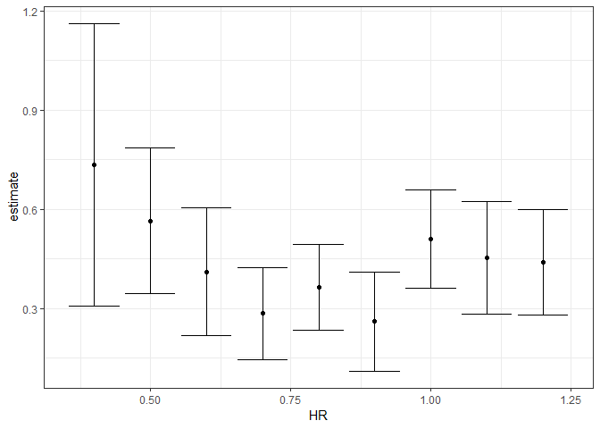

Now we return to discussing our original task of determining if slopes change. **The plot we just made using do and broom shows that the confidence intervals overlap, which provides a nice visual confirmation that our assumption that the slopes do not change with home run strata, is relatively safe.** Earlier we mentioned two other functions from the broom package, **glance** and **augment** Glance and augment relate to model specific and observation specific outcomes, respectively. Here we can see the model fit summary the glance returns.

``` r
glance(fit)
```

    ## # A tibble: 1 x 11
    ##   r.squared adj.r.squared sigma statistic  p.value    df logLik   AIC   BIC
    ##       <dbl>         <dbl> <dbl>     <dbl>    <dbl> <int>  <dbl> <dbl> <dbl>
    ## 1     0.266         0.265 0.454      343. 1.37e-65     2  -596. 1199. 1213.
    ## # ... with 2 more variables: deviance <dbl>, df.residual <int>

You can learn more about these summaries in any regression textbook. We'll see an example of augment in a future video.

Regression and Baseball
-----------------------

### Building a Better Offensive Metric for Baseball

In trying to answer how well bases on balls predict runs, data exploration let us to this model.

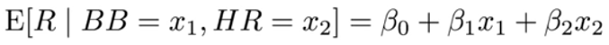

Here, the data is approximately normal. And conditional distributions were also normal. Thus, we're justified to pose a linear model like this.

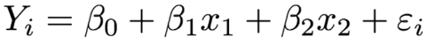

With yi, the runs per game. x1, walks per game. And x2, home runs per game. To use lm here, we need to let it know that we have two predictive variables. So we use the plus symbol as follows. Here's a code that fits that multiple regression model.

``` r
fit <- Teams %>%
  filter(yearID %in% 1961:2001) %>%
  mutate(BB = BB/G, HR = HR/G, R = R/G) %>%
  lm(R ~ BB + HR, data = .)
```

Now, we can use the tidy function to see the nice summary.

``` r
tidy(fit, conf.int = TRUE)
```

    ## # A tibble: 3 x 7
    ##   term        estimate std.error statistic   p.value conf.low conf.high
    ##   <chr>          <dbl>     <dbl>     <dbl>     <dbl>    <dbl>     <dbl>
    ## 1 (Intercept)    1.74     0.0823      21.2 7.30e- 83    1.58      1.91 
    ## 2 BB             0.387    0.0270      14.3 1.20e- 42    0.334     0.440
    ## 3 HR             1.56     0.0490      31.9 1.75e-155    1.47      1.66

*When we fit the model with only one variable without the adjustment, the estimated slopes were 0.735 and 1.844 for bases on ball and home runs, respectively.* (This is comparing to 0.387 and 1.56 in the current table) But note that when we fit the multivariate model, both these slopes go down with the bases on ball effect decreasing much more.

Now, if we want to construct a metric to pick players, we need to consider single, doubles, and triples as well. **Can we build a model that predicts runs based on all these outcomes?** Now, we're going to take somewhat of a **leap of faith and assume that these five variables are jointly normal. This means that if we pick any one of them and hold the other for fixed, the relationship with the outcome-- in this case, runs per game-- is linear. And the slopes for this relationship do not depend on the other four values that were held constant. If this is true, if this model holds true, then a linear model for our data is the following.**

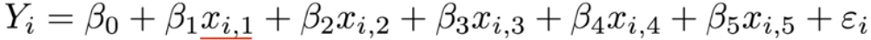

With x1, x2, x3, x4, x5 representing bases on balls per game, singles per game, doubles per game, triples per game, and home runs per game, respectively. Using lm, we can quickly find the least square errors for the parameters using this relatively simple piece of code.

``` r
fit <- Teams %>%
  filter(yearID %in% 1961:2001) %>%
  mutate(BB= BB/G,
         singles = (H-X2B-X3B-HR)/G,
         doubles = X2B/G,
         triples = X3B/G,
         HR = HR/G,
         R = R/G) %>%
  lm(R ~ BB + singles + doubles + triples + HR, data = .)

coefs <- tidy(fit, conf.int = TRUE)
coefs
```

    ## # A tibble: 6 x 7
    ##   term        estimate std.error statistic   p.value conf.low conf.high
    ##   <chr>          <dbl>     <dbl>     <dbl>     <dbl>    <dbl>     <dbl>
    ## 1 (Intercept)   -2.77     0.0862     -32.1 5.32e-157   -2.94     -2.60 
    ## 2 BB             0.371    0.0117      31.6 2.08e-153    0.348     0.394
    ## 3 singles        0.519    0.0127      40.8 9.81e-217    0.494     0.544
    ## 4 doubles        0.771    0.0226      34.1 8.93e-171    0.727     0.816
    ## 5 triples        1.24     0.0768      16.1 2.24e- 52    1.09      1.39 
    ## 6 HR             1.44     0.0244      59.3 0.           1.40      1.49

We can again use the tidy function to see the coefficients, the standard errors, and confidence intervals. To see how well our metric actually predicts runs, we can predict the number of runs for each team in 2002 using the function predict to make the plot.

``` r
Teams %>% filter(yearID %in% 2002) %>%
  mutate(BB = BB/G,
         singles = (H-X2B-X3B-HR)/G,
         doubles = X2B/G,
         triples = X3B/G,
         HR = HR/G,
         R = R/G) %>%
  mutate(R_hat = predict(fit,newdata = .)) %>%
  ggplot(aes(R_hat, R)) + 
  geom_point() +
  geom_text(aes(label=teamID), hjust = -0.2, vjust = 0.2) +
  geom_abline()
```

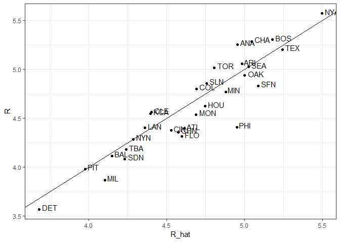

Note that we did not use the 2002 year to create this metric. We used data from years previous to 2002. And here is the plot. Our model does quite a good job, as demonstrated by the fact that points from the observed versus predicted plot fall close to the identity line. So instead of using batting average or just the number of home runs as a measure for picking players, we can use our fitted model to form a more informative metric that relates more directly to run production. Specifically, to define a metric for player A, we imagine a team made up of players just like player A and use our fitted a regression model to predict how many runs this team would produce. The formula would look like this.

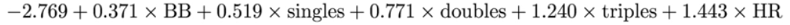

We're basically sticking in the estimated coefficients into the regression formula. However, to define a player's specific metric, we have a bit more work to do. **Our challenge here is that we have derived the metrics for teams based on team-level summary statistics.** For example, the home run value that is entered into the equation is home runs per game for the entire team. If you compute the home runs per game for a player, it will be much lower. As the total is accumulated by nine batters, not just one. Furthermore, if a player only plays part of the game and gets less opportunity than average, it's still considered a game play. So this means that their rates will be lower than they should be. **For players, a rate that takes into account opportunities is a per-plate-appearance rate.** To make the per-game team rate comparable to the per-plate-appearance player rate, we compute the average number of team plate appearances per game using this simple piece of code.

``` r
pa_per_game <- Batting %>% filter(yearID == 2002) %>%
  group_by(teamID) %>%
  summarize(pa_per_game = sum(AB+BB)/max(G)) %>%
  .$pa_per_game %>%
  mean

pa_per_game
```

    ## [1] 38.74657

Now, we're ready to use our metric. We're going to compute the per-plate-appearance rates for players available in 2002. But we're going to use data from 1999 2001. Because remember, we are picking players in 2002. We don't know what has happened yet. To avoid small sample artifacts, we're going to filter players with few plate interferences. Here is the calculation of what we want to do in one long line of code using tidyverse.

``` r
players <- Batting %>% filter(yearID %in% 1999:2001) %>%
  group_by(playerID) %>%
  mutate(PA = BB + AB) %>%
  summarize(G = sum(PA)/pa_per_game,
            BB = sum(BB)/G,
            singles = sum(H-X2B-X3B-HR)/G,
            doubles = sum(X2B)/G,
            triples = sum(X3B)/G,
            HR = sum(HR)/G,
            AVG = sum(H)/sum(AB),
            PA = sum(PA)) %>%
  filter(PA >= 300) %>%
  select(-G) %>%
  mutate(R_hat = predict(fit,newdata=.))
#Batting
players
```

    ## # A tibble: 465 x 9
    ##    playerID     BB singles doubles triples    HR   AVG    PA R_hat
    ##    <chr>     <dbl>   <dbl>   <dbl>   <dbl> <dbl> <dbl> <int> <dbl>
    ##  1 abbotje01  3.28    6.21    2.03  0.113  0.565 0.252   343  4.20
    ##  2 abbotku01  2.41    5.87    1.93  0.241  1.13  0.252   482  4.59
    ##  3 abernbr01  3.16    6.91    1.99  0.117  0.585 0.270   331  4.52
    ##  4 abreubo01  6.03    5.91    2.39  0.478  1.45  0.313  2025  7.08
    ##  5 agbaybe01  4.53    6.31    1.89  0.223  1.30  0.284  1044  5.80
    ##  6 alexama02  2.26    6.39    1.48  0.492  0.393 0.240   394  3.71
    ##  7 alfoned01  4.81    6.31    2.15  0.0625 1.44  0.293  1860  6.10
    ##  8 alicelu01  3.55    7.16    1.65  0.387  0.419 0.273  1201  4.62
    ##  9 allench01  2.99    6.99    1.87  0.253  0.709 0.275   765  4.75
    ## 10 alomaro01  4.73    7.20    2.22  0.331  1.23  0.323  1991  6.62
    ## # ... with 455 more rows

So we fit our model. And we have player-specific metrics. The player-specific predicted runs computer here can be interpreted as a number of runs we would predict a team to score if this team was made up of just that player, if that player batted every single time. The distribution shows that there's y variability across players, as we can see here.

``` r
players %>% ggplot(aes(R_hat)) +
  geom_histogram(binwidth = 0.5, color ="black")
```

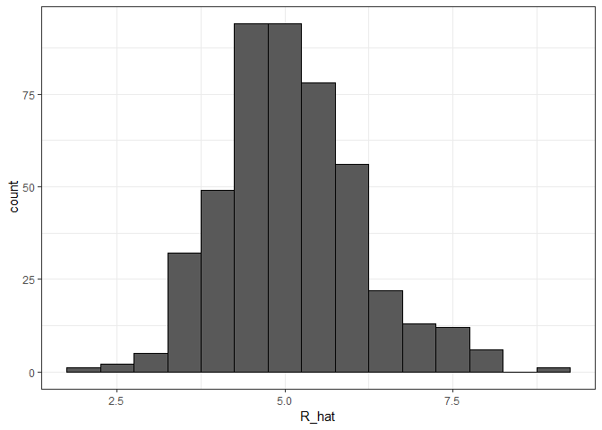

To actually build the teams, we will need to know the players' salaries, since we have a limited budget. Remember, we are pretending to be the Oakland A's in 2002 with only a $40 million budget. We also need to know the players' position. Because we're going to need one shortstop, one second baseman, one third baseman, et cetera. For this, we're going to have to do a little bit of data wrangling to combine information that is contained in different tables from the Lahman library. OK, so here we go. We start by adding the 2002 salaries for each player using this code.

``` r
players <- Salaries %>% 
  filter(yearID == 2002) %>%
  select(playerID, salary) %>%
  right_join(players, by="playerID")
```

Next, we're going to add the defensive position. This is a little bit complicated, because players play more than one position each year. So here, we're going to pick the one position most played by each player using the top\_n function. And to make sure that we only pick one position in the case of ties, we're going to take the first row if there is a tie. We also remove the OF position. Because this stands for outfielder, which is a generalization of three positions-- left field, center field, right field. We also remove pitchers, as they don't bat in the league that the Athletics play. Here is the code that does that.

``` r
players <- Fielding %>%  filter(yearID == 2002) %>%
  filter(!POS %in% c("OF","P")) %>%
  group_by(playerID) %>%
  top_n(1, G) %>%
  filter(row_number(G) == 1) %>%
  ungroup() %>%
  select(playerID, POS) %>%
  right_join(players, by="playerID") %>%
  filter(!is.na(POS) & !is.na(salary))
players
```

    ## # A tibble: 242 x 11
    ##    playerID POS   salary    BB singles doubles triples    HR   AVG    PA
    ##    <chr>    <chr>  <int> <dbl>   <dbl>   <dbl>   <dbl> <dbl> <dbl> <int>
    ##  1 abernbr~ 2B    2.15e5  3.16    6.91    1.99  0.117  0.585 0.270   331
    ##  2 alfoned~ 3B    6.20e6  4.81    6.31    2.15  0.0625 1.44  0.293  1860
    ##  3 alicelu~ 2B    8.00e5  3.55    7.16    1.65  0.387  0.419 0.273  1201
    ##  4 alomaro~ 2B    7.94e6  4.73    7.20    2.22  0.331  1.23  0.323  1991
    ##  5 alomasa~ C     2.50e6  1.66    7.39    1.92  0.156  0.884 0.279   745
    ##  6 anderma~ 2B    4.00e5  2.28    6.93    2.05  0.225  0.546 0.268  1207
    ##  7 aurilri~ SS    5.25e6  3.02    6.92    1.76  0.168  1.66  0.294  1847
    ##  8 ausmubr~ C     5.00e6  3.74    6.39    1.82  0.324  0.524 0.259  1553
    ##  9 bagweje~ 1B    1.10e7  6.63    5.11    2.11  0.0916 2.35  0.301  2114
    ## 10 bakopa01 C     7.50e5  4.38    5.46    2.04  0.180  0.360 0.234   646
    ## # ... with 232 more rows, and 1 more variable: R_hat <dbl>

Finally, we add their names and last names so we know who we're talking about. And here's a code that does that.

``` r
players <- Master %>%
  select(playerID, nameFirst, nameLast, debut) %>%
  right_join(players, by="playerID")


players %>% select(nameFirst, nameLast, POS, salary, R_hat) %>%
  arrange(desc(R_hat)) %>%
  top_n(10)
```

    ## Selecting by R_hat

    ##    nameFirst    nameLast POS   salary    R_hat
    ## 1       Todd      Helton  1B  5000000 8.228149
    ## 2      Jason      Giambi  1B 10428571 7.993738
    ## 3     Albert      Pujols  3B   600000 7.536519
    ## 4      Nomar Garciaparra  SS  9000000 7.505192
    ## 5       Jeff     Bagwell  1B 11000000 7.475011
    ## 6       Alex   Rodriguez  SS 22000000 7.439996
    ## 7     Carlos     Delgado  1B 19400000 7.368549
    ## 8     Rafael    Palmeiro  1B  8712986 7.257184
    ## 9       Mike      Piazza   C 10571429 7.161069
    ## 10       Jim       Thome  1B  8000000 7.156321

So now, we have a table with our predicted run statistic, some other statistic, the player's name, their position, and their salary. If we look at the top 10 players based on our run production statistic, you're going to recognize some names if you're a baseball fan. Note the very high salaries of these players in the top 10. In fact, we see that players with high metrics have high salaries. We can see that by making a plot we do see some low-cost players with very high metrics.

``` r
players %>% ggplot(aes(salary, R_hat, color=POS)) +
  geom_point() +
  scale_x_log10()
```

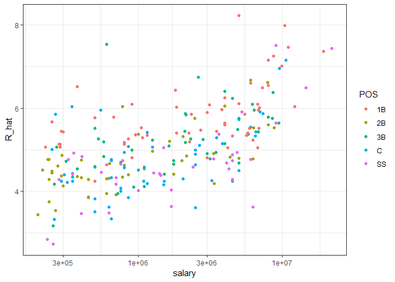

These would be great for our team. Unfortunately, these are likely young players that have not yet been able to negotiate a salary and are not going to be available in 2002. For example, the lowest earner on our top 10 list is Albert Pujols, who was a rookie in 2001. Here's a plot with players that debuted before 1997.

``` r
players %>% filter(debut < 1998) %>%
  ggplot(aes(salary, R_hat, color= POS)) +
  geom_point() +
  scale_x_log10()
```

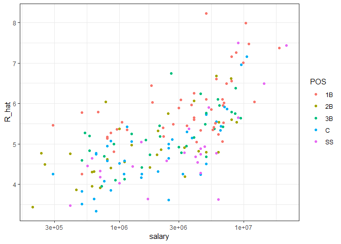

This removes all the young players. We can now search for good deals by looking at players that produce many more runs and others with similar salaries. We can use this table to decide what players to pick and keep our total salary below the $40 million Billy Beane had to work with.

### Building a Better Offensive Metric for Baseball: Linear Programming

A way to actually pick the players for the team can be done using what computer scientists call linear programming. Although we don't go into this topic in detail in this course, we include the code anyway:

``` r
library(reshape2)
```

    ## Warning: package 'reshape2' was built under R version 3.5.2

``` r
library(lpSolve)
```

    ## Warning: package 'lpSolve' was built under R version 3.5.2

``` r
players <- players %>% filter(debut <= 1997 & debut > 1988)
constraint_matrix <- acast(players, POS ~ playerID, fun.aggregate = length)
```

    ## Using R_hat as value column: use value.var to override.

``` r
npos <- nrow(constraint_matrix)
constraint_matrix <- rbind(constraint_matrix, salary = players$salary)
constraint_dir <- c(rep("==", npos), "<=")
constraint_limit <- c(rep(1, npos), 50*10^6)
lp_solution <- lp("max", players$R_hat,
                  constraint_matrix, constraint_dir, constraint_limit,
                  all.int = TRUE) 
```

This algorithm chooses these 9 players:

``` r
our_team <- players %>%
  filter(lp_solution$solution == 1) %>%
  arrange(desc(R_hat))
our_team %>% select(nameFirst, nameLast, POS, salary, R_hat)
```

    ##   nameFirst    nameLast POS   salary    R_hat
    ## 1     Jason      Giambi  1B 10428571 7.993738
    ## 2     Nomar Garciaparra  SS  9000000 7.505192
    ## 3      Mike      Piazza   C 10571429 7.161069
    ## 4      Phil       Nevin  3B  2600000 6.745200
    ## 5      Jeff        Kent  2B  6000000 6.679876

We note that these players all have above average BB and HR rates while the same is not true for singles.

``` r
my_scale <- function(x) (x - median(x))/mad(x)
players %>% mutate(BB = my_scale(BB), 
                   singles = my_scale(singles),
                   doubles = my_scale(doubles),
                   triples = my_scale(triples),
                   HR = my_scale(HR),
                   AVG = my_scale(AVG),
                   R_hat = my_scale(R_hat)) %>%
    filter(playerID %in% our_team$playerID) %>%
    select(nameFirst, nameLast, BB, singles, doubles, triples, HR, AVG, R_hat) %>%
    arrange(desc(R_hat))
```

    ##   nameFirst    nameLast        BB     singles    doubles    triples
    ## 1     Jason      Giambi 3.1181144 -0.53819656  0.9076229 -0.6329836
    ## 2     Nomar Garciaparra 0.1541135  1.61136609  3.1409114  0.4670948
    ## 3      Mike      Piazza 0.4587973 -0.08105246 -0.1879762 -1.2659673
    ## 4      Phil       Nevin 0.6487843 -0.67449076  0.8088466 -1.0762258
    ## 5      Jeff        Kent 0.7315361 -0.29159380  2.1777322  1.1756823
    ##          HR       AVG    R_hat
    ## 1 1.9045739 2.4963991 3.671238
    ## 2 0.9171691 3.7950709 3.059411
    ## 3 2.4762192 1.5842759 2.628452
    ## 4 1.9380514 0.9892049 2.107642
    ## 5 0.8832230 1.5476026 2.025834

### On Base Plus Slugging (OPS)

Since the 1980s sabermetricians have used a summary statistic different from batting average to evaluate players. They realized walks were important, and that doubles, triples, and home runs should be weighted much more than singles, and proposed the following metric.

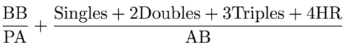

They call this **on-base-percentage plus slugging percentage, or OPS.** Today, this statistic has caught on, and you see it in ESPN and other sports networks. Although the sabermetricians are probably not using regression, this metric is impressively close to what one gets with regression to the summary statistic that we created. Here is the plot. They're very correlated.

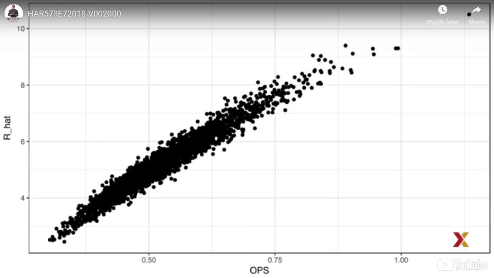

### Regression Fallacy

Wikipedia defines the sophomore slump in the following way. **A sophomore slump or sophomore jinx or sophomore jitters refers to an instance in which a second, or sophomore, effort fails to live up to the standard of the first effort.** It is commonly used to refer to the apathy of students-- second year of high school, college, university-- the performance of athletes-- second season of play-- singers/bands-- second album-- television shows-- second season-- and movies-- sequels or prequels. We hear about the sophomore slump often in Major League Baseball. This is because in Major League Baseball, the Rookie of the Year-- this is an award that's given to the first year player that is judged to have performed the best-- usually does not perform as well during their second year. Therefore they call this the sophomore slump. Know, for example, that in a recent Fox Sports article they asked, will MLB's tremendous rookie class of 2015 suffer a sophomore slump. Now does the data confirm the existence of a sophomore slump? Let's take a look and examine the data for batting averages to see if the observation holds true. The data is available in the Lehman Library, but we have to do some work to create a table with the statistics for all the rookies of the year. Let's go through them. First, we create a table with player ID, their names and their most played position, using this code.

``` r
library(Lahman)
playerInfo <- Fielding %>%
  group_by(playerID) %>%
  arrange(desc(G)) %>%
  slice(1) %>%
  ungroup() %>%
  left_join(Master, by="playerID") %>%
  select(playerID, nameFirst, nameLast, POS)
head(playerInfo)
```

    ## # A tibble: 6 x 4
    ##   playerID  nameFirst nameLast POS  
    ##   <chr>     <chr>     <chr>    <chr>
    ## 1 aardsda01 David     Aardsma  P    
    ## 2 aaronha01 Hank      Aaron    OF   
    ## 3 aaronto01 Tommie    Aaron    1B   
    ## 4 aasedo01  Don       Aase     P    
    ## 5 abadan01  Andy      Abad     1B   
    ## 6 abadfe01  Fernando  Abad     P

Now we will create a table with only the Rookie of the Year Award winners and add their batting statistics. We're going to filter out pitchers since pitchers are not given awards for batting. And we're going to focus on offense. Specifically, we'll focus on batting average since it is the summary that most pundits talk about when discussing the sophomore slump. So we write this piece of code to do this.

``` r
ROY <- AwardsPlayers %>%
  filter(awardID == "Rookie of the Year") %>%
  left_join(playerInfo, by="playerID") %>%
  rename(rookie_year = yearID) %>%
  right_join(Batting, by="playerID") %>%
  mutate(AVG = H/AB) %>%
  filter(POS != "P")
head(ROY)
```

    ##    playerID            awardID rookie_year lgID.x  tie notes nameFirst
    ## 1  darkal01 Rookie of the Year        1948     ML <NA>  <NA>        Al
    ## 2 robinja02 Rookie of the Year        1947     ML <NA>  <NA>    Jackie
    ## 3  darkal01 Rookie of the Year        1948     ML <NA>  <NA>        Al
    ## 4 robinja02 Rookie of the Year        1947     ML <NA>  <NA>    Jackie
    ## 5  darkal01 Rookie of the Year        1948     ML <NA>  <NA>        Al
    ## 6 dropowa01 Rookie of the Year        1950     AL <NA>  <NA>      Walt
    ##   nameLast POS yearID stint teamID lgID.y   G  AB   R   H X2B X3B HR RBI
    ## 1     Dark  SS   1946     1    BSN     NL  15  13   0   3   3   0  0   1
    ## 2 Robinson  2B   1947     1    BRO     NL 151 590 125 175  31   5 12  48
    ## 3     Dark  SS   1948     1    BSN     NL 137 543  85 175  39   6  3  48
    ## 4 Robinson  2B   1948     1    BRO     NL 147 574 108 170  38   8 12  85
    ## 5     Dark  SS   1949     1    BSN     NL 130 529  74 146  23   5  3  53
    ## 6    Dropo  1B   1949     1    BOS     AL  11  41   3   6   2   0  0   1
    ##   SB CS BB SO IBB HBP SH SF GIDP       AVG
    ## 1  0 NA  0  3  NA   0  0 NA    0 0.2307692
    ## 2 29 NA 74 36  NA   9 28 NA    5 0.2966102
    ## 3  4 NA 24 36  NA   2 10 NA    4 0.3222836
    ## 4 22 NA 57 37  NA   7  8 NA    7 0.2961672
    ## 5  5 NA 31 43  NA   1 11 NA   10 0.2759924
    ## 6  0  0  3  7  NA   0  0 NA    2 0.1463415

Now we'll keep only the rookie and sophomore seasons and remove players that did not play a sophomore season.

``` r
ROY <- ROY %>%
  filter(yearID == rookie_year | yearID == rookie_year + 1) %>%
  group_by(playerID) %>%
  mutate(rookie = ifelse(yearID == min(yearID), "rookie", "sophomore")) %>%
  filter(n() == 2) %>%
  ungroup() %>%
  select(playerID, rookie_year, rookie, nameFirst, nameLast, AVG)

head(ROY)
```

    ## # A tibble: 6 x 6
    ##   playerID  rookie_year rookie    nameFirst nameLast   AVG
    ##   <chr>           <int> <chr>     <chr>     <chr>    <dbl>
    ## 1 robinja02        1947 rookie    Jackie    Robinson 0.297
    ## 2 darkal01         1948 rookie    Al        Dark     0.322
    ## 3 robinja02        1947 sophomore Jackie    Robinson 0.296
    ## 4 darkal01         1948 sophomore Al        Dark     0.276
    ## 5 sievero01        1949 rookie    Roy       Sievers  0.306
    ## 6 dropowa01        1950 rookie    Walt      Dropo    0.322

And remember, now we're only looking at players that won the Rookie of the Year Award. This code achieves what we want. Finally, we will use the spread function to have one column for the rookie and another column for the sophomore years' batting averages. For that we use this simple line of code.

``` r
library(tidyverse)
```

    ## Warning: package 'tidyverse' was built under R version 3.5.2

    ## -- Attaching packages -------------------------------------------------------------------------------- tidyverse 1.2.1 --

    ## v tibble  2.0.1     v purrr   0.3.0
    ## v tidyr   0.8.2     v stringr 1.4.0
    ## v readr   1.3.1     v forcats 0.4.0

    ## Warning: package 'tibble' was built under R version 3.5.2

    ## Warning: package 'tidyr' was built under R version 3.5.2

    ## Warning: package 'readr' was built under R version 3.5.2

    ## Warning: package 'purrr' was built under R version 3.5.2

    ## Warning: package 'stringr' was built under R version 3.5.2

    ## Warning: package 'forcats' was built under R version 3.5.2

    ## -- Conflicts ----------------------------------------------------------------------------------- tidyverse_conflicts() --
    ## x gridExtra::combine() masks dplyr::combine()
    ## x dplyr::filter()      masks stats::filter()
    ## x dplyr::lag()         masks stats::lag()

``` r
ROY <- ROY %>%
  spread(rookie, AVG) %>% 
  arrange(desc(rookie))
head(ROY)
```

    ## # A tibble: 6 x 6
    ##   playerID  rookie_year nameFirst nameLast rookie sophomore
    ##   <chr>           <int> <chr>     <chr>     <dbl>     <dbl>
    ## 1 mccovwi01        1959 Willie    McCovey   0.354     0.238
    ## 2 suzukic01        2001 Ichiro    Suzuki    0.350     0.321
    ## 3 bumbral01        1973 Al        Bumbry    0.337     0.233
    ## 4 lynnfr01         1975 Fred      Lynn      0.331     0.314
    ## 5 pujolal01        2001 Albert    Pujols    0.329     0.314
    ## 6 troutmi01        2012 Mike      Trout     0.326     0.323

Now we can see the top performers in their first year. These are the Rookie of the Year Award winners. And we're showing their rookie season batting average and their sophomore season batting average. Look closely and you will see the sophomore slump. It definitely appears to be real. In fact, the proportion of players that have a lower batting average their sophomore years is 68%.

So is it jitters? Is it a jinx? To answer this question, let's turn our attention to all players. We're going to look at the 2013 season and 2014 season. And we're going to look at players that batted at least 130 times. This is a minimum needed to win the Rookie of the Year. We're going to perform a similar operation as we did before to construct this data set. Here is the code.

``` r
two_years <- Batting %>%
  filter(yearID %in% 2013:2014) %>%
  group_by(playerID, yearID)  %>%
  filter(sum(AB) >= 130) %>%
  summarize(AVG = sum(H)/sum(AB)) %>%
  ungroup() %>%
  spread(yearID, AVG) %>%
  filter(!is.na(`2013`) & !is.na(`2014`)) %>%
  left_join(playerInfo, by = "playerID") %>%
  filter(POS !="P") %>%
  select(-POS) %>%
  arrange(desc(`2013`)) %>%
  select(-playerID)
head(two_years)
```

    ## # A tibble: 6 x 4
    ##   `2013` `2014` nameFirst nameLast
    ##    <dbl>  <dbl> <chr>     <chr>   
    ## 1  0.348  0.313 Miguel    Cabrera 
    ## 2  0.345  0.283 Hanley    Ramirez 
    ## 3  0.331  0.332 Michael   Cuddyer 
    ## 4  0.324  0.289 Scooter   Gennett 
    ## 5  0.324  0.277 Joe       Mauer   
    ## 6  0.323  0.287 Mike      Trout

Now let's look at the top performers of 2013 and then look at their performance in 2014. Note that the same pattern arises when we look at the top performers. Batting averages go down for the top performers. But these are not rookies. So this can't be explained with a sophomore slump. Also know what happens to the worst performers of 2013. Here they are.

``` r
arrange(two_years, `2013`)
```

    ## # A tibble: 312 x 4
    ##    `2013` `2014` nameFirst nameLast 
    ##     <dbl>  <dbl> <chr>     <chr>    
    ##  1  0.158  0.219 Danny     Espinosa 
    ##  2  0.179  0.149 Dan       Uggla    
    ##  3  0.181  0.2   Jeff      Mathis   
    ##  4  0.184  0.208 Melvin    Upton    
    ##  5  0.190  0.262 Adam      Rosales  
    ##  6  0.192  0.215 Aaron     Hicks    
    ##  7  0.194  0.229 Chris     Colabello
    ##  8  0.194  0.177 J. P.     Arencibia
    ##  9  0.195  0.241 Tyler     Flowers  
    ## 10  0.198  0.218 Ryan      Hanigan  
    ## # ... with 302 more rows

Their batting averages go up in their second season in 2014. Is this some sort of reverse sophomore slump? It is not. There is no such thing as a sophomore slump. **This is all explained with a simple statistical fact.** **The correlation of performance in two separate years is high but not perfect.** Here is the data for 2013 performance and 2014 performance.

``` r
two_years %>% ggplot(aes(`2013`,`2014`)) + geom_point()
```

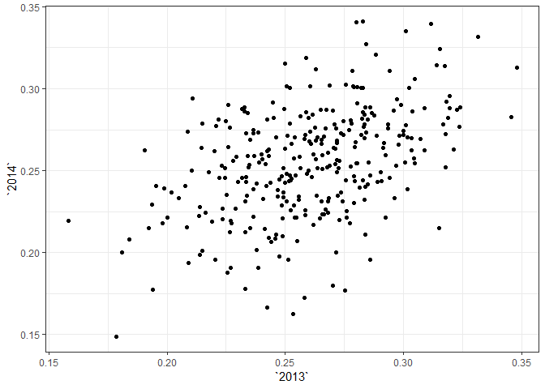

You can see it's correlated. But it's not perfectly correlated. The correlation is 0.46.

``` r
summarize(two_years, cor(`2013`,`2014`))
```

    ## # A tibble: 1 x 1
    ##   `cor(\`2013\`, \`2014\`)`
    ##                       <dbl>
    ## 1                     0.460

The data look very much like a bivariate normal distribution, which means that if we were to predict the 2014 batting average, let's call it y, for any given player that had a 2013 batting average of x, we would use the regression equation, which would be this.

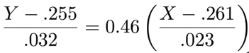

Because a correlation is not perfect, regression tells us that on average, we expect high performers from 2013 to do a little bit worse in 2014. **This regression to the mean.** It's not a jinx. It's just due to chance. The rookies of the year are selected from the top values of x So it is expected that their y will regress to the mean.

### Measurement Error Models

Up until now, all our linear regression examples have been applied to two or more random variables. We assume the pairs are bivariate normal and use this to motivate a linear model. This approach covers most of real life examples where linear regression is used. **The other major application comes from measurement error models.** In these applications, it is common to have a nonrandom covariates, such as time. And randomness is introduced from measurement error, rather than sampling or natural variability. To understand these models, we're going to use a motivation example related to physics. Imagine you are Galileo in the 16th century trying to describe the velocity of a falling object. An assistant climbs the Tower of Pisa and drops a ball. While several other assistants record the position at different times. The falling object data set contains an example of what that data would look like. The assistant hands the data to Galileo and this is what he sees.

´falling\_object %&gt;% ´
´ ggplot(aes(time, observed\_distance)) +´
´ geom\_point() +´
´ ylab("Distance in meters") +´
´ xlab("Time in seconds")´

He uses ggplot to make a plot. 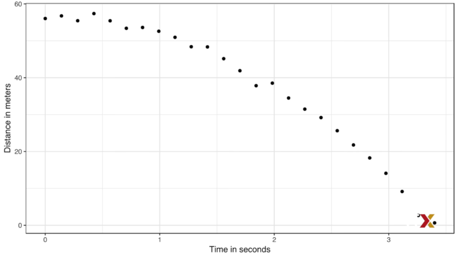

Here we see the distance in meters that has dropped on the y-axis and time on the x-axis. Galileo does not know the exact equation, but from data exploration, by looking at the plot, he deduces that the position should follow a parabola, which we can write like this.

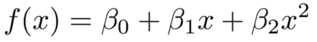

The data does not fall exactly on a parabola, **but Galileo knows that this is due to measurement error.** His helpers make mistakes when measuring the distance the ball has fallen. To account for this, we write this model.

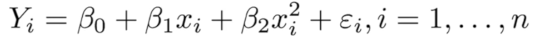

Here, y represents the distance the ball is dropped in meters. Xi represents time in seconds. And epsilon represents measurement error. The measurement error is assumed to be random, independent from each other and having the same distribution from each i. We also assume that there is no bias, which means that the expected value of epsilon is 0. **Note that this is a linear model because it is a linear combination of known quantities.** X and x squared are known and unknown parameters, the betas. Unlike our previous example, the x's are fixed quantities. This is just time. We're not conditioning. Now to pose a new physical theory and start making predictions about other falling objects, Galileo needs actual numbers, rather than the unknown parameters. The LSE squares estimates seem like a reasonable approach. So how do we find the LSE squares estimates? **Note that the LSE calculations do not require the errors to be approximately normal.** **The lm( ) function will find the betas that minimize the residual sum of squares, which is what we want.** So we use this code to obtain our estimated parameters.

´fit &lt;- falling\_object %&gt;% ´
´ mutate(time\_sq = time^2) %&gt;%´
´ lm(y~time+time\_sq, data=.)´

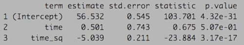

To check if the estimated parabola fits the data, the broom function augment( ) lets us do this easily. Using this code,

´augment(fit) %&gt;%´ ´ ggplot() +´ ´ geom\_point(aes(time, y)) +´ ´ geom\_line(aes(time, fitted))´

we can make the following plot.

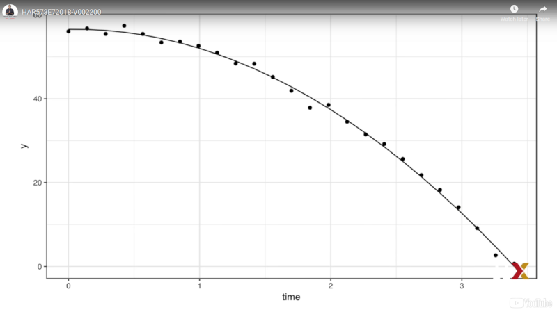

Note that the predicted values go right through the points. Now, thanks to my high school physics teacher, I know that the equation for the trajectory of a falling object is the following.

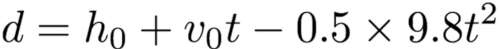

With h0 and v0, the starting height and starting velocity respectively. The data we use follow this equation and added measurement error to simulate and observations. Dropping the ball, that means the starting velocity is 0 because we start just by dropping it from the Tower of Pisa, which has a height of about 56.67 meters. These known quantities are consistent with the parameters that we estimated, which we can see using the tidy function. Here they are.

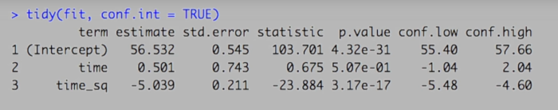

The Tower of Pisa height is within the confidence interval for beta 0. The initial velocity of 0 is in the confidence interval for beta 1. Note that the p value is larger than 0.05, which means we wouldn't reject the hypothesis that the starting velocity is 0. And finally, the acceleration constant is in the confidence intervals for negative 2 times beta 2.
