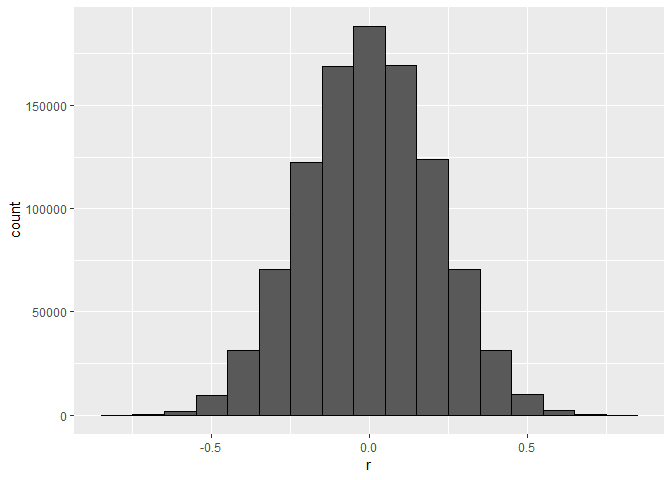
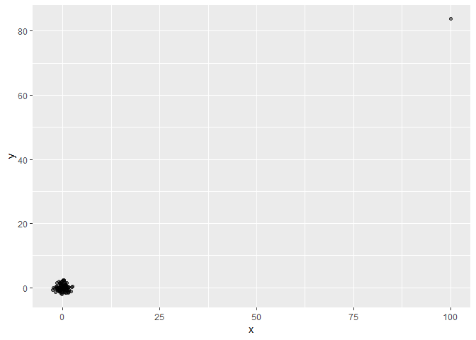
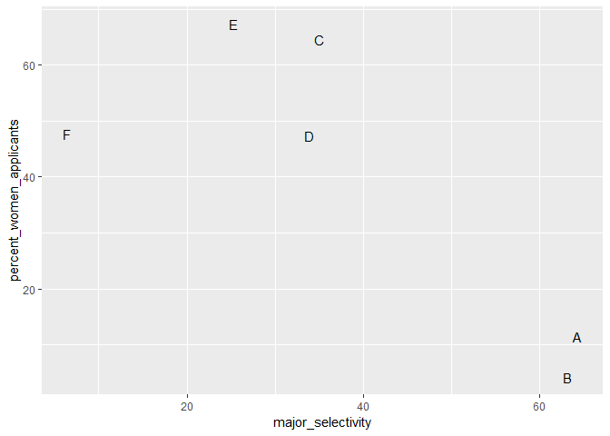

Linear Regression - Confounding
================

Confounding
===========

Confounding Overview
--------------------

In the **Confounding** section, you will learn what is perhaps the most important lesson of statistics: that correlation is not causation.

After completing this section, you will be able to:

        Identify examples of spurious correlation and explain how data dredging can lead to spurious correlation.
        Explain how outliers can drive correlation and learn to adjust for outliers using Spearman correlation.
        Explain how reversing cause and effect can lead to associations being confused with causation.
        Understand how confounders can lead to the misinterpretation of associations.
        Explain and give examples of Simpson's Paradox.

This section has one part: **Correlation is Not Causation.**

Correlation is Not Causation
----------------------------

### Spurious Correlation

**Correlation is not causation is perhaps the most important lesson one learns in a statistics class.** In this course, we have described tools useful for quantifying associations between variables, but we must be careful not to over interpret these associations. **There are many reasons that a variable x can correlate with a variable y, without either being a cause for the other.** Here we examine common ways that can lead to misinterpreting associations. The first example of how we can misinterpret associations are spurious correlations. The following comical example underscores that correlation is not causation. The example shows a very strong correlation between divorce rates and margarine consumption. The correlation is 0.93. Does this mean that margarine causes divorces, or do divorces cause people to eat more margarine? Of course, the answer to both these questions is no. This is just an example of what we call spurious correlations. You can see many, many more observed examples in this website completely dedicated to spurious correlations. In fact, that's the title of the website. The cases presented in the spurious correlation site are all examples of what is generally called **data dredging, or data phishing, or data snooping.** It's basically a form of what in the United States, they call **cherry picking.** An example of **data dredging** would be if you look through many results produced by a random process, and pick the one that shows a relationship that supports the theory you want to defend. A Monte Carlo simulation can be used to show how data dredging can result in finding high correlations among variables that are theoretically uncorrelated. We'll save the results of a simulation into a table like this.

``` r
library(tidyverse)
```

    ## Warning: package 'tidyverse' was built under R version 3.5.2

    ## -- Attaching packages -------------------------------------------------------------------------------- tidyverse 1.2.1 --

    ## v ggplot2 3.1.0       v purrr   0.3.0  
    ## v tibble  2.0.1       v dplyr   0.8.0.1
    ## v tidyr   0.8.2       v stringr 1.4.0  
    ## v readr   1.3.1       v forcats 0.4.0

    ## Warning: package 'ggplot2' was built under R version 3.5.2

    ## Warning: package 'tibble' was built under R version 3.5.2

    ## Warning: package 'tidyr' was built under R version 3.5.2

    ## Warning: package 'readr' was built under R version 3.5.2

    ## Warning: package 'purrr' was built under R version 3.5.2

    ## Warning: package 'dplyr' was built under R version 3.5.2

    ## Warning: package 'stringr' was built under R version 3.5.2

    ## Warning: package 'forcats' was built under R version 3.5.2

    ## -- Conflicts ----------------------------------------------------------------------------------- tidyverse_conflicts() --
    ## x dplyr::filter() masks stats::filter()
    ## x dplyr::lag()    masks stats::lag()

``` r
N <- 25
G <- 1000000
sim_data <- tibble(group = rep(1:G, each = N), X = rnorm(N*G), Y = rnorm(N*G))
head(sim_data)
```

    ## # A tibble: 6 x 3
    ##   group      X       Y
    ##   <int>  <dbl>   <dbl>
    ## 1     1  0.656  0.485 
    ## 2     1 -1.30  -0.709 
    ## 3     1 -0.909  1.18  
    ## 4     1 -0.852 -0.944 
    ## 5     1 -0.178  0.266 
    ## 6     1  1.17   0.0452

The first column denotes group and we simulated one million groups, each with 25 observations. For each group, we generate 25 observations which are stored in the second and third column. These are just random, independent normally distributed data. So we know,\*\* because we constructed the simulation, that x and y are not correlated.\*\* Next, we compute the correlation between x and y for each group, and look for the maximum. Here are the top correlations.

``` r
res <- sim_data %>% 
  group_by(group) %>%
  summarize(r = cor(X, Y)) %>%
  arrange(desc(r))

head(res)
```

    ## # A tibble: 6 x 2
    ##    group     r
    ##    <int> <dbl>
    ## 1  91550 0.821
    ## 2  44576 0.784
    ## 3 945726 0.757
    ## 4 754575 0.753
    ## 5 827713 0.750
    ## 6  97101 0.746

If we just plot the data from this particular group, it shows a convincing plot that x and y are, in fact, correlated.

``` r
sim_data %>% filter(group == res$group[which.max(res$r)]) %>% 
  ggplot(aes(X,Y)) + 
  geom_point() +
  geom_smooth(method = "lm")
```


But remember that the correlations number is a random variable. Here's the distribution we just generated with our Monte Carlo simulation.

``` r
res %>% ggplot(aes(x=r)) + geom_histogram(binwidth = 0.1, color = "black")
```



**It is just a mathematical fact that if we observe random correlations that are expected to be 0, but have a standard error of about 0.2,** the largest one will be close to 1 if we pick from among one million. **Note that if we performed regression on this group and interpreted the p-value, we would incorrectly claim this was a statistically significant relation.** Here's the code.

``` r
library(broom)
```

    ## Warning: package 'broom' was built under R version 3.5.2

``` r
sim_data %>% filter(group == res$group[which.max(res$r)]) %>%
  do(tidy(lm(Y ~ X, data = .)))
```

    ## # A tibble: 2 x 5
    ##   term        estimate std.error statistic     p.value
    ##   <chr>          <dbl>     <dbl>     <dbl>       <dbl>
    ## 1 (Intercept)   0.0480     0.116     0.413 0.683      
    ## 2 X             0.822      0.119     6.89  0.000000506

Look how small the p-value is. This particular form of data dredging is referred to as **p-hacking.** P-hacking is a topic of much discussion because it is a problem in scientific publications. Because publishers tend to reward statistically significant results over negative results, there's an incentive to report significant results. In epidemiology in the social sciences for example, researchers may look for associations between an average outcome and several exposures, and report only the one exposure that resulted in a small p-value. Furthermore, they might try fitting several different models to adjust for confounding and pick the one model that yields the smallest p-value. In experimental disciplines, an experiment might be repeated more than once, and only the one that results in a small p-value are reported. This does not necessarily happen due to unethical behavior, but rather to statistical ignorance or wishful thinking. In advanced statistics courses, you'll learn methods to adjust for what is called the multiple comparison problem.

### Outliers

Another way that we can see high correlations when there's no causation is when we have outliers. Suppose we take measurements from two independent outcomes, x and y, and we standardize the measurements. However, imagine we made a mistake and forgot to standardize entry 23. We can simulate such data using the following code.

``` r
set.seed(1)
x <- rnorm(100,100,1)
y <- rnorm(100,84,1)
x[-23] <- scale(x[-23])
y[-23] <- scale(y[-23])
```

The data looks like this.

``` r
library(tidyverse)
tibble(x,y) %>% ggplot(aes(x,y)) + geom_point(alpha = 0.5)
```



Not surprisingly, the correlation is very high.

``` r
cor(x,y)
```

    ## [1] 0.9881391

That one point, that one outlier, is making the correlation be as high as 0.99. But again, this is driven by that one outlier. If we remove this outlier, the correlation is greatly reduced to almost 0, which is what it should be. Here's what we get if we remove entry 23.

``` r
cor(x[-23], y[-23])
```

    ## [1] -0.001066464

**So one way to deal with outliers is to try to detect them and remove them.** But there is an alternative way to the sample correlation for estimating the population correlation that is robust to outliers. It is called **Spearman correlation.** The idea is simple. **Compute the correlation on the ranks of the values, rather than the values themselves.** Here's a plot of the ranks plotted against each other for that data set that includes the outlier.


Note that the one point that's very large is just at the 100th location. It is no longer really out there and pulling the correlation towards 1. So if we compute the correlation of the ranks, we get something much closer to 0, as we see here.

``` r
cor(rank(x),rank(y))
```

    ## [1] 0.06583858

Spearman correlation can also be calculated with the correlation function, but using the method argument to tell cor which correlation to compute.

``` r
cor(x,y, method = "spearman")
```

    ## [1] 0.06583858

There are also methods for robust fitting of linear models, which you can learn about in, for example, this book.

### Reversing Cause and Effect

**Another way associations are confounded with causation is when the cause and effect are reversed.** An example of this is claiming that tutoring makes students perform worse because they test lower than peers that are not tutored. Here, the tutoring is not causing the low test, but the other way around. A form of this claim was actually made in an op ed in the New York Times, titled "Parental Involvement is Overrated". Consider this quote from the article. "When we examine whether regular help with homework had a positive impact on children's academic performance, we were quite startled by what we found. Regardless of family social class, racial, or ethnic background, or child's grade level, consistent homework help almost never improved test scores or grades. Even more surprising to us was that when parents regularly helped with homework, kids usually performed worse." A very likely possibility is that children needing regular parental help get this help because they don't perform well in school. To see another example, we're going to use one of the data sets that we've seen in this course. Specifically, we can easily construct an example of cause and effect reversal using the father and son height data.


Note that if we fit the following model to the father and son height data, with x representing the father height, and y representing the son height, we do get a statistically significant result. You can see that with this simple code.

``` r
library(HistData)
```

    ## Warning: package 'HistData' was built under R version 3.5.2

``` r
data("GaltonFamilies")
GaltonFamilies %>% filter(childNum == 1 & gender == "male") %>%
  select(father,childHeight) %>%
  rename(son = childHeight) %>%
  do(tidy(lm(father ~ son , data = .)))
```

    ## # A tibble: 2 x 5
    ##   term        estimate std.error statistic  p.value
    ##   <chr>          <dbl>     <dbl>     <dbl>    <dbl>
    ## 1 (Intercept)   34.0      4.57        7.44 4.31e-12
    ## 2 son            0.499    0.0648      7.70 9.47e-13

This model fits the data very well. However, if we look at the mathematical formulation of the model, **it could easily be incorrectly interpreted** as to suggest that the son being tall caused the father to be tall. But given what we know about genetics and biology, we know it's the other way around. **The model is technically correct. The estimates and p-value were obtained correctly as well. What is wrong here is simply the interpretation.**

### Confounders

Confounders are perhaps the most common reason that leads to associations being misinterpreted. **If X and Y are correlated, we call Z a confounder if changes in Z cause changes in both X and Y**. Earlier, when studying baseball data, we saw how home runs was a confounder that resulted in higher correlation than expected when studying the relationship between bases and balls and runs. In some cases, we can use linear models to account for confounders, as we did in the baseball example. But it is not always possible. Incorrect interpretation due to confounders are ubiquitous in the lay press. They are sometimes hard to detect. We examined admission data from UC Berkeley majors from 1973 that showed that more men were being admitted than women. 44% men were admitted compared to 30% women. Here's the data.

``` r
library(dslabs)
```

    ## Warning: package 'dslabs' was built under R version 3.5.2

``` r
data("admissions")
admissions
```

    ##    major gender admitted applicants
    ## 1      A    men       62        825
    ## 2      B    men       63        560
    ## 3      C    men       37        325
    ## 4      D    men       33        417
    ## 5      E    men       28        191
    ## 6      F    men        6        373
    ## 7      A  women       82        108
    ## 8      B  women       68         25
    ## 9      C  women       34        593
    ## 10     D  women       35        375
    ## 11     E  women       24        393
    ## 12     F  women        7        341

The percent of men and women that got accepted can be computed from this data using this simple piece of code.

``` r
admissions %>% group_by(gender) %>%
  summarize(percentage = round(sum(admitted*applicants)/sum(applicants),1))
```

    ## # A tibble: 2 x 2
    ##   gender percentage
    ##   <chr>       <dbl>
    ## 1 men          44.5
    ## 2 women        30.3

A statistical test, the chi-squared test that we learned about in a previous course, clearly rejects the hypothesis that gender and admissions are independent.

``` r
library(broom)
admissions %>% group_by(gender) %>%
  summarize(total_admitted = round(sum(admitted/100*applicants)),not_admmitted = sum(applicants)-sum(total_admitted)) %>%
  select(-gender) %>%
  do (tidy(chisq.test(.)))
```

    ## # A tibble: 1 x 4
    ##   statistic  p.value parameter method                                      
    ##       <dbl>    <dbl>     <int> <chr>                                       
    ## 1      91.6 1.06e-21         1 Pearson's Chi-squared test with Yates' cont~

The p value is very small. But closer inspection shows a paradoxical result. Here are the percent of admissions by major. Four out of the six majors favor women. But more importantly, all the differences are much smaller than the 14% difference that we see when examining the totals. The paradox is that analyzing the totals suggest a dependence between admissions and gender. But when the data is grouped by major, this dependence seems to disappear. What's going on? **This actually can happen if an uncounted confounder is driving most of the variability.** So let's define three variables. X is 1 for men and 0 for women, Y is 1 for those admitted and 0 otherwise, and Z quantifies how selective the major is. **A gender bias claim would be based on the fact that this probability is higher when X is 1 than when X is 0.**


**But Z is an important confounder.** Clearly, Z is associated with Y, because the more selective a major, the lower the probability that someone enters that major. \*But is major selectivity, which we call Z, associated with gender?\*\* One way to see this is to plot the total percent admitted to a major versus the percent of women that make up the applicants. We can see that in this plot.

``` r
admissions %>%
  group_by(major) %>%
  summarize(major_selectivity = sum(admitted*applicants)/sum(applicants),
            percent_women_applicants = sum(applicants*(gender=="women")/sum(applicants))*100) %>%
  ggplot(aes(major_selectivity, percent_women_applicants, label=major)) + 
  geom_text()
```



There seems to be an association. The plot suggests that women were much more likely to apply to the two hard majors. Gender and major selectivity are confounded. Compare, for example, major B and major E. Major E is much harder to enter than major B. And over 60% of applicants to major E were women, while less than 30% of the applicants of major B were women. The following plot shows the percentage of applicants that were accepted by gender.

``` r
admissions %>%
  mutate(percent_admitted = admitted * applicants/ sum(applicants)) %>%
  ggplot(aes(gender, y =percent_admitted, fill = major)) +
  geom_bar(stat = "identity", position = "stack")
```


The color here represents major. It also breaks down the acceptance rates by major. The size of the colored bar represent the percent of each major students that were admitted to. This breakdown lets us see that the majority of accepted men came from two majors, A and B. It also lets us see that few women apply to these two easy majors. What the plot does not show us is what's the percent admitted by major. In this plot, we can see that if we condition or stratify by major, and then look at differences, we control for the confounder, and the effect goes away.

``` r
admissions %>% 
  ggplot(aes(major, admitted, col=gender, size = applicants)) +
  geom_point()
```


Now we see that major by major, there's not much difference. The size of the dot represents the number of applicants, and explains the paradox. We see large red dots and small blue dots for the easiest majors, A and B. If we first stratify by major, compute the difference, and then average, we find that the percent difference is actually quite small.

``` r
admissions %>% group_by(gender) %>% summarize(average = mean(admitted))
```

    ## # A tibble: 2 x 2
    ##   gender average
    ##   <chr>    <dbl>
    ## 1 men       38.2
    ## 2 women     41.7

**This is actually an example of something that is called Simpson's paradox, which we will describe in the next video.**

### Simpson's Paradox

We have just seen an example of Simpson's paradox. It is called a paradox because we see the sign of the correlation flip when we computed on the entire population and when we computed on specific strata. Now, we're going to use a very illustrative simulated example to show you how this can happen. Suppose you have three variables-- x, y, and z. Here's a scatter plot of y versus x.


You can see that x and y are negatively correlated. However, once we stratify by z-- the confounder which we haven't looked at yet--  we see that another pattern emerges. This plot, the different strata defined by disease, are shown in different colors. If you compute the correlation in each strata, you see that the correlations are now positive. So it's really z that is negatively correlated with x. If we stratify by z, the x and y are actually positively correlated. This is an example of Simpson's paradox.
