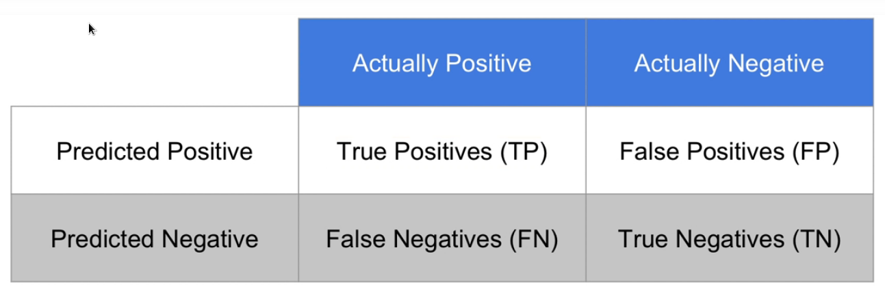
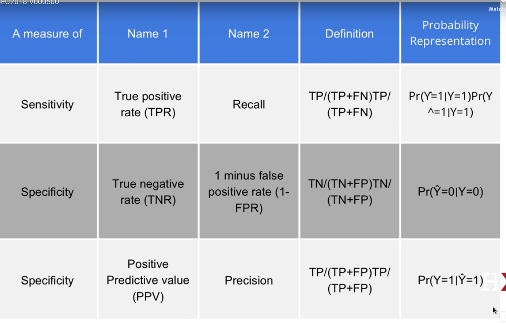
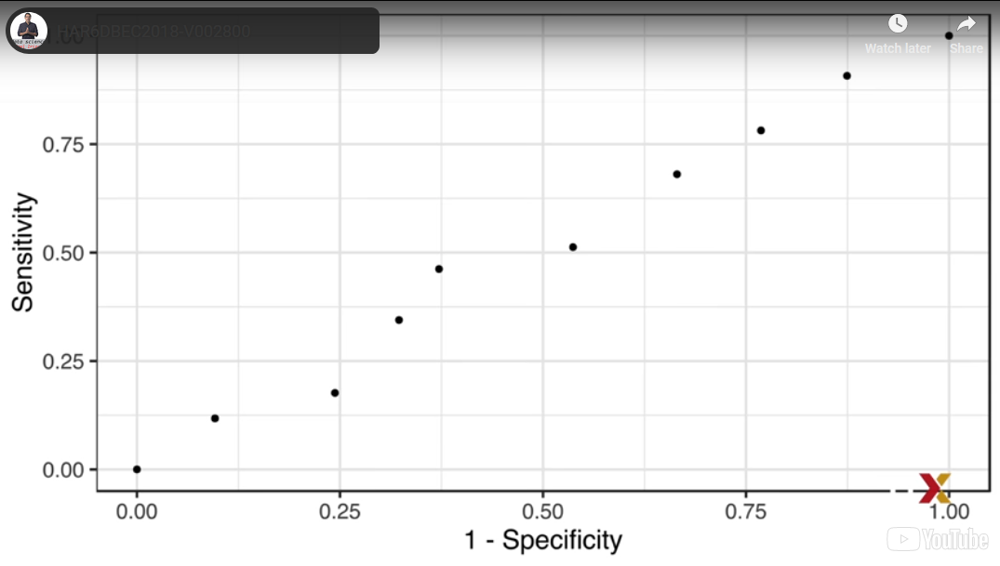
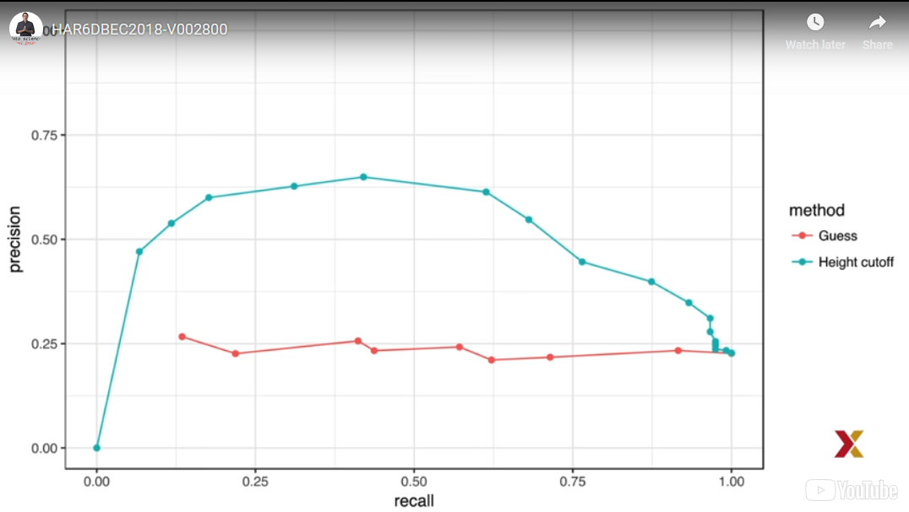
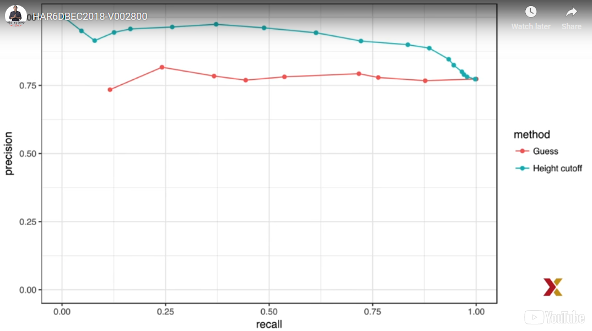

## Machine Learning Basics Overview

In the **Machine Learning Basics** section, you will learn the basics of machine learning.

After completing this section, you will be able to:

        * Start to use the caret package.
        * Construct and interpret a confusion matrix.
        * Use conditional probabilities in the context of machine learning.

This section has two parts: **basics of evaluating machine learning algorithms and conditional probabilities**. There are comprehension checks at the end of each part.

## Basics of Evaluating Machine Learning Algorithms

### Caret package, training and test sets, and overall accuracy

In this course, we will be using the caret package, which
has several useful functions for building and assessing machine learning
methods.  
You can load it like this.

```{r}
library(caret)
library(tidyverse)
```

Later, we show how these functions are useful.
In this video, we focus on describing ways in which machine
learning algorithms are evaluated.
So let's get started.
For our first introduction to machine learning concepts,
we'll start with a boring and simple example--
predict sex-- female or male--
using height.
We explain machine learning step by step and this example
will let us sit down the first building block.
Soon enough, we'll be attacking more interesting challenges.
For this first example, we will use the heights data set in the ds labs
package, which you can load like this.

```{r}
library(dslabs)
data(heights)
```


We start by defining the outcome and predictors.
In this example, we have only one predictor.
So y is sex and x is height.

```{r}
y <- heights$sex
x <- heights$height
```

This is clearly a** categorical outcome **since y can be male or female,
and we only have one predictor, height.
We know that we will not be able to predict y very accurately based
on x because male and female heights are not
that different relative to within group variability,
but can we do better than guessing?
The answer to this question, we need to quantify the definition of better.
Ultimately, a machine learning algorithm is
evaluated on how it performs in the real world with others running the code.
However, when developing an algorithm, we usually
have a data set for which we know the outcomes as we do with the heights.
We know the sex of every student.
Therefore, to mimic the ultimate evaluation process,
we typically split the data into two and act
as if we don't know the outcome for one of these two sets.
We stop pretending we don't know the outcome to evaluate the algorithm,
but only after we're done constructing it.
We refer to the groups of which we know the outcome
and use to develop the algorithm as the **training set,**
and the group for which we pretend we don't know the outcome as the **test set.**
A standard way of generating the training and test sets
is by randomly splitting the data.  
The **caret package** includes the function **createDataPartition**
that helps us generate indexes for randomly splitting
the data into training and test sets.
The argument **times** in functions is used to define how many
random samples of indexes to return.
The argument **p** is used to define what proportion of the index
represented and the argument **list** is used to decide you want indexes
to be returned as a list or not.
Here we're going to use it like this.

```{r}
set.seed(2)
test_index <- createDataPartition(y, times = 1, p = 0.5, list = FALSE)
```


We can use this index to define the training set and test set like this.

```{r}
train_set <- heights[-test_index,]
test_set <- heights[test_index,]
```

We will now develop an algorithm using only the training set.
Once we're done developing the algorithm,
we will freeze it, and evaluate it using the tests.
The simplest way to evaluate the algorithm when the outcomes are
categorical is simply by reporting the proportion of cases that were correctly
predicted in the test studies.
This metric is usually referred to as **overall accuracy.**
To demonstrate the use of overall accuracy,
we will build two competing algorithms and compare them.
Let's start by developing the simplest possible machine learning algorithm--
guessing the outcome.  

We can do that using the sample function like this.

```{r}
y_hat <- sample(c("Male","Female"),
                length(test_index), replace = TRUE)
```


Note that we're completely ignoring the predictor and simply guessing the sex.
OK, let's move on.
In machine learning applications, it is useful to use factors
to represent the categorical outcomes.
Our functions developed for machine learning,
such as those in the caret package, require or recommend
**that categorical outcomes be coded as factors.**
So we can do that like this.

```{r}
y_hat <-sample(c("Male","Female"),length(test_index),replace = TRUE) %>%
  factor(levels = levels(test_set$sex))
```

The overall accuracy is simply defined as the overall proportion
that is predicted correctly.
We can compute that using this simple line of code.

```{r}
mean(y_hat == test_set$sex)
```

Not surprisingly, our accuracy is about 50%--
we're guessing.
Now, can we do better?
Exploratory data as it suggests we can because on average, males
are slightly taller than females.
You can see it by typing this code.

```{r}
heights %>% group_by(sex) %>%
  summarize(mean(height), sd(height))
```

But how do we make use of this insight?
Let's try a simple approach.
Predict male if height is within two standard deviations
from the average male.
We can do that using this very simple code.

```{r}
y_hat <- ifelse(x > 62, "Male", "Female") %>%
  factor(levels = levels(test_set$sex))
```


The accuracy goes way up from 50% to 80%,

```{r}
mean(y == y_hat)
```

which we can see by typing this line, but can we do better?
In the example above, we use the cutoff of 62 inches,
but we can examine the accuracy obtained for other cutoffs
and then take the value that provides the best result.
But remember it is important that we pick the best value on the training
set.
The test set is only for evaluation.
Although for this simplistic example, it is not much of a problem.
Later, we will learn that evaluating an algorithm on the training set
can lead to **overfitting**, which often results in dangerously
over optimistic assessments.
OK, so let's choose a different cutoff.
We examined the accuracy we obtain with 10 different cutoffs
and pick the one yielding the best result.
We can do that with this simple piece of code.

```{r}
cutoff <- seq(61,70)
accuracy <- map_dbl(cutoff,function(x){
  y_hat <- ifelse(train_set$height > x, "Male", "Female") %>%
    factor(levels = levels(test_set$sex))
  mean(y_hat == train_set$sex)
})  
```

We can make a plot showing the accuracy on the training set
for males and females.
Here it is.

```{r}

data.frame(cutoff,accuracy) %>%
  ggplot(aes(
    x = cutoff,
    y = accuracy)) +
  geom_line() +
  geom_point()
```


We see that the maximum value is a 83.6%.

```{r}
max(accuracy)
```


Much higher than 50%, and it is maximized with the cutoff of 64 inches.

```{r}
best_cutoff <- cutoff[which.max(accuracy)]
best_cutoff
```

Now, we can test this cut off on our test
set to make sure accuracy is not overly optimistic.
Now, we get an accuracy of 81.7%.

```{r}
y_hat <- ifelse(test_set$height > best_cutoff, "Male", "Female") %>%
  factor(levels = levels(test_set$sex))
y_hat <-factor(y_hat)
mean(y_hat == test_set$sex)
```

We see that is a bit lower than the accuracy observed on the training set,
but it's still better than guessing.
And by testing on a data that we did not train on,
we know it is not due to overfitting.


### Confusion Matrix

We previously developed a decision rule
that predicts male if the student is taller than 64 inches.
Now, given that the average female is about 65 inches,
this prediction rule seems wrong.
What happened?
If a student is the height of the average female,
shouldn't we predict female?
Generally speaking, overall accuracy can be a deceptive measure.
To see this, we'll start by constructing what is referred to as the confusion
matrix, which basically tabulates each combination of prediction
and actual value.
We can do this in R using the function table, like this.

```{r}
table(predicted = y_hat, actual = test_set$sex)
```


If we study this table closely, it reveals a problem.
If we compute the accuracy separately for each sex, we get the following.

```{r}
test_set %>%
  mutate(y_hat = y_hat) %>%
  group_by(sex) %>%
  summarize(accuracy = mean(y_hat == sex))
```


We get that we get a very high accuracy for males, 93%,
but a very low accuracy for females, 42%.
There's an imbalance in the accuracy for males and females.
Too many females are predicted to be male.
In fact, we're calling close to half females males.
How can our overall accuracy we so high, then?  

**This is because of the prevalence.**  

There are more males in the data sets than females.  

These heights were collected from three data science courses, two of which
had more males enrolled.
At the end, we got that 77% of the students were male.

```{r}
prev <-  mean(y == "Male")
prev
```

So when computing overall accuracy, **the high percentage of mistakes made for females is outweighted by the gains in correct calls for men.**
This can actually be a **big problem in machine learning.**
If your training data is biased in some way,
you are likely to develop an algorithm that are biased as well.
The fact that we evaluated on a test set does not
matter, because that test set was also derived
from the original biased data set.
This is one of the reasons we look at metrics
other than overall accuracy when evaluating
a machine learning algorithm.
There are several metrics that we can use to evaluate an algorithm in a way
that prevalence does not cloud our assessments.
And these can all be derived from what is called the confusion matrix.
**A general improvement to using over accuracy is to study sensitivity and specificity separately.**
To define sensitivity and specificity, we need a binary outcome.
When the outcomes are categorical, we can define these terms
for a specific category.
In the digits example, we can ask for the specificity
in the case of correctly predicting 2 as opposed to some other digit.
Once we specify a category of interest then
we can talk about  

** positive outcomes, when y is 1, and negative outcomes, when y is zero.**  

In general,   

    Sensitivity: is the ability of an algorithm to predict a positive outcome when the actual outcome is positive.
  
So we're going to call y hat equals 1 whenever y equals 1.
Because an algorithm that calls everything positive,
so it says y hat equals 1 no matter what, has perfect sensitivity,
this metric on its own is not enough to judge an algorithm.
For this reason, we also examine specificity,  

    Specificity: is the ability of an algorithm to not predict the positive
    
so y hat equals 0, when the actual outcome is not a positive, y equals zero.
We can summarize in the following way.
High sensitivity means y equals 1 implies y hat equals 1.  

** High sensitivity **
$$
Y = 1 \to \hat{Y} = 1
$$

**High specificity** means y equals 0 implies y hat equals 0.  


$$
Y = 0 \to \hat{Y} = 0
$$


Now there's another way to define specificity,
and it's by the proportion of positive calls that are actually positive.
So in this case, high specificity is defined
as y hat equals 1 implies y equals 1.


$$
\hat{Y} = 1 \to Y = 1
$$

To provide a precise definition, we name the four entries
of the confusion matrix.




So when an outcome that is actually positive is predicted as positive,
we call this a true positive, TP for short.
When an actually negative result is called positive,
it's predictive positive, then we call it a false positive, or FP.
When an actually positive result is predicted negative,
we call it a false negative, or FN.
And when it actually negative results get predicted as a negative,
we call it a true negative, or TN.
Now we can provide more specific definitions.  

**Sensitivity**
$$
\frac{TP}{(TP + FN)}
$$


Sensitivity is typically quantified by true positives divided
by the sum of true positives plus false negatives, or the proportion
of actual positives, the first column of the confusion matrix
that are called positives. **This quantity is referred to as the true positive rate or recall.**  

**Specificity**
$$
\frac{TN}{(TN + FP)}
$$

Specificity is typically quantified as the true negatives divided
by the sum of the two negatives plus the false positives, or the proportions
of negatives, the second column of our confusion matrix
that are called negatives. **This quantity is also called the true negative rate.**  

Now there's another way of quantifying specificity, which
is the true positives divided by the sum of the true positives
plus false positives, or the proportion of outcomes
called positives, the first row of our confusion matrix,
that are actually positives.  

$$
\frac{TP}{(TP + FP)}
$$


This quantity is referred to as precision,
and also as the positive predictive value, PPV.
Note that unlike the true positive rate and the true negative rate,
precision depends on the prevalence, since higher prevalence implies
you can get higher precision, even when guessing.

The multiple names can be confusing, so we include
a table to help us remember the terms.  



The table includes a column that shows the definition if we think
of the proportions as probabilities.
And here is that table.
**The confusion matrix** *(confusionMatrix)* function in the **caret package**
computes all these metrics for us once we define what a positive is.
The function expects factors as inputs, and the first level is considered
the positive outcome, or y equals 1.
In our example, female is the first level
because it comes before male alphabetically.
So if we type this line of code for our predictions,

```{r}
confusionMatrix(data = y_hat, reference = test_set$sex)
```


we get the confusion matrix information all given to us in one shot.
We can see that the high overall accuracy is possible despite relatively
low sensitivity.
As we hinted at previously, the reason this happens
is the low prevalence, 23%.
The proportion of females is low.
Because prevalence is low, failing to call actual females
females, low sensitivity, does not lower the accuracy
as much as it would have increased if incorrectly called males females.
**This is an example of why it is important to examine sensitivity and specificity, and not just accuracy.**
Before applying this algorithm to general data sets,
we need to ask ourselves if prevalence will be the same in the real world.

### Balanced accuracy and F1 score

Let's look at another metric.
Although in general we recommend studying both specificity
and sensitivity, very often it is useful to have a one number summary,
for example, for optimization purposes.
**One metric that is preferred over overall accuracy is the average of specificity and sensitivity,**
referred to as the **balanced accuracy.**
Because specificity and sensitivity are raised,
it is more appropriate to compute the harmonic average of specificity
and sensitivity like this.

** F1 Score **
$$
\frac{1}{1/2(1/recall + 1/precision)}
$$


In fact, the F1 score, a widely used one number summary,
is the harmonic average of precision and recall.
Because it is easy to write, you often see this harmonic average
written like this.

$$
2 (\frac{precision * recall}{precision + recall})
$$


All right.
Let's discuss some other considerations.
**Note that depending on the context, some types of errors**
are more costly than others.
For example, in the case of plane safety,
**it is much more important to maximize sensitivity over specificity.**
Failing to predict a plane will malfunction before it crashes
is a much more costly error than grounding
a plane when in fact the plane is in perfect condition.
In a capital murder criminal case, the opposite
is true, since a false positive can lead to killing an innocent person.
The F1 score can be adopted to weigh specificity and sensitivity
differently.
To do this, we define beta to represent how much more important sensitivity is
compared to specificity, and consider a weighted harmonic average using
this formula.   

$$
1 /( \frac{\beta^2}{1+\beta^2} * \frac{1}{recall} + \frac{1}{1+\beta^2} * \frac{1}{precision} )
$$


**The F_meas function in the caret package computes the summary with beta defaulting to one.**
So let's rebuild our prediction algorithm,
but this time maximizing the F score instead of overall accuracy.
We can do that by just editing the code and using this instead.

```{r}
cutoff <- seq(61,70)
F_1 <- map_dbl(cutoff, function(x){
  y_hat <- ifelse(train_set$height > x, "Male", "Female") %>%
    factor(levels = levels(test_set$sex))
  F_meas(data = y_hat, reference = factor(train_set$sex))
})
```


As before, we can plot the F1 measure versus the different cutoffs.

```{r}
temp <- data_frame(cutoff, F_1)

temp %>%
  ggplot(aes(x = temp$cutoff,
             y = temp$F_1)) +
  geom_line() +
  geom_point()
```


And we see that it is maximized at 61% 
```{r}
max(F_1)
```

when we use a cutoff of 66 inches.

```{r}
best_cutoff <- cutoff[which.max(F_1)]
best_cutoff
```

A cutoff of 66 inches makes much more sense than 64.
Furthermore, it balances the specificity and sensitivity of our confusion matrix
as seen here.
```{r}
y_hat <- ifelse(test_set$height > best_cutoff, "Male", "Female") %>% 
  factor(levels = levels(test_set$sex))
confusionMatrix(data = y_hat, reference = test_set$sex)
```


We now see that we do much better than guessing,
and that both sensitivity and specificity are relatively high.
We have built our first machine learning algorithm.
 It takes height as a predictor, and predicts
female if you are 66 inches or shorter.

### Prevalence matters in practice

A **machine learning algorithm with very high sensitivity and specificity may not be useful in practice when prevalence is close to either 0 or 1.**
To see this, consider the case of a doctor
that specializes in a rare disease and is
interested in developing an algorithm to predict who has the disease.
The doctor shares data with you, and you develop an algorithm
with very high sensitivity.
** You explain that this means that if a patient has a disease, the algorithm is very likely to predict correctly.**
You also tell the doctor that you are also
concerned because based on the data set you analyzed,
about half the patients have the disease,
the probability of Y hat equals was 1/2.  
$$
Pr(\hat{Y} = 1) = \frac{1}{2}
$$


The doctor is neither concerned nor impressed
and explains that what is important is the precision of the test,
the probability of y equals 1 given that Y hat equals 1.  
$$
Pr(Y = 1 | \hat{Y} = 1)
$$


Using Bayes' theorem, we can connect the two measures.  

$$
Pr(Y | \hat{Y} = 1) = Pr(\hat{Y} = 1 | Y = 1)\frac{Pr(Y = 1)}{Pr(\hat{Y} = 1)}
$$

The probability of Y equals given Y hat equals 1 equals the probably of Y
hat equals 1 given Y equals 1 times the probability of Y
equals 1 divided by the probability of Y hat being equal to 1.
The doctor knows that the prevalence of the disease is 5 in 1,000.
The prevalence of the disease in your data set was 50%.
This implies that that ratio, the probability of Y equals
is 1 divided by the proportion of Y hat equals 1 is about 1 in 100.  

$$
\frac{Pr( Y = 1 )}{Pr(\hat{Y} = 1)} = \frac{1}{100}
$$

And therefore, the position of your algorithm is less than 0.01.
The doctor does not have much use for your algorithm.


### ROC and Precision-Recall Curves

When comparing two or more methods--
for example, **guessing versus using a height cutoff** in our
predict sex with height example--
we looked at accuracy and F1.
The second method, the one that used height, clearly outperformed.
However, while for the second method we consider several cutoffs,
for the first one we only considered one approach,
guessing with equal probability.
Note that guessing male with higher probability
would give us higher accuracy due to the bias in the sample.
You can see this by writing this code, which predicts male.

```{r}
p <- 0.9
y_hat <- sample(c("Male","Female"), length(test_index), replace = TRUE, prob = c(p,1-p)) %>%
  factor(levels = levels(test_set$sex))
mean(y_hat == test_set$sex)
```


**By guessing 90% of the time, we make our accuracy go up to 0.72.But as previously described, this would come at a cost of lower sensitivity.**
The curves we describe in this video will help us see this.
**Note that for each of these parameters, we can get a different sensitivity and specificity.**
For this reason, a very common approach to evaluating methods
is to **compare them graphically by plotting both.**  

A widely used plot that does this is the **receiver operating characteristic or ROC curve.**

The **ROC curve plus sensitivity**, the true positive rate,
versus one minus specificity, or the false positive rate.

**sensitivity (TPR) versus 1 - specificity or the false positive rate (FPR) **  


Here is an ROC curve for guessing sex, but using different probabilities
of guessing male.




The ROC curve for guessing always looks like this, like the identity line.
Note that a perfect algorithm would shoot straight to one
and stay up there, perfect sensitivity for all values of specificity.
So how does our second approach compare?
We can construct an ROC curve for the height-based approach using this code.

```{r}
cutoffs <- c(50, seq(60,75), 80)
height_cutoff <- map_df(cutoffs, function(x){
  y_hat <- ifelse(test_set$height > x, "Male", "Female") %>%
    factor(levels = c("Female", "Male"))
  list(method = "Height cutoff",
       FPR = 1-specificity(y_hat, test_set$sex),
       TPR = sensitivity(y_hat, test_set$sex))
})
height_cutoff
```


By plotting both curves together, we are able to compare sensitivity

```{r}
ggplot(
  data = height_cutoff,
  aes(x =height_cutoff$FPR,
      y =height_cutoff$TPR,
      fill = )) +
  geom_line() +
  geom_point()
```


for different values of specificity.
We can see that we obtain higher sensitivity
with the height-based approach for all values of specificity, which
imply it is, in fact, a better method.
Note that when making ROC curves, it is often
nice to add the cutoff used to the points.
It would look like this.
ROC curves are quite useful for comparing methods.
However, **they have one weakness, and it is that neither of the measures plotted depend on prevalence.**
In cases in which prevalence matters, we may instead
make a **precision recall plot**.
The idea is similar, but we instead plot precision against recall.

```{r eval=FALSE}
#missing piece of code for getting probs.
guessing <- map_df(probs,
                   function(p){
                     y_hat <- sample(c("Male","Female"), length(test_index),
                                     replace = TRUE, prob = c(p,1-p)) %>%
                       factor(levels = c("Female", "Male"))
                     list(method = "Guess",
                          recall = sensitivity(y_hat, test_set$sex),
                          precision = precision(y_hat, test_set$sex))
                     })

height_cutoff <- map_df(cutoff,
                        function(x){
                          y_hat <- ifelse(test_set$height > x, "Male", "Female") %>%
                            factor(levels = c("Female", "Male"))
                          list(method = "Height cutoff",
                               recall = sensitivity(y_hat, test_set$sex),
                               precision = precision(y_hat, test_set$sex))
                          
                        })
```

Here's what the plot looks like comparing our two methods.



From this plot, we immediately see that the precision of guessing is not high.
This is because the prevalence is low.
If we change positives to mean male instead of females,
the ROC curve remains the same, but the precision recall plot changes.
And it looks like this.


## Conditional Probabilities

### Conditional Probabilities

In machine learning applications,
we rarely can predict outcomes perfectly.
Note, that spam detectors often miss emails that are clearly spam,
Siri often misunderstands the words we're saying,
and your bank often thinks your card was stolen when it was not.
Instead, you are on vacation.
The most common reason for not being able to build perfect algorithms
is that it is impossible.
To see this, note that most data sets will include groups of observations
with the same exact observed values for all predictors, and thus,
resulting in the same prediction.
But they have different outcomes, making it impossible to make the predictions
right for all these observations.
We saw a simple example of this in the previous videos
for any given height, x, you will have both males and females
that are x inches tall.
So you can't predict them all right.
However, none of this means that we can't build useful algorithms that
are much better than guessing, and in some cases, better than expert opinion.
To achieve this in an optimal way, we make
use of probabilistic representations of the problem.
Observations with the same observed values for the predictors
may not all be the same, but we can assume
that they all have the same probability of this class or that class.
We will write this idea out mathematically
for the case of categorical data.
We use the notation X1 = little x1, all the way to Xp = little xp,
to represent the fact that we have observed values, little x1 up
to little xp.  

$$
(X_1 = x_1, \dots , X_p = x_p)
$$
**for observed values** $x_1, \dots, x_p$ **for covariates** $X_1, \dots ,X_p$


For covariates, X1 through Xp.
**This does not imply that the outcome, y, will take a specific value, but rather, that it implies a specific probability.**
Specifically, we denote the conditional probabilities of each class, k,
using this notation.  

** Conditional probabilities for each class** *k*  
$Pr(Y = k | X_1 = x_1, \dots ,  X_p = x_p)$, for k=1, ... , K


To avoid writing out all the predictors, we'll use the following notation.  

$$
X = (X_1, \dots, X_p)
$$
and

$$
x = (x_1, \dots , x_p)
$$


We will use bold letters to represent all the predictors like this.
We will also use the following notation for the conditional probability
of being in class k. We can write it like this.  

$p_k(x) = Pr(Y = k | X = x)$, for k = 1, ... , K


Before we continue, a word of caution.
We'll be using the notation p of x to represent
conditional probabilities as functions.  

*p(x)* ** to represent conditional probabilities**

**Do not confuse this with the p that we use
to represent the number of predictors.**
Now, let's continue.
Knowing these probabilities can guide the construction of an algorithm that
makes the best prediction.  

Any given **X** predict the class **k** with the largest probability among $p_1(x), p_2(x),\dots,p_k(x) $


For any given set of predictors, x, we'll
predict the class, k, with the largest probability
among p1x, p2x, all the way up to p capital Kx.
In mathematical notation, we can write it like this.  

$$
\hat{Y} = max_k p_k(x)
$$


But it's not this simple, because **we don't know the pk of xs.**
In fact, estimating these conditional probabilities
can be thought of as the main challenge of machine learning.
The better our algorithm estimates p hat of kx,
the better our predictor will be.

**the better the estimate** $\hat{p}_k(x)$, **the better our predictor** $\hat{Y} = max_k \hat{p}_k(x)$


So, how good will our prediction be will depend on two things--
how close the maximum probability is to 1,
and how close our estimate of the probabilities
are to the actual probabilities.  

**how close** $max_k p_k(x)$ **is to 1**  

**how close** $\hat{p}_k(x)$ **is to**  $p_k(x)$  


**We can't do anything about the first restriction,**
as it is determined by the nature of the problem.
So our energy goes into finding ways to best estimate
condition of probabilities.  

**How close our estimate **

$$
\hat{p}_k(X)
$$
is to 

$$
p_k(X)
$$

The first restriction does imply that we have
limits as to how well even the best possible algorithm can perform.
You should get used to the idea that while in some challenges
we will be able to achieve almost perfect accuracy--
digit readers, for example--
and others, our success is restricted by the randomness of the process--
movie recommendations, for example.
And before we continue, we note that defining our prediction
by maximizing the probability is not always optimal in practice
and depends on the context.
As previously discussed, sensitivity and specificity
may differ in importance in different contexts.
But even in these cases, **having a good estimate**
**of the conditional probabilities will suffice**
**for us to build an optimal prediction model, since we can control specificity**
**and sensitivity however we wish.**
**For example, we can simply change the cutoff used**
**to predict one class versus another.**


### Conditional expectations and loss function

In this video, we make a connection
between conditional probabilities and conditional expectations.
For binary data, you can think of the conditional probably of y equals 1
when x equals x as a proportion of 1s in the stratum
of the population for which x equals x.

$$
 Pr( Y = 1 | X = x)
$$
**as the proportion of 1s in the stratum of the population for which X = x**


Many of the algorithms we will learn can be
applied to both categorical and continuous data
due to the connection between conditional probabilities
and conditional expectations.
Because the expectation is the average of values, y1 through yn
in the population, in the case in which y's are 0s or 1s,
the expectation is equivalent to the probability
of randomly picking a 1 since the average is simply the proportion of 1s.
**Therefore, the conditional expectation is equal to the conditional probability.**
**We, therefore, often only use the expectation to know both the conditional probability and the conditional expectation.**  

So why do we even care about the conditional expectation?
Just like with categorical outcomes, in most applications,
the same observed predictors does not guarantee the same continuous outcome.
Instead, we assume that the outcome follows
the same conditional distribution, and we will now
explain why we look and use the conditional expectations
to define our predictors.  

Before we start describing approaches to optimizing
the way we build algorithm for continuous outcomes,
we first need to define what we mean when we say
one approach is better than the other.
With binary outcomes, we have already described
**how sensitivity, specificity, accuracy, and F1 can be used as quantifications. However, these metrics are not useful for continuous outcomes.**
The general approach of defining best in machine learning
**is to define a loss function.**  

The most common used one is a **squared loss function.**
If y hat is our predictor and y is our actual outcome,
the squared loss function is simply the difference squared.  

$$
(\hat{Y} - Y)^2
$$

Because we often have a test set with many observations, say n observations,
**we use the mean squared error given by this formula.  **


$$
\frac{1}{N} \Sigma_{i=1}^N (\hat{Y}_i - Y_i)^2
$$

Note that if the outcomes are binary, the mean squared error
is equivalent to accuracy since y hat minus y squared
is one of the prediction was correct and 0 otherwise.
And the average is just taking the proportion of correct predictions.
In general, our goal is to build an algorithm that minimizes the loss so it
is as close to 0 as possible.  

** Because our data is usually a random sample, the mean squared error is a random variable.**
So **it is possible that an algorithm minimize mean squared error on a specific data to look,**
**but that in general, another algorithm will do better.**
We, therefore, try to find algorithms that minimize the mean squared error
on average.  

**That is, we want the algorithm that minimizes the average of the squared loss across many, many random samples.**
The mathematical equation for this is this here.

$$
E \{ \frac{1}{N} \Sigma_{i=1}^N(\hat{Y}_i - Y_i)^2 \}
$$


The expectation of the squared error.
Note that this is a theoretical concept because in principle, we only
have one data set to work with.
However, we will later learn of techniques that
permit us to estimate this quantity.
Before we continue, note that there are other loss
functions other than squared loss.  

For example, we can use absolute value instead of squaring the errors.
But in this course, we focus on minimizing squared loss
since it is the most widely used.
**So why do we care about the conditional expectation in machine learning?**
**This is because the expected value has an attractive mathematical property. It minimizes the expected squared loss.**
Specifically, of all possible y hats, the conditional expectation of y given
x minimizes the expected loss given x.

$$
\hat{Y} = E(Y | X = x)
$$
** minimizes **  

$$
E \{ (\hat{Y} - Y)^2 | X = x \}
$$


Due to this property, a succinct description
of the main task of machine learning is that we
use data to estimate the conditional probability for any set of features x1
through xp.  

**Main task of machine learning: use data to estimate conditional probabilities**  
$$
f(x) = E (Y | X = x)
$$
** for any set of features

$$
X = (x_1,...,x_p)
$$

This, of course, is easier said than done since this function
can take any shape and p, the number of covariance, can be very large.
OK, so consider a case in which we only have one predictor-- x.
The expectation of y given x can be any function of x--
a line, a parabola, a sine wave, a step function, anything.  

$$
E \{ Y | X = x \}
$$


It gets even more complicated when we consider cases
with larger number of covariance in which case, f of x
is a function of a multi-dimensional vector x.
For example, in our digit reader example, the number of covariance
was 784.  

The main way in which computing, machine learning algorithms differ
is in the approach to estimating this conditional expectation,
and we are going to learn a few of those approaches.  

