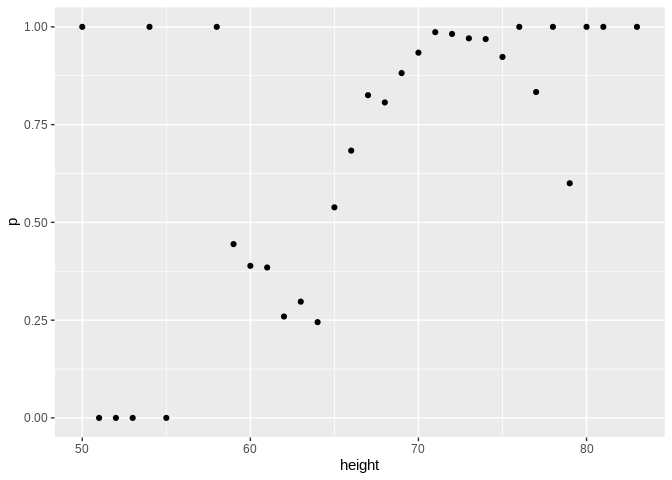
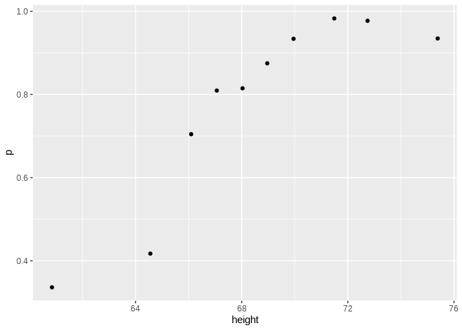
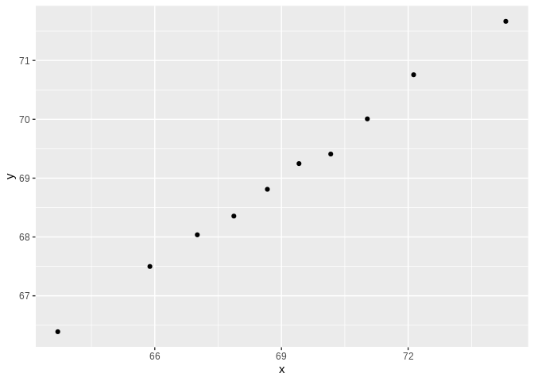

Comprehension Check: Conditional Probabilities Practice
================

Q1
--

We are now going to write code to compute conditional probabilities for being male in the heights dataset. Round the heights to the closest inch. Plot the estimated conditional probability for each .

Part of the code is provided here:

    ## Registered S3 methods overwritten by 'ggplot2':
    ##   method         from 
    ##   [.quosures     rlang
    ##   c.quosures     rlang
    ##   print.quosures rlang

    ## Registered S3 method overwritten by 'rvest':
    ##   method            from
    ##   read_xml.response xml2

    ## ── Attaching packages ──────────────────────────────────────────────────────────────────────────────── tidyverse 1.2.1 ──

    ## ✔ ggplot2 3.1.1       ✔ purrr   0.3.2  
    ## ✔ tibble  2.1.1       ✔ dplyr   0.8.0.1
    ## ✔ tidyr   0.8.3       ✔ stringr 1.4.0  
    ## ✔ readr   1.3.1       ✔ forcats 0.4.0

    ## ── Conflicts ─────────────────────────────────────────────────────────────────────────────────── tidyverse_conflicts() ──
    ## ✖ dplyr::filter() masks stats::filter()
    ## ✖ dplyr::lag()    masks stats::lag()



Q2
--

In the plot we just made in Q1 we see high variability for low values of height. This is because we have few data points. This time use the quantile ( 0.1,0.2,,0.9 )and the cut function to assure each group has the same number of points. Note that for any numeric vector x, you can create groups based on quantiles like this: cut(x, quantile(x, seq(0, 1, 0.1)), include.lowest = TRUE).

``` r
ps <- seq(0, 1, 0.1)
heights %>% 
    mutate(g = cut(height, quantile(height, ps), include.lowest = TRUE)) %>%
    group_by(g) %>%
    summarize(p = mean(sex == "Male"), height = mean(height)) %>%
    qplot(height, p, data =.)
```



Q3
--

You can generate data from a bivariate normal distrubution using the MASS package using the following code. And make a quick plot using plot(dat).

Using an approach similar to that used in the previous exercise, let's estimate the conditional expectations and make a plot. Part of the code has been provided for you:

``` r
Sigma <- 9*matrix(c(1,0.5,0.5,1), 2, 2)
dat <- MASS::mvrnorm(n = 10000, c(69, 69), Sigma) %>%
    data.frame() %>% setNames(c("x", "y"))

ps <- seq(0, 1, 0.1)
dat %>% 
    mutate(g = cut(x, quantile(x, ps), include.lowest = TRUE)) %>%
  group_by(g) %>%
  summarize(y = mean(y), x = mean(x)) %>%
    qplot(x, y, data =.)
```


