## Linear Regression for Prediction, Smoothing, and Working with Matrices Overview

### Linear Regression for Prediction

Linear regression can be considered a machine
learning algorithm.
As you will see, it is too rigid to be useful in general,
but for some challenges it works rather well.
It also serves as a baseline approach.
If you can't beat it with a more complex approach,
you probably want to stick to linear regression.
To quickly make the connection between regression and machine learning,
we will reformulate Galten study with heights a continuous outcome.
We're going to load it up using this code.

```{r}
library(HistData)
library(tidyverse)
set.seed(1)
galton_heights <- GaltonFamilies %>%
  filter(childNum == 1 & gender == "male") %>%
  select(father, childHeight) %>%
  rename(son = childHeight)
```

Suppose you're tasked with *building a machine learning algorithm that predicts the son's height y using the father's height x.*
Let's start by generating some testing and train sets using this code.

```{r}
library(caret)
y <-galton_heights$son

test_index <- createDataPartition(y, times = 1, p=0.5 , list = FALSE)

train_set <- galton_heights %>% slice(-test_index)
test_set <- galton_heights %>% slice(test_index)
```

In this case, if we're ignoring the father's height and guessing
the son's height, we would guess the average height of son's.
So our prediction would be the average, which we can get this way.


**NOTE:** The results are different from the course, more likely the seed used in this course module was not specified.
```{r}
avg <- mean(train_set$son)
avg
```


R squared loss is about 6.60 which you can see by typing this code.

```{r}
mean((avg - test_set$son)^2)
```

Now can we do better?
In the regression course, **we learned that if a pair (x,y) follows a bivariate normal distribution**
, as the son and father's heights do,
the **conditional expectation**, which is what
we want to estimate in machine learning, **is equivalent to the regression line.**

$$
f(x) = E(Y| X = x) = \beta_0 + \beta_1x
$$
We also introduced least squares as a method
for estimating the slope and intercept.
We can write this code to quickly get that fitted model.

```{r}
fit <- lm(son ~ father, data = train_set)
fit$coef
```


This gives us an estimate of the conditional expectation,
which is a simple formula.

$\hat{f}(x) $ = 38 + 0.47x

It's 38, plus 0.47x.
We can see that this does indeed provide an improvement
over our guessing approach which gave us a loss of 6.6.
Now we get a loss of 4.78, a little bit lower.
```{r}
y_hat <- fit$coefficients[1] + fit$coefficients[2]*test_set$father
mean((y_hat - test_set$son)^2)
```

### Predict Function

Before we continue with the concepts that
connect linear regression to machine learning,
let's describe the function predict.
The predict function is very useful for machine learning applications.
This function takes a fitted object from functions
such a **lm** or **glm** and a data frame with the new predictors
for which you want to predict and returns a prediction.
So in our current example, instead of writing out
the formula for the regression line, we can use the function predict like this.

```{r}
y_hat <- predict(fit, test_set)
```


We can see that we get the same result for the loss
by computing it just like we did before.

```{r}
mean((y_hat - test_set$son)^2)
```


And we see that we once again get 4.78.
**It's because using predict is equivalent to using the regression line.**
Note that predict does not always return objects of the same type.
To learn about the specifics, you need to look
at the help file for the type of fitted object that is being used.
So if we use lm,

```{r eval=FALSE}
?predict.lm
```

we might get a different object type
than if we use glm.


```{r eval=FALSE}
?predict.glm
```

To learn about the specifics, you can look at the help
file for predict.lm and predict.glm.
There'll be other examples like this, where the function is called, say, knn.
Then we have to look at the help file for predict.knn.

```{r eval=FALSE}
?predict.knn3
```

## Regression for a Categorical Outcome

All right let's continue with regression.
The regression approach can also be applied to categorical data.
To illustrate this, we will apply it to our previous example of predicting
sex, male or female, using heights.

```{r}
library(dslabs)
data("heights")

y <- heights$height
set.seed(2)
test_index <- createDataPartition(y, times=1, p=0.5, list=FALSE)
train_set <- heights %>% slice(-test_index)
test_set <- heights %>% slice(test_index)
```


If we define the outcome **Y = 1 for females or 0 for males**
**and X as the height,** in this case, we are
interested in the conditional probability
of being female given the height.  

**Pr(Y = 1 | X = x)**

As an example, let's provide a prediction
for a student that is 66 inches tall.
What is the condition of probably of being female if you're 66 inches tall?
In our dataset, we can estimate this by rounding to the nearest inch
and computing the average for these values.
You can do that using this code, and you find that the conditional probability
is 24%.

```{r}
train_set %>%
  filter(round(height) == 66) %>%
  summarize(mean(sex =="Female"))
```
**Note:** in the video it was expected 0.242  

Let's see what it looks like for several values of X.
We'll repeat the same exercise but for 60 inches, 61 inches, etcetera.
Note that we're removing X values for which we have very few data points.
And if we do this, we get the following results.
Since the results from this plot look close to linear,
and it is the only approach we currently know, we will try regression.

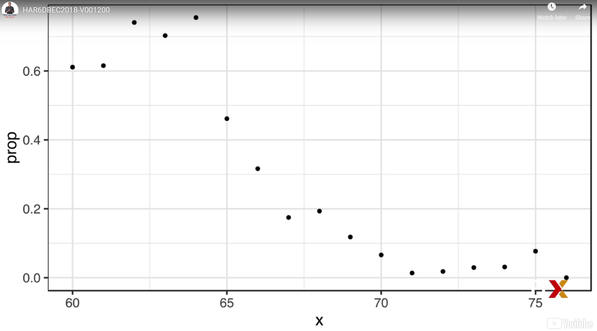

We assume that the conditional probability of Y being equals 1 given X
is a line--

$$
p(x) = Pr(Y = 1 | X = x) = \beta_0 + \beta_1x
$$


intercept plus slope times height.
If we convert the factors to 0s and 1s, we can estimate beta 0 and beta 1
with least squares using this piece of code.

```{r}
lm_fit <- mutate(train_set, y = as.numeric(sex == "Female")) %>%
  lm(y ~ height, data = .)
```


Once we have the estimates, we can obtain an actual prediction.
Our estimate of the conditional probability
is going to be beta 0 hat plus beta 1 hat times x.

$$
\hat{p}(x) = \hat{\beta}_0 + \hat{\beta}_1x
$$

To form a prediction, we define a decision rule.
We predict female if the conditional probability is bigger than 50%. $\hat{p}(x)$ > 0.5  

Now we can use the confusion matrix function to see how we did.

```{r}
p_hat <- predict(lm_fit, test_set)
y_hat <- ifelse(p_hat > 0.5, "Female", "Male") %>% factor()
confusionMatrix(y_hat, test_set$sex)
```

We see that we got an **accuracy of 78.5%.**


### Logistic Regression

Note that the function beta 0 plus beta
1x can take any value, including negatives and values larger than 1.
In fact, the estimate that we obtained for our conditional probability
using linear regression goes from negative 0.4 to 1.12.


But we're estimating a probability that's between 0 and 1.
So can we avoid this?
**Logistic regression is an extension of linear regression**
that assures us the estimate of the conditional probability
is, in fact, **between 0 and 1.**
This approach makes use of the logistic transformation introduced
in the data visualization course, which you can see here.

$$
g(p) = log \frac{p}{1-p}
$$

The logistic transformation converts probabilities to log odds.
As discussed in the data visualization course,
the odds tells us how much more likely something
will happen compared to not happen.
So if p is equal to 0.5, this means that the odds are 1 to 1.
Thus, the odds are 1.
If p is 0.75, the odds are 3 to 1.
A nice characteristic of this transformation
is that it transforms probabilities to be symmetric around 0.
Here's a plot of the logistic transformation versus the probability.
Now, how do we fit this model?

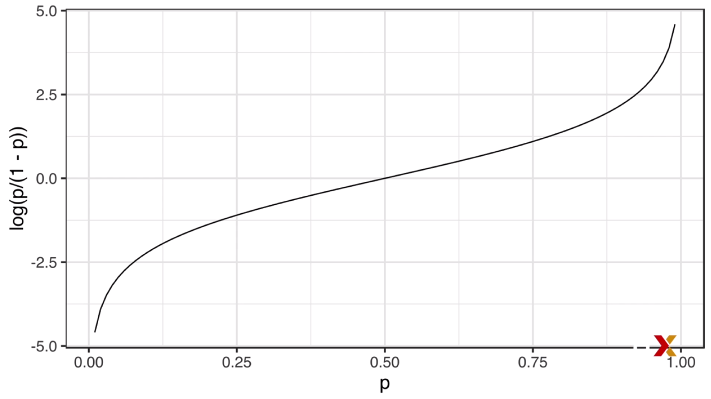

We can no longer use least squares.
Instead, we compute something called the **maximum likelihood estimate.**
You can learn more about this concept in a statistical theory textbook.
In R, we can **fit the logistic regression model**
**with the function GLM, which stands for Generalized Linear Models.**

```{r}
glm_fit <- train_set %>%
  mutate(y = as.numeric(sex == "Female")) %>%
  glm( y ~ height, data = ., family = "binomial")

glm_fit
```


This function is more general than logistic regression,
so we need to specify the model we want.
We do this through the family parameter.
Here's the code that fits a logistic regression model to our data.

```{r}
p_hat_logit <- predict(glm_fit, newdata = test_set, type = "response")
head(p_hat_logit)
```


Just like with linear regression, we can obtain
predictions using the predict function.
However, once we read the help file **predict.glm,**
**we realize that when using predict with a GLM object, we have to specify that we want type equals response if we want the conditional probabilities.**
This is because the default is to return the logistic transform values.

Now that we've done it, we can see how well our model fit.


Note that this model fits the data slightly better than the line.


Because we have an estimate of the conditional probability,
we can obtain predictions using code like this.

```{r}
y_hat_logit <- ifelse(p_hat_logit > 0.5, "Female","Male") %>% factor()
confusionMatrix(y_hat_logit, test_set$sex)
```


And once we look at the confusion matrix,
**we see that our accuracy has increased slightly to about 80%.**
Note that the resulting predictions are similar.
This is because the two estimates of our conditional probability
are larger than a half in roughly the same regions.
You can see that in this plot.


**Both linear and logistic regression provide an estimate for the conditional expectation, which, in the case of binary data,**
is equivalent to a conditional probability.
So we can use it in machine learning applications.
However, once we move on to more complex examples,
**we will see that linear regression and logistic regression are limited and not flexible enough to be useful.**
The techniques we will learn are essentially
approaches to estimating conditional probabilities
or conditional expectations in ways that are more flexible.

### Case Study: 2 or 7

In the simple examples we've examined up to now,
we only had one predictor.
We actually do not consider these machine
learning challenges, which are characterized
by having many predictors.
So let's go back to the digit example, in which we had 784 predictors.
However, for elicitive purpose, we would look
at a subset of this data set, where we only
**have two predictors and two categories.**  
**We want to build an algorithm that can determine if a digit is a two or a seven from the two predictors.  **
We're not quite ready to build an algorithm with 784 predictors.
So we will extract two simple predictors from the 784.
These will be the proportion of dark pixels
that are in the upper left quadrant and the proportion of pixels that
are black in the lower right quadrant.
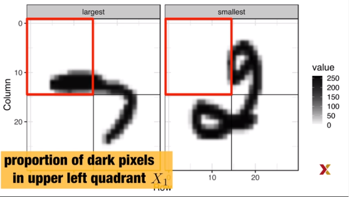


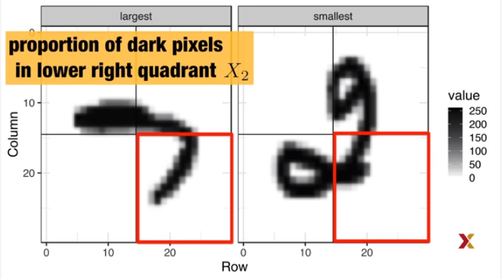

To have a more manageable data set, we will
select a random sample of 1,000 digits from the training
set that has 60,000 digits.
500 will be in the training set, and 500 will be in the test set.
We actually include these examples in the DS Lab package.
And you can load it using this line of code.

```{r}
library(dslabs)
data("mnist_27")
```


We can explore this data by plotting the two predictors
and use colors to denote the labels.
You can see them here.

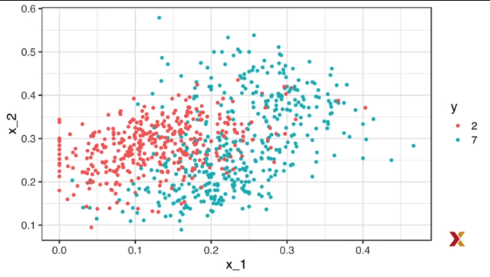

We can immediately see some patterns.
For example, if x1, the first predictor, which represents the upper left panel,
is large, then the digit is probably a seven.
Also, for smaller values of the second predictor, the lower right panel,
the twos appear to be in the mid-range values.
To connect these insights to the original data,
let's look at the images of the digits with the largest
and smallest values of x1.
Here are the images.
This makes a lot of sense.
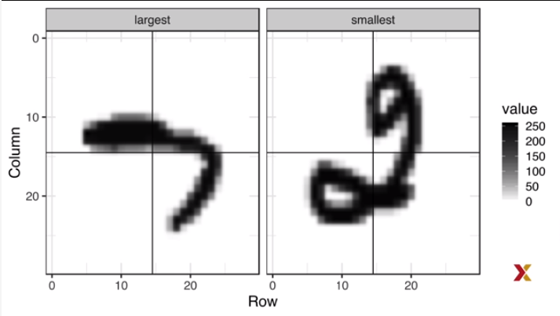

The image on the left, which is a seven, has a lot
of dark in the upper left quadrant.
So x1 is big.
The digit on the right, which is a two, has no black on the upper left
quadrant.
So x1 is small.
OK.
Now let's look at the original images corresponding
to the largest and smallest values of the second predictor, x2, which
represents the lower right quadrant.

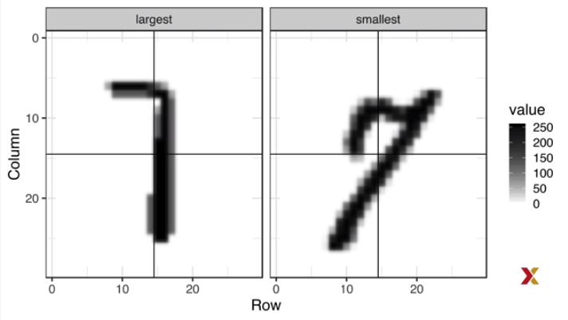

Here we see that they're both sevens.
The seven on the left has a lot of black on the lower right quadrant.
The seven on the right has very little black on the lower right quadrant.
So we can start getting a sense for why these predictors are informative,
but also why the problem will be somewhat challenging.
So let's try building a machine learning algorithm with what we have.
We haven't really learned any algorithm yet.
So let's start with logistic regression.
The model will be simply like this.


$$
p(x_1,x_2) = Pr(Y = 1 | X_1 = x_1, X_2 = x_2) = g^{-1}(\beta_0 + \beta_1x_1 + \beta_2x_2)
$$

with $g{-1}$ the inverse of the logistic function:


$$
g{-1}(x)= exp(x) / {1 + exp(x)}
$$

The conditional probability of being a seven given the two predictors x1
and x2 will be a linear function of x1 and x2
after the logistic transformation.

We can fit it using the glm function like this.

```{r}
fit <- glm(y ~ x_1 + x_2, data = mnist_27$train, family ="binomial")
```


And now we can build a decision rule based
on the estimate of the conditional probability.
Whenever it is bigger than 0.5, we predict a seven.
Whenever it's not, we predict a two.
So we write this code.

```{r}
p_hat <- predict(fit, newdata = mnist_27$test)
y_hat <- factor(ifelse(p_hat >0.5,7,2))
confusionMatrix(data = y_hat, reference = mnist_27$test$y)
```


Then we compute the confusion matrix, and we
see that we achieve an accuracy of 79%.

Not bad for our first try.
But can we do better?
Now before we continue, I want to point out that, for this particular data set,
I know the true conditional probability.
This is because I constructed this example using
the entire set of 60,000 digits.
I use this to build the true conditional probability p of x1, x2.
Now note that this is something we don't have access to in practice,
but included here in this example because it lets us compare estimates
to our true conditional probabilities.
And this teaches us the limitations of the different algorithms.
So let's do that here.
We can access and plot the true conditional probability.
We can use this code.

```{r}
mnist_27$true_p %>%
  ggplot(aes(x_1, x_2, fill= p)) +
  geom_raster()
```


And it looks like this.
We will improve this plot by choosing better colors.
And we'll also draw a curve that separates the pairs, x1, x2,
for which the conditional probably is bigger than 0.5 and lower than 0.5.
We use this code.

```{r}
mnist_27$true_p %>%
  ggplot(aes(x_1,x_2, z=p, fill = p)) +
  geom_raster() +
  scale_fill_gradientn(colors = c("#F8766D","white","#00BFC4")) +
  stat_contour(breaks = c(0.5),color = "black")
  
```

And now the plot looks like this.
So we can see the true conditional probability.
So to start understanding the limitations of logistic regression,
we can compare the true conditional probability
to the estimated conditional probability.
Let's compute the boundary that divides the values of x1 and x2
that make the estimated conditional probably lower than 0.5
and larger than 0.5.
So at this boundary, the conditional probability
is going to be equal to 0.5.
Now we can do a little bit of math, shown here.

$$
g^{-1}(\hat{\beta}_0 + \hat{\beta}_1x_1 + \hat{\beta}_2x_2) = 0.5 \to
$$

$$
\hat{\beta}_0 + \hat{\beta}_1x_1 + \hat{\beta}_2x_2 = g(0.5) = 0 \to
$$


$$
x_2 = (-\hat{\beta}_0/ \hat{\beta}_2) +  (-\hat{\beta}_1/(\hat{\beta}_2x1))
$$

**And if we do this, we will see that the boundary can't be anything other than a straight line, which implies that our logistic regression approach has no chance of capturing the non-linear nature of our true conditional probability.**

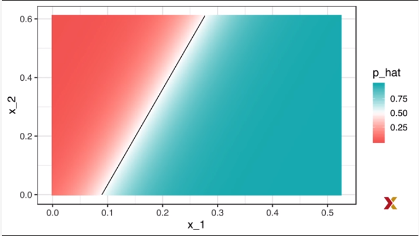

You can see that the boundary of the true conditional probability
is a curve.
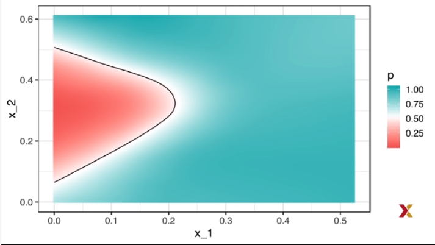

Now to see where the mistakes were made, we
can again plot the test data with x1 and x2 plotted
against each other and color used to show the label.

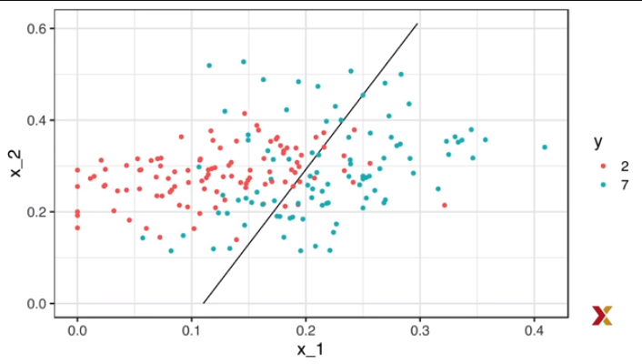

If we do this, **we can see where the mistakes are made.**
**Because logistic regression divides the sevens and the twos with a line, we will miss several points that can't be captured by this shape.**
So we need something more flexible.
**Logistic regression forces our estimates to be a plane and our boundary to be a line.**
We need a method that permits other shapes.
We will start by describing the nearest neighbor algorithm and some kernel
approaches.
To introduce the concepts behind these approaches,
we will again start with a simple one-dimensional example
and describe the concept of smoothing.


### Smoothing

#### Introduction to Smoothing

Before continuing with machine learning algorithms,
we introduce the important concept of smoothing.
Smoothing is a very powerful technique used all across data analysis.
**Other names given to this technique are curve fitting and low band pass filtering.**
It's designed to detect trends in the presence of noisy data
in cases in which the shape of the trend is unknown.
The smoothing name comes from the fact that
to accomplish this feat we assume that the trend is smooth,
as in a smooth surface, and the noise is unpredictably wobbly.
Something like this.

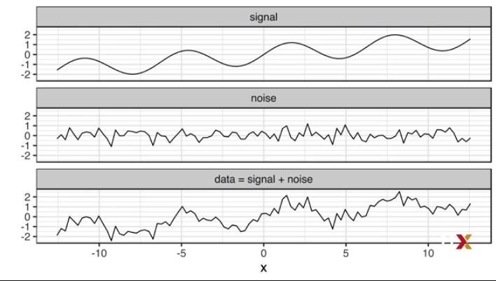
Part of what we explain here are the assumptions
that permit us to extract a trend from the noise.
To understand why we cover this topic, note
that the concepts behind smoothing techniques
are extremely useful in machine learning because **conditional expectations and probabilities can be thought of as trends of unknown shapes**
that we need to estimate in the presence of uncertainty.
To explain these concepts, we will focus first
on a problem with just one predictor.
Specifically we try to estimate the time trend in the popular vote
from the 2008 election, the difference between Obama and McCain.
You can load the data like this and we can see a plot here.

```{r}
data("polls_2008")
qplot(day, margin, data = polls_2008)
```


**For the purposes of this example, do not think of it as a forecasting problem. We're simply interested in learning the shape of the trend after collecting all the data.**  

*We assume that for any given day x, there's a true preference among the electorate, f of x, but due to the uncertainty introduced by polling, each data point comes with an error, epsilon.*  


A mathematical model for the observed poll margin, y,
is y equals f of x plus epsilon.

$$
Y_i = f(x_i) + \epsilon_i
$$

To think of this as a machine learning problem,
consider that we want to predict y given the day x.
And that if we knew it, we would use the conditional expectation, f of x
equals expectation of y given x.

$$
f(x) = E(Y | X = x)
$$

But we don't know it, so we have to estimate it.
We're going to start by using regression, the only method we know,
to see how it does.

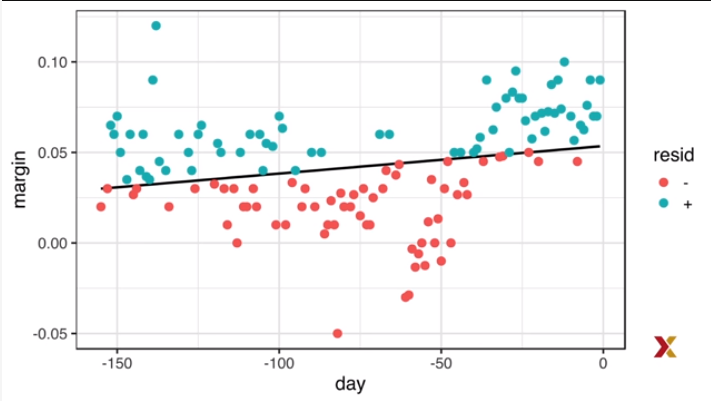

The line we see does not appear to describe the trend very well.
Note, for example, that on September 4, this is day negative 62,
62 days until Election Day, the Republican Convention was held.
This appeared to give McCain a boost in the polls, which
can be clearly seen in the data.  

The regression line does not capture this.
To further see the lack of fit, we note that points
above the fitted line, blue, and those below, red, are not evenly distributed.
We therefore need an alternative, a more flexible approach.

### Bin Smoothing and Kernels

The general idea of bin smoothing is to group data points
into strata in which the value of f of x can be assumed to be constant.
We can make this assumption because we think f of x changes slowly.
And as a result, f of x is almost constant in small windows of time.
An example of this idea is to assume for the poll data
that public opinion remain approximately the same within a week's time.
With this assumption in place, we have several data points
with the same expected value.
So if we fix a day to be in the center of our week-- call it **x0**--
**then for any day x, such that the absolute value of x minus x0 is less than 3.5**
$ | x - x_0 | \leq $ 3.5

, **we assume that f of x is a constant**. Let's call it mu. $f(x) = \mu $ 
This assumption implies that the expected value of y given x
is approximately mu when the distance between x i and x0 is less than 3.5.

$$
E[Y_i | X_i = x_i] \approx \mu
$$

if

$$
|x_i - x_0| \leq 3.5
$$

**In smoothing, we call the size of the interval satisfying the condition the distance between** $x_i$ **and** $x_0$ **is less than 3.5 the window size, the bandwidth, or the span.**  

These are all synonyms.
Now, this assumption implies that a good estimate
for $f(x)$ is the average of the y values in the window.
If we define $A_0$ to be the set of indexes i such that $x_i$ minus $x_0$
is less than 3.5 in absolute value and $N_0$ as the number of indexes in $A_0$,
then our estimate is given by this formula.

$$
\hat{f}(x_0) = \frac{1}{N_0}\Sigma_{i \in A_0} Y_i
$$

It's just simply the average in the window.
The idea behind bin smoothing is to make this calculation for each value of x.
So we make each value of x the center and recompute that average.
So in the poll example, for each day, we would
compute the average for the values within a week of the day
that we're considering.
Let's look at two examples.
Let's set the center at negative 125 and then also set it at negative 55.
Here's what the data looks like.

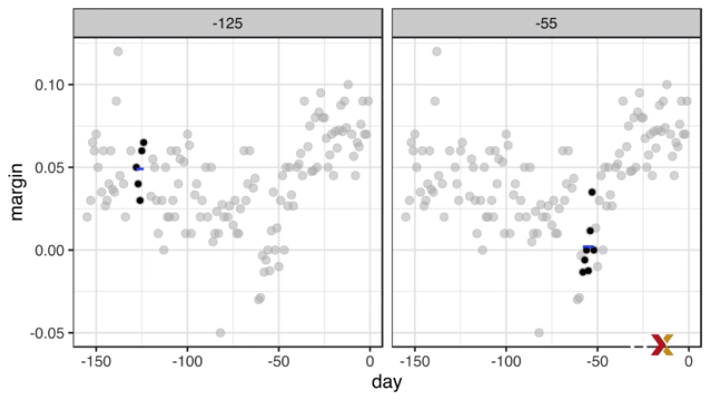

The black points are the points that are used to compute
the average at those two points.
The blue line represents the average that was computed.

By computing this average for every point,
we form an estimate of the underlying curve f of x.
In this animation, we see the procedure happening, starting at negative 155
all the way up to election day-- day 0.
At each value of x0, we keep the estimate f hat of x0
and move on to the next point.

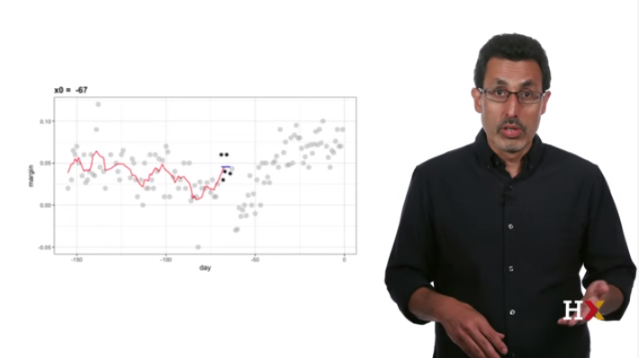


The final result, which you can compute using this code, looks like this.

```{r}
span <- 7
fit <- with(polls_2008,
            ksmooth(day, margin, x.points = day, kernel = "box", bandwidth = span))

polls_2008 %>%
  mutate(smooth = fit$y) %>%
  ggplot(aes(day, margin)) + 
  geom_point(size = 3, alpha = 0.5, color = "grey") +
  geom_line(aes(day, smooth), color= "red")
```


Note that the final result for the bin smoother is quite wiggly.
One reason for this is that each time the window moves, two points change.
So if we start with seven points and change two,
that's a substantial percentage of points that are changing.
We can attenuate this somewhat by taking weighted averages that
give the center of a point more weight than those
that are far away from the center, with the two points at the edges receiving
very little weight.
**We call the functions from which we compute these weights the kernel.**
Note that you can think of the bin smoother
as an approach that uses a kernel.
The formula looks like this.

$$
\hat{f}(x_0) = \Sigma_{i=1}^N \omega_0(x_i)Y_i
$$

Each point receives a weight, in the case of bin smoothers,
between 0 for points that are outside the window and 1
divided by N0 for points inside the window,
with N0 the number of points in that week.
In the code we showed, we told the function k-smooth
to use the kernel "box."
That is because the kernel that gives us bin smoother using this formulation
looks like a box.
Here's a picture.

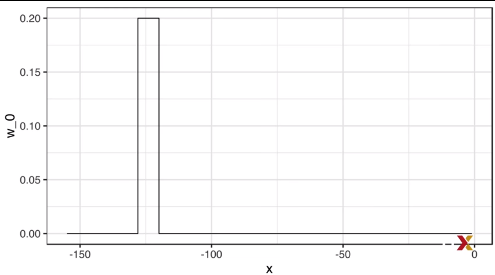
Now, the k-smooth function provides a way to obtain a smoother estimate.
This is by using the normal or Gaussian density to assign weights.
So the kernel will be the normal density, which we can see here.

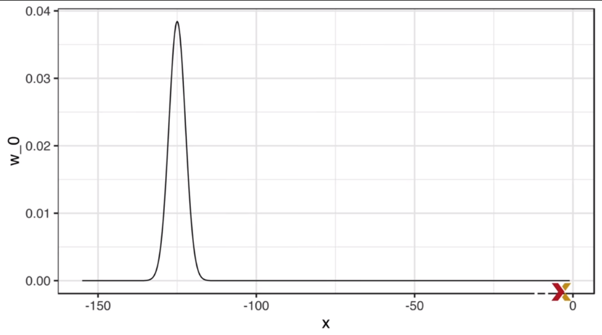

In this animation, the size of the points
represent the weights they get in the weighted average.

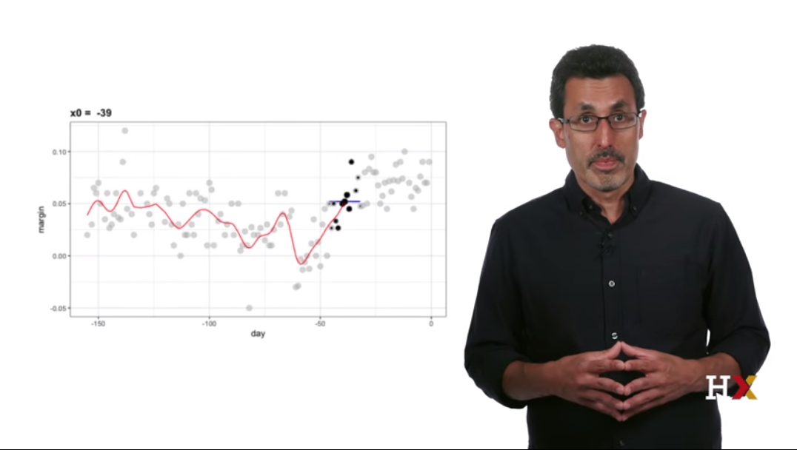

You can see that the points near the edges receive little weight.

The final result, which you can get using this code, looks like this.

```{r}
span <- 7
fit <- with(polls_2008,
            ksmooth(day, margin, x.points = day, kernel = "normal", bandwidth = span))

polls_2008 %>%
  mutate(smooth = fit$y) %>%
  ggplot(aes(day, margin)) +
  geom_point(size=3, alpha = 0.5, color = "grey") +
  geom_line(aes(day, smooth), color = "red")

```


Note that the final estimate looks smoother now.
Now, there are several functions in R that implement bin smoothers or kernel
approaches.
One example, the one we showed, is k-smooth.
However, in practice,** we typically prefer methods that use slightly more complex models than fitting a constant.**
The final result that we saw for the smooth bin smoother
is still somewhat wiggly.
You can see in some parts-- for example, from negative 125 to negative 75,
we see that the function is more wiggly than we really expect.
We're now going to learn about approaches that improve on this.


### Local Weighted Regression (loess)

A limitation of the bin smoother approach
**we just described is that we need small windows for the approximately constant assumption to hold.**
As a result, **we end up with a small number of data points to average.**
And as a result of this, we obtain imprecise estimates of our trend.
Here, we describe how local weighted regression or loess
permits us to consider larger windows.
To do this, we will use a mathematical result
referred to as **Taylor's theorem, which tells us that if you look close enough at any smooth function f, it looks like a line.**
To see why this makes sense, consider the curved edges gardeners make.
They make these using spades which are straight lines so they can generate
curves that are locally straight lines.
**So instead of assuming the function is approximately constant in a window, we assume the function is locally linear.**
With the linear assumption, we can consider larger window sizes
than with a constant.
So instead of the one-week window, we will instead
consider a larger window in which the trend is approximately linear.
We start with a three-week window and later consider enabling other options.
So the model for points that are in a three-week window looks like this.

$$ 
E[Y_i|X_i = x_i] = \beta_0 + \beta_1(x_i - x_0)
$$

**if**  
$$
|x_i - x_0| \leq 10.5
$$


We assume that Y given X in that window is a line.
Now, for every point x0 loess defines a window
and then fits a line within that window.
So here's an example of those fits for x0 equals negative 125 and x0
equals negative 55.

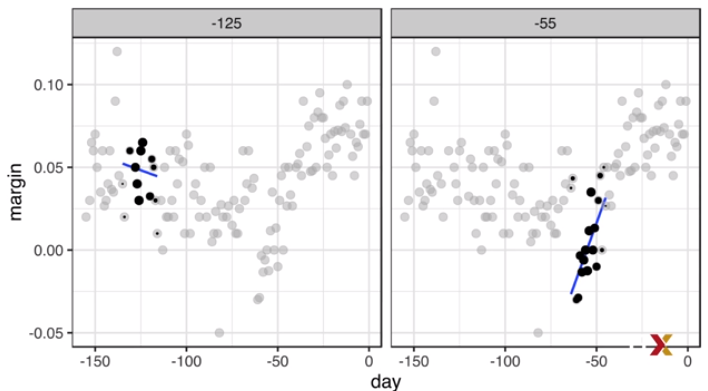

The fitted values at x0 become our estimate of the trend.
In this animation, we demonstrate the idea.

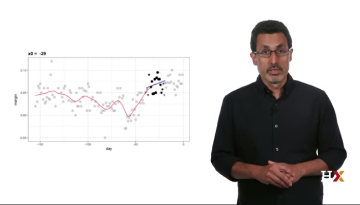


The final result is a smoother fit than the bin
smoother since we used larger sample sizes to estimate our local parameters.
You can get the final estimate using this code, and it looks like this.

```{r}
total_days <- diff(range(polls_2008$day))
span <- 21/total_days


fit <- loess(margin ~ day,degree = 1, span = span, data = polls_2008 )

polls_2008 %>% mutate(smooth = fit$fitted) %>%
  ggplot(aes(day, margin)) +
  geom_point(size = 3, alpha = 0.5, color = "grey") +
  geom_line(aes(day,smooth), color= "red")
```


Now, note that different spans give us different estimates.
We can see how different window sizes lead to different estimates
with this animation.

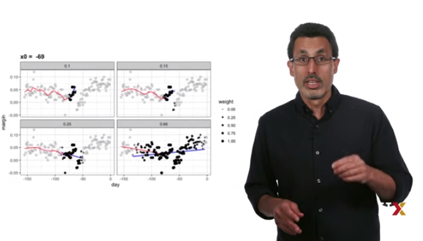

Here are the final estimates.

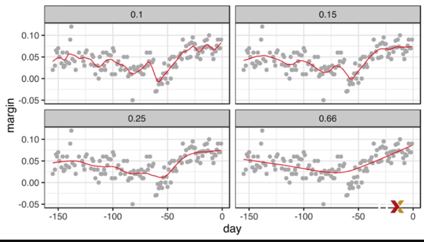

We can see that with 0.1 the line is quite wiggly.
With 0.15, it's slightly less.
Now, with 0.25, we get a rather smooth estimate.
And with 0.66, it almost looks like a straight line.
**There are three other differences between loess and the typical bin smoother which we describe here.**  

The first is that **rather than keeping the bin size the same, loess keeps the number of points used in the local fit the same.**
**This number is controlled via the span argument which expects a proportion.**
So for example, if N is a number of data points,
and the span is 0.5, then for any given X,
loess will use 0.5 times N closest points to X for the fit.  

**Second difference** is that when **fitting a line locally, loess uses a weighted approach.**
Basically, instead of least squares, we minimize a weighted version.
So we would minimize this equation.

$$
\Sigma_{i=1}^N \omega_0(x_i)[Y_i - \{\beta_0 + \beta_1(x_i - x_0) \}]^2
$$

However, instead of the **Gaussian kernel**, loess
uses a function called the **Tukey tri-weight** which you can see here.

$W(u) = (1 - |u|^3)^3$ if $|u| \leq 1$  

and  

$W(u) = 0$ if $|u| > 1$


And to define weights, we use this formula.

$$
w_0(x_i) = W(\frac{x_i-x_0}{h})
$$

The kernel for the tri-weight looks like this.

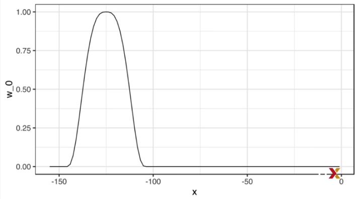

The **third difference is that loess has the option of fitting the local model robustly.**  
An iterative algorithm is implemented in which,
**after fitting a model in one iteration, outliers are detected and down-weighted for the next iteration.**
To use this option, use the argument **family = symmetric.**
One more important point about loess.
**Taylor's theorem also tells us that if you look at a function close enough, it looks like a parabola and that you don't have to look as close as you do for the linear approximation.**
This means **we can make our windows even larger**
and fit parabolas instead of lines, so the local model would look like this.

$$
E[Y_i | X_i = x_i] = \beta_0 + \beta_1(x_i - x_0) + \beta_2(x_i - x_0)^2
$$

**if ** $|x_i - x_0| \leq h$

**This is actually the default procedure for the function loess.**
You may have noticed that when we show the code for loess,
we set a parameter **degree = 1.**
This tells loess to fit polynomials of degree 1, a fancy name for lines.
If you read the help page for loess, you'll
see that the argument degree defaults to 2.
So by default, loess fits parabolas not lines.
Here is a comparison of fitting lines, the red dashed, and fitting parabolas,
the orange solid.

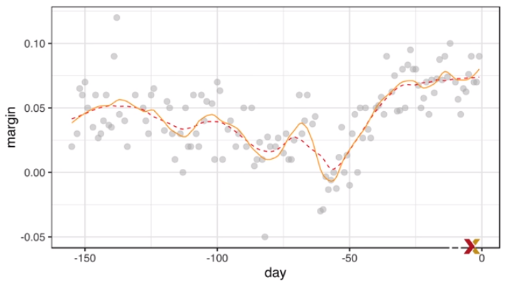


Notice that degree equals 2 gives us a more wiggly result.
I personally prefer degree equals 1 as it is less prone to this kind of noise.
**Now, one final note.**
This relates to ggplot.
Note that **ggplot uses loess and the geom smooth function.**
So if you type this, you get your points and fitted loess line.

```{r}
polls_2008 %>% ggplot(aes(day,margin)) +
  geom_point()+
  geom_smooth()
```


**But be careful with the default table, as they are rarely optimal.**
However, you can change these quite easily as is demonstrated in this code,
and now we get a better fit.

```{r}
polls_2008 %>% ggplot(aes(day,margin)) +
  geom_point() +
  geom_smooth(color= "red", span = 0.15, method.args = list(degree = 1))
```

### Working with Matrices

#### Matrices

In machine learning, situations
in which all predictors are numeric, or can
be converted to numeric in a meaningful way, are common.
The digits data set is an example.
Every pixel records a number between 0 and 255.
We can actually load the 60,000 digits using this code.

```{r}
library(dslabs)
mnist <- read_mnist()
```

In these cases, it is often **convenient to save the predictors in a matrix and the outcomes in a vector rather than using a data frame.**
In fact, we can see that the data set that we just downloaded does this.
You can see that the training data image is a matrix by typing this code.

```{r}
class(mnist$train$images)
```

This matrix represents 60,000 digits.
It's a pretty big matrix.
So for the example, in this video, we'll take a more manageable subset.
We will take the first 1,000 predictors and the first 1,000 labels,
which we can do using this code.

```{r}
x <- mnist$train$images[1:1000,]
y <- mnist$train$labels[1:1000]
```


In machine learning, **the main reason for using matrices is that certain mathematical operations needed to develop efficient code can be performed using techniques from a branch of mathematics called linear algebra.**
In fact, linear algebra and matrix notation are key elements of the language used in academic papers describing machine learning techniques. We will not cover linear algebra in detail here, but we'll demonstrate how to use matrices in R, so that you can apply the linear algebra techniques already implemented in R Base and other packages.  

To motivate the use of matrices, we will pose five challenges.  

    * First, we're going to study the distribution of the total pixel darkness and how it varies by digits.
    * Second, we're going to study the variation of each pixel and remove predictors, columns, associated with pixels that don't change much and thus can't provide much information for classification.
    * Third, we're going to zero out low values that are likely smudges. First, we're going to look at the distribution of all pixel values, use this to pick a cutoff to define unwritten space, then make anything below that cutoff a zero. 
    * Fourth, we're going to binarize the data. We're going to first look at the distribution of all pixel values, use this to pick a cutoff, and distinguish between writing and no writing. Then convert all entries into either zero or one.
    * Then finally, we're going to scale each of the predictors in each entry to have the same average and standard deviation.

To complete these, we'll have to perform mathematical operations involving several variables. **The tidyverse is not developed to perform this type of mathematical operation.** For this task, **it is convenient to use matrices.** Before we attack the challenges, we will introduce matrix notation and basic R code to define and operate on matrices.

#### Matrix Notation

In matrix algebra we have **three main types of objects, scalars, vectors, and matrices.**  

A **scalar** is just one number. For example, a = 1, a is a scalar. To denote scalars in matrix notation, we usually use a lowercase letter and we don't bold it.


**Vectors** are like the numeric vectors we define in r. They include several scalar entries. For example, the column containing the first pixel is a vector. It has length 1000. Here is the code that shows it.

```{r}
length(x[,1])
```


In **matrix** algebra we use the following notation to define vectors, like this. 

$$
\begin{pmatrix} 
x_1 \\
x_2 \\
\dots \\
x_N
\end{pmatrix}
$$

Similarly, we can use math notation to represent different features
mathematically by adding an index.
So here's x1, the first feature and x2, the second feature.
Both are vectors.
$$
X_1 =
\begin{pmatrix} 
x_{1,1}\\
\dots \\
x_{N,1}
\end{pmatrix}
$$
**and**
$$
X_2 =
\begin{pmatrix} 
x_{1,2}\\
\dots \\
x_{N,2}
\end{pmatrix}
$$


If we're writing out a column such as x1, in a sentence we often use the notation x1 through xn and then we have the transpose symbol t. 
$$
X_1 = (x_{1,1}, \dots, x_{N,1})^T
$$

**This transpose operation converts columns into rows and rows**
into columns.   

**A matrix** can be defined as a series of vectors of the same size
joined together, each forming a column. So in our code, we can write it like this.  

```{r}
x_1 <- 1:5
x_2 <- 6:10
cbind(x_1, x_2)
```


Mathematically, we represent them with bold uppercase letters like this.   

$$
X = [X_1 X_2] = 
\begin{pmatrix}
x_{1,1} & x_{1,2} \\
\ldots \\
x_{N,1} & x_{N,2}
\end{pmatrix}
$$


The dimension of a matrix is often an important characteristic needed to assure certain operations can be performed. The dimension is a two number summary defined as the number of rows and the number of columns. In r we can extract the dimensions of the matrix
with the function dim like this.   

```{r}
dim(x)
```


Note that vectors can be thought of as n by 1 matrices. However, in r, a vector does not have dimensions. You can see it by typing this.  

```{r}
dim(x_1)
```


However, we can explicitly convert a vector into a matrix using the as.matrix function. So if we do that, then we see that indeed this is a matrix that is 5 by 1.

```{r}
dim(as.matrix(x_1))
```

We can use this notation to denote an arbitrary number of predictors with the following n by p matrix.
For example, if we have 784 columns we could do this. P is 784, here's the arbitrary matrix representing our data.

$$
X=
\begin{pmatrix}
x_{1,1} & \dots &  x_{1,p} \\
x_{2,1} & \dots &  x_{2,p} \\
& \ldots \\
x_{N,1} & \dots & x_{N,p}
\end{pmatrix}
$$

We store this into x. So when you do dim x, you can see it's 1000 by 784.

```{r}
dim(x)
```


#### Converting a Vector to Matrix

We will learn several useful operations related to matrix algebra. We'll use some of the motivating examples we described in an earlier video to demonstrate this. It is often useful to convert a vector to a matrix. For example, because the variables are pixels on a grid, we can convert the rows of pixel intensities into a matrix representing this grid. We can convert a vector into a matrix with the **matrix function** and specifying the number of rows and columns the resulting matrix should have. The matrix is filled by column. **The first column is filled first, and the second is filled second, and so on.** So here's an example to illustrate what we mean.  

```{r}
my_vector <- 1:15
mat <- matrix(my_vector,5,3)
mat
```

If we define a vector, that's the numbers 1 through 15.
And then we use the matrix function on this factor,
and say it has five rows and three columns,
we end up with the following matrix.
We can fill in by row instead of by column by using the byrow argument.
So, for example, to transpose the matrix we just showed,
we would use the matrix function like this.
Now we have three rows, five columns, and we fill it in by row.
Here's the code.
```{r}
mat_t <- matrix(my_vector,3,5, byrow = TRUE)
mat_t
```


This is essentially transposing the matrix.
In R, we can use the function t to directly transpose a matrix.
Now notice that these two are the same.

```{r}
identical(t(mat), mat_t)
```


An important warning.
**The matrix function in R recycles values in the vector without warnings.**
If the product of columns and rows does not match the length of the vector,
this happens.

```{r}
matrix(my_vector,5,5)
```


So look at what happens when I try to turn my vector, which has 15 entries, into a 5 by 5 matrix. So how can we use this in practice? Let's look at an example. To put the pixel intensities of, say, the third entry, which we know is a digit that represents a 4, into a grid, we can use this.

```{r}
grid <- matrix(x[3,],28,28)
```


To confirm that, in fact, we have done this correctly,
we can use a function image, which shows an image of the third argument.
Here's how we use it.

```{r}
image(1:28, 1:28, grid)
```


We can see that this looks like an upside down 4. Now it looks upside down because the top of this image, pixel one, is shown at the bottom. This is how R plots images. So it's flipped. If we want to flip it back, we can use this code.
```{r}
image(1:28,1:28,grid[,28:1])
```


And now we get an image that looks like a 4.


#### Row and Column Summaries, and Apply

So now let's start to attack the challenges that we posed earlier. For the first one which related to the total pixel darkness, we want to sum the values of each row and then visualize how these values vary by digit.
The **function rowSums** takes a matrix as input and computes the desired values.
It takes the sum of each row. So this little simple code does that very quickly.

```{r}
sums <- rowSums(x)
```

We can also compute the averages with the function rowMeans like this.

```{r}
avg <- rowMeans(x)
```

Once we have this, we can simply generate a box plot
to see how the average pixel intensity changes from digit to digit.
Here it is.

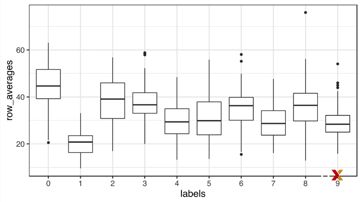

**From this plot, we see that, not surprisingly, ones use less ink than other digits.**  
  
Note that we can also compute the column sums
and averages using the functions **colSums and colMeans** respectively.
The **package matrixStats** adds functions that perform operations on each row or column very efficiently, including
the functions **rowSds and colSds.**  
Note that the functions just describe are performing
an operation similar to two functions that we've already learned, **sapply and the per function map.**
They apply the same function to a part of our object.
In this case, either each row or each column.
The apply function lets you apply any function, not just sum or mean,
to a matrix.
The first argument of the apply function is the matrix. The second is the dimension that you want to apply the function to, one for rows, two for columns. And the third argument is the function.

    * apply(matrix, dimension, function)
    
So for example, rowMeans can be written like this.

```{r}
avg <- apply(x, 1, mean)
```


But note that just like sapply and map, we can perform any function. So if we wanted the standard deviation for each column, we could write this.  

```{r}
sds <- apply(x, 2, sd)
```

Now what you pay for in this flexibility is that these are not as fast as the dedicated functions such as rowMeans, colMeans, etc.

#### Filtering Columns Based on Summaries

Now let's turn to our second challenge. Let's study the variation of each pixel and remove columns associated with pixels that don't change much, thus not informing the classification. Although a simplistic approach, we will quantify
the variation of each pixel with its standard deviation across all entries. Since each column represents a pixel, we use the colSds function from the matrix stats package like this. 

```{r}
library(matrixStats)
sds <- colSds(x)
```


A quick look at the distribution of these values

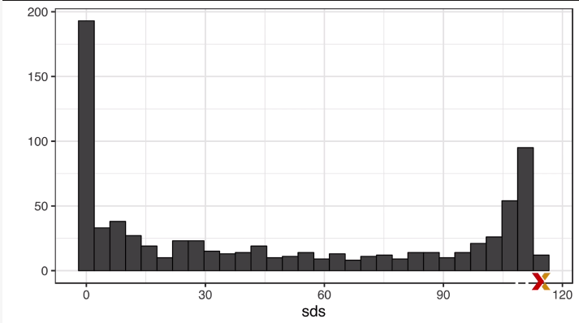

shows that some pixels have very low entry to entry variability. This makes sense, since we don't write in some parts of the box. Here is the variance plotted by location. 

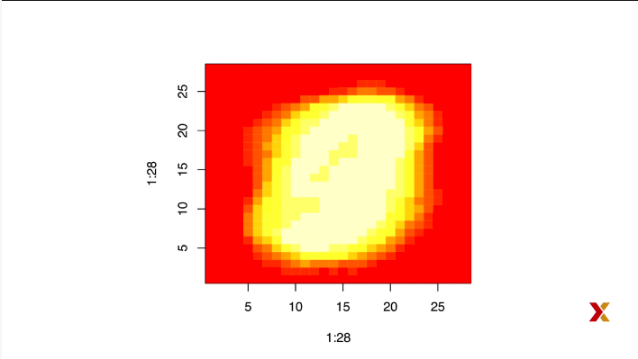

We see that there is little variation in the corners.
This makes sense. We'd write the digits in the center. So we could remove features that have no variation since these
can't help us predict much. In the R basics course, we describe the operations used to extract columns. Here's an example showing the 351st and 352nd columns and the rows. 

```{r}
head(x[,c(351,352)])
```

Here are the second and third rows.

```{r}
head(x[c(2,3),], n = 1)
```


We can also use logical indices to determine which columns or rows to keep. So if we wanted to remove uninformative predictors from our Matrix, we could write this one line of code, like this.

```{r}
new_x <- x[,colSds(x)>60]
dim(new_x)
```


Only the columns for which the standard deviation is above 60 are kept. Here we add an important warning related to subsetting matrices. If you select one column or one row, the result is no longer a matrix, but a vector.
Here's an example.

```{r}
class(x[,1])
dim(x[1,])
```


This could be a problem if you're assuming that operations on matrices will result in matrices. However, we can preserve the matrix class by using the **argument drop**, like this.


```{r}
class(x[,1,drop=FALSE])
dim(x[,1, drop=FALSE])
```


#### Indexing with Matrices and Binarizing the Data

For our next challenge, we want to be able to look at a histogram of all our pixels.We already saw how we can turn vectors into matrices, but we can also undo this and turn matrices into vectors. Here's how it works. It's the function as vector. Here's an example.

```{r}
mat <- matrix(1:15,5,3)
mat
as.vector(mat)

```

So to see a histogram of all our predictors,
we can simply type this code.

```{r}
qplot(as.vector(x), bins = 30, color= I("black"))
```


When we look at this plot we see a clear dichotomy which is explained as parts with ink and parts without ink. If we think that values below say, 25, are smudges, we can quickly make them zero using this very simple code. 

```{r}
new_x <- x
new_x[new_x < 50] <- 0
```


To see what this does, let's look at a smaller matrix at a smaller example.
Type this code and notice what happens.

```{r}
mat <- matrix(1:15,5,3)
mat[mat < 3] <- 0
mat
```


It changes all the values that are less than three to zero.
We can also use more complicated logical operations with matrices like this.

```{r}
mat <- matrix(1:15,5,3)
mat[mat> 6 & mat < 12] <- 0
mat
```

Here's an example where we zero out all the values that are between 6 and 12.

Now for the next challenge, we want to binarize the data. The histogram we just saw suggests that this data is mostly binary pixels, are either ink or no ink. Using what we've learned, we can binarize the data using just matrix operations. For example, using this code we turn all the values below 255 divided by 2 to 0 and above it to 1.

```{r}
bin_x <- x
bin_x[bin_x <255/2] <- 0
bin_x[bin_x >255/2] <- 1
```


But we can also convert it to a matrix using logicals and coerce it into numbers like this.

```{r}
bin_X <- (x > 255 / 2) *1
```

Here's an example showing that by converting things into 0 and 1 we don't lose that much information. The figure on the left includes all the pixel values. The picture on the right is binarized. You can see it's three.

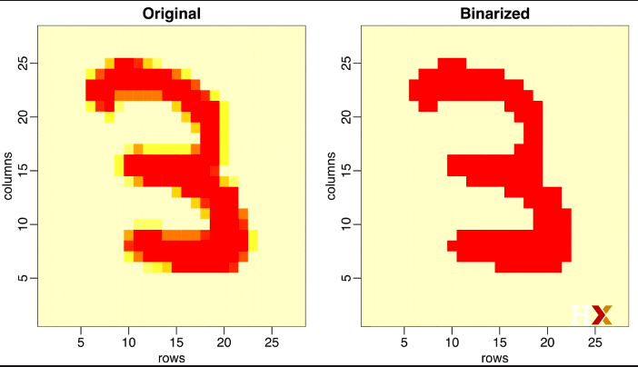


#### Vectorization for Matrices and Matrix Algebra Operation

For our final challenge in which we're standardizing the rows or the columns,we're going to use vectorization. In R, we subtract a vector from a matrix,the first element of each vector is subtracted from the first row of the matrix.
The second element from the vector is subtracted from the second row of the matrix and so on. So using mathematical notation, we would write it like this.

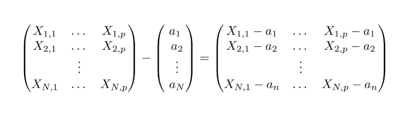

**This is what R does when you subtract a vector from a matrix.**
The same holds true for other arithmetic operations.
This implies that we can scale each row of a matrix using this simple code.

```{r echo=FALSE}
(x - rowMeans(x)) /rowSds(x)
```


Now, if you want to scale each column, be careful because **it does not work for columns.** For columns, we would have to transpose a matrix. So we would have to do it like this.


```{r echo=FALSE}
t( t(x) - colMeans(x))
```


We transpose the matrix, subtract the columns, and then transpose it back. For this task, we can also use a **function call sweep**, which works in a similar way to apply. It takes each entry of a vector and subtracts it from the corresponding row or column. So for example, in this code, we take each column. There's a two there.
That tells you it's a column. And it subtracts the column mean from each column and returns the new matrix.

```{r}
X_mean_0 <- sweep(x, 2, colMeans(x))
```


Now, the function sweep actually has an other argument that lets you define the arithmetic operation.
By default, it's subtraction. But we can change it. So to divide by the standard deviation, we can do the following.


```{r}
x_mean_0 <- sweep(x, 2, colMeans(x))
x_standarized <- sweep(x_mean_0, 2 , colSds(x), FUN = "/")
```


So we have seen powerful ways in which we can use matrix algebra in R to perform certain tasks. Finally, although we do not cover matrix algebra operations such as matrix multiplication, we share here the relevant commands for those that know the mathematics and want to learn the code.  


**Matrix multiplication** is done with the following operation: %*%, So the cross-product, for example, can be written like this.

```{r}
t(x) %*% x
```

We can compute the cross-product directly with the function with that name. cross product x gives us as the cross-product. 

```{r}
crossprod(x)
```

**To compute the inverse of a function, we use solve.** Here it is applied to the cross-product.

```{r eval=FALSE}
solve(crossprod(x))
```


Finally, the qr decomposition is readily available by using the qr function like this.


```{r}
qr(x)
```
