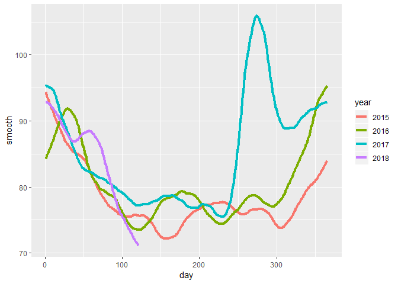

Comprehension Check: Smoothing
================

Q1
--

In the Wrangling course of this series, PH125.6x, we used the following code to obtain mortality counts for Puerto Rico for 2015-2018:

``` r
library(tidyverse)
```

    ## Warning: package 'tidyverse' was built under R version 3.5.2

    ## -- Attaching packages ------------------------------------------------------------------------------------- tidyverse 1.2.1 --

    ## v ggplot2 3.0.0     v purrr   0.2.5
    ## v tibble  1.4.2     v dplyr   0.7.6
    ## v tidyr   0.8.1     v stringr 1.3.1
    ## v readr   1.1.1     v forcats 0.3.0

    ## -- Conflicts ---------------------------------------------------------------------------------------- tidyverse_conflicts() --
    ## x dplyr::filter() masks stats::filter()
    ## x dplyr::lag()    masks stats::lag()

``` r
library(purrr)
library(pdftools)
```

    ## Warning: package 'pdftools' was built under R version 3.5.2

``` r
library(dslabs)
library(lubridate)
```

    ## 
    ## Attaching package: 'lubridate'

    ## The following object is masked from 'package:base':
    ## 
    ##     date

``` r
fn <- file.path("extdata", "RD-Mortality-Report_2015-18-180531.pdf")
dat <- map_df(str_split(pdf_text(fn), "\n"), function(s){
    s <- str_trim(s)
    header_index <- str_which(s, "2015")[1]
    tmp <- str_split(s[header_index], "\\s+", simplify = TRUE)
    month <- tmp[1]
    header <- tmp[-1]
    tail_index  <- str_which(s, "Total")
    n <- str_count(s, "\\d+")
    out <- c(1:header_index, which(n==1), which(n>=28), tail_index:length(s))
    s[-out] %>%
        str_remove_all("[^\\d\\s]") %>%
        str_trim() %>%
        str_split_fixed("\\s+", n = 6) %>%
        .[,1:5] %>%
        as_data_frame() %>% 
        setNames(c("day", header)) %>%
        mutate(month = month,
            day = as.numeric(day)) %>%
        gather(year, deaths, -c(day, month)) %>%
        mutate(deaths = as.numeric(deaths))
}) %>%
    mutate(month = recode(month, "JAN" = 1, "FEB" = 2, "MAR" = 3, "APR" = 4, "MAY" = 5, "JUN" = 6, 
                          "JUL" = 7, "AGO" = 8, "SEP" = 9, "OCT" = 10, "NOV" = 11, "DEC" = 12)) %>%
    mutate(date = make_date(year, month, day)) %>%
    filter(date <= "2018-05-01")
```

Use the loess function to obtain a smooth estimate of the expected number of deaths as a function of date. Plot this resulting smooth function. Make the span about two months long.

``` r
total_days <- as.numeric(diff(range(dat$date)))
span <- 60/total_days

fit <- dat %>%
  mutate(date_numeric = as.numeric(date)) %>%
  loess(deaths ~ date_numeric, data = ., span = span, degree = 1)

dat %>% 
  mutate(smooth = predict(fit, as.numeric(date))) %>%
  ggplot() +
  geom_point(aes(date, deaths))+
  geom_line(aes(date, smooth), lwd =1.5, col = 2)
```

    ## Warning: Removed 1 rows containing missing values (geom_point).


Q2
--

Work with the same data as in Q1 to plot smooth estimates against day of the year, all on the same plot, but with different colors for each year.

Which code produces the desired plot?

``` r
dat %>% 
    mutate(smooth = predict(fit, as.numeric(date)), day = yday(date), year = as.character(year(date))) %>%
    ggplot(aes(day, smooth, col = year)) +
    geom_line(lwd = 1.5)
```



Q3
--

Suppose we want to predict 2s and 7s in the mnist\_27 dataset with just the second covariate. Can we do this? On first inspection it appears the data does not have much predictive power.

In fact, if we fit a regular logistic regression the coefficient for x\_2 is not significant!

This can be seen using this code:

``` r
library(broom)
mnist_27$train %>% glm(y ~ x_2, family = "binomial", data = .) %>% tidy()
```

    ## # A tibble: 2 x 5
    ##   term        estimate std.error statistic p.value
    ##   <chr>          <dbl>     <dbl>     <dbl>   <dbl>
    ## 1 (Intercept)  -0.0907     0.247    -0.368   0.713
    ## 2 x_2           0.685      0.827     0.829   0.407

Plotting a scatterplot here is not useful since y is binary:

``` r
qplot(x_2, y, data = mnist_27$train)
```


Fit a loess line to the data above and plot the results. What do you observe? **There is predictive power and the conditional probability is non-linear. **

Note that there is indeed predictive power, but that the conditional probability is non-linear.

The loess line can be plotted using the following code:

``` r
mnist_27$train %>% 
    mutate(y = ifelse(y=="7", 1, 0)) %>%
    ggplot(aes(x_2, y)) + 
    geom_smooth(method = "loess")
```


