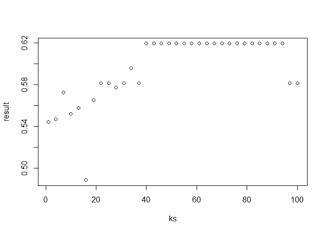

Comprehension Check: Nearest Neighbors
================

Q1
--

Previously, we used logistic regression to predict sex based on height. Now we are going to use knn to do the same. Set the seed to 1, then use the caret package to partition the dslabs "heights" data into a training and test set of equal size. Use the sapply function to perform knn with k values of seq(1, 101, 3) and calculate F\_1 scores.

What is the max value of F\_1?

``` r
library(caret)
```

    ## Loading required package: lattice

    ## Loading required package: ggplot2

    ## Registered S3 methods overwritten by 'ggplot2':
    ##   method         from 
    ##   [.quosures     rlang
    ##   c.quosures     rlang
    ##   print.quosures rlang

``` r
library(dslabs)
library(tidyverse)
```

    ## Registered S3 method overwritten by 'rvest':
    ##   method            from
    ##   read_xml.response xml2

    ## -- Attaching packages ---------------------------------------------------------------------------------------------------------------------- tidyverse 1.2.1 --

    ## v tibble  2.1.1       v purrr   0.3.2  
    ## v tidyr   0.8.3       v dplyr   0.8.0.1
    ## v readr   1.3.1       v stringr 1.4.0  
    ## v tibble  2.1.1       v forcats 0.4.0

    ## -- Conflicts ------------------------------------------------------------------------------------------------------------------------- tidyverse_conflicts() --
    ## x dplyr::filter() masks stats::filter()
    ## x dplyr::lag()    masks stats::lag()
    ## x purrr::lift()   masks caret::lift()

``` r
set.seed(1)
data("heights")

test_index <- createDataPartition(heights$sex, times = 1, p=0.5, list= FALSE)

train_set <- heights[-test_index,]
test_set <-  heights[test_index,]

ks <- seq(1, 101, 3)

result <- sapply(ks, function(k){
  
  fit <- knn3(sex ~ height, train_set, k = k )
  y_hat <- predict(fit, test_set ,type = "class") %>%
    factor(levels(train_set$sex))
  F_meas(data = y_hat, reference = test_set$sex)
})

plot(ks,result)
```



``` r
max(result)
```

    ## [1] 0.619469

``` r
ks[which.max(result)]
```

    ## [1] 40

Different from the exercise: 0.60194 and 46

Q2
--

Next we will use the same gene expression example used in the Comprehension Check: Distance exercises. You can load it like this:

``` r
library(dslabs)
data("tissue_gene_expression")
```

Split the data into training and test sets, and report the accuracy you obtain. Try it for k = 1, 3, 5, 7, 9, 11. Set the seed to 1.

``` r
set.seed(1)
library(caret)
y <- tissue_gene_expression$y
x <- tissue_gene_expression$x
train_index <- createDataPartition(y, list = FALSE)
sapply(seq(1, 11, 2), function(k){
    fit <- knn3(x[train_index,], y[train_index], k = k)
    y_hat <- predict(fit, newdata = data.frame(x=x[-train_index,]),
                type = "class")
mean(y_hat == y[-train_index])
})
```

    ## [1] 1.0000000 0.9892473 1.0000000 0.9462366 0.9247312 0.9354839

Expected answers: 0.978, 0.968, 0.989, 0.968, 0.957, 0.957
