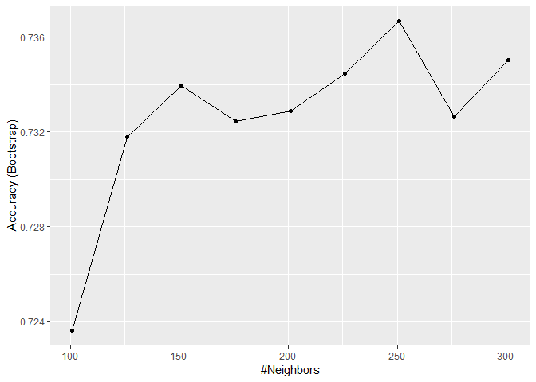
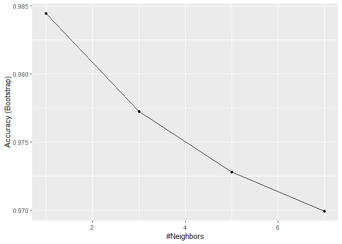

Comprehension Check: Cross-validation
================

Q1
--

Generate a set of random predictors and outcomes using the following code:

``` r
library(dslabs)
library(tidyverse)
```

    ## Registered S3 methods overwritten by 'ggplot2':
    ##   method         from 
    ##   [.quosures     rlang
    ##   c.quosures     rlang
    ##   print.quosures rlang

    ## Registered S3 method overwritten by 'rvest':
    ##   method            from
    ##   read_xml.response xml2

    ## -- Attaching packages ---------------------------------------------------------------------------------------------------------------------- tidyverse 1.2.1 --

    ## v ggplot2 3.1.1       v purrr   0.3.2  
    ## v tibble  2.1.1       v dplyr   0.8.0.1
    ## v tidyr   0.8.3       v stringr 1.4.0  
    ## v readr   1.3.1       v forcats 0.4.0

    ## -- Conflicts ------------------------------------------------------------------------------------------------------------------------- tidyverse_conflicts() --
    ## x dplyr::filter() masks stats::filter()
    ## x dplyr::lag()    masks stats::lag()

``` r
library(caret)
```

    ## Loading required package: lattice

    ## 
    ## Attaching package: 'caret'

    ## The following object is masked from 'package:purrr':
    ## 
    ##     lift

``` r
set.seed(1996)
n <- 1000
p <- 10000
x <- matrix(rnorm(n*p), n, p)
colnames(x) <- paste("x", 1:ncol(x), sep = "_")
y <- rbinom(n, 1, 0.5) %>% factor()

x_subset <- x[ ,sample(p, 100)]
```

Because x and y are completely independent, you should not be able to predict y using x with accuracy greater than 0.5. Confirm this by running cross-validation using logistic regression to fit the model. Because we have so many predictors, we selected a random sample x\_subset. Use the subset when training the model.

Which code correctly performs this cross-validation?

``` r
fit <- train(x_subset, y, method = "glm")
fit$results
```

    ##   parameter  Accuracy       Kappa AccuracySD    KappaSD
    ## 1      none 0.5052329 0.009740464 0.02993012 0.06042542

Q2
--

Now, instead of using a random selection of predictors, we are going to search for those that are most predictive of the outcome. We can do this by comparing the values for the *y = 1* group to those in the \* y = 0 \* group, for each predictor, using a t-test. You can do perform this step like this:

``` r
library(devtools)
#devtools::install_bioc("genefilter")
library(genefilter)
```

    ## 
    ## Attaching package: 'genefilter'

    ## The following object is masked from 'package:readr':
    ## 
    ##     spec

``` r
tt <- colttests(x, y)
```

Which of the following lines of code correctly creates a vector of the p-values called pvals?

``` r
pvals <- tt$p.value
```

Q3
--

Create an index ind with the column numbers of the predictors that were "statistically significantly" associated with y. Use a p-value cutoff of 0.01 to define "statistically significantly."

How many predictors survive this cutoff?

``` r
ind <- which(pvals <= 0.01)
length(ind)
```

    ## [1] 108

Answer = 108

Q4
--

Now re-run the cross-validation after redefinining x\_subset to be the subset of x defined by the columns showing "statistically significant" association with y.

What is the accuracy now?

``` r
x_subset <- x[,ind]
fit <- train(x_subset, y, method = "glm")
fit$results
```

    ##   parameter  Accuracy     Kappa AccuracySD    KappaSD
    ## 1      none 0.7547533 0.5088535 0.02094083 0.04247884

Answer 0.754

Q5
--

Re-run the cross-validation again, but this time using kNN. Try out the following grid k = seq(101, 301, 25) of tuning parameters. Make a plot of the resulting accuracies.

Which code is correct?

``` r
fit <- train(x_subset, y, method = "knn", tuneGrid = data.frame(k = seq(101, 301, 25)))
ggplot(fit)
```



Q6
--

In the previous exercises, we see that despite the fact that x and y are completely independent, we were able to predict y with accuracy higher than 70%. We must be doing something wrong then.

What is it?

**We used the entire dataset to select the columns used in the model.**

Explanation

Because we used the entire dataset to select the columns in the model, the accuracy is too high. The selection step needs to be included as part of the cross-validation algorithm, and then the cross-validation itself is performed after the column selection step.

As a follow-up exercise, try to re-do the cross-validation, this time including the selection step in the cross-validation algorithm. The accuracy should now be close to 50%.

Q7 Use the train function with kNN to select the best k for predicting tissue from gene expression on the tissue\_gene\_expression dataset from dslabs. Try k = seq(1,7,2) for tuning parameters. For this question, do not split the data into test and train sets (understand this can lead to overfitting, but ignore this for now).
---------------------------------------------------------------------------------------------------------------------------------------------------------------------------------------------------------------------------------------------------------------------------------------------------------------------------------------

What value of k results in the highest accuracy?

``` r
data("tissue_gene_expression")
fit <- with(tissue_gene_expression, train(x, y, method = "knn", tuneGrid = data.frame( k = seq(1, 7, 2))))
ggplot(fit)
```



``` r
fit$results
```

    ##   k  Accuracy     Kappa AccuracySD    KappaSD
    ## 1 1 0.9844406 0.9811146 0.01315780 0.01595194
    ## 2 3 0.9772461 0.9724452 0.01732953 0.02088672
    ## 3 5 0.9728171 0.9670638 0.02494014 0.03014280
    ## 4 7 0.9699560 0.9637139 0.03493925 0.04201823

Answer: 1
