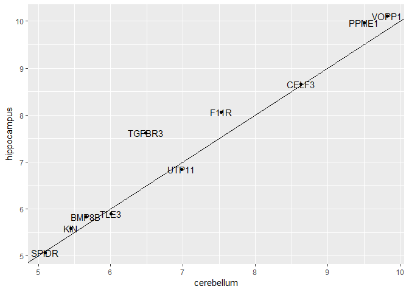
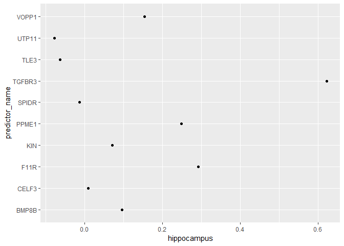
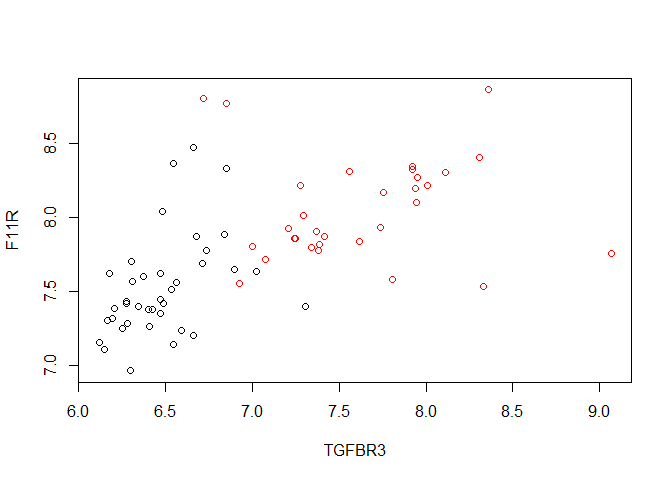

Comprehension Check: Generative Models
================

Q1
--

Create a dataset of samples from just cerebellum and hippocampus, two parts of the brain, and a predictor matrix with 10 randomly selected columns using the following code:

``` r
library(dslabs)
library(caret)
```

    ## Loading required package: lattice

    ## Loading required package: ggplot2

    ## Registered S3 methods overwritten by 'ggplot2':
    ##   method         from 
    ##   [.quosures     rlang
    ##   c.quosures     rlang
    ##   print.quosures rlang

``` r
library(tidyverse)
```

    ## Registered S3 method overwritten by 'rvest':
    ##   method            from
    ##   read_xml.response xml2

    ## -- Attaching packages ---------------------------------------------------------------------------- tidyverse 1.2.1 --

    ## v tibble  2.1.1       v purrr   0.3.2  
    ## v tidyr   0.8.3       v dplyr   0.8.0.1
    ## v readr   1.3.1       v stringr 1.4.0  
    ## v tibble  2.1.1       v forcats 0.4.0

    ## -- Conflicts ------------------------------------------------------------------------------- tidyverse_conflicts() --
    ## x dplyr::filter() masks stats::filter()
    ## x dplyr::lag()    masks stats::lag()
    ## x purrr::lift()   masks caret::lift()

``` r
data("tissue_gene_expression")
      
set.seed(1993)
ind <- which(tissue_gene_expression$y %in% c("cerebellum", "hippocampus"))
y <- droplevels(tissue_gene_expression$y[ind])
x <- tissue_gene_expression$x[ind, ]
x <- x[, sample(ncol(x), 10)]
```

Use the train function to estimate the accuracy of LDA. For this question, use the entire tissue\_gene\_expression dataset: do not split it into training and test sets (understand this can lead to overfitting).

``` r
train_lda <- train(x,y , method = "lda")
train_lda$results["Accuracy"]
```

    ##   Accuracy
    ## 1 0.974834

Answer: Expected from course 0.871 (What I got 0.9804733)

What is the accuracy?

Q2
--

In this case, LDA fits two 10-dimensional normal distributions. Look at the fitted model by looking at the finalModel component of the result of train. Notice there is a component called means that includes the estimated means of both distributions. Plot the mean vectors against each other and determine which predictors (genes) appear to be driving the algorithm.

``` r
train_lda$finalModel
```

    ## Call:
    ## lda(x, grouping = y)
    ## 
    ## Prior probabilities of groups:
    ##  cerebellum hippocampus 
    ##   0.5507246   0.4492754 
    ## 
    ## Group means:
    ##                BMP8B    VOPP1     KIN   TGFBR3    PPME1     TLE3    SPIDR
    ## cerebellum  5.660265  9.82454 5.45312 6.486941 9.507488 6.008919 5.097781
    ## hippocampus 5.834400 10.10523 5.58260 7.614880 9.960071 5.894071 5.073355
    ##                 F11R    CELF3    UTP11
    ## cerebellum  7.527174 8.632449 6.984611
    ## hippocampus 8.057552 8.650689 6.843593
    ## 
    ## Coefficients of linear discriminants:
    ##               LD1
    ## BMP8B  -1.6806192
    ## VOPP1  -0.1903705
    ## KIN     2.4938547
    ## TGFBR3  1.9078804
    ## PPME1   4.0014554
    ## TLE3   -2.0382325
    ## SPIDR  -0.8284707
    ## F11R    2.4599963
    ## CELF3  -1.0681965
    ## UTP11  -0.6983432

``` r
t(train_lda$finalModel$means) %>% data.frame() %>%
    mutate(predictor_name = rownames(.)) %>%
    ggplot(aes(cerebellum, hippocampus, label = predictor_name)) +
    geom_point() +
    geom_text() +
    geom_abline()
```



Which TWO genes appear to be driving the algorithm? Answer RAB1B & OAZ2

Q3
--

Repeat the exercise in Q1 with QDA.

Create a dataset of samples from just cerebellum and hippocampus, two parts of the brain, and a predictor matrix with 10 randomly selected columns using the following code:

``` r
library(dslabs)      
library(caret)
data("tissue_gene_expression")
      
set.seed(1993)
ind <- which(tissue_gene_expression$y %in% c("cerebellum", "hippocampus"))
y <- droplevels(tissue_gene_expression$y[ind])
x <- tissue_gene_expression$x[ind, ]
x <- x[, sample(ncol(x), 10)]
```

Use the train function to estimate the accuracy of QDA. For this question, use the entire tissue\_gene\_expression dataset: do not split it into training and test sets (understand this can lead to overfitting).

``` r
fit_qda <- train(x, y, method = "qda")
fit_qda$results["Accuracy"]
```

    ##    Accuracy
    ## 1 0.9256166

What is the accuracy? Answer: expected 0.815, gotten 0.9256

Q4
--

Which TWO genes drive the algorithm when using QDA instead of LDA?

``` r
t(fit_qda$finalModel$means) %>% data.frame() %>%
    mutate(predictor_name = rownames(.)) %>%
    ggplot(aes(cerebellum, hippocampus, label = predictor_name)) +
    geom_point() +
    geom_text() +
    geom_abline()
```


Answer: RAB1B & OAZ2

Q5
--

One thing we saw in the previous plots is that the values of the predictors correlate in both groups: some predictors are low in both groups and others high in both groups. The mean value of each predictor found in colMeans(x) is not informative or useful for prediction and often for purposes of interpretation, it is useful to center or scale each column. This can be achieved with the preProcess argument in train. Re-run LDA with preProcess = "center". Note that accuracy does not change, but it is now easier to identify the predictors that differ more between groups than based on the plot made in Q2.

``` r
fit_lda <- train(x, y, method = "lda", preProcess = "center")
fit_lda$results["Accuracy"]
```

    ##    Accuracy
    ## 1 0.9800666

``` r
t(fit_lda$finalModel$means) %>% data.frame() %>%
    mutate(predictor_name = rownames(.)) %>%
    ggplot(aes(predictor_name, hippocampus)) +
    geom_point() +
    coord_flip()
```



You can see that it is different genes driving the algorithm now. This is because the predictor means change.

In the previous exercises we saw that both LDA and QDA approaches worked well. For further exploration of the data, you can plot the predictor values for the two genes with the largest differences between the two groups in a scatter plot to see how they appear to follow a bivariate distribution as assumed by the LDA and QDA approaches, coloring the points by the outcome, using the following code:

``` r
d <- apply(fit_lda$finalModel$means, 2, diff)
ind <- order(abs(d), decreasing = TRUE)[1:2]
plot(x[, ind], col = y)
```



Which TWO genes drive the algorithm after performing the scaling? OAZ2 & SPI1

Q6
--

Now we are going to increase the complexity of the challenge slightly. Repeat the LDA analysis from Q5 but using all tissue types. Use the following code to create your dataset:

``` r
library(dslabs)      
library(caret)
data("tissue_gene_expression")
           
set.seed(1993)
y <- tissue_gene_expression$y
x <- tissue_gene_expression$x
x <- x[, sample(ncol(x), 10)]
```

``` r
fit_lda <- train(x, y, method = "lda", preProcess = c("center"))
fit_lda$results["Accuracy"]
```

    ##    Accuracy
    ## 1 0.8714486

We see that the results are slightly worse when looking at all of the tissue types instead of only selected ones. You can use the confusionMatrix function to learn more about what type of errors we are making, like this: confusionMatrix(fit\_lda).

What is the accuracy using LDA? Answer:0.819
