## Trees Motivation

We describe how methods lda and qda are not meant to be used with datasets that have many predictors. This is because the number of parameters that we need to estimate becomes too large.  
For example, with the digits example where we have 784 predictors, lda would have to estimate over 600,000 parameters. With qda, you would have to multiply that by the number of classes, which is 10 here. Kernel methods such k-nearest neighbors or local regression do not have model parameters to estimate. But they also face a challenge when multiple predictors are used due to what is referred to as the **curse of dimensionality.**  

The dimension here refers to the fact that when we have p predictors, the distance between two observations is computed in p dimensional space. A useful way to understand the curse of dimensionality is by considering how large we have to make a neighborhood, the neighborhood we used to make the estimates, to include a given percentage of the data.  


Remember that with large neighborhoods, our methods lose flexibility. For example, suppose we have one continuous predictor with equally spaced points in the [0 - 1] interval, and you wanted to create windows that include 1/10 of the data. Then it's easy to see that our windows have to be of size 0.1.
You can see it in this figure.

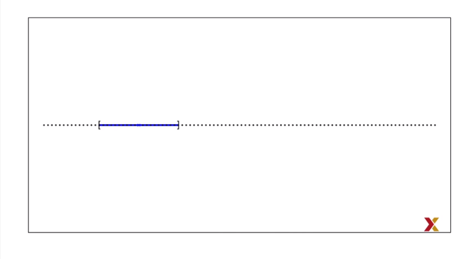

Now, for two predictors, if we decide to keep the neighborhood just a small, 10% of each dimensions we only include one point.

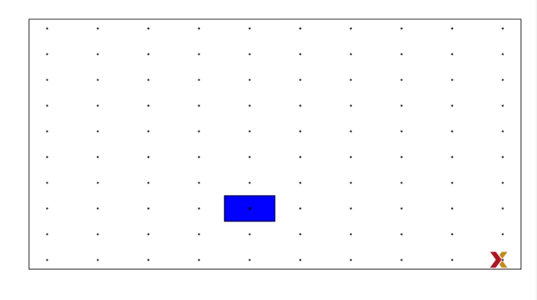

If we want to include 10% of the data, then we need to increase the size of each side of the square to the square root of 10 so that the area is 10 out of 100. This is now 0.316.

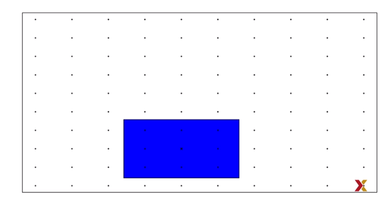

In general, to include 10% of the data in a case with p dimensions,
we need an interval [? with ?] each side having a size of 0.10 to the 1/p.

$$
\sqrt[p]{.10}
$$

This proportion gets close to 1, which means we're including practically all the data, and it's no longer smoothing very quickly. You can see it in this graph, plotting p versus 0.1 to the 1/p.

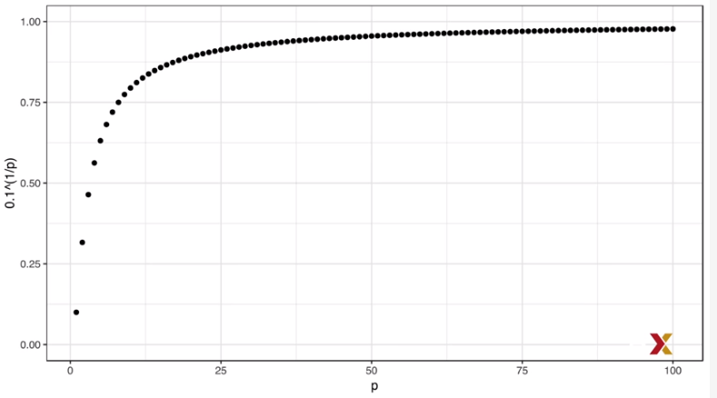

So by the time we reach 100 predictors, the neighborhood is no longer very local, as each side covers almost the entire dataset. In this video, we introduced a set of elegant and versatile methods that adapt to higher dimensions and also allow these regions to take more complex shapes, while still producing models that are interpretable. These are very popular well-known and studied methods. We will focus on regression and decision trees and their extension, random forests.


## Classification and Regression Trees (CART)

To motivate this video, we will use a new dataset that includes the breakdown of the composition
of olive into eight fatty acids. You can get the data like this.

```{r}
library(dslabs)
library(tidyverse)
data("olive")
head(olive)
```


For illustrative purpose, we'll try to predict the region using the fatty acid composition values as predictors.

```{r}
table(olive$region)
```

It's either Northern Italy, Sardinia, or Southern Italy. We'll remove the area column because we don't use it as a predictor.

```{r}
olive <- select(olive, -area)
```

Let's very quickly see how we do using k-nearest neighbors. We use the caret package to fit the model, and we get an accuracy of about 0.97, pretty good.

```{r}
library(caret)
fit <- train(region ~ ., method = "knn", tuneGrid = data.frame(k = seq(1,15,2)), data = olive)
```


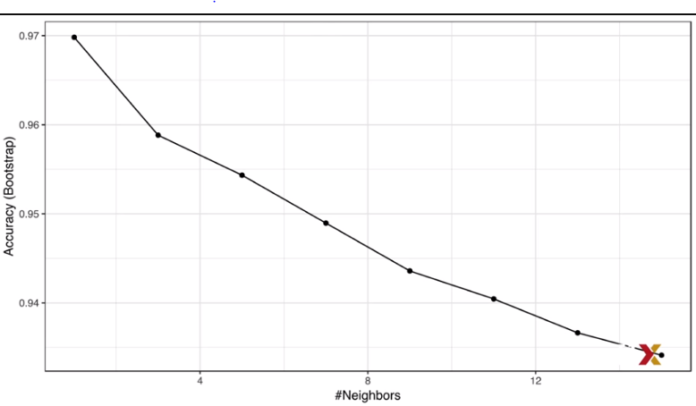

However, a bit of data exploration reveals that we should be able to do even better. 

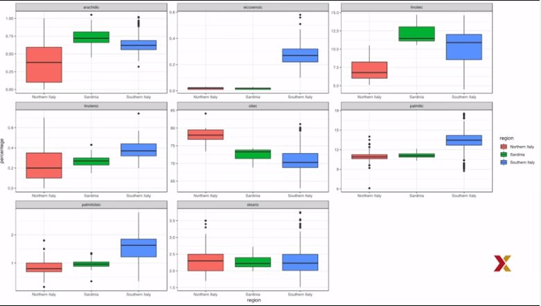


For example, if we look at the distributionof each predictor stratified by region, we see that one of the fatty acids is only present in Southern Italy,

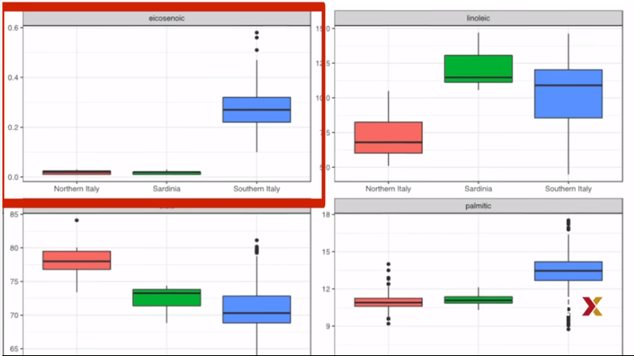

and then another one separates Northern Italy from Sardinia.

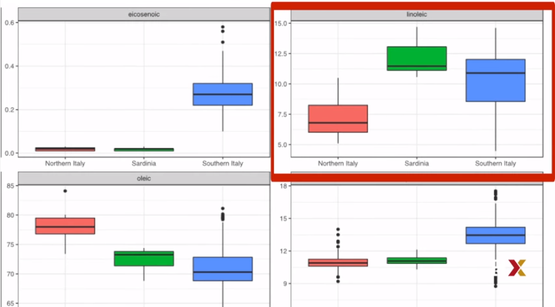


This implies that we should be able to build an algorithm that perfectly predicts. We can see this clearly by plotting the values of these two fatty acids.

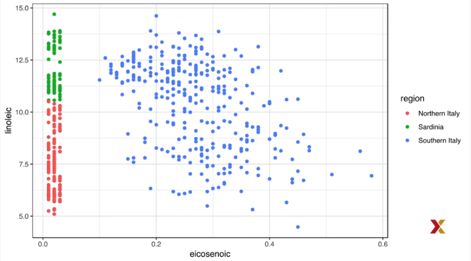


We can, by eye, construct a prediction rule the partitions the predictor
space like this.

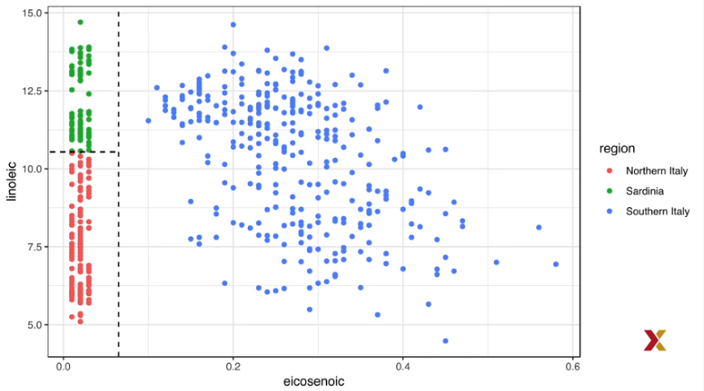

Specifically, we define the following decision rule. If the first predictor is larger than 0.065, B, predict Southern Italy. If not, then look at the second predictor. And if that's larger than 10.535, predict Sardinia, and Northern Italy otherwise. We can draw this as a decision tree like this.

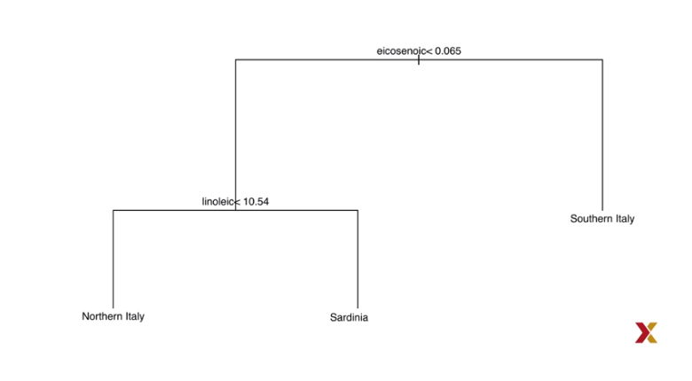

Decision trees like this one are often used in practice. For example, to decide if a person at risk of having a heart attack,a doctor will use a decision tree such as this one. 

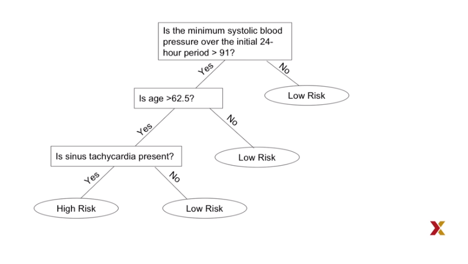

The general idea is to define an algorithm that uses data to create trees such as the ones we've just shown. Regression and decision trees operate by predicting an outcome variable y by partitioning the predictor space.
**When the outcome is continuous, we call these types of algorithms regression trees.**
We'll use a continuous case, the 2008 poll data introduced earlier, to describe the basic idea of how we build these algorithms. We'll try to estimate the conditional expectation-- we'll call it f of x, the expected value of y given x--

$$
f(x) = E(Y|X=x)
$$

with y, the poll margin, and x, the day. Here's a graph of the data.

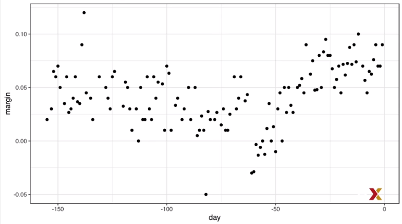

**The general idea here is to build a decision tree. And at the end of each node, we'll have a different prediction Y hat.**  

Here is how we do it. **First we partition the space into j non-overlapping regions, R1, R2, all the way up to Rj.** For every observation that follows within a region $x_i \in R_j$ , let's say, region Rj, we predict the $\hat{Y}$ with the average of all the training observations $Y_i$  in that region $x_i \in R_j$ .But how do we decide on the partitions R1, R2 and so on? And how do we decide how many? Regression trees create partitions recursively. But what does this mean? OK, suppose we already have a partition. We then have to decide what predictor j to use to make the next partition and where to make it within that predictor. So suppose we already have a partition so that every observation i is in exactly one of these partitions. For each of these partitions, we will divide further using the following algorithm.  

First we need to find a **predictor j and a value s that define two new partitions.** Let's call them $R_1$ and $R_2$. These two partitions will split our observations into the following two sets. $\hat{y}R_1$ and $\hat{y}R_2$ 

$$
R_1(j,s) = \{X | X_j \lt s \}
$$
and
$$
R_2(j,s) = \{X | X_j \ge s \}
$$

Then, in each one of these two sets, we will define an average $\bar{y}R_1$ and $\bar{y}R_2$ and use these as our predictions. The averages will be the averages of the observations in each of the two partitions.  So we could do this for many Js and Ss. So how do we pick them? We pick the combination that minimizes the residual sum of squares defined by this formula.

$$
\Sigma_{i:x_i \in R_1(j,s)} (y_i - \hat{y}R_1)^2 + \Sigma_{i:x_i \in R_2(j,s)} (y_i - \hat{y}R_2)^2

$$

This is then applied recursively. We keep finding new regions to split into two. Once we're done partitioning the predictor space into regions, in each region, a prediction is made by using the observations in that region. You basically calculate an average. Let's take a look at what this algorithm does on the 2008 presidential election
poll data.  We will use the **rpart function in the rpart package.** We simply type this.

```{r}
library(rpart)
fit <- rpart(margin ~ ., data= polls_2008)
```

Here there's only one predictor. So we don't have to decide which predictor j to split by. We simply have to decide what value s we use to split.We can visually see where the splits were made by using this piece of code. 

```{r}
plot(fit, margin = 0.1)
text(fit, cex = 0.75)
```

Here's a tree.The first split is made on day 39.5. Then one of those two regions is split at day 86.5. The two resulting new partitions are split on day 49.5 and 117.5 respectively and so on. We end up with eight partitions. The final estimate f hat of x looks like this.

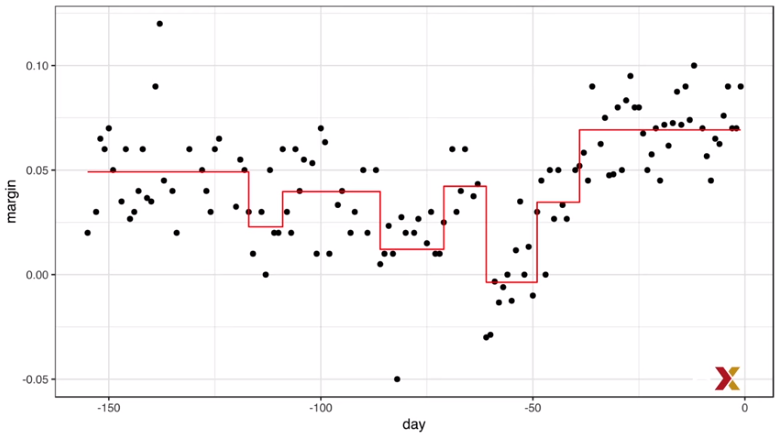

Now, why did the algorithm stop partitioning at eight? There are some details of the algorithm we did not explain. Let's explain them now. Note that every time we split and define two new partitions, our training set residual sum of squares decreases. This is because with more partitions, our model has more flexibility to adapt to the training data. In fact, if you split until every point is its own partition, then the residual sum of squares goes all the way down to zero since the average of one value is that same value. To avoid this overtraining, **the algorithm sets a minimum for how much the residual sum of squares must improve for another partition to be added. This parameter is referred to as the Complexity Parameter, or CP.** The residual sum of squares must improve by a factor of CP the new partition to be added.  

Another aspect of the algorithm we didn't describe is that** it sets a minimum number of observations to be partitioned.** In the rpart package, that rpart function has an **argument called minsplit** that lets you define this. **The default is 20**.   

The algorithm also **sets a minimum on the number of observations in each partition.** In the rpart function, this **argument is called minbucket.** So if the optimal split results in a partition with less observation than this minimum, it is not considered. The default for this parameter is minsplit divided by 3 rounded to the closest integer. $default = round(\frac{minsplit}{3})$  
 
OK, so let's see what happens if we set CP to 0 and minsplit to 2. What will happen then? Well, our prediction is our original data because the tree will keep splitting and splitting until the RSS is minimized to zero.
Here's the data with the resulting fit. 

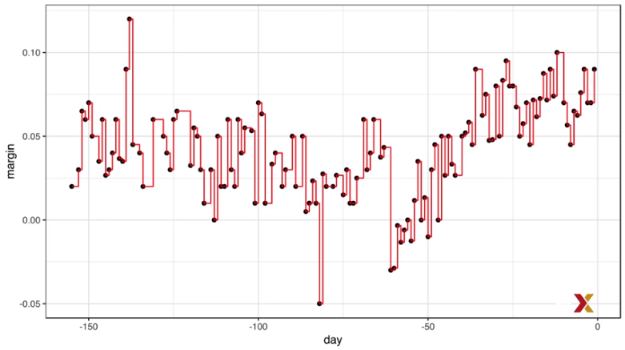

Now, note that in this methodology, we can also **prune trees** by snipping off partitions that do not meet a CP criterion. So we can grow a tree very, very big and then prune off branches to make a smaller tree. Here is a code for how to do this.

```{r}
pruned_fit <- prune(fit, cp = 0.01)
```

With the code that we just wrote, here is the resulting estimate.

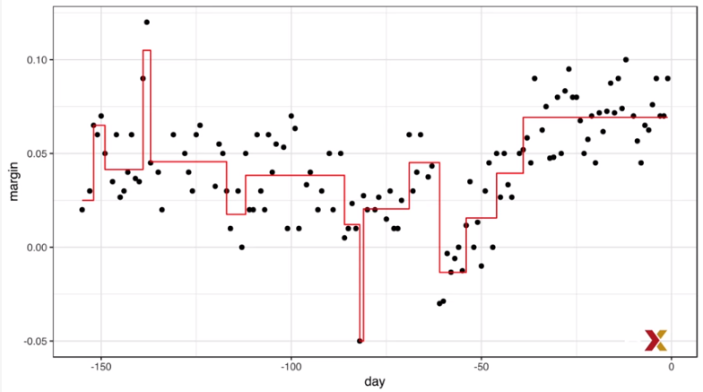

OK, but now is a default value of CP the best one? How do we pick CP? Well, we can use cross-validation, just like with any other tuning parameter. We can use the train function in the caret package, for example. We can write this code, then plot the result, and pick the best CP.

```{r}
library(caret)
train_rpart <- train(margin ~ .,
                     method = "rpart",
                     tuneGrid = data.frame(cp = seq(0, 0.05, len=25)),data = polls_2008)

ggplot(train_rpart)
```


To see the resulting tree that minimizes the mean squared error, we can access it through the component finalmodel. If we plot it, we can see the tree.Here it is.

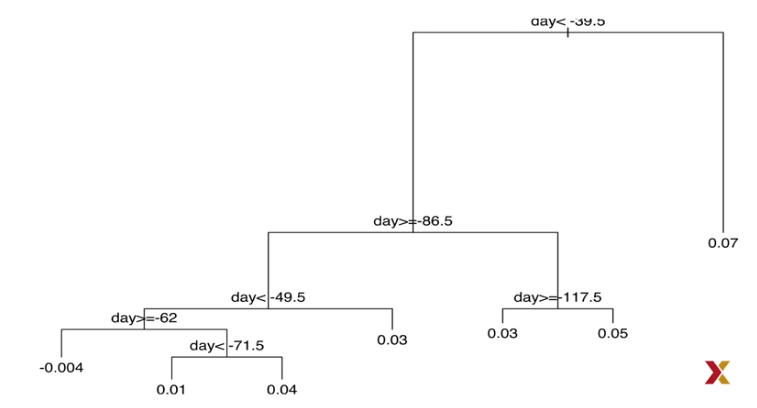

And because we only have one predictor, we can actually plot f(x). Here it is.

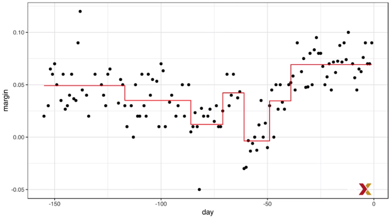

You can see that the fit looks reasonable.


## Classification (Decision) Trees

When the outcome is categorical, we refer to these methods as classification trees or decision trees. We use the same partitioning principles, that we use for the continuous case, but with some slight differences to account for the fact that we are now working with categorical data. **The first difference is that rather than taking the average at the end of each node, now in the partitions, we predict with the class that has the majority vote in each node. So the class that appears the most in a node, that will be what we predict.**  

The second difference is that **we can no longer use residual sum of squares to decide on the partition because the outcomes are categorical.** Well, we could use a naive approach, for example, looking four partitions that minimize training error. Better performing approaches use more sophisticated metrics. Two of the more popular ones are the **Gini index and entropy**. Let's define those two concepts. If we define $\hat{p}m , k $ as a proportion of observations in partition **m** that are of class **k**, then the Gini index is defined as follows.

$$
Gini = \Sigma_{k=1}^K \hat{p}_{m,k}(1 - \hat{p}_{m,k})
$$

And entropy is defined in the following way.

$$
- \Sigma_{k=1}^K \hat{p}_{m,k} log(\hat{p}_{m,k})
$$
**with 0 x log(0) defined as 0**  

Both of these metrics seek to partition observations into subsets that have the same class. They want what is called purity. Note that of a partition-- let's call it m-- has only one class-- let's say it's the first one-- then p hat of 1 for that partition is equal to 1, while all the other p hats are equal to 0.

$$
\hat{p}_{m,1} = 1, \hat{p}_{m,2} = 0,\dots,\hat{p}_{m,K} = 0

$$

**When this happens, both the Gini index and entropy are 0, the smallest value.**  


So let's look at an example. Let's see how classification trees perform on the two or seven example we have examined in previous videos. This is the code that we would write to fit a tree. 

```{r}
train_rpart <- train(y ~ .,method = "rpart", tuneGrid = data.frame(cp = seq(0.0,0.1, len = 25)),data = mnist_27$train)

plot(train_rpart)
```


We then look at the accuracy versus complexity parameter function, and we can pick the best complexity parameter from this plot. And now we use that tree and see how well we do. We see that we achieve an accuracy of 0.82. We can use this code.

```{r}
confusionMatrix(predict(train_rpart, mnist_27$test), mnist_27$test$y)$overall["Accuracy"]
```

Note that this is better than logistic regression but not as good as the kernel methods. If we plot the estimate of the conditional probability obtained with this tree, it shows us the limitations of classification trees.

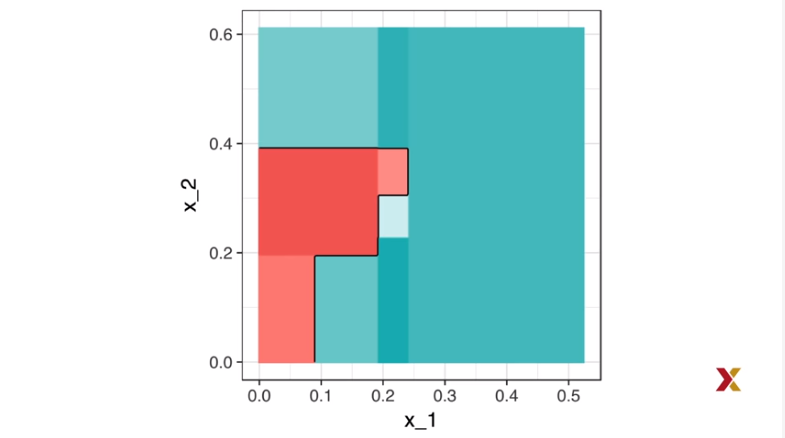


Note that with decision trees, the boundary can't be smoothed. Despite these limitations, classification trees have certain advantages that make them very useful. First, they're highly interoperable, even more so than linear regression models or logistic regression models. They're also easy to visualize if they're small enough.Finally, they sometimes model human decision processes. On the other hand, the greedy approach via recursive partitioning is a bit harder to train than, for example, linear regression or k-nearest neighbors.  

Also, it may not be the best performing method since it's not very flexible, and it's actually quite susceptible to changes in the training data. Random forests, explained in the next video, improve on several of these shortcomings.

## Random Forests

Random forests are a very popular approach that address the shortcomings of decision trees using a clever idea. The goal is to improve prediction performance and reduce instability by averaging multiple decision trees, a forest of trees constructed with randomness.It has two features that help accomplish this.  

**The first feature is referred to as bootstrap aggregation, or bagging.** The general scheme for bagging is as follows. **First, we build many decision trees, T1 through TB**, using the training set. We later explain how we're sure they're different. **Second, for every observation j in the test set, we form a prediction y hat j using tree Tj.**

Now, to obtain a final prediction, we combine the predictions for each tree in two different ways, one for continuous outcomes and one for categorical outcomes. 

For **continuous outcomes**, we simply take the average of the y hat j's.

$$
\hat{y} = \frac{1}{B} \Sigma_{j=1}^B\hat{y}j
$$

For **categorical data**, we predict $\hat{y}$ with a majority vote. The class that appears most across all the trees is the one we predict.$\hat{y}_1,\dots, \hat{y}_T$  

OK, now, but how do we get many decision trees from a single training set? For this, we use the **bootstrap.** So to create, let's say, B bootstrap trees, we do the following. To create tree Tj from a training set of size N, we create a bootstrap training set by sampling N observations from this training set with replacement. Now we build a decision tree for each one of these bootstrap training sets. And then we apply the algorithm that we just
described to get a final prediction. Here's the code for applying random forest to the 2008 polls data. It's quite simple. We do it like this.

```{r}
library(randomForest)
fit <- randomForest(margin ~ ., data = polls_2008)
```


We can see the algorithm improves as we add more trees. If you plot the object that comes out of this function like this, we get a plot of the error versus the number of trees that have been created.

```{r}
plot(fit)
```

In this case, we see that by the time we get to about 200 trees, the algorithm is not changing much. But note that for more complex problems will require more trees for the algorithm to converge. Here is the final result for the polls 2008 data.

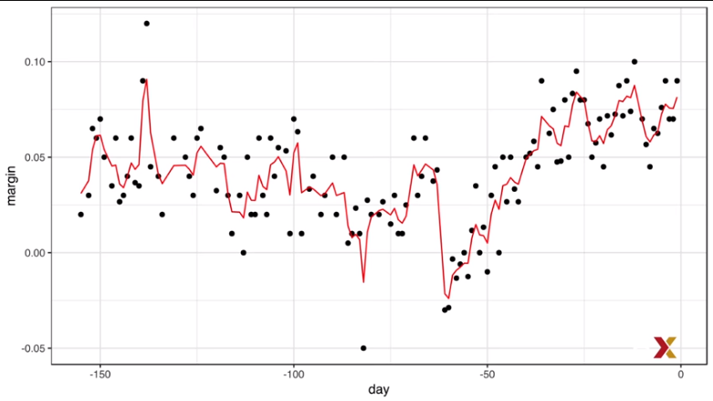

Note that the final result is somewhat smooth. It's not a step function like the individual trees. The averaging is what permits estimates that are not step functions. To see this, we've generated an animation to help illustrate the procedure. In the animated figure, you see each of 50 trees, B equals 1 up to 50. Each one is a bootstrap sample which appears in order. For each one of the bootstrap samples, we see the tree that is fitted to that bootstrap sample. And then in blue, we see the result of bagging the trees up to that point. So you can see the blue line changing with time. 

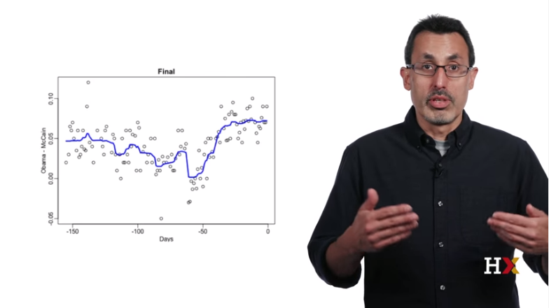

Now let's look at another example. Let's fit a random forest to our two or seven digit example. The code would look like this.

```{r}
library(randomForest)
train_rf <-  randomForest(y ~ ., data= mnist_27$train)
confusionMatrix(predict(train_rf, mnist_27$test), mnist_27$test$y)$overall["Accuracy"]
```

And here's what the conditional probabilities look like.

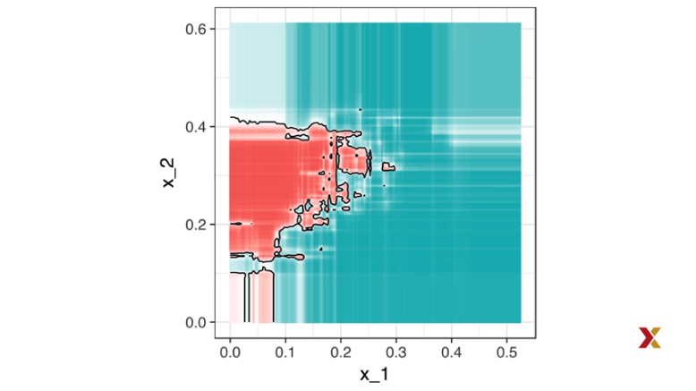

Note that we now have much more flexibility than just a single tree. This particular random forest is a little bit too wiggly. We want something smoother. However, note that we have not optimized the parameters in any way.
So let's use the caret package to do this. We can do it using this code.  
Here we're going to use a different random forest algorithm, Rborist, that is a little bit faster.
And here is the final result. We also see that our accuracy is much improved.

```{r}
fit  <- train(y ~ .,
              method = "Rborist", 
              tuneGrid= data.frame(predFixed = 2,
                                   minNode  = seq(3,50)),
              data = mnist_27$train)
              
confusionMatrix(predict(fit,mnist_27$test), mnist_27$test$y)$overall["Accuracy"]
```


So we can **control the smoothness of the random forest estimate in several ways**. One is to **limit the size of each node.** We can require the number of points per node to be larger.A second feature of random forest that we have not yet described is that we can use a **random selection of features to use for the splits.** Specifically, when building each tree at each recursive partition, we only consider a randomly selected subset of predictors
to check for the best split. And every tree has a different random selection of features. **This reduces correlation between trees in the forests, which in turn improves prediction accuracy.** The argument for this tuning parameter in the random forest function is **mtry.** But each random forest implementation has a different name. You can look at the help file to figure out which one.  

A **disadvantage of random forest is that we lose interpretability.** We're averaging hundreds or thousands of trees. However, there's a **measure called variable importance** that helps us interpret the results. Variable importance basically tells us how much each predictor influences the final predictions. We will see an example later.
