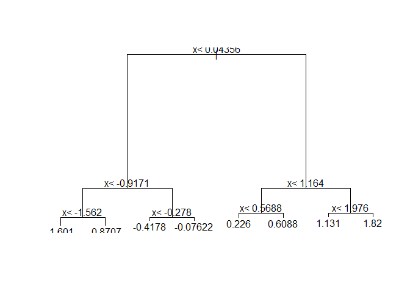

Comprehension Check: Trees and Random Forests
================

Q1
--

Create a simple dataset where the outcome grows 0.75 units on average for every increase in a predictor, using this code: Which code correctly uses rpart to fit a regression tree and saves the result to fit?

``` r
library(rpart)
n <- 1000
sigma <- 0.25
set.seed(1)
x <- rnorm(n, 0, 1)
y <- 0.75 * x + rnorm(n, 0, sigma)
dat <- data.frame(x = x, y = y)
fit <- rpart(y ~ ., data = dat)
```

Q2
--

Which of the following plots has the same tree shape obtained in Q1?

``` r
plot(fit)
text(fit)
```



Q3
--

Below is most of the code to make a scatter plot of y versus x along with the predicted values based on the fit.

``` r
library(tidyverse)
```

    ## Registered S3 methods overwritten by 'ggplot2':
    ##   method         from 
    ##   [.quosures     rlang
    ##   c.quosures     rlang
    ##   print.quosures rlang

    ## Registered S3 method overwritten by 'rvest':
    ##   method            from
    ##   read_xml.response xml2

    ## -- Attaching packages ---------------------------------------------------------------------------- tidyverse 1.2.1 --

    ## v ggplot2 3.1.1       v purrr   0.3.2  
    ## v tibble  2.1.1       v dplyr   0.8.0.1
    ## v tidyr   0.8.3       v stringr 1.4.0  
    ## v readr   1.3.1       v forcats 0.4.0

    ## -- Conflicts ------------------------------------------------------------------------------- tidyverse_conflicts() --
    ## x dplyr::filter() masks stats::filter()
    ## x dplyr::lag()    masks stats::lag()

``` r
dat %>% 
    mutate(y_hat = predict(fit)) %>% 
    ggplot() +
    geom_point(aes(x, y)) +
    #BLANK
  geom_step(aes(x, y_hat), col=2)
```


``` r
  #BLANK
```

Which line of code should be used to replace \#BLANK in the code above?

Q4
--

Now run Random Forests instead of a regression tree using randomForest from the **randomForest** package, and remake the scatterplot with the prediction line. Part of the code is provided for you below.

``` r
library(randomForest)
```

    ## randomForest 4.6-14

    ## Type rfNews() to see new features/changes/bug fixes.

    ## 
    ## Attaching package: 'randomForest'

    ## The following object is masked from 'package:dplyr':
    ## 
    ##     combine

    ## The following object is masked from 'package:ggplot2':
    ## 
    ##     margin

``` r
fit <- randomForest(y ~ x, data = dat)#BLANK 
dat %>% 
    mutate(y_hat = predict(fit)) %>% 
    ggplot() +
    geom_point(aes(x, y)) +
    geom_step(aes(x, y_hat), col = 2)
```

 What code should replace \#BLANK in the provided code?

Q5
--

Use the plot function to see if the Random Forest from Q4 has converged or if we need more trees.

``` r
plot(fit)
```

 Which is the correct plot to assess whether the Random Forest has converged?

Q6
--

It seems that the default values for the Random Forest result in an estimate that is too flexible (unsmooth). Re-run the Random Forest but this time with a node size of 50 and a maximum of 25 nodes. Remake the plot.

Part of the code is provided for you below.

``` r
library(randomForest)
fit <- randomForest(y ~ x, data = dat, nodesize = 50, maxnodes = 25)#BLANK
dat %>% 
    mutate(y_hat = predict(fit)) %>% 
    ggplot() +
    geom_point(aes(x, y)) +
    geom_step(aes(x, y_hat), col = 2)
```

 What code should replace \#BLANK in the provided code?
