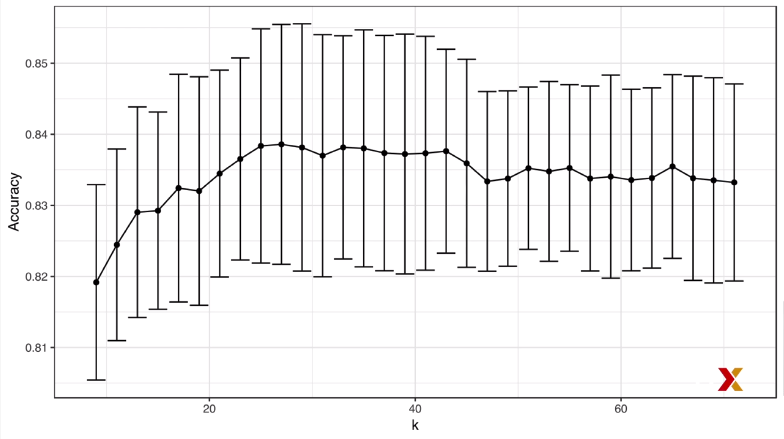
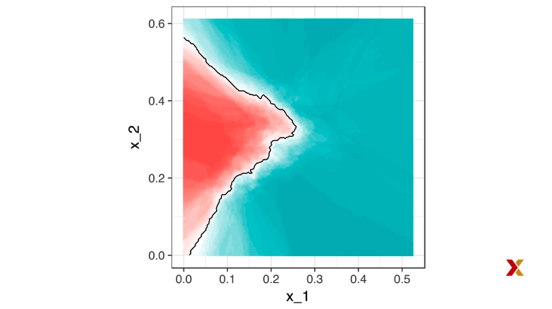
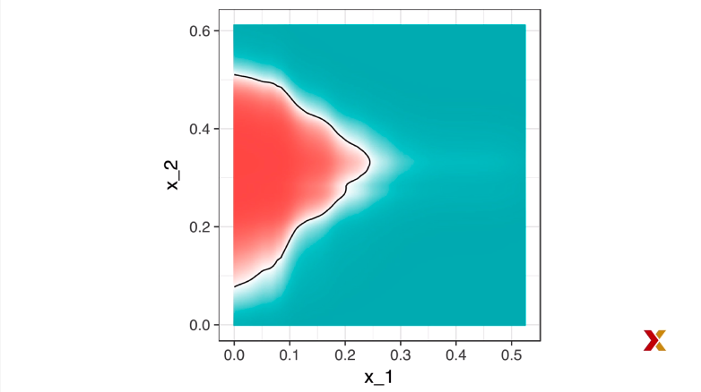

## Caret Package

We have already learned about regression, logistic regression, and k-nearest neighbors as machine-learning algorithms. In later sections, we learn several others. And this is just a small subset of all the algorithms out there. Many of these algorithms are implemented in R. However, they are distributed via different packages, developed by different authors, and often use different syntax. The caret package tries to consolidate these differences and provide consistency. **It currently includes 237 different methods**, which are summarized in the following site.  

<https://topepo.github.io/caret/available-models.html>  


We'll include the link in the courseware. Note that caret does not automatically install the packages needed to run these methods. So to implement a package through caret, you still need to install the library. The required package for each method is included in this page.  

<https://topepo.github.io/caret/train-models-by-tag.html>  

We'll include the link in the courseware. **The caret package also provides a function that performs cross-validation for us.** Here we provide some examples showing how we use this incredibly helpful package. We will use the two-or-seven example to illustrate this. You can load it like this.


```{r}
library(dslabs)
library(caret)
library(tidyverse)
data("mnist_27")

```


train trade function lets us train different algorithms using similar syntax. So for example, we can train a logistic regression model or a k-NN model using very similar syntax, like this.

```{r}
train_glm <- train(y ~ ., method = "glm", data = mnist_27$train)
train_knn <- train(y ~ ., method = "knn", data = mnist_27$train)
```

Now, to make predictions, we can use the output of this function directly without needing to look at the specifics of predict.glm or predict.knn. Instead, we can learn how to obtain predictions from the **predict.train function**. Once we read this help page, we know how to use a predict function for these objects. Here is the code to get the predictions for the logistic regression and the k-NN.

```{r}
y_hat_glm <- predict(train_glm, mnist_27$test, type = "raw")
y_hat_knn <- predict(train_knn, mnist_27$test, type = "raw")
```


Notice that the syntax is very similar. We can also very quickly study the confusion matrix. For example, we can compare the accuracy of both these methods like this.

```{r}
confusionMatrix(y_hat_glm, mnist_27$test$y)$overall["Accuracy"]
```

and

```{r}
confusionMatrix(y_hat_knn, mnist_27$test$y)$overall["Accuracy"]
```

## Tuning Parameters with Caret

When an algorithm includes a tuning parameter, train automatically uses cross-validation to decide among a few default values. To find out what parameter or parameters are optimized, you can read this page that explains it.  

<https://topepo.github.io/caret/available-models.html>  

We'll include the link in the courseware. Or study the output of the following code.

```{r}
getModelInfo("knn")
```


The get model info function can be used to get information of the method that you're interested in. You can do a quick lookup using the model lookup function like this.

```{r}
modelLookup("knn")
```


**When we run this code, we see that for knn, the parameter that's optimized is k.** So if we run the function train with default values, 

```{r}
train_knn <- train(y ~ ., method = "knn", data = mnist_27$train)
```
you can quickly see the results of the cross-validation using the ggplot function.You can use the argument highlight to highlight the parameter that
optimizes the algorithm. So you can type this.

```{r}
ggplot(train_knn, highlight = TRUE)
```


By default, **the cross-validation is performed by testing on 25 bootstrap samples comprised of 25% of the observations**. Also, for the knn method, the **default is to try out k=5, 7, and 9. We already saw that 9 maximizes this.** But maybe there's another k that's even better. So to change this, we need to use the **tunegrid parameter** in the train function. The grid of values that are going to be compared must be supplied by a data frame with the column names as specified by the parameters that you get in the model lookup output. Here we present an example trying out 30 values between 9 and 67. We need to use a column in k, so the data frame we use is going to be this one.


```{r}
data.frame(k=seq(9,67,2))
```


Now, note that when running this code, we are fitting 30 versions of knn to 25 bootstrap samples, so we're fitting 750 knn models. And thus, running this code will take several seconds. Here's the code.

```{r}
train_knn <- train(y ~ ., method = "knn", data = mnist_27$train, tuneGrid = data.frame(k = seq(9,71,2)))
ggplot(train_knn, highlight = TRUE)
```


In the plot, we can see the k that maximizes accuracy, but we can also access it using this code.

```{r}
train_knn$bestTune
```

The bestTune component gives us the parameter that maximizes the accuracy. We can also access the best-performing model using this code.


```{r}
train_knn$finalModel
```


Now, if you apply the function predict to the output of the train function, it will use this best-performing model to make predictions. Note that the best model was obtained using the training set. We did not use the test set at all. The cross-validation was performed on the training set. So now, if we want to see the accuracy we obtain on the test set, which hasn't been used, we can use the following code.

```{r}
confusionMatrix(predict(train_knn, mnist_27$test, type = "raw"), mnist_27$test$y)$overall["Accuracy"]
```

Sometimes we like to change the way we perform cross-validation. We might change the method, we might change how we do the partitions, etcetera. If we want to do this, we need to use a **trainControl function.** So for example, we can make the code that we just showed go a bit faster by using 10-fold cross-validation. This means we're going to have 10 validation samples that use 10% of the observations each.

```{r}
control <- trainControl(method = "cv", number = 10, p = 0.9) 
train_knn_cv <- train(y ~ ., method = "knn", data = mnist_27$train, tuneGrid = data.frame(k = seq(9, 71,2)), trControl = control)
ggplot(train_knn_cv, highlight = TRUE)
```

Notice that if we plot the estimated accuracy versus k plot, we notice that the accuracy estimates are more variable than in the previous example. Now this is expected since we changed a number of samples we use to estimate accuracy. In the first example, we used 25 bootstrap samples, and in this example, we use 10-fold cross-validation. One more thing to point out. Note that **the train function also provides standard deviation values for each parameter that was tested.** This is obtained from the different validation sets. So we can make a plot like this that shows the point estimates of the accuracy along with standard deviations.




To finish this example up, let's notice that the best-fitting knn model approximates the true condition of probability pretty well. However, we do see that the boundary is somewhat wiggly.



**This is because knn, like the basic bin smoother, does not use a smooth kernel.** To improve this, we could try loess. By reading through the available models of the caret package, which you can get to through this link, which we include in the course material, we see that we can use the **gamLoess method**.  


Also from the caret documentation link-- you can go to it here--

<https://topepo.github.io/caret/train-models-by-tag.html>  

you can see that we need to install the gam package if we have not done so already. So we will type something like this.

```{r eval=FALSE}
install.packages("gam")
```


Then we will see that we have two parameters to optimize if we use this particular method.

```{r}
library("gam")
modelLookup("gamLoess")
```


You can see this with the model lookup function, like this. For this example, we'll keep the degree fixed at one. We won't try out degree two. But to try out different values for the span, we still have to include a column in the table with the named degree. This is a requirement of the caret package. So we would define a grid using the expand.grid function, like this.

```{r}
grid <- expand.grid(span = seq(0.15,0.65, len = 10), degree = 1)
```


Now, we use the default cross-validation control parameters, so we type code like this to train our model. 

```{r}
train_loess <- train( y ~ ., method = "gamLoess", tuneGrid = grid, data = mnist_27$train)
```


Then, select the best-performing model, and now we can see the final result. It performs similarly to knn.

```{r}
ggplot(train_loess, highlight = TRUE)
```


```{r}
confusionMatrix(data = predict(train_loess, mnist_27$test), reference = mnist_27$test$y)$overall["Accuracy"]
```

However, we can see that the conditional probability estimate is indeed
smoother than what we get with knn.



**Note that not all parameters in machine-learning algorithms are tuned**. For example, in regression models or in LDA, we fit the best model using the squares estimates or maximum likelihood estimates. **Those are not tuning parameters.** We obtained those using least squares, or MLE, or some other optimization technique.  

Parameters that are tuned are parameters that we can change and then get an estimate of the model for each one. So in k-nearest neighbors, the number of neighbors is a tuning parameter. In regression, the number of predictors that we include could be considered a parameter that's optimized. So in the caret package, in the train function, we only optimize parameters that are tunable. So it won't be the case that, for example, in regression models, the caret package will optimize the regression coefficients that are estimated. Instead, it will just estimate using least squares. This is an important distinction to make when using the caret package-- knowing which parameters are optimized, and which ones are not.
