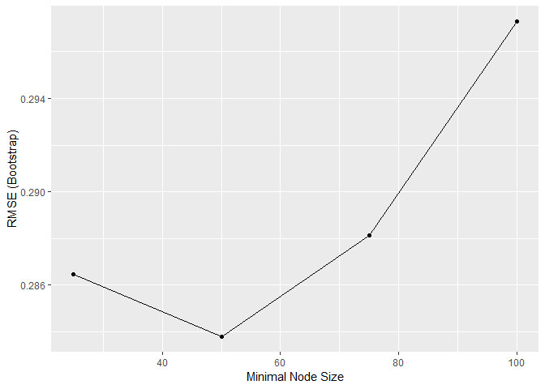
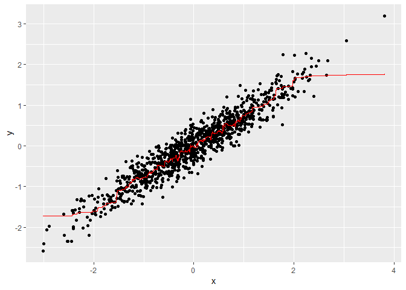
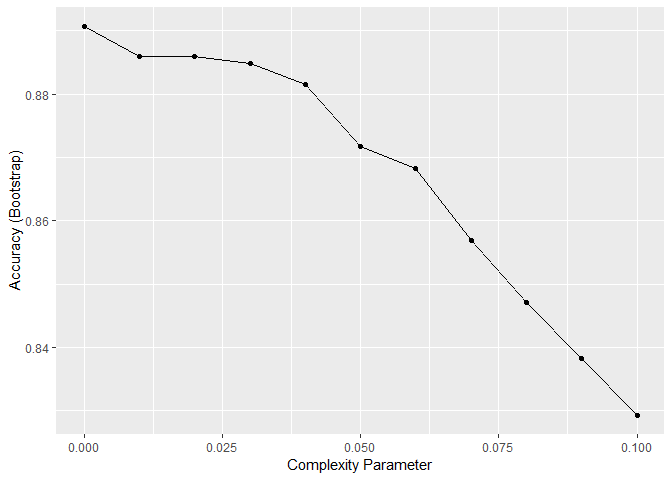
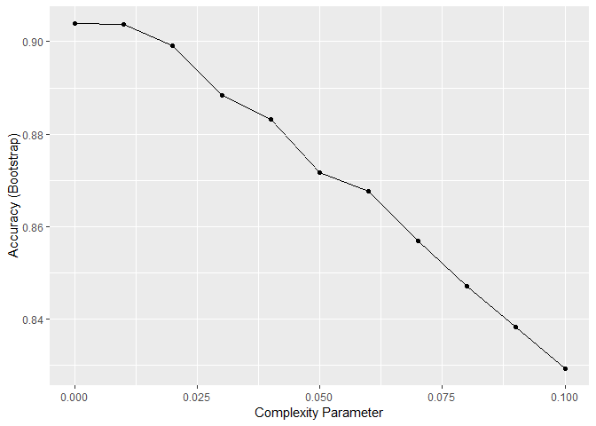
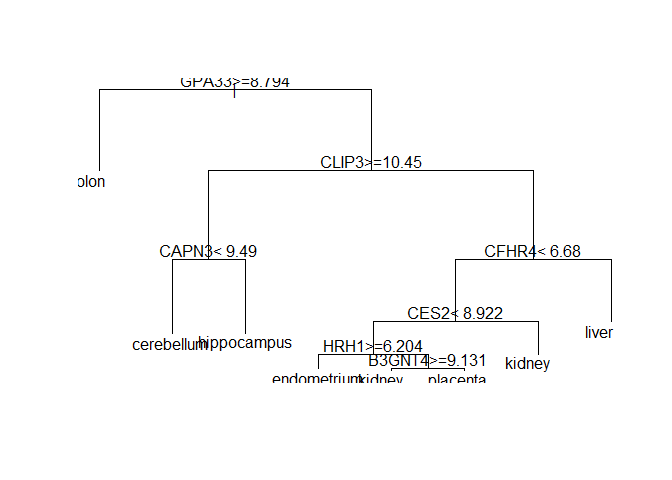
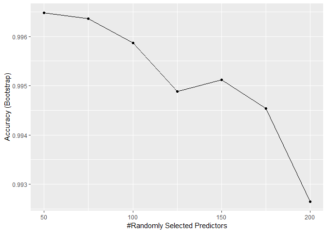

Comprehension Check: Caret Package
================

Q1
--

In the exercise in Q6 from Comprehension Check: Trees and Random Forests, we saw that changing nodesize to 50 and setting maxnodes to 25 yielded smoother results. Let's use the train function to help us pick what the values of nodesize and maxnodes should be.

From the caret description of methods, we see that we can't tune the maxnodes parameter or the nodesize argument with randomForests. So we will use the **Rborist** package and tune the minNode argument. Use the train function to try values minNode &lt;- seq(25, 100, 25). Set the seed to 1.

Which value minimizes the estimated RMSE?

``` r
library(randomForest)
```

    ## randomForest 4.6-14

    ## Type rfNews() to see new features/changes/bug fixes.

``` r
library(Rborist)
```

    ## Rborist 0.1-17

    ## Type RboristNews() to see new features/changes/bug fixes.

``` r
library(dslabs)
library(rpart)
library(caret)
```

    ## Loading required package: lattice

    ## Loading required package: ggplot2

    ## Registered S3 methods overwritten by 'ggplot2':
    ##   method         from 
    ##   [.quosures     rlang
    ##   c.quosures     rlang
    ##   print.quosures rlang

    ## 
    ## Attaching package: 'ggplot2'

    ## The following object is masked from 'package:randomForest':
    ## 
    ##     margin

``` r
library(tidyverse)
```

    ## Registered S3 method overwritten by 'rvest':
    ##   method            from
    ##   read_xml.response xml2

    ## -- Attaching packages ---------------------------------------------------------------------------------------------------------------------- tidyverse 1.2.1 --

    ## v tibble  2.1.1       v purrr   0.3.2  
    ## v tidyr   0.8.3       v dplyr   0.8.0.1
    ## v readr   1.3.1       v stringr 1.4.0  
    ## v tibble  2.1.1       v forcats 0.4.0

    ## -- Conflicts ------------------------------------------------------------------------------------------------------------------------- tidyverse_conflicts() --
    ## x dplyr::combine()  masks randomForest::combine()
    ## x dplyr::filter()   masks stats::filter()
    ## x dplyr::lag()      masks stats::lag()
    ## x purrr::lift()     masks caret::lift()
    ## x ggplot2::margin() masks randomForest::margin()

``` r
n <- 1000
sigma <- 0.25
set.seed(1)
x <- rnorm(n, 0, 1)
y <- 0.75 * x + rnorm(n, 0, sigma)
dat <- data.frame(x = x, y = y)

grid <- data.frame(minNode = seq(25, 100 , 25), predFixed = 1)
fit <- train(y ~ ., method = "Rborist", tuneGrid = grid , data = dat )
ggplot(fit)
```



Answer: 50

Q2
--

Part of the code to make a scatterplot along with the prediction from the best fitted model is provided below.

``` r
library(caret)
dat %>% 
    mutate(y_hat = predict(fit)) %>% 
    ggplot() +
    geom_point(aes(x, y)) +
    #BLANK
  geom_step(aes(x, y_hat), col = 2)
```



Which code correctly can be used to replace \#BLANK in the code above?

Q3
--

Use the rpart function to fit a classification tree to the tissue\_gene\_expression dataset. Use the train function to estimate the accuracy. Try out cp values of seq(0, 0.1, 0.01). Plot the accuracies to report the results of the best model. Set the seed to 1991.

Which value of cp gives the highest accuracy?

``` r
set.seed(1991)
data("tissue_gene_expression")
    
fit <- with(tissue_gene_expression, 
                train(x, y, method = "rpart",
                      tuneGrid = data.frame(cp = seq(0, 0.1, 0.01))))
    
ggplot(fit)       
```



Answer 0

Q4
--

Study the confusion matrix for the best fitting classification tree from the exercise in Q3.

What do you observe happening for the placenta samples? Answer: Placenta samples are being classified somewhat evenly across tissues.

Explanation: confusionMatrix(fit) will show the confusion matrix for the classification tree from the tissue gene expression dataset. Looking at the confusion matrix, you can see that placenta is classified somewhat evenly across different tissue types, and in fact, placentas are called endometriums more frequently than they are called placentas.

``` r
confusionMatrix(fit)
```

    ## Bootstrapped (25 reps) Confusion Matrix 
    ## 
    ## (entries are percentual average cell counts across resamples)
    ##  
    ##              Reference
    ## Prediction    cerebellum colon endometrium hippocampus kidney liver
    ##   cerebellum        17.7   0.0         0.3         0.6    0.6   0.2
    ##   colon              0.1  18.0         0.1         0.1    0.0   0.0
    ##   endometrium        0.3   0.1         6.3         0.2    0.8   0.1
    ##   hippocampus        0.6   0.0         0.1        14.8    0.1   0.1
    ##   kidney             0.2   0.2         1.4         0.2   18.1   0.5
    ##   liver              0.0   0.1         0.1         0.1    0.5  13.3
    ##   placenta           0.6   0.0         0.3         0.2    0.5   0.0
    ##              Reference
    ## Prediction    placenta
    ##   cerebellum       0.0
    ##   colon            0.0
    ##   endometrium      1.4
    ##   hippocampus      0.0
    ##   kidney           0.6
    ##   liver            0.1
    ##   placenta         0.9
    ##                             
    ##  Accuracy (average) : 0.8902

Q5
--

Note that there are only 6 placentas in the dataset. By default, rpart requires 20 observations before splitting a node. That means that it is difficult to have a node in which placentas are the majority. Rerun the analysis you did in the exercise in Q3, but this time, allow rpart to split any node by using the argument control = rpart.control(minsplit = 0). Look at the confusion matrix again to determine whether the accuracy increases. Again, set the seed to 1991.

What is the accuracy now?

``` r
set.seed(1991)
data("tissue_gene_expression")
control = rpart.control(minsplit = 0)
fit <- with(tissue_gene_expression, 
                train(x, y, method = "rpart",
                      tuneGrid = data.frame(cp = seq(0, 0.1, 0.01)),control = control))
    
ggplot(fit) 
```



``` r
confusionMatrix(fit)
```

    ## Bootstrapped (25 reps) Confusion Matrix 
    ## 
    ## (entries are percentual average cell counts across resamples)
    ##  
    ##              Reference
    ## Prediction    cerebellum colon endometrium hippocampus kidney liver
    ##   cerebellum        18.1   0.0         0.2         0.8    0.8   0.2
    ##   colon              0.1  18.0         0.2         0.1    0.0   0.1
    ##   endometrium        0.3   0.1         6.3         0.2    0.5   0.1
    ##   hippocampus        0.6   0.0         0.1        14.8    0.1   0.1
    ##   kidney             0.2   0.2         1.2         0.2   18.0   0.4
    ##   liver              0.0   0.1         0.1         0.1    0.5  13.3
    ##   placenta           0.2   0.0         0.5         0.1    0.6   0.0
    ##              Reference
    ## Prediction    placenta
    ##   cerebellum       0.0
    ##   colon            0.0
    ##   endometrium      0.6
    ##   hippocampus      0.0
    ##   kidney           0.5
    ##   liver            0.1
    ##   placenta         1.9
    ##                            
    ##  Accuracy (average) : 0.903

Answer Expected : 0.9141

Q6
--

Plot the tree from the best fitting model of the analysis you ran in Q5.

Which gene is at the first split?

``` r
plot(fit$finalModel)
text(fit$finalModel)
```



Answer: GPA33

Q7
--

We can see that with just seven genes, we are able to predict the tissue type. Now let's see if we can predict the tissue type with even fewer genes using a Random Forest. Use the train function and the rf method to train a Random Forest. Try out values of mtry ranging from seq(50, 200, 25) (you can also explore other values on your own). What mtry value maximizes accuracy? To permit small nodesize to grow as we did with the classification trees, use the following argument: nodesize = 1.

Note: This exercise will take some time to run. If you want to test out your code first, try using smaller values with ntree. Set the seed to 1991 again.

What value of mtry maximizes accuracy? Answer 100

``` r
set.seed(1991)
library(randomForest)
fit <- with(tissue_gene_expression, 
                train(x, y, method = "rf", 
                      nodesize = 1,
                      tuneGrid = data.frame(mtry = seq(50, 200, 25))))
    
ggplot(fit)
```



8
-

Use the function varImp on the output of train and save it to an object called imp.

``` r
imp <- varImp(fit)#BLANK
imp
```

    ## rf variable importance
    ## 
    ##   only 20 most important variables shown (out of 500)
    ## 
    ##          Overall
    ## GPA33     100.00
    ## BIN1       61.80
    ## CLIP3      57.77
    ## KIF2C      54.98
    ## GPM6B      51.52
    ## COLGALT2   48.15
    ## DOCK4      37.79
    ## GTF2IRD1   37.43
    ## SHANK2     35.74
    ## SUSD6      35.53
    ## CFHR4      33.87
    ## KCTD2      33.73
    ## H2AFY      33.65
    ## FCN3       33.04
    ## TFR2       32.74
    ## CEP55      32.10
    ## RARRES2    31.69
    ## CELSR2     31.03
    ## TCN2       30.36
    ## SKP1       29.40

What should replace \#BLANK in the code above?

Q9
--

The rpart model we ran above produced a tree that used just seven predictors. Extracting the predictor names is not straightforward, but can be done. If the output of the call to train was fit\_rpart, we can extract the names like this:

``` r
tree_terms <- as.character(unique(fit$finalModel$frame$var[!(fit$finalModel$frame$var == "<leaf>")]))
tree_terms
```

    ## character(0)

Calculate the variable importance in the Random Forest call for these seven predictors and examine where they rank.

What is the importance of the CFHR4 gene in the Random Forest call? 35 What is the rank of the CFHR4 gene in the Random Forest call? 7

``` r
data_frame(term = rownames(imp$importance), 
            importance = imp$importance$Overall) %>%
    mutate(rank = rank(-importance)) %>% arrange(desc(importance)) %>%
    filter(term %in% tree_terms)
```

    ## Warning: `data_frame()` is deprecated, use `tibble()`.
    ## This warning is displayed once per session.

    ## # A tibble: 0 x 3
    ## # ... with 3 variables: term <chr>, importance <dbl>, rank <dbl>
