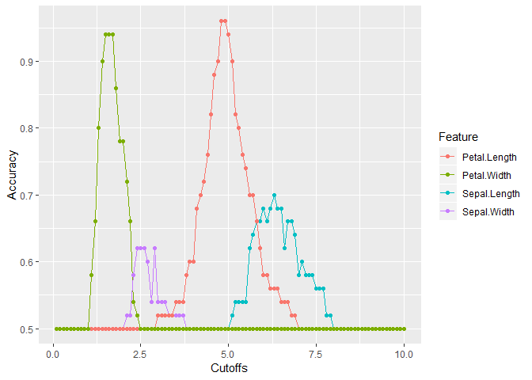
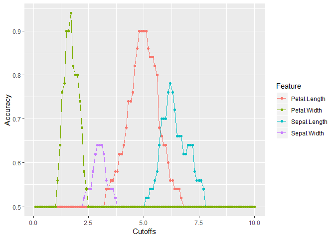

Comprehension Check: Practice with Machine Learning
================

We will practice building a machine learning algorithm using a new dataset, iris, that provides multiple predictors for us to use to train. To start, we will remove the setosa species and we will focus on the versicolor and virginica iris species using the following code:

``` r
library(caret)
```

    ## Warning: package 'caret' was built under R version 3.5.3

    ## Loading required package: lattice

    ## Warning: package 'lattice' was built under R version 3.5.2

    ## Loading required package: ggplot2

``` r
library(purrr)
```

    ## 
    ## Attaching package: 'purrr'

    ## The following object is masked from 'package:caret':
    ## 
    ##     lift

``` r
library(tidyverse)
```

    ## Warning: package 'tidyverse' was built under R version 3.5.2

    ## -- Attaching packages ------------------------------------------------------------------------------ tidyverse 1.2.1 --

    ## v tibble  1.4.2     v dplyr   0.7.6
    ## v tidyr   0.8.1     v stringr 1.3.1
    ## v readr   1.1.1     v forcats 0.3.0

    ## -- Conflicts --------------------------------------------------------------------------------- tidyverse_conflicts() --
    ## x dplyr::filter() masks stats::filter()
    ## x dplyr::lag()    masks stats::lag()
    ## x purrr::lift()   masks caret::lift()

``` r
data(iris)
iris <- iris[-which(iris$Species=='setosa'),]
y <- iris$Species
```

The following questions all involve work with this dataset.

Q1
--

First let us create an even split of the data into train and test partitions using createDataPartition. The code with a missing line is given below:

``` r
set.seed(2)
# missing line of code
test_index <- createDataPartition(y,times=1,p=0.5,list=FALSE)
```

    ## Warning in createDataPartition(y, times = 1, p = 0.5, list = FALSE): Some
    ## classes have no records ( setosa ) and these will be ignored

``` r
# missing line of code
test <- iris[test_index,]
train <- iris[-test_index,]
```

Which code should be used in place of \# line of code above?

Q2
--

Next we will figure out the singular feature in the dataset that yields the greatest overall accuracy. You can use the code from the introduction and from Q1 to start your analysis.

Using only the train iris dataset, for each feature, perform a simple search to find the cutoff that produces the highest accuracy. Use the seq function over the range of each feature by intervals of 0.1 for this search Which feature produces the highest accuracy?

types &lt;- dat %&gt;% distinct(type) types\_cutoff &lt;- map\_df(types$type, function(x){  y\_hat &lt;- ifelse(dat$type == x, "Female", "Male") %&gt;% factor(levels = c("Female", "Male")) list(method = "Type cutoff", FPR = specificity(y\_hat,factor(dat*s**e**x*)), *T**P**R* = *s**e**n**s**i**t**i**v**i**t**y*(*y*<sub>*h*</sub>*a**t*, *f**a**c**t**o**r*(*d**a**t*sex))) })

``` r
cutoffs <- seq(from =0.1,to = 10,.1)
features <- colnames(train[,-5])
accuracy_df <- data.frame()


for(feature in features){
    accuracy <- map_dbl(cutoffs, function(x){
    currentColumn <- train[,feature]
    y_hat <- ifelse(x > currentColumn,"versicolor", "virginica" )
    mean(y_hat == train$Species)
  })
    
  if(nrow(accuracy_df) == 0){
    accuracy_df <- data.frame(accuracy)
    colnames(accuracy_df) <- feature
  }else{
    accuracy_df[feature] <- accuracy
  }
    
}
head(accuracy_df)
```

    ##   Sepal.Length Sepal.Width Petal.Length Petal.Width
    ## 1          0.5         0.5          0.5         0.5
    ## 2          0.5         0.5          0.5         0.5
    ## 3          0.5         0.5          0.5         0.5
    ## 4          0.5         0.5          0.5         0.5
    ## 5          0.5         0.5          0.5         0.5
    ## 6          0.5         0.5          0.5         0.5

Changing data to tidy format and plotting it

``` r
temp <- accuracy_df
temp["Cutoffs"] <- cutoffs
temp["Species"] <- train$Species
temp <- temp %>% gather("Feature",c(Cutoffs,Species), features)
colnames(temp)[4] <- "Accuracy"

ggplot(
  data = temp,
  aes(x = Cutoffs,
      y = Accuracy,
      color = Feature)
) + 
  geom_line() +
  geom_point()
```



From the plot we can see that Petal.Length feature is the one with the biggest accuracy

``` r
max_petal.length <- max(accuracy_df$Petal.Length)
max_petal.width <- max(accuracy_df$Petal.Width)
max_sepal.length <- max(accuracy_df$Sepal.Length)
max_sepal.width <- max(accuracy_df$Sepal.Width) 

sprintf ("Max Petal Length: %f", max_petal.length )
```

    ## [1] "Max Petal Length: 0.960000"

``` r
sprintf ("Max Petal Width: %f", max_petal.width )
```

    ## [1] "Max Petal Width: 0.940000"

``` r
sprintf ("Max Sepal Length: %f", max_sepal.length )
```

    ## [1] "Max Sepal Length: 0.700000"

``` r
sprintf ("Max Sepal Length: %f", max_sepal.width )
```

    ## [1] "Max Sepal Length: 0.620000"

Q3
--

Using the smart cutoff value calculated on the training data from Q2, what is the overall accuracy in the test data? accuracy &lt;- map\_dbl(cutoffs, function(x){ currentColumn &lt;- train\[,feature\] y\_hat &lt;- ifelse(x &gt; currentColumn,"versicolor", "virginica" ) mean(y\_hat == train$Species) })

``` r
petal_length_smart_cutoffs <- temp[which(temp$Accuracy == 0.96),]

accuracy <- map_dbl(petal_length_smart_cutoffs$Cutoffs, function(x){
  y_hat <- ifelse(x > test$Petal.Length, "versicolor", "virginica")
  mean(y_hat == test$Species)
})

accuracy
```

    ## [1] 0.9 0.9

The accuracy is 0.9

Q4
--

Notice that we had an overall accuracy greater than 96% in the training data, but the overall accuracy was lower in the test data. This can happen often if we overtrain. In fact, it could be the case that a single feature is not the best choice. For example, a combination of features might be optimal. Using a single feature and optimizing the cutoff as we did on our training data can lead to **overfitting.**

Given that we know the test data, we can treat it like we did our training data to see if the same feature with a different cutoff will optimize our predictions. Which feature best optimizes our overall accuracy?

``` r
cutoffs <- seq(from =0.1,to = 10,.1)
features <- colnames(train[,-5])
accuracy_df <- data.frame()


for(feature in features){
    accuracy <- map_dbl(cutoffs, function(x){
    currentColumn <- test[,feature]
    y_hat <- ifelse(x > currentColumn,"versicolor", "virginica" )
    mean(y_hat == test$Species)
  })
    
  if(nrow(accuracy_df) == 0){
    accuracy_df <- data.frame(accuracy)
    colnames(accuracy_df) <- feature
  }else{
    accuracy_df[feature] <- accuracy
  }
    
}


temp <- accuracy_df
temp["Cutoffs"] <- cutoffs
temp["Species"] <- test$Species
temp <- temp %>% gather("Feature",c(Cutoffs,Species), features)
colnames(temp)[4] <- "Accuracy"

ggplot(
  data = temp,
  aes(x = Cutoffs,
      y = Accuracy,
      color = Feature)
) + 
  geom_line() +
  geom_point()
```



Answer: Petal.Width

``` r
max_petal.length <- max(accuracy_df$Petal.Length)
max_petal.width <- max(accuracy_df$Petal.Width)
max_sepal.length <- max(accuracy_df$Sepal.Length)
max_sepal.width <- max(accuracy_df$Sepal.Width) 

sprintf ("Max Petal Length: %f", max_petal.length )
```

    ## [1] "Max Petal Length: 0.900000"

``` r
sprintf ("Max Petal Width: %f", max_petal.width )
```

    ## [1] "Max Petal Width: 0.940000"

``` r
sprintf ("Max Sepal Length: %f", max_sepal.length )
```

    ## [1] "Max Sepal Length: 0.780000"

``` r
sprintf ("Max Sepal Length: %f", max_sepal.width )
```

    ## [1] "Max Sepal Length: 0.640000"

``` r
petal_width_smart_cutoff <- temp[which(temp$Accuracy == 0.94),]
```

Q5
--

Now we will perform some exploratory data analysis on the data.

Notice that Petal.Length and Petal.Width in combination could potentially be more information than either feature alone.

Optimize the combination of the cutoffs for Petal.Length and Petal.Width in the train data and report the overall accuracy when applied to the test dataset. For simplicity, create a rule that if either the length OR the width is greater than the length cutoff or the width cutoff then virginica or versicolor is called. (Note, the F1 will be similarly high in this example.) What is the overall accuracy for the test data now?

``` r
petalLengthRange <- range(train[,3])
petalWidthRange <- range(train[,4])

petalLengthRange <- seq(petalLengthRange[1],petalLengthRange[2],by=0.1)
petalWidthRange <- seq(petalWidthRange[1],petalWidthRange[2],by=0.1)

cutoffs <- expand.grid(petalLengthRange, petalWidthRange)

rowId <- sapply(seq(nrow(cutoffs)), function(i){
  y_hat <- ifelse(train$Petal.Length > cutoffs[i,1] | train$Petal.Width > cutoffs[i,2],'virginica','versicolor')
  mean(y_hat == train$Species)
}) %>% which.max

#219
optimalCutoff <- cutoffs[rowId,] %>% as.numeric

y_hat <- ifelse(test$Petal.Length > optimalCutoff[1] & test$Petal.Width > optimalCutoff[2], 'virginica','versicolor')
mean(y_hat == test$Species)
```

    ## [1] 0.92

Answer = 0.92
