## Distance, Knn, Cross Validation, and Generative Models

In the Distance, kNN, Cross Validation, and Generative Models section, you will learn about different types of discriminative and generative approaches for machine learning algorithms.  

After completing this section, you will be able to:

    * Use the k-nearest neighbors (kNN) algorithm.
    * Understand the problems of overtraining and oversmoothing.
    * Use cross-validation to reduce the true error and the apparent error. 
    * Use generative models such as naive Bayes, quadratic discriminant analysis (qda), and linear discriminant analysis (lda) for machine learning.

## Distance

The concept of distance is quite intuitive. For example, when we cluster animals into subgroups, reptiles, amphibians, mammals, we're implicitly defining a distance that permits us to say what animals are close to each other.
Many machine learning techniques rely on being able to define distance between observations using features or predictors. As a review, let's define the distance between two points, A and B, on the Cartesian plane, like these two.


The Euclidean distance between AB is simply given by this formula.

$$
dist(A,B) = \sqrt{(A_x - B_x)^2 + (A_y - B_y)^2}
$$

Note that this definition applies to the case of one dimension. In which case, the distance between two numbers
is simply the absolute value of their difference. So if our two one dimensional numbers are A and B, the distance is simply this, which turns into the absolute value.

$$
dist(A,B) = \sqrt{(A - B)^2} = |A - B|
$$

In an earlier video, we introduced a training data set with feature matrix measurements of 784 features. For illustrative purposes, we look at random samples of 2s and 7s. We can generate this data set using this piece of code.

```{r}
library(dslabs)
library(tidyverse)
set.seed(0)
if(!exists("mnist")) mnist <- read_mnist()
ind <- which(mnist$train$labels %in% c(2,7)) %>% sample(500)
x <- mnist$train$images[ind,] # predictors
y <- mnist$train$labels[ind] # labels

```


The predictors are on x and the labels are on y. For the purposes of, for example, smoothing, we're interested in describing distances between observations. In this case, digits. Later, for the purposes of selecting features,
we might also be interested in finding pixels that behave similar across samples. Now, to define distance, we need to know what points are, since mathematical distance is computed between two points. With high dimensional data, points are no longer on the Cartesian plane. Instead, points are higher dimensional. We can no longer visualize them and need to think abstractly. For example, in our digits example, a predictor, $x_i$, is defined as a point in 784 dimensional space.

$$
X_i = (x_{i,1}, \dots,x_{i,784})^T
$$


We can write it out like this. Once we define points this way, the Euclidean distance is defined very similar as it was for the two dimensional case. For instance, the distance between observations 1 and 2 is given by this formula.

$$
dist(1,2) = \sqrt{\Sigma_{j=1}^{784} (x_{1,j} - x_{2,j})^2}
$$

Note that this is a non-negative number, just as it is for the two dimensions. So any two observations, there's a distance and it's just one number. OK. Now let's look at an example. Let's look at the first three observations. Let's look at their labels.

```{r}
y[1:3]
```

This is a 7, a 7, and a 2. The vector of predictors for each of these observations
are going to be saved in these three objects.

```{r}
x_1 <- x[1,]
x_2 <- x[2,]
x_3 <- x[3,]
```

Now let's look at the distances. And remember, the first two numbers are a 7 and the third one is a 2. We expect the distances between the same number, like this,

```{r}
sqrt(sum((x_1-x_2)^2))
```

to be smaller than between different numbers. And that's what happens.
We can see it here.

```{r}
sqrt(sum((x_1 - x_3)^2))
sqrt(sum((x_2 - x_3)^2))

```


As expected, the 7s are closer to each other. Now, if you know matrix algebra, note that a faster way to compute
this is using the cross-product. So we can actually type this. 

```{r}
sqrt(crossprod(x_1-x_2))
sqrt(crossprod(x_1-x_3))
sqrt(crossprod(x_2-x_3))
```


**We can also compute all the distances between all the observations at once relatively quickly using the function, dist.** If you feed it a matrix, the dist function computes the distance between each row and produces an object of class dist. Here's the code demonstrating this.

```{r}
d <- dist(x)
class(d)
```


Now there are several machine learning-related functions in R that take objects of class dist as input. But to access the entries using row and column indices, we need to coerce this object into a matrix. We can do this like this.

```{r}
as.matrix(d)[1:3,1:3]
```


If we look at the first three entries, we can see that the distances that we calculated match what the function, dist, calculates. We can also quickly see an image of these distances using the image function. So we type this.

```{r}
image(as.matrix(d))
```


We see a visual representation of the distance between every pair of observations.
If we order that distances by labels, we can see that, in general, the 2s are closer to each other
and the 7s are closer to each other. We can achieve this using this code.

```{r}
image(as.matrix(d)[order(y), order(y)])
```


Those red squares demonstrate that digits that are the same are closer to each other.But another thing that comes out of this plot is that there appears to be more uniformity in how the 7s are drawn since they appear to be closer. It's more red up there. Now, we can also compute distance between predictors. If N is the number of observations, the distance between two predictors,say the first and the second, can be computed like this.

$$
dist(1,2) = \sqrt{\Sigma_{i=1}^N (x_{i,1}-x_{i,2})^2}
$$

To compute the distance between all pairs of the 784 predictors,we can transpose the matrix first and then use the dist function. We can write this code.

```{r}
d <- dist(t(x))
dim(as.matrix(d))
```


Note that the dimension of the resulting distance matrix is a 784 by 784 matrix.
An interesting thing to note here is that, if we pick a predictor, a pixel,
we can see which pixels are close, meaning
that they are either ink together or they don't have ink together.
So as an example, let's just look at the 492nd pixel
and let's look at the distances between each pixel and the 492nd pixel.
Here is what it looks like.

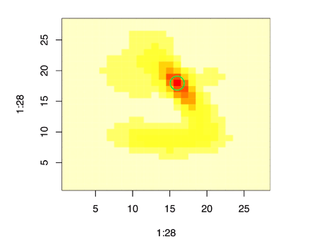

We can see the spatial pattern. Not surprisingly, pixels that are physically close on the image
are actually also close mathematically. So in summary, the concept of distance is important in machine learning. And we will see this as we learn more about specific algorithms. 


## Knn

we will learn our first machine learning algorithm, the **k-nearest neighbors algorithm.** To demonstrate it, we're going to use the digits data with two predictors that we created in a previous video.

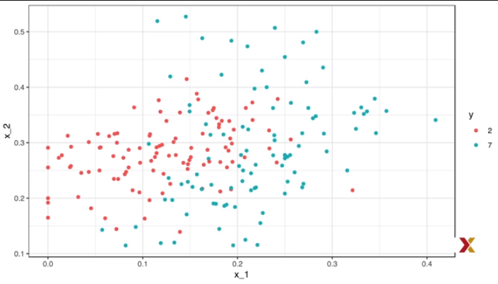

K-nearest neighbors is related to smoothing. To see this, we will think about the conditional probably, the probably of being a seven, y equals 1, given the two predictors.

$$
p(x_1, x_2) = Pr(Y = 1 | X_1 = x_1, X_2 = x_2)
$$

**This is because the zeros and ones we observe are noisy** because some of the regions of the conditional probability
are not close to zero or one, which means that you can go either way sometimes.So we have to estimate the conditional probability. How do we do this? We're going to try **smoothing.**
**K-nearest neighbors is similar to bin smoothing.But it is easier to adapt to multiple dimensions.** We first defined the distance between observations based on the features. Basically, for any point for which you want to estimate the conditional probability, we look at the k-nearest points and then take an average of these points. We refer to the set of points used to compute the average as a neighborhood. Due to the connection we described earlier between conditional expectations and conditional probabilities, this gives us the **estimated conditional probability**, $\hat{p}(x_1,x_2)$, just like bin smoothers gave us an estimated trend.  

**We can control, flexibility of our estimate through k. Larger Ks result in smaller estimates, while smaller Ks result in more flexible and more wiggly estimates.** So let's implement k-nearest neighbors. We're going to compare it to logistic regression, which will be the standard we need to beat. We can write this code to compute the glm predictions. 

```{r}
library(caret)
fit_glm <- glm(y ~ x_1 + x_2, data=mnist_27$train, family="binomial")
p_hat_logistic <- predict(fit_glm, mnist_27$test)
y_hat_logistic <- factor(ifelse(p_hat_logistic > 0.5, 7,2))
confusionMatrix(data = y_hat_logistic, reference=mnist_27$test$y)$overall[1]
```


And notice that we have an accuracy of **0.76**. Now let's compare this to knn. We will use the **function knn3** which comes with the caret package. If we look at the help file of this package,
```{r}
?knn3
```

we see that we can call it in one of two ways. **In the first, we specify a formula and a data frame.** The data frame contains all the data to be used. The formula has the form outcome tilde predictor 1 plus predictor 1 plus predictor 3 and so on.

    outcome ~ predictor_1 + predictor_2 + predictor_3 + ..
    
So in this m where we only have two predictors, we would type y-- those are the outcomes-- tilde x1 plus x2. $y \sim x_1 + x_2$
But if we're going to use all the predictors, we can use a shortcut, and it's the dot. $y \sim $ . ,We would type y tilde dot. And that says use all the predictors. So the call to knn3 looks simply like this.

```{r}
knn_fit <- knn3(y ~ ., data = mnist_27$train)
```


**The second way to call this function is that the first argument being the matrix predictors and the second, a vector of outcomes.** So the code would look like this instead. We would define our matrix with the predictors. Then when we would define a vector with the outcomes. And then we would call it simply like this.

```{r}
x <- as.matrix(mnist_27$train[,2:3])
y <- mnist_27$train$y
knn_fit <- knn3(x,y)
```

The reason we have two ways of doing this is because the formula is a quicker, simpler way to write it when we're in a hurry.
But once we face large data sets, we will want to use the matrix approach, the second approach.  

All right, now, for this function, we also need to pick a parameter, **the number of neighbors to include**. Let's start with **the default, which is k equals 5.** We can write it explicitly like this.

```{r}
knn_fit <- knn3(y ~ . , data = mnist_27$train, k = 5)
```

**Because this data set is balanced-- there's many twos as there are sevens-- and we care just as much about sensitivity as we do about specificity-- both mistakes are equally bad-- we will use accuracy to quantify performance. The predict function for this knn function produces either a probability for each class, or it could actually produce the outcome that maximizes the probability, the outcome with the highest probability.**


So we're going to use the code predict, the fitted object,
the new data that we're predicting for.

```{r}
y_hat_knn <- predict(knn_fit, mnist_27$test, type = "class")
```


That's the test data set. And then we're going to type, type equals class. This will give us the actual outcomes that are predicted. So once we have this, we can compute our accuracy using the confusion matrix formula like this.

```{r}
confusionMatrix(data = y_hat_knn, reference = mnist_27$test$y)$overall["Accuracy"]
```

**And we see that we already have an improvement over the logistic regression. Our accuracy is 0.815.**


## Overtraining and Oversmoothing

Now to see why we improved over logistic regression in this case that we only have two predictors, we can actually make some visualizations. Here is the true conditional probability on the left.

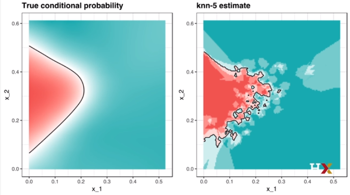

And on the right, you can see the estimate that we obtained with knn with five neighbors. So you see that the estimate has the essence of the shape of the true conditional probability. Therefore we do better than logistic regression. However, we can probably do better. Because if you look closely, this estimate, we see some isles of blue in the red areas. Intuitively this does not make much sense. Why are they on their own like that?

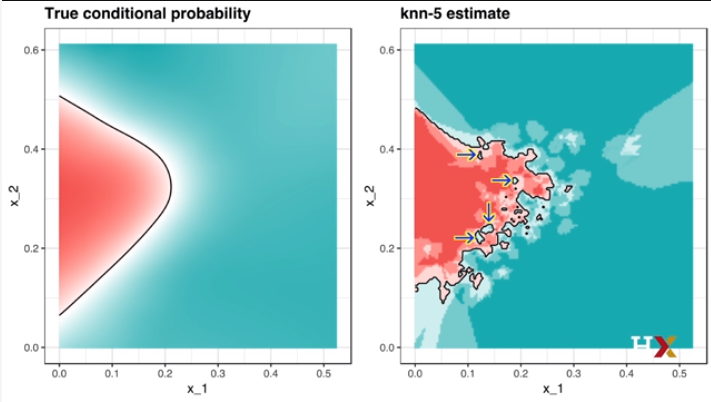

This is due to what we call overtraining. To understand what overtraining is, notice that we have higher accuracy when we predict on a training set than we compare on a test set. We can do it using this code.

```{r}
y_hat_knn <- predict(knn_fit, mnist_27$train, type = "class")
confusionMatrix(data = y_hat_knn,
                reference = mnist_27$train$y)$overall["Accuracy"]
```

```{r}
y_hat_knn <- predict(knn_fit, mnist_27$test, type = "class")
confusionMatrix(data = y_hat_knn,
                reference = mnist_27$test$y)$overall["Accuracy"]
```


You can see that the accuracy computed on the training side is quite higher. It's 0.882 compared to what we get on the test set, which is only 0.815. This is because we overtrained. **Overtraining is at its worst when we set k equals to 1.** With k equals to 1, the estimate for each point in the training set is obtained with just the y corresponding to that
point because you are your closest neighbor. So in this case, we obtain practically perfect accuracy in the training set because each point is used to predict itself.  

Perfect accuracy will occur when we have unique predictors, which we almost
do have here.

```{r}
knn_fit_1 <- knn3(y ~ . , data = mnist_27$train, k = 1)
y_hat_knn_1 <- predict(knn_fit_1, mnist_27$train, type = "class")
confusionMatrix(data = y_hat_knn_1,
                reference = mnist_27$train$y)$overall["Accuracy"]
```

So you can see that when we use a k equals to 1, our accuracy on a training set is 0.995, five almost perfect accuracy. However, when we check on the test set, the accuracy is actually worse than with logistic regression. It's only 0.735.
We can see that using this code.


```{r}
y_hat_knn_1 <- predict(knn_fit_1, mnist_27$test, type="class")
confusionMatrix(data = y_hat_knn_1,
                reference = mnist_27$test$y)$overall["Accuracy"]
```


To see the over-fitting in a figure, we can plot the data and then use contours to show what divides the twos from the sevens.
And this is what you get when you use k equals 1. 

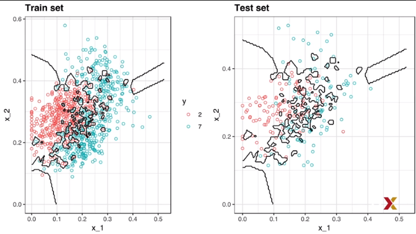

Notice all the little islands that in the training set fit the data perfectly. You'll have this little red point on its own,and a little island will be formed around it so that you get the perfect prediction. But once you look at the test set, that point is gone. There's no red there anymore. Now there's perhaps a blue, and you make a mistake.  

The estimated conditional probability followed the training data too closely. Although it's not as bad, we see this overtraining with k equals 5, or the default. So we should consider a larger k. Let's try an example. Let's try a much larger example. Let's try 401. We can fit the model just by simply changing the k to 401 like this.

```{r}
knn_fit_401 <- knn3(y ~ ., data = mnist_27$train, k=401)
y_hat_knn_401 <- predict(knn_fit_401, mnist_27$test , type = "class")
confusionMatrix(data = y_hat_knn_401, reference = mnist_27$test$y)$overall["Accuracy"]
```


We see that the accuracy on a test set is only 0.79, not very good, a similar accuracy to logistic regression. In fact, the estimates actually look quite similar. On the left is logistic regression. On the right is k-nearest neighbors with k equals 401.

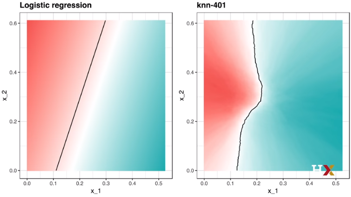

The size of k is so large that it does not permit enough flexibility. We're almost including half the data to compute each single estimated conditional probability. **We call this oversmoothing.** So how do we pick k? Five seems to be too small. 401 seems to be too big. Something in the middle might be better. So what we can do is we can repeat what we just did for different values of k So we can try all the odd numbers between 3 and 251. And we'll do this using the map df function to repeat what we just did for each k. For comparative purposes, we will compute the accuracy by using both training set--
that's incorrect. We shouldn't do that, but just for comparison we're going to do it-- and the test set, which is the correct way to do it. The code looks simply like this.

```{r}
library(purrr)
ks <- seq(3,251,2)
accuracy <- map_df(ks,function(k){
  fit <- knn3(y ~ ., data = mnist_27$train, k = k)
  
  y_hat <- predict(fit, mnist_27$train, type ="class")
  train_error <- confusionMatrix(data =  y_hat, reference = mnist_27$train$y)$overall["Accuracy"]
  
  
  y_hat <- predict(fit, mnist_27$test, type="class")
  test_error <- confusionMatrix(data = y_hat, reference = mnist_27$test$y)$overall["Accuracy"]
  
  list(train = train_error, test = test_error)
  
})
```


Once we run that code, we can now plot the accuracy against the value of k, and that looks like this.

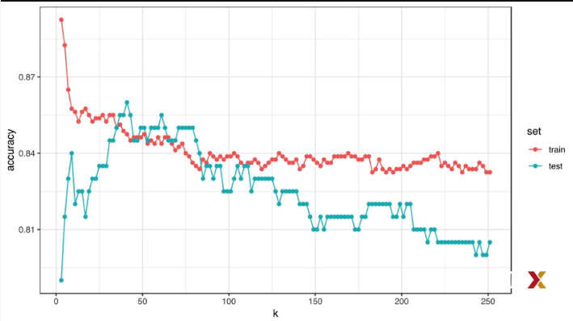

First, note that the accuracy versus k plot is quite jagged. **We don't not expect this because small changes in k should not affect the algorithm's performance too much. The jaggedness is explained by the fact that the accuracy is computed on this sample and therefore is a random variable. This demonstrates why we prefer to minimize the expectation loss, rather than the loss we observe with one dataset.**

We will soon learn a better way of estimating this expected loss. Now, despite the noise present in the plot, we still see a general pattern. Low values of k give low test set accuracy but high train set accuracy, which is evidence of overtraining.
Large values of k result in low accuracy, which is evidence of oversmoothing. The maximum is achieved somewhere between 25 and 41. And the maximum accuracy is 0.85, substantially higher than logistic regression.
In fact, the resulting estimate with k equals to 41 looks quite similar to the true conditional probability,
as we see in this plot.

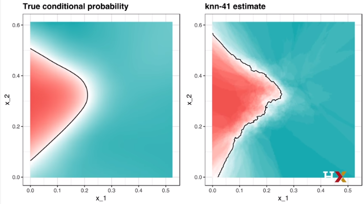

Now, is an accuracy of 0.85 what we should expect if we apply this algorithm in the real world? The answer is actually no because we broke a golden rule of machine learning. We selected the k using the test set. So how do we select the k? In the next videos, we introduce the important concept of cross-validation, which provides a way to estimate the expected loss for a given method using only the training set.


## Cross Validation

### k-fold Cross Validation

In previous videos, we've
described how the goal of machine learning
is often to find an algorithm that produces
predictors, y hat for an outcome y, that minimizes mean squared error.

$$
MSE = E \{\frac{1}{N} \Sigma_{i=1}^N (\hat{Y}_i - Y_i)^2  \}
$$

When all we have to our disposal is one data set,
we can estimate the mean squared error with the observed mean squared
error like this.

$$
\hat{MSE} = \frac{1}{N} \Sigma_{i=1}^N (\hat{y}_i - y_i)^2  
$$


** These two quantities are often referred to as a true error and the apparent error respectively.There are two important characteristics of the apparent error we should always keep in mind**. First, **it is a random variable since our data is random.** For example, the data set we have may be a random sample from a larger population. So an algorithm having lower apparent error than another may be due to luck. Second, **if we train an algorithm on the same data set that we used to compute the apparent error, we might be overtraining.** In general when we do this, the apparent error will be an underestimate of the true error. We saw an extreme example of this with the k-nearest neighbors when we said k equals to 1. Cross-validation is a technique that permits us to alleviate both these problems. There are several approaches. I will go over some of them here.  
To understand cross-validation, it helps to think of the true error, a theoretical quantity, as the average of many, many apparent errors obtained by applying the algorithm to, let's call it, B, new random samples of the data, none of them used to train the algorithm. When we think this way, we can think of the true error as the average of the apparent errors obtained in each of the random samples. The formula would be like this.

$$
\frac{1}{B}\Sigma_{b=1}^B \frac{1}{N}\Sigma_{i=1}^N(\hat{y}_i^b - y_i^b)^2

$$

Here **B a large number that can be thought of as practically infinite.** Now, this is a theoretical quantity because we only get to see one set of outcomes. We don't get to see them over and over again. The idea of cross-validation is to imitate this theoretical setup as best we can with the data that we have. To do this, we have to generate a series of different random samples. There are several approaches to doing this. But the general idea for all of them is to randomly generate smaller data sets that are not used for training and instead are used to estimate the true error. The first one we describe, and the one we focus on in this video, is k-fold cross-validation. Let's describe it. Remember, that generally speaking, a machine learning challenge
starts with a data set. And we need to build an algorithm using this data set that will eventually be used in a completely independent data set. So here we have the data set we have in blue and the independent data set that we'll never see in yellow.

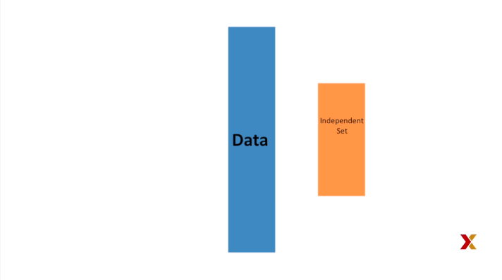


So we don't get to see the yellow, so all we see is the blue.

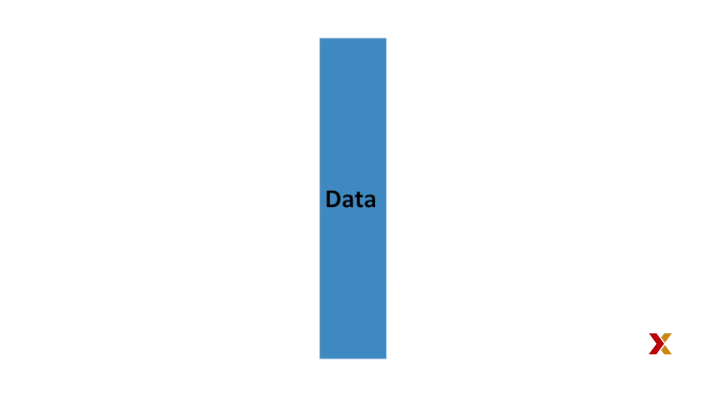

So as we have already described, to imitate the situation, we carve out a piece of our data set and pretend it is an independent data set. We divide the data set into training set, blue, and a test set, red.

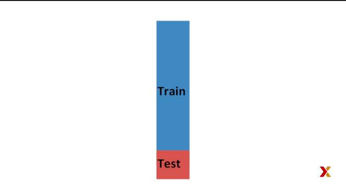

We'll train our algorithm exclusively on the training set and use the test set only for evaluation purposes. We usually try to select a small piece of the data set so we have as much data as possible to train. However, we also want a test set to be large so that we can obtain stable estimates of the loss.
Typical choices to use for the size of the **test that are 10% to 20% of the original data set.** Let's reiterate that it is indispensable that we do not use the test set at all when training our algorithm, not for filtering out rows, not for selecting features, nothing. Now, this presents a new problem.
Because for most machine learning algorithms, we need to select parameters, for example, the number of neighbors k in the k-nearest neighbors algorithm.
Here we'll refer to the set of parameters as lambda ($\lambda$). **So we need to optimize the algorithm parameters lambda without using our test set. And we know that if we optimize and evaluated on the same data set, we will overtrain.** So here is where we use cross-validation. **This is where cross-pollination is most useful.** So let's describe k-fold cross-validation. **For each set of algorithm parameters being considered, we want to estimate the MSE. And then we will choose the parameters with the smallest MSE. Cross-validation will provide this estimate**. First, **it is important that before we start the cross-validation procedure we fix all the algorithm parameters. We're computing the MSE for a given parameter.** So as we describe later, we will trained the algorithm on a set of training sets. The parameter lambda will be the same across all these training sets. We'll use the notation y hat i parentheses lambda to denote the prediction obtained when we use a parameter lambda for observation i.

$$
\hat{y}_i(\lambda)
$$

So if we're going to imitate the definition of the expected loss, we could write it like this.

$$
MSE(\lambda) = \frac{1}{B}\Sigma_{b=1}^B \frac{1}{N}\Sigma_{i=1}^N(\hat{y}_i^b(\lambda) - y_i^b)^2
$$

It is the average over B samples that we've taken of the MSE that we obtain on the data separated out as a test set. For this formula, we want to consider data sets that can be thought of as independent random samples. And you'll want to do this several times. With k-fold cross-validation, we do it k times. In the cartoons we're showing, we use as an example k equals 5. We will eventually end up with k samples. But let's start by describing how to construct the first one. We simply pick N divided K rounded to the nearest integer, ** M = N/K**. Let's call that M. So we have M observations that we pick at random
and think of these as a random sample. We could denote them using this equation. And here **b = 1**. It's the first, what we call, fold.
$$
y_1^b, \dots , y_M^b
$$

So here's what it looks like graphically.


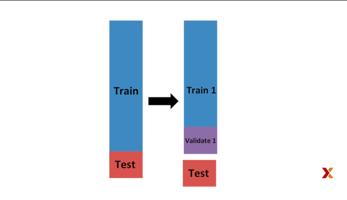

We have our training set. We separate out the test set. And then we take our training set, and we take a small sample of it, which we're going to call the validation set, the first one. And that is where we're going to test. Now we can fit the model in the training set, with the validation set separated out, and compute the apparent error on the independent set like this.


$$
\hat{MSE}_b(\lambda) = \frac{1}{M}\Sigma_{i=1}^M(\hat{y}_i^b(\lambda) -y_i^b)^2
$$

Note that this is just one sample and will therefore return
a noisy estimate of the true error.
This is why we take k sample not just one.
So graphically it would look like this.

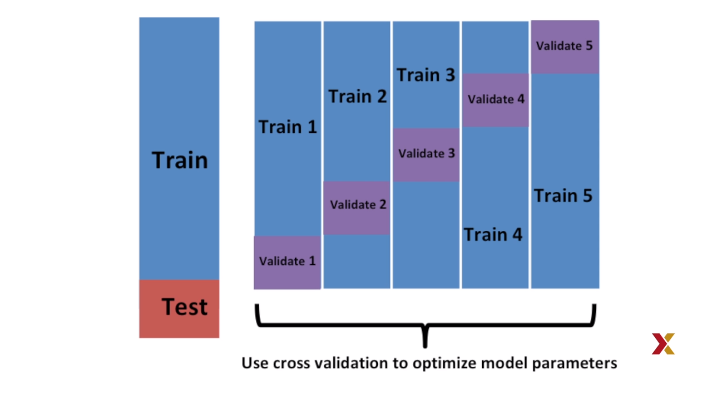

In k-fold cross-validation, we randomly split the observations
into k non-overlapping sets. 
So now we repeat this calculation for each of these sets, b
going from 1 all the way up to k. **b = 1,...,K** So we obtain k estimates of the MSE.

$$
\hat{MSE}_1(\lambda),\dots,\hat{MSE}_k(\lambda)
$$

In our final estimate, we compute the average like this.

$$
\hat{MSE}(\lambda) = \frac{1}{B}\Sigma_{b=1}^K \hat{MSE}_b(\lambda)
$$

And this gives us an estimate of our loss. **A final step would be to select the lambda, the parameters, that minimize the MSE.** So this is how we use cross-validation to optimize parameters. However, now we have to take into account the fact that the optimization occurred on the training data. So we need to compute an estimate of our final algorithm based on data that was not used to optimize this choice.


**And this is why we separated out the test set. That is where we'll compute our final estimate of the MSE. So note that we can do cross-validation again. Note that this is not for optimization purpose. This is simply to know what the MSE of our final algorithm is. So doing this would give us a better estimate.**


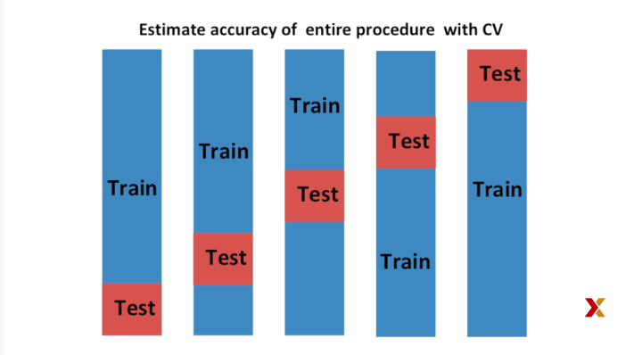

However, note that to do this, we have to go through the entire optimization process k times. You will soon learn that performing machine learning tasks
can take time because we're performing many complex computations. And therefore we're always looking for ways to reduce this. So for the final evaluation, we often just use one test set. We use cross-validation to optimize our algorithm. But once we've optimized it, we're done, and we want to have an idea of what our MSE is, we just use this one last test set.

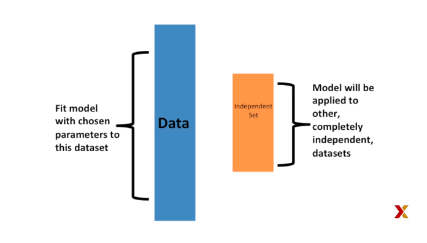

Once we're satisfied with this model, and we want to make it available to others, we could refit the model on the entire data set, but without changing the parameters.  

Now, how do we pick the cross-validation k? We used five in these examples. We could use other numbers. **Large values of k are preferable because the training data better imitate the original data. However, larger values of k will have much lower computation time.** For example, hundred fold cross-validation will be 10 times slower than tenfold cross-validation. For this reason, **the choices of k equals to 5 and 10 are quite popular.** Now, one way we can improve the variance of our final estimate is to take more samples.

To do this, **we would no longer require that training set be partitioned into non-overlapping sets. Instead we would just pick k sets of some size at random.** One popular version of this technique, at each fold, picks observations at random with replacement, which means that the same observation can appear twice. This approach has some advantages not discussed here is generally referred to as the bootstrap approach. In fact, this is the default approach in the caret package. In another video, we'll describe the concept of the bootstrap.

### Bootstrap

We describe the bootstrap. We're going to use a very simple example to do it. Suppose the income distribution of a population is as follows.

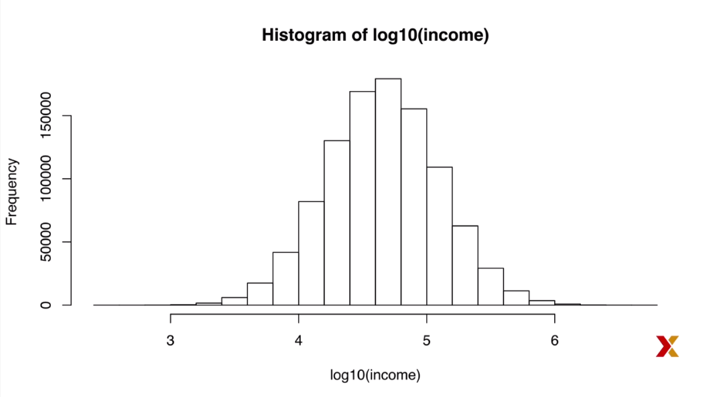


The population median is, in this case, about 45,000.

    m <- meadian(income)
    m
     [1] 45396

Suppose we don't have access to the entire population,
but want to estimate the median, let's call it M. We take a sample of 250
and estimate the population median, M, with the sample medium big M,
like this.

    set.seed(1)
    N <- 250
    X <- sample(income, N)
    M <- median(x)
    M
     [1] 42978

Now, can we construct a confidence interval? What's the distribution of the sample median? From an Monte Carlo simulation, we see that the distribution of the sample median is approximately normal with the following expected value and standard errors. You can see it here.

    B <- 10^5
    Ms <- replicate(B, {
      X < sample(income, N)
      M <- median(X)
    })
    
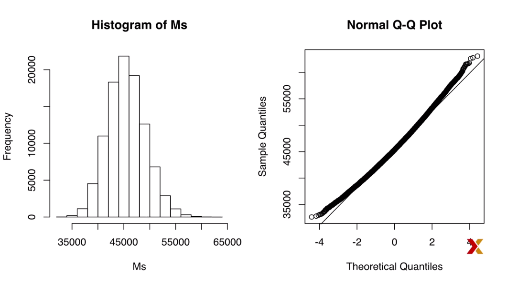

The problem here is that, as we have described before, in practice, we do not have access to the distribution. In the past, **we've used the central limit theorem, but the central limit theorem we studied applies to averages and here we're interested in the median.**  

The bootstrap permits us to approximate a Monte Carlo simulation without access to the entire distribution. The general idea is relatively simple. **We act as if the sample is the entire population and sample with replacement data sets of the same size. Then we compute the summary statistic, in this case, the median,** on what is called the bootstrap sample.  


There is theory telling us that the distribution of the statistic obtained with bootstrap samples approximate the distribution of our actual statistic. This is how we construct bootstrap samples in an approximate distribution. This simple code.

    B <- 10^5
    M_stars <- replicate(B,{
      X_star <- sample(X, N, replace = TRUE)
      M_star <- median(X_star)
    })

Now we can check how close it is to the actual distribution. We can see it's relatively close.

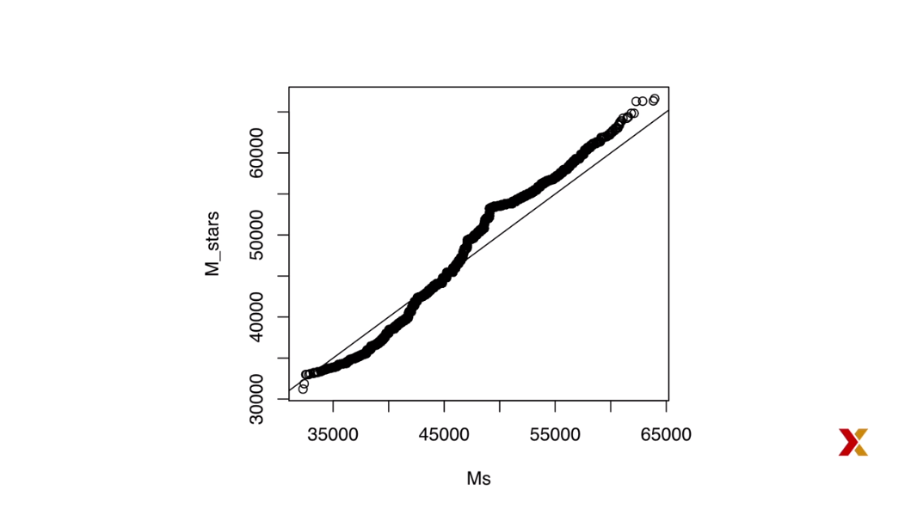

We see it's not perfect, but it provides a decent approximation. In particular, look at the quantities we need to form a 95% confidence interval.

    quantile(Ms, c(0.05,0.95))
    5%      95%
    39837 51763
    
    quantile(M_stars, c(0.05, 0.95))
    5%      95%
    39965 52030


They are quite close. This is much better than what we get if we mindlessly use the central limit
theorem, which would give us this confidence interval, which is entirely wrong.

    median(X) + 1.96 * sd(X)/sqrt(N) * c(-1,1)
     [1] 31564  54392
    
If we know the distribution is normal, we can use a bootstrap to estimate the mean, the standard error, and then form a confidence interval that way.


## Generative Models

###Generative Models

We have described how when using square loss the conditional expectation or probabilities provide the best approach to developing a decision rule. In a binary case, the best we can do is called **Bayes' rule** which is a decision rule based on the true conditional probability, probably y equals one given the predictors x.

$$
p(x) = Pr(Y = 1 | X = x)
$$

We have described several approaches to estimating this conditional probability. **Note that in all these approaches, we estimate the conditional probability directly and do not consider the distribution of the predictors.**
In machine learning, these are referred to as **discriminative approaches.** However, **Bayes' theorem tells us that knowing the distribution of the predictors x may be useful**. Methods that model the joint distribution of y and the predictors x are referred to as **generative models.** We start by describing the most general generative model naive Bayes and then proceed to describe some more specific cases, quadratic discriminant analysis QDA and linear discriminant analysis LDA. Recall that Bayes' theorem tells us that we can rewrite the conditional probability like this with the f's representing the distribution functions of the predictors x for the two classes y equals 1 and when y equals 0. 


$$
p(x) = Pr(Y = 1 | X = x) =

$$

$$
  \frac{f_{X|Y=1}(x)Pr(Y=1)}{f_{X|Y=0Pr(Y=0) + f{X|Y=1(x)Pr(Y=1)}}}
$$


**The formula implies that if we can estimate these conditional distributions, the predictors, we can develop a powerful decision realm. However, this is a big if.**
As we go froward, we will encounter examples in which the predictors x have many dimensions and we do not have much information about their distribution. So it will be very hard to estimate those conditional distributions.
**In these cases, naive Bayes would be practically impossible to implement.** However, there are instances in which we have a small number of predictors, not much more than two, and many categories in which generated models can be quite powerful. We describe two specific examples and use our previously described case study to illustrate them.


### Naive Bayes

Let's start with a very simple and uninteresting, yet illustrative, example.
Predict sex from the height example. We can get the data and generate training and test set using this code.

```{r}
library(caret)
library(dslabs)
library(tidyverse)
data(heights)
y <- heights$height
set.seed(2)
test_index <- createDataPartition(y, times = 1, p = 0.5, list = FALSE)

train_set <- heights %>% slice(-test_index)
test_set <- heights %>% slice(test_index)


```


**In this example, the naive Bayes approach is particularly appropriate. Because we know that the normal distribution is a very good approximation of the conditional distributions of height given sex for both classes, females and males.**
This implies that we can approximate the conditional distributions, $f_{X|Y=1}$ and $f_{X|Y = 0}$  by simply estimating averages and standard deviations from the data with this very simple piece of code, like this. 


```{r}
params <- train_set %>%
  group_by(sex) %>%
  summarize(avg = mean(height), sd = sd(height))
params
```


The prevalence, which we will denote with pi,which is equal to the probability of y equals 1, can be estimated from the data as well like this.

$$
\pi = Pr(Y = 1)
$$

We basically compute the proportion of females. Now we can use our estimates of average and standard deviations
to get the actual rule.

```{r}
pi <- train_set %>%
  summarize(pi = mean(sex == "Female")) %>%
  .$pi
pi
```

We get the conditional distributions, f0 and f1, and then we use Bayes theorem to compute the naive Bayes estimate of the conditional probability.

```{r}
x <- test_set$height

f0 <- dnorm(x, params$avg[2], params$sd[2])
f1 <- dnorm(x, params$avg[1], params$sd[1])

p_hat_bayes <- f1 * pi / (f1*pi + f0*(1-pi))

```


This estimate of the conditional probably looks a lot like a logistic regression estimate, as we can see in this graph. 


In fact, we can show mathematically that the naive Bayes approach is similar to the logistic regression
approach in this particular case. But we're not going to show that derivation here.


### Controlling Prevalence

One nice feature of the Naive Bayes approach is that it includes a parameter to account for differences in prevalence. Using our sample, we estimated the conditional probabilities and the prevalence pi. If we use hats to denote the estimates, we can rewrite the estimate of the conditional probability with this formula.

$$
\hat{p}(x) = \frac{\hat{f}_{X|Y=1}(x)\hat{\pi} }{ \hat{f}_{X|Y=0}(x)(1- \hat{\pi})+\hat{f}_{X|Y=1}(x)\hat{\pi}}
$$

As we discussed, our sample has much lower prevalence than the general population. We only have 23% women. So if we use our rule that the conditional probability has to be bigger than 0.5 to predict females, our accuracy will be affected due to the low sensitivity, which we can see by typing this code.

```{r}
y_hat_bayes <- ifelse(p_hat_bayes > 0.5, "Female", "Male") 
sensitivity(data = factor(y_hat_bayes), reference = factor(test_set$sex))
```
**Note: expected value from course was 0.263** 

Again, this is because the algorithm gives more weight to specificity to account for the low prevalence. You can see that we have very high specificity by typing this code.

```{r}
specificity(data = factor(y_hat_bayes), reference = factor(test_set$sex))
```
**Note: Expected value from the course 0.953**

This is due mainly to the fact that pi hat is substantially less than 0.5, so we tend to predict male more often than female. It makes sense for a machine learning algorithm to do this in our sample because we do have a higher percentage of males. **But if we were to extrapolate this to the general population, our overall accuracy would be affected by the low sensitivity.** The Naive Bayes approach gives us a direct way to correct this, since we can simply force our estimate of pi to be different. So to balance specificity and sensitivity, instead of changing the cutoff in the decision rule, we could simply change pi hat. Here in this code, we changed it to 0.5.


```{r}
p_hat_bayes_unbiased <- f1 * 0.5 / (f1*0.5 + f0*(1-0.5))
y_hat_bayes_unbiased <- ifelse(p_hat_bayes_unbiased > 0.5, "Female", "Male")
```


Now note the difference in sensitivity and the better balance. We can see it using this code.

```{r}
sensitivity(data = factor(y_hat_bayes_unbiased), reference = factor(test_set$sex))
```
**Notes: expected value from the course: 0.712**

This plot shows us that the new rule also gives us a very intuitive cutoff between 66 and 67, which is about the middle of the female and male average heights.

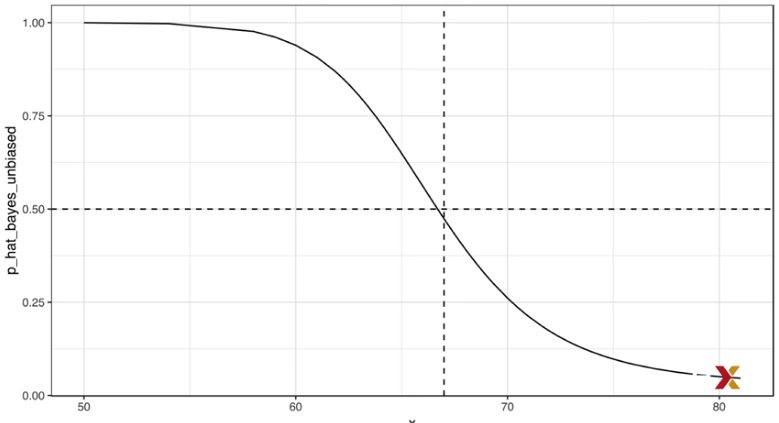

### QDA and LDA

** Quadratic discriminant analysis, or QDA, is a version of Naive Bayes in which we assume that the conditional probabilities for the predictors are multivariate normal.** So the simple example we described in our Naive Bayes video was actually QDA. In this video, we're going to look at a slightly more complicated example where we have two predictors. It's the 2 or 7 example that we've previously seen. We can load it with this code.

```{r}
data("mnist_27")
```

In this case, we have two predictors. So we **assume that their conditional distribution is bivariate normal.** This implies that we need to estimate two averages, two standard deviations, and a correlation for each case, the 7s and the 2s. Once we have these, we can approximate the conditional distributions. 

$$
fX_1,X_2 | Y = 1
$$
$$
fX_1,X_2 | Y = 0
$$


We can easily estimate these parameters from the data using this simple code.

```{r}
params <- mnist_27$train %>%
  group_by(y) %>%
  summarize(avg_1 = mean(x_1), avg_2 = mean(x_2), sd_1 = sd(x_1), sd_2 = sd(x_2), r = cor(x_1,x_2))
params
```


We can also visually demonstrate the approach. 

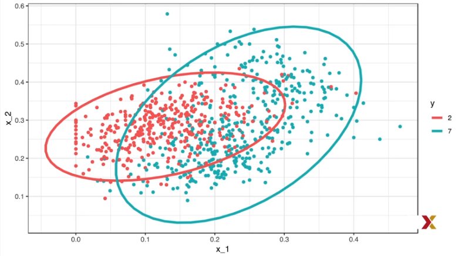


We plot the data and use contour plots to give an idea of what the two estimated normal densities look like. We show a curve representing a region that includes 95% of the points. Once you've estimated these two distributions, this defines an estimate for the conditional probability of y equals 1 given x1 and x2.  

We can the caret package to fit the model and obtain predictors. The code is quite simple and it looks like this.


```{r}
library(caret)
train_qda <- train(y ~ ., method = "qda", data = mnist_27$train)
```


We see that we obtain a relatively good accuracy of 0.82. 

```{r}
y_hat <- predict(train_qda, mnist_27$test)
confusionMatrix(data = y_hat, reference = mnist_27$test$y)$overall["Accuracy"]
```

The estimated conditional probability looks relatively similar to the true distribution, as we can see here.

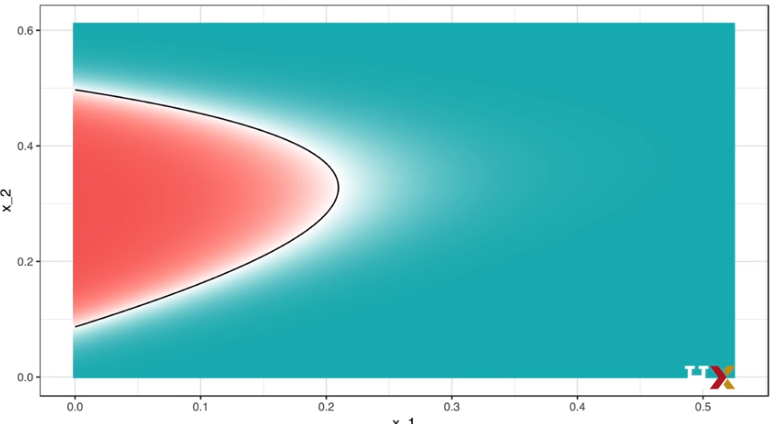

Although the fit is not as good as the one we obtain with kernel smoothers, which we saw in a previous video. And there's a reason for this. The reason is that we can show mathematically that the boundary must be a quadratic function of the form $x_2 = ax_1^2 + bx_1 + c$.


One reason QDA does not work as well as the kernel method is perhaps because the assumption of normality do not quite hold. Although for the 2s, the bivariate normal approximation seems reasonable, for the 7 it does seem to be off.

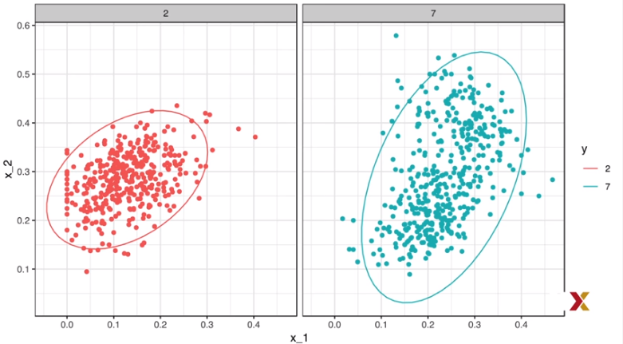

Notice the slight curvature.

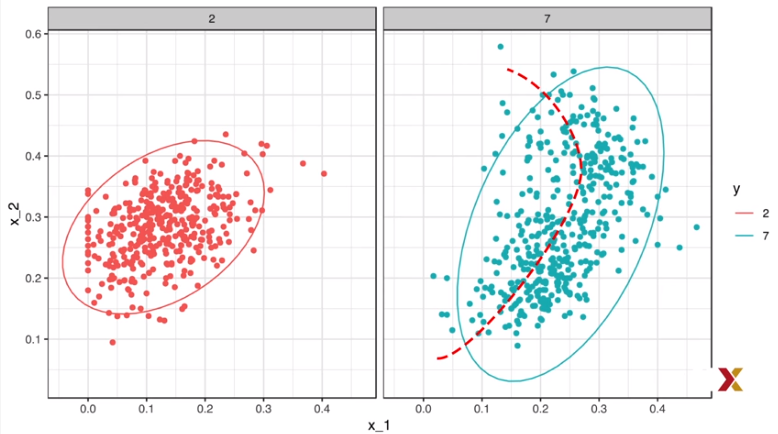

Although QDA work well here, it becomes harder to use as a number of predictors increases. Here we have two predictors and have to compute four means, four standard deviations, and two correlations. **How many parameters would we have to estimate if instead of two predictors we had 10? The main problem comes from estimating correlations for 10 predictors. With 10, we have 45 correlations for each class.**
In general, this formula tells us how many parameters we have to estimate, and **it gets big pretty fast.**

$$
K * (2p + p * (p - 1)/2)
$$

Once the number of parameters approaches the size of our data, the method becomes unpractical due to overfitting.  


One solution to avoid to calculate too many parameters is to assume the correlation structure is the same for all classes, this reduces the number of parameters we need to calculate. so we can calculate pairs of means and sd.


```{r}
params <- mnist_27$train %>%
  group_by(y) %>%
  summarize(avg_1 = mean(x_1), avg_2 = mean(x_2),
            sd_1 = sd(x_1), sd_2 = sd(x_2), r= cor(x_1,x_2))


params <- params %>% mutate(sd_1 = mean(sd_1), sd_2 = mean(sd_2), r= mean(r))
params
```

Now the conditional distribution looks like this:

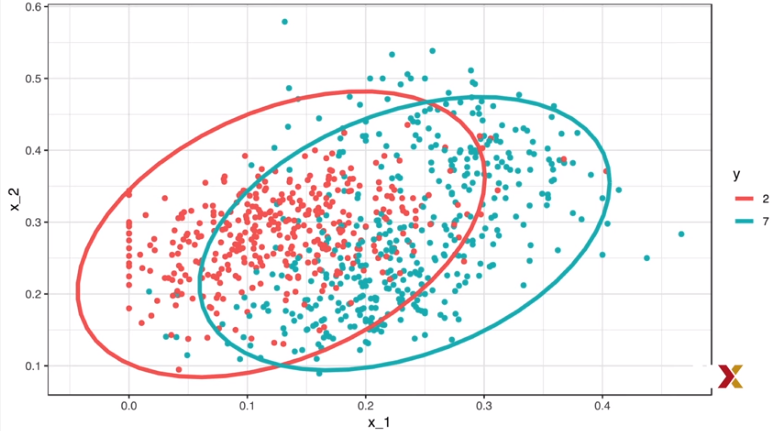

**This is because they have the same sd and correltations, due to the assumtpion.When we force this assumptions we can show that the boundary is a line, just like logistic regression.for this reason, we call this process Linear discriminant Analysis (LDA)**

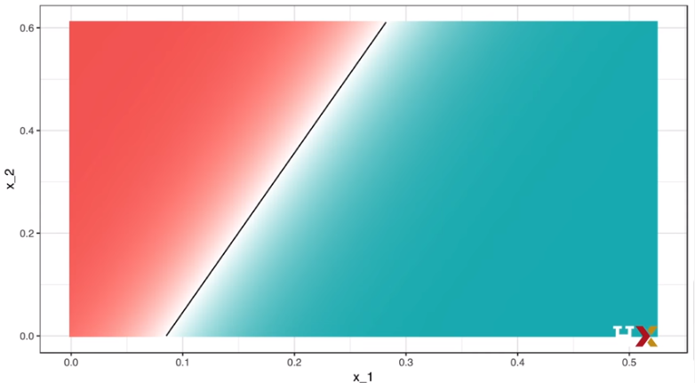

Here is the estimate of the conditional probability we obtain when using LDA, in this case the lack of flexibility does not allow us to get a good estimate. see this code.


```{r}
train_lda <- train(y ~ ., method = "lda", data = mnist_27$train)
y_hat < predict(train_lda, mnist_27$test)
confusionMatrix(data = y_hat, reference = mnist_27$test$y)$overall["Accuracy"]
```

**Note: expected value 0.75**

### Case Study: More than Three Classes

In this video, we will give a slightly more complex example, one with three classes instead of two. We first create a dataset similar to the two or seven dataset. Except now we have one, twos, and sevens.
We can generate that dataset using this rather complex code.

```{r}
mnist <- read_mnist()
set.seed(3456)
index_127 <- sample(which(mnist$train$labels %in% c(1,2,7)), 2000)


y <- mnist$train$labels[index_127]
x <- mnist$train$images[index_127,]
index_train <- createDataPartition(y, p=0.8, list= FALSE)

# get the quadrants
row_column <- expand.grid(row = 1:28, col= 1:28)

# temporary object to help figure out the quadrants
upper_left_ind <- which(row_column$col <= 14 & row_column$row <= 14)
lower_right_ind <- which(row_column$col > 14 & row_column$row > 14)

x <- x > 200
# binarize the values. Above200 is ink, below is no ink

x<- cbind(rowSums(x[,upper_left_ind])/rowSums(x),
          # proportion of pixels in upper right quadrant          
          rowSums(x[,lower_right_ind])/rowSums(x))

train_set <- data.frame(y = factor(y[index_train]), x_1 = x[index_train,1],x_2 = x[index_train,2])
test_set <- data.frame(y = factor(y[-index_train]), x_1 = x[-index_train,1],x_2 = x[-index_train,2])
```


Once we're done, we obtain training set and a test set. Here we're showing the data for the training set.
You can see the x1 and x2 predictors. And then in color, we're showing you the different labels, the different categories.

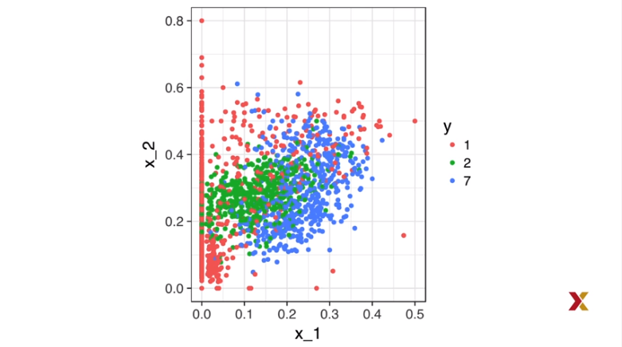

The ones are in red, the greens are the twos, and the blue points are the sevens. As an example, we'll fit a qda model. We'll use the caret package. So all we do is type this piece of code.

```{r}
train_qda <- train(y ~ ., method = "qda", data = train_set)
```

So how do things differ now? First note that we estimate three conditional probabilities, although they all have to add up to 1. So if you type predict with type probability, you now get a matrix with three columns, a probability for the ones, a probability for the two, a probability for the sevens.

```{r}
predict(train_qda, test_set, type = "prob") %>% head()
```


We predict the one with the highest probability. So for the first observation, we would predict a two (note, in the executed code it was 1 with 0.765), And now our predictors are one of three classes. If we use the predict function, with the default setting of just giving you the outcome, we get twos, ones, and sevens.

```{r}
predict(train_qda, test_set)
```


The confusion matrix is a three-by-three table now because we can make two kinds of mistakes with the ones,two kinds of mistakes with the two, and two kinds of mistakes with the sevens. You can see it here.

```{r}
confusionMatrix(predict(train_qda, test_set), test_set$y)
```

The accuracy's still at one number because it just basically computes how often we make the correct prediction. Note that for sensitivity and specificity, we have a pair of values for each class. This is because to define these terms, we need a binary outcome. We therefore have three columns, one for each class as a positive and the other two as the negatives. Finally, we can visualize what parts of the regionsare called ones, twos, and seven by simply plotting

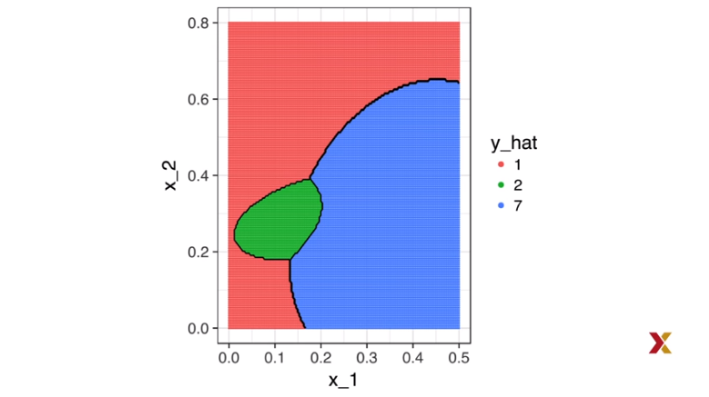

The estimated conditional probability. Let's see how it looks like for lda. We can train the model like this.

```{r}
train_lda <- train(y ~ ., method = "lda", data = train_set)
confusionMatrix(predict(train_lda, test_set), test_set$y)$overall["Accuracy"]
```
 
The accuracy is much worse, and it is because our boundary regions have three lines.

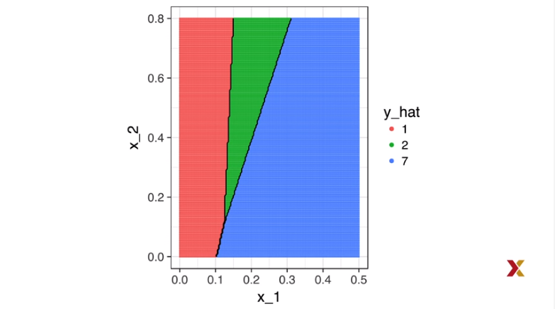

This is something we can show mathematically.   


The results for knn are actually much better.

```{r}
train_knn <- train(y ~ ., method = "knn", tuneGrid = data.frame(k = seq(15,51,2)), data = train_set)
confusionMatrix(predict(train_knn, test_set), test_set$y)$overall["Accuracy"]
```

Look how higher the accuracy is.And we can also see that the estimated conditional probability is much more
flexible, as we can see in this plot.

1[](figs/chart51.png)

Note that the reason that qda and, in particularly, lda are not working well is due to lack of fit. We can see that by plotting the data and noting that at least the ones are definitely not bivariate normally distributed.

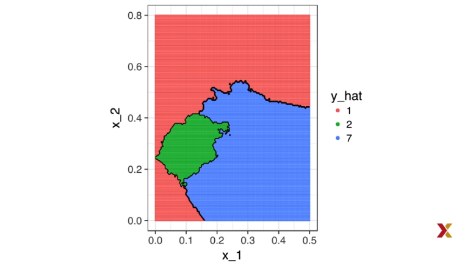

**So in summary, generating models can be very powerful but only when we're able to successfully approximate the joint distribution of predictor's condition on each class.**
