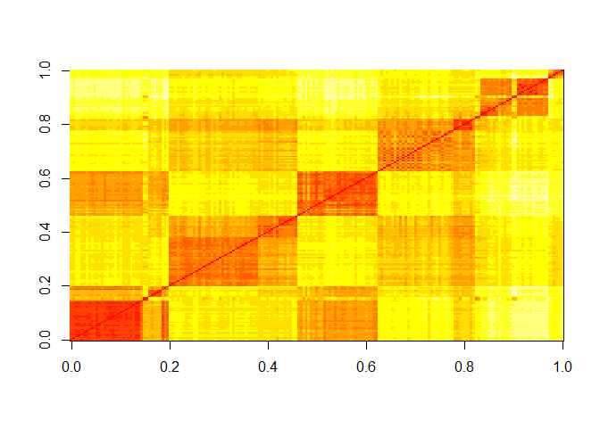

Comprehension Check: Distance
================

Q1
--

Load the following dataset:

``` r
library(dslabs)
```

    ## Warning: package 'dslabs' was built under R version 3.5.3

``` r
data("tissue_gene_expression")
```

This dataset includes a matrix x:

``` r
dim(tissue_gene_expression$x)
```

    ## [1] 189 500

This matrix has the gene expression levels of 500 genes from 189 biological samples representing seven different tissues. The tissue type is stored in y:

``` r
table(tissue_gene_expression$y)
```

    ## 
    ##  cerebellum       colon endometrium hippocampus      kidney       liver 
    ##          38          34          15          31          39          26 
    ##    placenta 
    ##           6

Which of the following lines of code computes the Euclidean distance between each observation and stores it in the object d?

Answer:

``` r
d <- dist(tissue_gene_expression$x)
```

Q2
--

Compare the distances between observations 1 and 2 (both cerebellum), observations 39 and 40 (both colon), and observations 73 and 74 (both endometrium).

Distance-wise, are samples from tissues of the same type closer to each other?

``` r
d_matrix <- as.matrix(d)
d_matrix[1:2,1:2]
```

    ##              cerebellum_1 cerebellum_2
    ## cerebellum_1     0.000000     7.005922
    ## cerebellum_2     7.005922     0.000000

``` r
d_matrix[39:40,39:40]
```

    ##          colon_1  colon_2
    ## colon_1 0.000000 8.191935
    ## colon_2 8.191935 0.000000

``` r
d_matrix[73:74,73:74]
```

    ##               endometrium_1 endometrium_2
    ## endometrium_1       0.00000      14.29405
    ## endometrium_2      14.29405       0.00000

Answer :

Yes, the samples from the same tissue type are closest to each other

Q3
--

Make a plot of all the distances using the image function to see if the pattern you observed in Q2 is general. Which code would correctly make the desired plot?

``` r
image(as.matrix(d))
```



``` r
#image(d_matrix)[order(tissue_gene_expression$y):order(tissue_gene_expression$y)]
```
