Classification with More than Two Classes and the Caret Package
================

Trees Motivation
----------------

We describe how methods lda and qda are not meant to be used with datasets that have many predictors. This is because the number of parameters that we need to estimate becomes too large.
For example, with the digits example where we have 784 predictors, lda would have to estimate over 600,000 parameters. With qda, you would have to multiply that by the number of classes, which is 10 here. Kernel methods such k-nearest neighbors or local regression do not have model parameters to estimate. But they also face a challenge when multiple predictors are used due to what is referred to as the **curse of dimensionality.**

The dimension here refers to the fact that when we have p predictors, the distance between two observations is computed in p dimensional space. A useful way to understand the curse of dimensionality is by considering how large we have to make a neighborhood, the neighborhood we used to make the estimates, to include a given percentage of the data.

Remember that with large neighborhoods, our methods lose flexibility. For example, suppose we have one continuous predictor with equally spaced points in the \[0 - 1\] interval, and you wanted to create windows that include 1/10 of the data. Then it's easy to see that our windows have to be of size 0.1. You can see it in this figure.

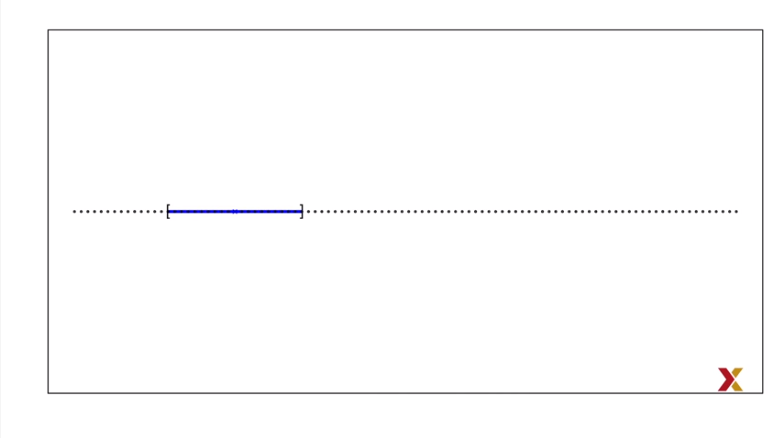

Now, for two predictors, if we decide to keep the neighborhood just a small, 10% of each dimensions we only include one point.

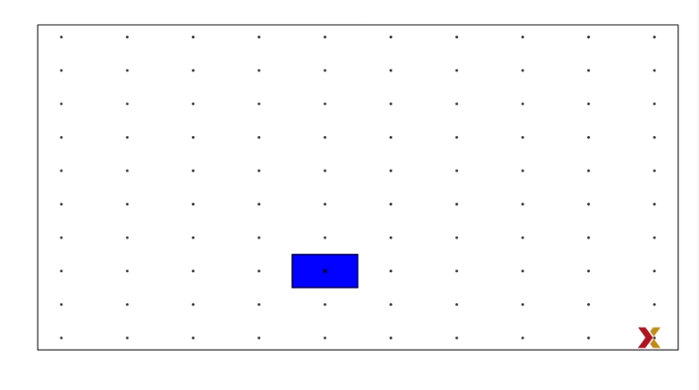

If we want to include 10% of the data, then we need to increase the size of each side of the square to the square root of 10 so that the area is 10 out of 100. This is now 0.316.

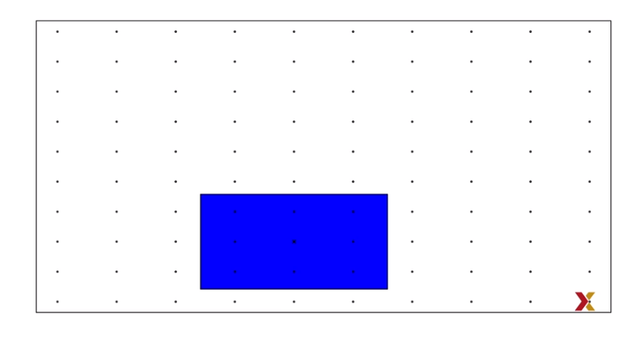

In general, to include 10% of the data in a case with p dimensions, we need an interval \[? with ?\] each side having a size of 0.10 to the 1/p.

$$
\\sqrt\[p\]{.10}
$$

This proportion gets close to 1, which means we're including practically all the data, and it's no longer smoothing very quickly. You can see it in this graph, plotting p versus 0.1 to the 1/p.

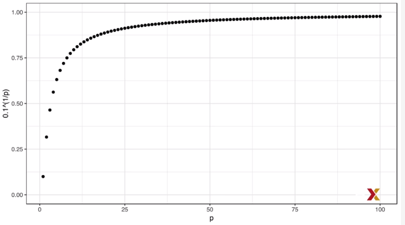

So by the time we reach 100 predictors, the neighborhood is no longer very local, as each side covers almost the entire dataset. In this video, we introduced a set of elegant and versatile methods that adapt to higher dimensions and also allow these regions to take more complex shapes, while still producing models that are interpretable. These are very popular well-known and studied methods. We will focus on regression and decision trees and their extension, random forests.

Classification and Regression Trees (CART)
------------------------------------------

To motivate this video, we will use a new dataset that includes the breakdown of the composition of olive into eight fatty acids. You can get the data like this.

``` r
library(dslabs)
library(tidyverse)
```

    ## Registered S3 methods overwritten by 'ggplot2':
    ##   method         from 
    ##   [.quosures     rlang
    ##   c.quosures     rlang
    ##   print.quosures rlang

    ## Registered S3 method overwritten by 'rvest':
    ##   method            from
    ##   read_xml.response xml2

    ## -- Attaching packages ---------------------------------------------------------------------------- tidyverse 1.2.1 --

    ## v ggplot2 3.1.1       v purrr   0.3.2  
    ## v tibble  2.1.1       v dplyr   0.8.0.1
    ## v tidyr   0.8.3       v stringr 1.4.0  
    ## v readr   1.3.1       v forcats 0.4.0

    ## -- Conflicts ------------------------------------------------------------------------------- tidyverse_conflicts() --
    ## x dplyr::filter() masks stats::filter()
    ## x dplyr::lag()    masks stats::lag()

``` r
data("olive")
head(olive)
```

    ##           region         area palmitic palmitoleic stearic oleic linoleic
    ## 1 Southern Italy North-Apulia    10.75        0.75    2.26 78.23     6.72
    ## 2 Southern Italy North-Apulia    10.88        0.73    2.24 77.09     7.81
    ## 3 Southern Italy North-Apulia     9.11        0.54    2.46 81.13     5.49
    ## 4 Southern Italy North-Apulia     9.66        0.57    2.40 79.52     6.19
    ## 5 Southern Italy North-Apulia    10.51        0.67    2.59 77.71     6.72
    ## 6 Southern Italy North-Apulia     9.11        0.49    2.68 79.24     6.78
    ##   linolenic arachidic eicosenoic
    ## 1      0.36      0.60       0.29
    ## 2      0.31      0.61       0.29
    ## 3      0.31      0.63       0.29
    ## 4      0.50      0.78       0.35
    ## 5      0.50      0.80       0.46
    ## 6      0.51      0.70       0.44

For illustrative purpose, we'll try to predict the region using the fatty acid composition values as predictors.

``` r
table(olive$region)
```

    ## 
    ## Northern Italy       Sardinia Southern Italy 
    ##            151             98            323

It's either Northern Italy, Sardinia, or Southern Italy. We'll remove the area column because we don't use it as a predictor.

``` r
olive <- select(olive, -area)
```

Let's very quickly see how we do using k-nearest neighbors. We use the caret package to fit the model, and we get an accuracy of about 0.97, pretty good.

``` r
library(caret)
```

    ## Loading required package: lattice

    ## 
    ## Attaching package: 'caret'

    ## The following object is masked from 'package:purrr':
    ## 
    ##     lift

``` r
fit <- train(region ~ ., method = "knn", tuneGrid = data.frame(k = seq(1,15,2)), data = olive)
```

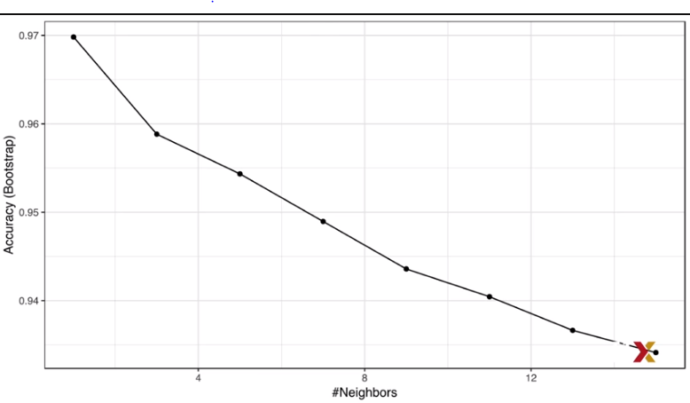

However, a bit of data exploration reveals that we should be able to do even better.

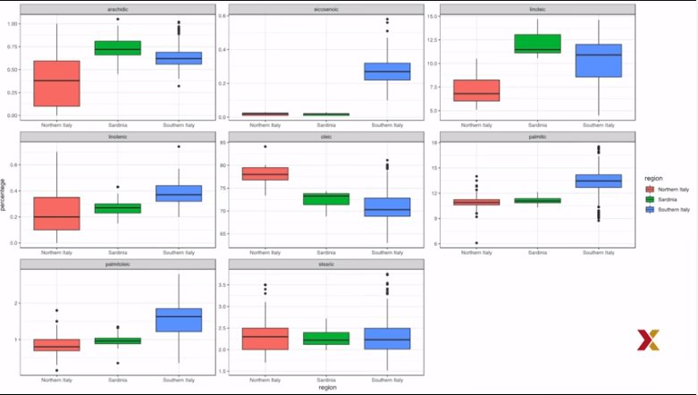

For example, if we look at the distributionof each predictor stratified by region, we see that one of the fatty acids is only present in Southern Italy,

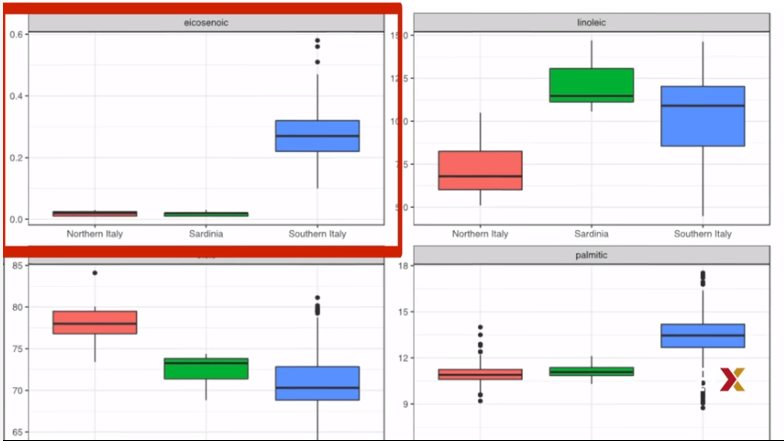

and then another one separates Northern Italy from Sardinia.

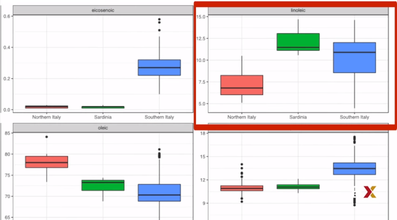

This implies that we should be able to build an algorithm that perfectly predicts. We can see this clearly by plotting the values of these two fatty acids.

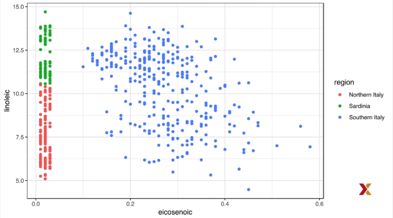

We can, by eye, construct a prediction rule the partitions the predictor space like this.

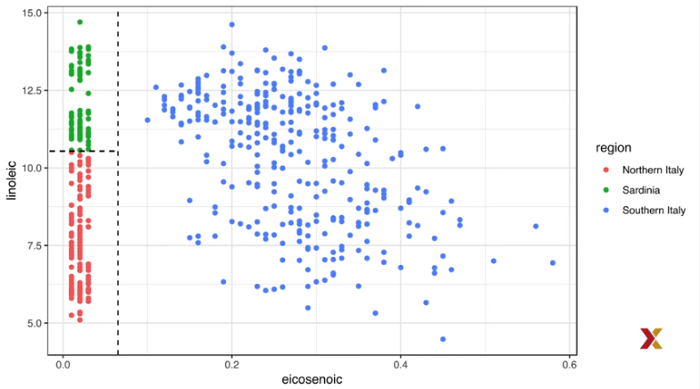

Specifically, we define the following decision rule. If the first predictor is larger than 0.065, B, predict Southern Italy. If not, then look at the second predictor. And if that's larger than 10.535, predict Sardinia, and Northern Italy otherwise. We can draw this as a decision tree like this.

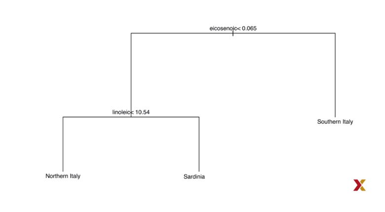

Decision trees like this one are often used in practice. For example, to decide if a person at risk of having a heart attack,a doctor will use a decision tree such as this one.

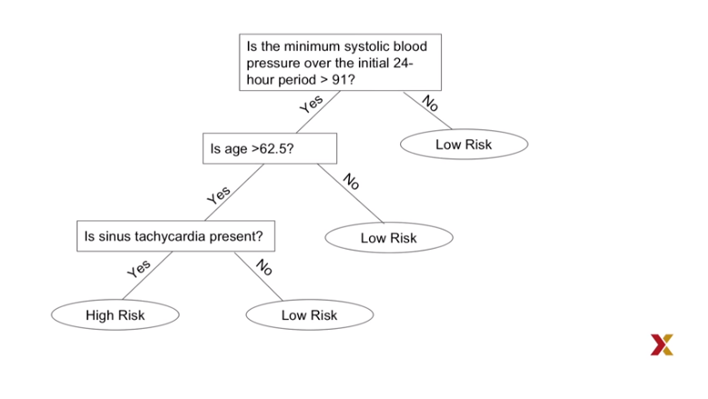

The general idea is to define an algorithm that uses data to create trees such as the ones we've just shown. Regression and decision trees operate by predicting an outcome variable y by partitioning the predictor space. **When the outcome is continuous, we call these types of algorithms regression trees.** We'll use a continuous case, the 2008 poll data introduced earlier, to describe the basic idea of how we build these algorithms. We'll try to estimate the conditional expectation-- we'll call it f of x, the expected value of y given x--

*f*(*x*)=*E*(*Y*|*X* = *x*)

with y, the poll margin, and x, the day. Here's a graph of the data.

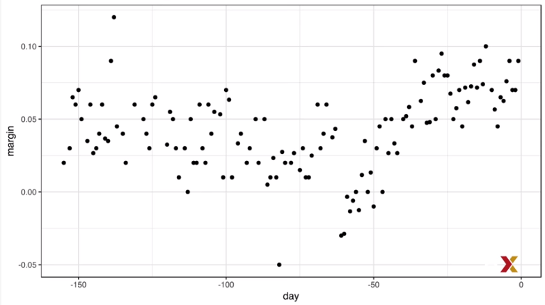

**The general idea here is to build a decision tree. And at the end of each node, we'll have a different prediction Y hat.**

Here is how we do it. **First we partition the space into j non-overlapping regions, R1, R2, all the way up to Rj.** For every observation that follows within a region *x*<sub>*i*</sub> ∈ *R*<sub>*j*</sub> , let's say, region Rj, we predict the $\\hat{Y}$ with the average of all the training observations *Y*<sub>*i*</sub> in that region *x*<sub>*i*</sub> ∈ *R*<sub>*j*</sub> .But how do we decide on the partitions R1, R2 and so on? And how do we decide how many? Regression trees create partitions recursively. But what does this mean? OK, suppose we already have a partition. We then have to decide what predictor j to use to make the next partition and where to make it within that predictor. So suppose we already have a partition so that every observation i is in exactly one of these partitions. For each of these partitions, we will divide further using the following algorithm.

First we need to find a **predictor j and a value s that define two new partitions.** Let's call them *R*<sub>1</sub> and *R*<sub>2</sub>. These two partitions will split our observations into the following two sets. $\\hat{y}R\_1$ and $\\hat{y}R\_2$

*R*<sub>1</sub>(*j*, *s*)={*X*|*X*<sub>*j*</sub> &lt; *s*}
 and
*R*<sub>2</sub>(*j*, *s*)={*X*|*X*<sub>*j*</sub> ≥ *s*}

Then, in each one of these two sets, we will define an average $\\bar{y}R\_1$ and $\\bar{y}R\_2$ and use these as our predictions. The averages will be the averages of the observations in each of the two partitions. So we could do this for many Js and Ss. So how do we pick them? We pick the combination that minimizes the residual sum of squares defined by this formula.

$$ *{i:x\_i R\_1(j,s)} (y\_i - R\_1)^2 + *{i:x\_i R\_2(j,s)} (y\_i - R\_2)^2

$$

This is then applied recursively. We keep finding new regions to split into two. Once we're done partitioning the predictor space into regions, in each region, a prediction is made by using the observations in that region. You basically calculate an average. Let's take a look at what this algorithm does on the 2008 presidential election poll data. We will use the **rpart function in the rpart package.** We simply type this.

``` r
library(rpart)
fit <- rpart(margin ~ ., data= polls_2008)
```

Here there's only one predictor. So we don't have to decide which predictor j to split by. We simply have to decide what value s we use to split.We can visually see where the splits were made by using this piece of code.

``` r
plot(fit, margin = 0.1)
text(fit, cex = 0.75)
```

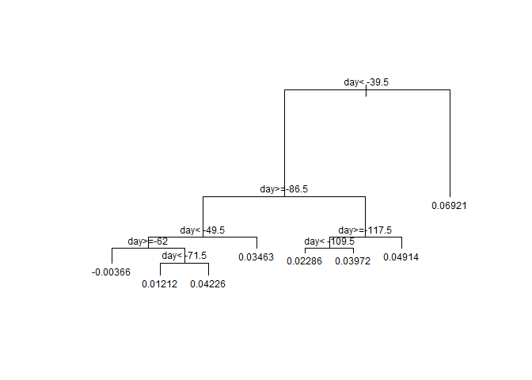

Here's a tree.The first split is made on day 39.5. Then one of those two regions is split at day 86.5. The two resulting new partitions are split on day 49.5 and 117.5 respectively and so on. We end up with eight partitions. The final estimate f hat of x looks like this.

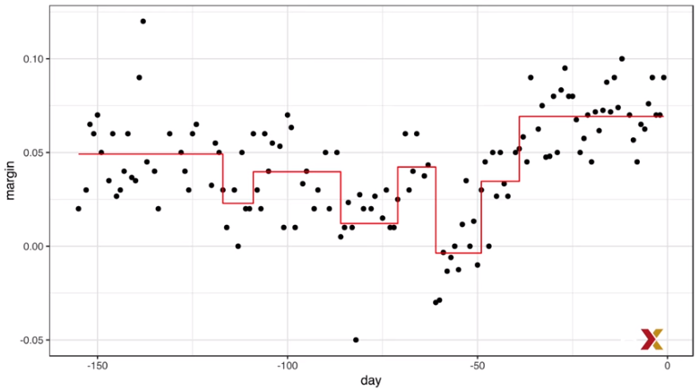

Now, why did the algorithm stop partitioning at eight? There are some details of the algorithm we did not explain. Let's explain them now. Note that every time we split and define two new partitions, our training set residual sum of squares decreases. This is because with more partitions, our model has more flexibility to adapt to the training data. In fact, if you split until every point is its own partition, then the residual sum of squares goes all the way down to zero since the average of one value is that same value. To avoid this overtraining, **the algorithm sets a minimum for how much the residual sum of squares must improve for another partition to be added. This parameter is referred to as the Complexity Parameter, or CP.** The residual sum of squares must improve by a factor of CP the new partition to be added.

Another aspect of the algorithm we didn't describe is that\*\* it sets a minimum number of observations to be partitioned.\*\* In the rpart package, that rpart function has an **argument called minsplit** that lets you define this. **The default is 20**.

The algorithm also **sets a minimum on the number of observations in each partition.** In the rpart function, this **argument is called minbucket.** So if the optimal split results in a partition with less observation than this minimum, it is not considered. The default for this parameter is minsplit divided by 3 rounded to the closest integer. $default = round(\\frac{minsplit}{3})$

OK, so let's see what happens if we set CP to 0 and minsplit to 2. What will happen then? Well, our prediction is our original data because the tree will keep splitting and splitting until the RSS is minimized to zero. Here's the data with the resulting fit.


Now, note that in this methodology, we can also **prune trees** by snipping off partitions that do not meet a CP criterion. So we can grow a tree very, very big and then prune off branches to make a smaller tree. Here is a code for how to do this.

``` r
pruned_fit <- prune(fit, cp = 0.01)
```

With the code that we just wrote, here is the resulting estimate.

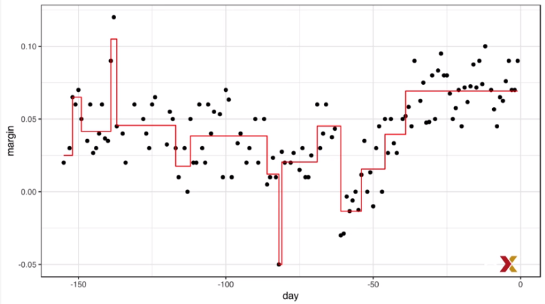

OK, but now is a default value of CP the best one? How do we pick CP? Well, we can use cross-validation, just like with any other tuning parameter. We can use the train function in the caret package, for example. We can write this code, then plot the result, and pick the best CP.

``` r
library(caret)
train_rpart <- train(margin ~ .,
                     method = "rpart",
                     tuneGrid = data.frame(cp = seq(0, 0.05, len=25)),data = polls_2008)

ggplot(train_rpart)
```

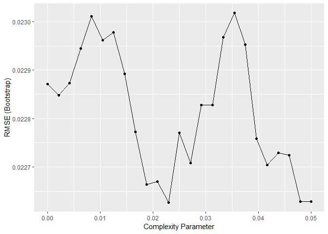

To see the resulting tree that minimizes the mean squared error, we can access it through the component finalmodel. If we plot it, we can see the tree. Here it is. And because we only have one predictor, we can actually plot f hat x. Here it is. You can see that the fit looks reasonable.
