## Case Study: MNIST

We have learned several machine learning algorithms and demonstrated how to use them with illustrative examples. But we are now going to try them out on a real example. This is a popular data set used in machine learning competitions called the **MNIST digits** (Modified National Institute of Standards and Technology Database). We can load the data using the following dslabs package, like this.

```{r}
library(dslabs)
mnist <- read_mnist()
```


The data set includes two components, a training set and a test set. You can see that by typing this.

```{r}
names(mnist)
```

Each of these components includes a matrix with features in the columns. You can access them using code like this.

```{r}
dim(mnist$train$images)
```


It also includes a vector with the classes as integers. You can see that by using this code.

```{r}
class(mnist$train$labels)
table(mnist$train$labels)
```


Because we want this example to run on a small laptop and in less than an hour, we'll consider a subset of the data set. **We will sample 10,000 random rows from the training set and 1,000 random rows from the test set.** 

```{r}
set.seed(123)
index <- sample(nrow(mnist$train$images), 10000)
x <- mnist$train$images[index,]
y <- mnist$train$labels[index]

index <- sample(nrow(mnist$train$images), 1000)
x_test <- mnist$train$images[index,]
y_test <- factor(mnist$train$labels[index])

```


## Preprocessing MNIST Data

In machine learning, we often transform predictors before running the machine learning algorithm. This is actually an important step. We also remove predictors that are clearly not useful-- also an important step. **We call all this pre-processing.**  

Examples of pre-processing include standardizing the predictors, taking the log transform of some predictors or some other transformation, removing predictors that are highly correlated with others, and removing predictors with very few non-unique values or close to zero variation. We're going to show an example of one of these. The example we're going to look at relates to the variability of the features. We can see that there are a large number of features with zero variability, or almost zero variability. We can use this code to compute the standard deviation of each column and then plot them in a histogram. Here's what it looks like.

```{r}
library(matrixStats)
sds <- colSds(x)
qplot(sds, bins = 256, color = I("black"))
```

This is expected, because there are parts of the image that rarely contain writing, very few dark pixels, so there's very little variation and almost all the values are 0. **The caret package includes a function that recommends features to be removed due to near zero variance.** You can run it like this.

```{r}
library(caret)
nzv <- nearZeroVar(x)
```


We can see the columns that are removed-- they're the yellow ones in this plot-- by simply making an image of the matrix.

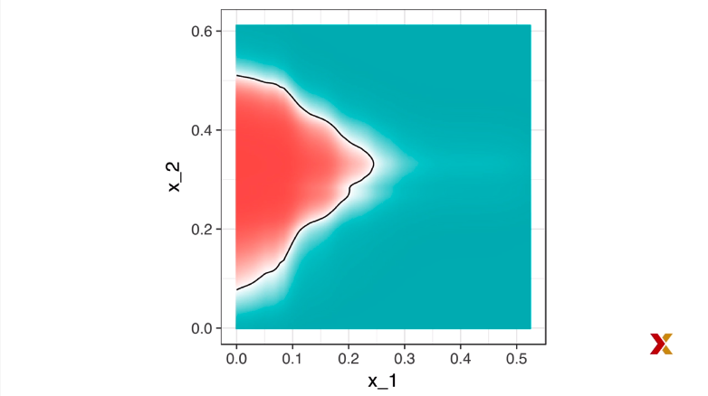

Once we remove these columns, we end up keeping these many columns.

```{r}
col_index <- setdiff(1:ncol(x),nzv)
length(col_index)
```
Expected from course: 252

Now, we're ready to fit some models.

## Model Fitting for MNIST Data

In this video, we're going to actually implement k-nearest neighbors and random forest on the MNIST data. However, before we start, we need to add column names to the feature matrices, as this is a requirement of the caret package. We can do this using this code.

```{r}
colnames(x) <- 1:ncol(mnist$train$images)
colnames(x_test) <- colnames(mnist$train$images)
```

We're going to add as a name the number of the column. OK, so **let's start with knn.** The first step is to optimize for the number of neighbors. Now, keep in mind that when we run the algorithm, we will have to compute a distance between each observation in the test set and each observation in the training set. These are a lot of calculations. We will therefore use k-fold cross-validation to improve speed.

```{r}
control <- trainControl(method = "cv", number = 10, p = 0.9)
train_knn <- train(x[,col_index], y, method = "knn", tuneGrid = data.frame(k = c(1,3,5,7)), trControl = control)
```

So we can use the caret package to optimize our k-nearest neighbor algorithm. This will find the model that maximizes the accuracy.

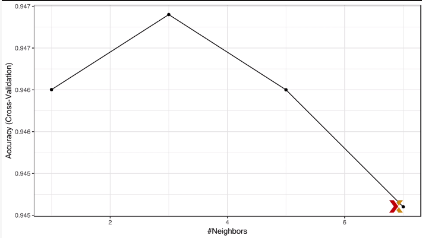


Note that running this code takes quite a bit of time on a standard laptop. It could take several minutes. In general, it is a good idea to test out a piece of code with a small subset of the data first to get an idea of timing, before we start running code that might take hours to run or even days. So always performs checks or make calculations by hand to make sure that your code isn't going to take too much time. You want to know-- have an idea-- of how long your code will take. So one thing you can do is test it out on smaller datasets. Here we define n and b as the number of rows that we're going to use and b, the number of cross-validation folds that we're going to use. 

```{r}
n <- 1000
b <- 2
index <- sample(nrow(x),n)
control <- trainControl(method = "cv", number = b, p = 0.9)
train_knn <- train(x[index, col_index], y[index],
                  method = "knn",
                  tuneGrid = data.frame(k = c(3,5,7)),
                  trControl = control)
```


Then we can start increasing these numbers slowly to get an idea of how long the final code will take. Now, once we're done optimizing our algorithm, we can fit the entire dataset. So we would code like this.

```{r}
fit_knn <- knn3(x[,col_index], factor(levels(y)), k = 3)
y_hat_knn <- predict(fit_knn, x_test[,col_index], type = "class")
cm <- confusionMatrix(y_hat_knn, factor(y_test))
cm$overall["Accuracy"]

```
**Expected Value 0.953**

We see that our accuracy is almost 0.95. From the specificity and sensitivity output coming from the confusion matrix function, we see that the eights are the hardest to detect,and the most commonly incorrect predicted digit seven.

```{r}
cm$byClass[,1:2]
```


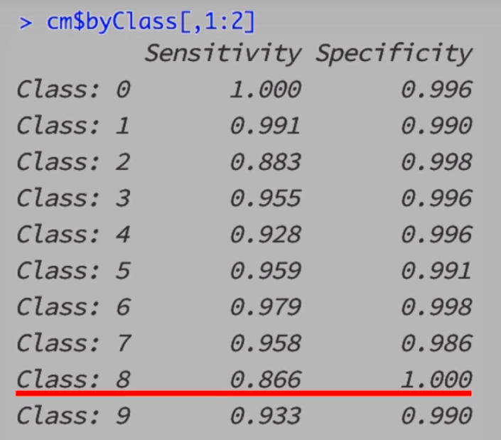

Now, let's see if we can do even better with **random forest**. With random forest, computation time is even a bigger challenge than with k-nearest neighbors. For each forest, we need to build hundreds of trees. We also have several parameters that we can tune. **Here we use the random forest implementation in the Rborist package, which is faster than the one in the random forest package.**
It has less features, but it is faster. Because with random forest, the fitting is the slowest part of the procedure rather than the predicting, as with knn, we will only use five-fold cross-validation. We'll also reduce the number of trees that are fit, since we are not yet building our final model. Finally, we'll take a random subset of observations when constructing each tree. We can change this number with the **nSamp argument** in the Rborist function. So here's a code to optimize around a random forest.

**Note on Rborist 0.1-17**

**There appears to be an issue with Version 0.1-17 of the Rborist package that causes R sessions to abort/terminate. We recommend using an older version of Rborist or not running the code  at 3:07.**
```{r}
library(Rborist)
control <- trainControl(method = "cv", number = 5, p = 0.8)
grid <- expand.grid(minNode = c(1,5), predFixed = c(10,15,25,35,50))

# train_rf <- train(x[,col_index], y, method = "Rborist", nTree = 50, trControl = control, tuneGrid = grid, nSamp = 5000)
```


It takes a few minutes to run.We can see the final results using ggplot.


And we can choose the parameters using the best tune component of the training object. And now we're ready to optimize our final tree. Now we're going to set the number of trees to a larger number. We can write this piece of code.

```{r}
fit_rf <- Rborist(x[,col_index], y, nTree = 1000, minNode = train_rf$bestTune$minNode, predFixed = train_rf$bestTune$predFixed)
```


Once the code is done running, and it takes a few minutes, we can see, using the confusion matrix function, that our **accuracy is above 0.95**. We have indeed improved over k-nearest neighbors. Now, let's look at some examples of the original image in the test set in our calls.
You can see that that first one we called an eight. It's an eight. The second is also called an eight. Looks like an eight.

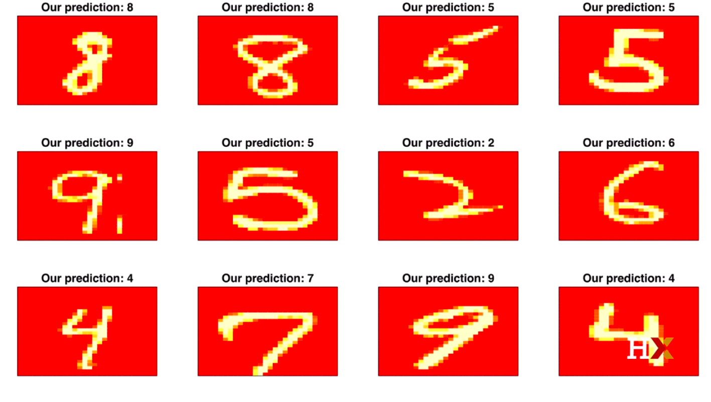

And all of them look like we made the right call. Not surprising-- we have an accuracy above 0.95. Now, note that we have done minimal tuning here. And with some further tuning, examining more parameters, growing out more trees, we can get even higher accuracy.

## Variable Importance


Earlier we described that one of the limitations of random forest is that they're not very interpretable. However, the concept of **variable importance**
helps a little bit in this regard. Unfortunately, the current implementation of the Rborist package does not yet support variable importance calculations. So to demonstrate the concept the variable importance, we're going to use the random forest function in the random forest package. Furthermore, we're not going to filter any columns out of the feature matrix out. We're going to use them all. So the code will look like this.

```{r}
library(randomForest)
library(dslabs)
mnist <- read_mnist()
x <- mnist$train$images[index,]
y <- factor(mnist$train$labels[index])
rf <- randomForest(x, y, ntree = 50)
imp <- importance(rf)
head(imp)
```


Once we run this, we can compute the importance of each feature using the important function. So we would type something like this. If you look at the importance, we immediately see that the first few features have zero importance. They're never used in the prediction algorithm. This makes sense because these are the features on the edges, the features that have no writing in them, no dark pixels in them. In this particular example, it makes sense to explore the importance of this feature using an image. We'll make an image where each feature is plotted in the location of the image where it came from. So we can use this code.

```{r}
image(matrix(imp,28,28))
```


And we see where the important features are. It makes a lot of sense. They're in the middle, where the writing is. And you can kind of see the different numbers there-- six, eight, seven. These are the features that distinguish one digit from another. An important part of data science is visualizing results
to discern why we're failing. How we do this depends on the application. For the examples with the digits, we'll find digits for which we were quite certain of a call, but it was incorrect. We can compare what we got with k-nearest neighbors to what we got with random forest. So we can write code like this 

```{r}
p_max <- predict(fit_knn, x_test[,index])
p_max <- apply(p_max, 1, max)
ind <- which(y_hat_knn != y_test)
ind <- ind[order(p_max[ind], decreasing = TRUE)]
```


and then make images of the cases where we made a mistake. Here they are.

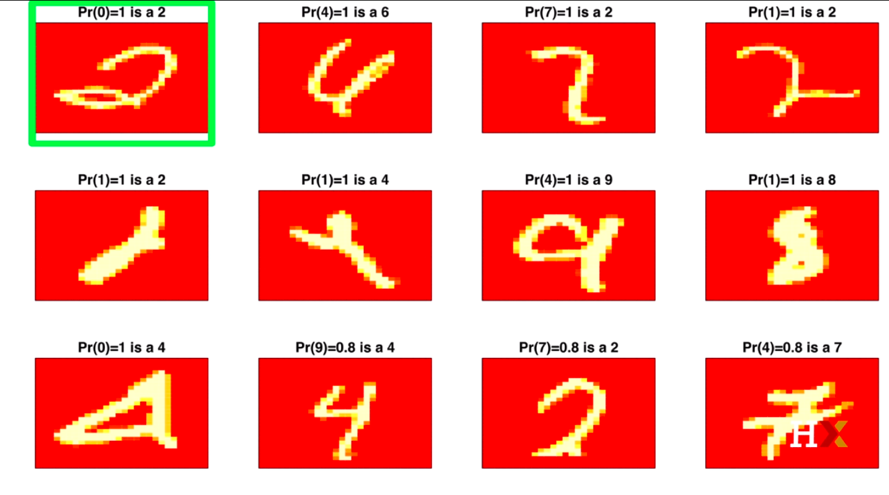

That first one was called a zero. It's actually a two. You can kind of see why. The second one was called a four, but it's a six. That one you definitely see why we made a mistake, et cetera. But by looking at these images, you might get ideas of how you could improve your algorithm. We can do the same for random forest.

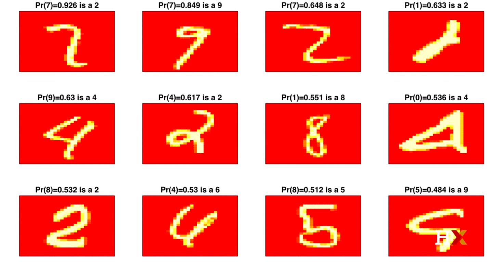

Here are the top 12 cases where we were very
sure it was one digit, when it was, in fact, another.


## Ensembles

A very powerful approach in machine learning is the idea of ensembling different machine learning algorithms into one. Let's explain what we mean by that. The idea of an ensemble is similar to the idea of combining data from different pollsters to obtain a better estimate of the true support for different candidates.  

In machine learning, one can usually greatly improve the final result of our predictions by combining the results of different algorithms. Here we present a very simple example, where we compute new class probabilities by taking the average of the class probabilities provided by random forest and k-nearest neighbors. We can use this code to simply average these probabilities.

```{r}
p_rf <- predict(fit_rf, x_test[, col_index])$census
p_rf <- p_rf / rowSums(p_rf)

p_knn <- predict(fit_knn, x_test[,col_index])
p_ <- (p_rf + p_knn)/2
y_pred <- factor(apply(p, 1, which.max)-1)
confusionMatrix(y_pred, y_test)
```

And we can see that once we do this, when we form the prediction, we actually improve the accuracy over both k-nearest neighbors and random forest.

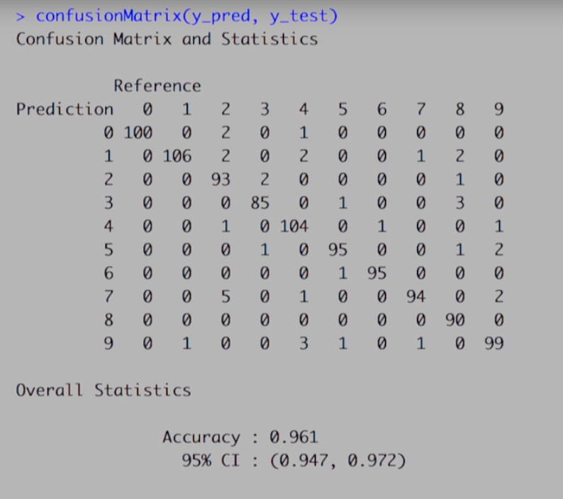

Now, notice, in this very simple example, we ensemble just two methods. In practice, we might ensemble dozens or even hundreds of different methods. And this really provides substantial improvements.

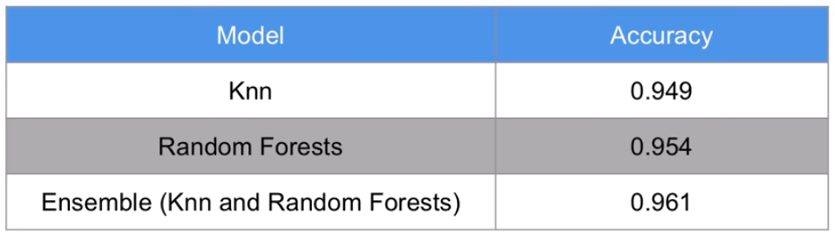

## Recomendation Systems

Recommendation systems use ratings that users have given items to make specific recommendations to users. Companies like Amazon that sell many products to many customers and permit these customers to rate their products are able to collect massive data sets that can be used to predict what rating a given user will give a specific item. Items for which a high rating is predicted for specific users are then recommended to that user. Netflix uses recommendation systems to predict how many stars a user will give a specific movie. Here we provide the basics of how these recommendations are predicted, motivated by some of the approaches taken by the winners of the Netflix challenge.  

What's the Netflix challenge? On October 2006, Netflix offered a challenge to the data science community. Improve our recommendation algorithm by 10% and win $1 million. In September 2009, the winners were announced. You can follow this [link](https://bits.blogs.nytimes.com/2009/09/21/netflix-awards-1-million-prize-and-starts-a-new-contest) to see the news article.  


You can read a good summary of how the winning algorithm was put together following this [link](http://blog.echen.me/2011/10/24/winning-the-netflix-prize-a-summary/)

We'll include it in the class material. And a more detailed explanation following this [link](http://www.netflixprize.com/assets/GrandPrize2009_BPC_BellKor.pdf), also included in the class material.  

Here we show you some of the data analysis strategies used by the winning team. Unfortunately, the Netflix data is not publicly available. But the GroupLens research lab generated their own database with over 20 million ratings for over 27,000 movies by more than 138,000 users. We make a small subset of this data available via the dslabs package. You can upload it like this.

```{r}
library(dslabs)
library(tidyverse)
data("movielens")
```

We can see that the movie lens table is tidy formant  and contains thousands of rows.

```{r}
head(movielens)
```


Each row represents a rating given by one user to one movie. We can see the number of unique users that provide ratings and for how many unique movies they provided them using this code. 

```{r}
movielens %>%
  summarize(n_users = n_distinct(userId),
            n_movies = n_distinct(movieId))
```


If we multiply those two numbers, we get a number much larger than 5 million. Yet our data table has about 100,000 rows. This implies that not every user rated every movie. So we can think of this data as a very large matrix with users on the rows and movies on the columns with many empty cells. The gather function permits us to convert to this format, but if we try to do it for the entire matrix it will crash R. So lets look at a smaller subset. This table shows a very small subset of seven users and five movies. You can see the ratings that each user gave each movie and you also see NA's for movies that they didn't watch or they didn't rate.

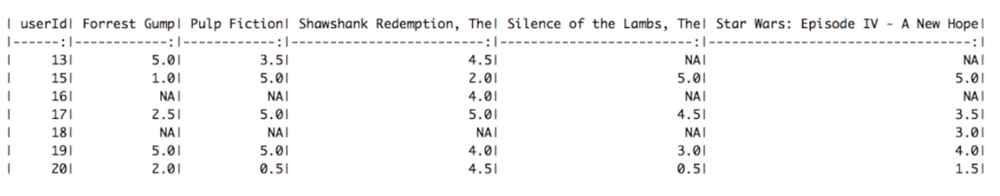

You can think of the task of recommendation systems as filling in the NA's in the table we just showed. To see how **sparse** the entire matrix is, here
the matrix for a random sample of 100 movies and 100 users is shown with yellow indicating a user movie combination for which we have a rating.  


All right so let's move on to try to make predictions. The machine learning challenge here is more complicated than we have studied up to now because each outcome y has a different set of predictors. To see this, note that if we are predicting the rating for movie i by user u, in principle, all other ratings related to movie i and by user u may be used as predictors. But different users rate a different number of movies and different movies. Furthermore, we may be able to use information from other movies that we have determined are similar to movie i or from users determined to be similar to user u. So in essence, the entire matrix can be used as predictors for each cell. OK. So let's get started. Let's look at some of the general properties of the data to better understand the challenge. The first thing we notice is that some movies get rated more than others. Here's the distribution.


This should not surprise us given that there are blockbusters watched by millions and artsy independent movies watched by just a few. A second observation is that some users are more active than others at rating movies. 


Notice that some users have rated over 1,000 movies while others have only rated a handful. To see how this is a machine learning challenge, note that we need to build an algorithm with data we have collected. And this algorithm will later be used by others as users look for movie recommendations. So let's create a test set to assess the accuracy of the models we implement, just like in other machine learning algorithms. We use the caret package using this code.

```{r}
library(caret)
set.seed(755)
test_index <- createDataPartition(y = movielens$rating, times = 1, p = 0.2, list = FALSE)

train_set <- movielens[-test_index,]
test_set <- movielens[test_index,]
```

To make sure we don't include users and movies in the test set that do not appear in the training set, we removed these using the semi_join function,
using this simple code.


```{r}
test_set <- test_set %>%
  semi_join(train_set, by = "movieId") %>%
  semi_join(train_set, by = "userId")
```

All right, now. To compare different models or to see how well we're doing compared to some baseline, we need to quantify what it means to do well. We need a loss function. The Netflix challenge used the typical error and thus decided on a winner based on the residual mean squared error on a test set. So if we define y_u,i as the rating for movie i by user u and y-hat_u,i as our prediction, then the residual mean squared error is defined as follows.

$$
RMSE = \sqrt{\frac{1}{N}\Sigma_{u,i}(\hat{y}_{u,i} - y_{u,i})^2}
$$

Here n is a number of user movie combinations and the sum is occurring over all these combinations. Remember that we can interpret the residual mean squared
error similar to standard deviation. It is the typical error we make when predicting a movie rating. If this number is much larger than one, we're typically missing by one or more stars rating which is not very good. So let's quickly write a function that computes this residual means squared error for a vector of ratings and their corresponding predictors. It's a simple function that looks like this. 

```{r}
RSME <- function(true_ratings, predicted_ratings){
  srqt(mean((true_ratings - predicted_ratings)^2))
}
```

And now we're ready to build models and compare them to each other.


## Building the Recommendation System

The Netflix challenge winners implemented two general classes of models. One was similar to k-nearest neighbors, where you found movies that were similar to each other and users that were similar to each other. The other one was based on an approach called matrix factorization. That's the one we we're going to focus on here.   

So let's start building these models. Let's start by building the simplest possible recommendation system. We're going to predict the same rating for all movies, regardless of the user and movie. So what number should we predict? We can use a model-based approach. **A model that assumes the same rating for all movies and all users**, with all the differences explained by random variation would look something like this.

$$
Y_{u,i} = \mu + \epsilon_{u,i}
$$


Here epsilon represents independent errors sampled from the same distribution centered at zero, and mu represents the true rating for all movies and users. We know that the estimate that minimizes the residual mean squared error is the least squares estimate of mu. And in this case, that's just the average of all the ratings. We can compute it like this.

```{r eval=FALSE}
mu_hat <- mean(train_set$rating)
mu_hat
```

**That average is 3.54.**

So that is the average rating of all movies across all users. So let's see how well this movie does.
We compute this average on the training data. And then we compute the residual mean squared error on the test set data. So we're predicting all unknown ratings with this average.


```{r eval=FALSE}
naive_rmse <- RMSE(test_set$rating, mu_hat)
naive_rmse
```
Get: 1.05

We get a residual mean squared error of about 1.05. That's pretty big. Now note, if you plug in any other number, you get a higher RMSE. That's what's supposed to happen, because we know that the average minimizes the residual mean squared error when using this model. And you can see it with this code.

```{r eval=FALSE}
predictions <- rep(2.5, nrow(test_set))
RMSE(test_set$rating, predictions)
```
Get: 1.49


So we get a residual mean squared error of about 1. To win the grand prize of $1 million, a participating team had to get to a residual mean squared error of about 0.857. So we can definitely do better. Now because as we go along we will be comparing different approaches, we're going to create a table that's going to store the results that we obtain as we go along. We're going to call it RMSE results. It's going to be created using this code.

```{r eval=FALSE}
rmse <- data.frame(method = "Just the averge", RMSE = naive_rmse)
```


All right. So let's see how we can do better. We know from experience that some movies are just generally rated higher than others. We can see this by simply making a plot of the average rating that each movie got. So our intuition that different movies are rated differently is confirmed by data. So we can augment our previous model by adding a term,** b_i,** to represent the average rating for movie i.

$$
Y_{u,i} = \mu + b_i + \epsilon_{u,i}
$$


In statistics, we usually call these b's, effects. But in the Netflix challenge papers, they refer to them as "bias," thus the b in the notation. All right. We can again use these squares to estimate the b's in the following way, like this. 

```{r eval=FALSE}
fit <- lm(rating ~ as.factor(userId), data = movielens)
```


However, note that because there are thousands of b's, each movie gets one parameter, one estimate. So the lm function will be very slow here. **So we don't recommend running the code we just showed.** However, in this particular situation, we know that the least squares estimate, b-hat_i, is just the average of y_u,i minus the overall mean for each movie, i. So we can compute them using this code.

```{r eval=FALSE}
mu <- mean(train_set$rating)
movie_avg <- train_set %>%
  group_by(movie_Id) %>%
  summarize(b_i = mean(rating - mu))
  
```


**Note that we're going to drop the hat notation in the code to represent the estimates going forward,** just to make the code cleaner. So this code completes the estimates for the b's. We can see that these estimates vary substantially, not surprisingly. Some movies are good. Other movies are bad.


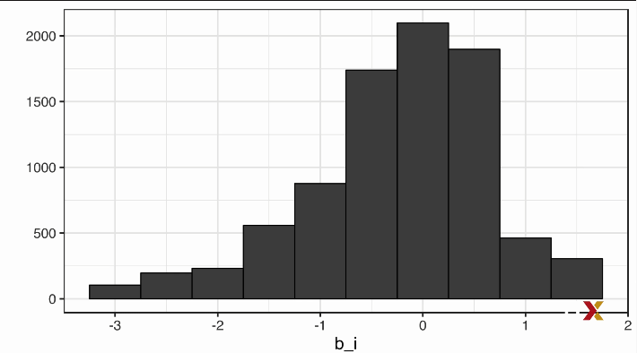

Remember, the overall average is about 3.5.

$\mu = 3.5$  
$b_i = 1.5$  
$\hat{y}_{u,i} = \hat{\mu} + b_i$  

So a b i of 1.5 implies a perfect five-star rating. Now let's see how much our prediction improves once we predict using the model that we just fit.
We can use this code and see that our residual mean squared error did drop a little bit.

```{r eval=FALSE}
predicted_ratings <- mu + test_set %>%
  left_join(movie_avgs, by = "movieId") %>%
  .$b_i

model_1_rmse <- RMSE(predicted_ratings, test_set$rating)
rmse_results < bind_rows(rmse_results,
                         data.frame(method = "Movie Effect Model",
                                    RMSE = model_1_rmse))

rmse_results %>% knitr::kable()
```


We already see an improvement. Now can we make it better? All right. How about users? Are different users different in terms of how they rate movies? To explore the data, let's compute the average rating for user, u, for those that have rated over 100 movies. We can make a histogram of those values. And it looks like this.

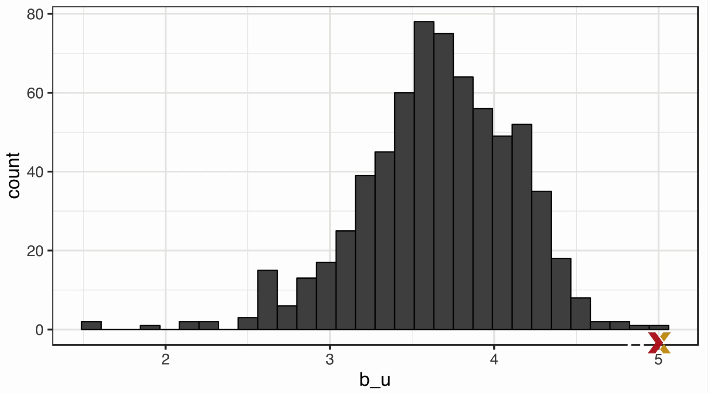

Note that there is substantial variability across users, as well. Some users are very cranky. And others love every movie they watch, while others are somewhere in the middle. This implies that a further improvement to our model may be something like this. 

$$
Y_{u,i} = \mu + b_i + b_u + \epsilon_{u,i}
$$

We include a term, b_u, which is the **user-specific effect.** So now if a cranky user-- this is a negative b_u-- rates a great movie, which will have a positive b_i, the effects counter each other, and we may be able to correctly predict that this user gave a great movie a three rather than a five, which
will happen. And that should improve our predictions. So how do we fit this model? Again, we could use lm. The code would look like this.


```{r eval=FALSE}
lm(rating  ~ as.factor(movieId) + as.factor(userId))
```

**But again, we won't do it, because this is a big model. It will probably crash our computer.**
Instead, we will compute our approximation by computing the overall mean, u-hat, the movie effects, b-hat_i, and then estimating the user effects, b_u-hat, by taking the average of the residuals obtained after removing the overall mean and the movie effect from the ratings y_u,i. The code looks like this.


```{r eval=FALSE}
user_avgs <- test_set %>%
  left_join(movie_avg, by = "movieId") %>%
  group_by(userId) %>%
  summarize(b_u = mean(rating - mu - b_i))
```


And now we can see how well we do with this new model by predicting values and computing the residual mean squared error. We see that now we obtain a further improvement. Our residual mean squared error dropped down to about 0.89.

```{r eval=FALSE}
predicted_ratings <- test_set %>%
  left_join(movie_avg, by="movieId") %>%
  left_join(user_avgs, by="userId") %>%
  mutate(pred = mu + b_i + b_u) %>%
  .$pred

model_2_rmse <- RMSE(predicted_ratings, test_set$rating)
rmse_results <- bind_rows(rmse_results,
                          data.frame(method="Movie + User Effect Model", RMSE = model_2_rmse ))
```


## Regularization


### Regularization

We're going to introduce the concept of regularization and show how it can improve our results even more. This is one of the techniques that was used by the winners of the Netflix challenge.  

All right. So how does it work? Note that despite the large movie to movie variation, our improvement in residual mean square error when we just included the movie effect was only about 5%. So let's see why this happened. Let's see why it wasn't bigger. Let's explore where we made mistakes in our first model when we only used movies.
Here are 10 of the largest mistakes that we made when only using the movie effects in our models. Here they are.

```{r}
test_set %>%
  left_join(movie_avgs, by='movieId') %>%
  mutate(residual = rating - (mu + b_i)) %>%
  arrange(desc(abs(residual))) %>%
  select(title, residual) %>%
  slice(1:10) %>%
  knitr::kable()
```

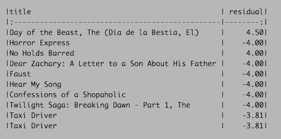

Note that these all seem to be obscure movies and in our model many of them obtained large predictions. So why did this happen? To see what's going on, let's look at the top 10 best movies in the top 10 worst movies based on the estimates of the movie effect b-hat_i. So we can see the movie titles, we're going to create a database that includes movie ID and titles using this very simple code.

```{r}
movie_titles <- movielens %>%
  select(movieId, title) %>%
  distinct()


movie_avgs %>%
  left_join(movie_titles, by= "movieId") %>%
  arrange(desc(b_i)) %>%
  select(title, b_i) %>% 
  slice(1:10) %>%
  knitr::kable()
  
```


So here are the best 10 movies according to our estimates.

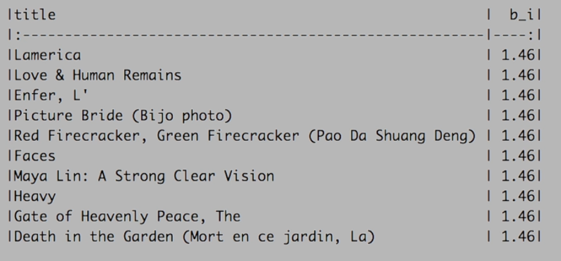

"Lamerica" is number one, "Love & Human Remains" is also number one, "L'Enfer" is number one. Look at the rest of the movies in this table. And here are the top 10 worst movies.

```{r}
movie_avgs %>%
  left_join(movie_titles, by= "movieId") %>%
  arrange(b_i) %>%
  select(title, b_i) %>% 
  slice(1:10) %>%
  knitr::kable()
  
```
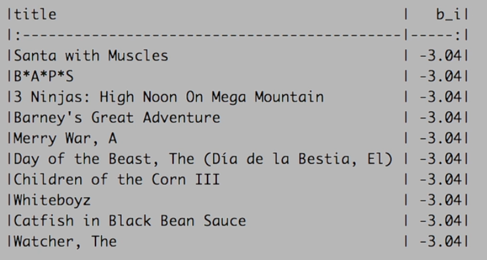

The first one started with "Santa with Muscles." Now they all have something in common. They're all quite obscure. So let's look at how often they were rated. Here's the same table, but now we include the number of ratings
they received in our training set.


```{r}
train_set %>% count(movieId) %>%
  left_join(movie_avg) %>%
  left_join(movie_titles, by="movieId") %>%
  arrange(desc(b_i)) %>%
  select(title, b_i, n) %>%
  slice(1:10) %>%
  knitr::kable()
```
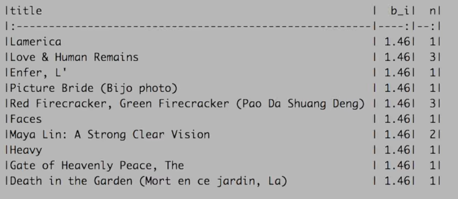


We can see the same for the bad movies.

```{r}
train_set %>% count(movieId) %>%
  left_join(movie_avg) %>%
  left_join(movie_titles, by="movieId") %>%
  arrange(b_i) %>%
  select(title, b_i, n) %>%
  slice(1:10) %>%
  knitr::kable()
```

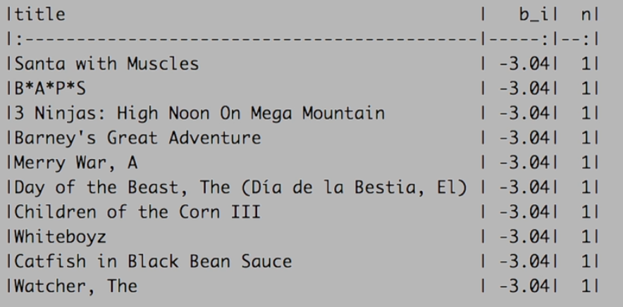


So the supposed best and worst movies were rated by very few users, in most cases just one. These movies were mostly obscure ones.**This is because with just a few users, we have more uncertainty,** therefore larger estimates of bi, negative or positive, are more likely when fewer users rate the movies. These are basically noisy estimates that we should not trust, especially when it comes to prediction. Large errors can increase our residual mean squared error, so we would rather be conservative when we're not sure. Previously we've learned to compute standard errors and construct confidence intervals to account for different levels of uncertainty. However, when making predictions we need one number, one prediction, not an interval. For this, we introduce the concept of regularization. **Regularization permits us to penalize large estimates that come from small sample sizes.** It has commonalities with the Bayesian approaches that shrunk predictions.  

The general idea is to add a penalty for large values of b to the sum of squares equations that we minimize. So having many large b's makes it harder to minimize the equation that we're trying to minimize. One way to think about this is that if we were to fit an effect to every rating, we could of course make the sum of squares equation by simply making each b match its respective rating y. This would yield an unstable estimate that changes drastically with new instances of y. 
Remember y is a random variable. But by penalizing the equation, we optimize to be bigger when the estimates b are far from zero. We then shrink the estimates towards zero. Again, this is similar to the Bayesian approach we've seen before.  

So this is what we do. **To estimate the b's instead of minimizing the residual sum of squares as is done by least squares, we now minimize this equation.**

$$
\frac{1}{N} \Sigma_{u,i}(y_{u,i} - \mu - b_i)^2 + \lambda\Sigma_i b_i^2
$$

**Note the penalty term. The first term is just the residual sum of squares and the second is a penalty that gets larger when many b's are large. ** Using calculus, we can actually show that the values of b that minimize this equation are given by this formula, 

$$

\hat{b_i}(\lambda) = \frac{1}{\lambda + n_i} \Sigma_{u=1}^{n_i}(Y_{u,i} - \hat{\mu})
$$

where n_i is a number of ratings b for movie i. Note that this approach will have our desired effect. When n_i is very large, which will give us a stable estimate, then lambda is effectively ignored because n_i plus lambda is about equal to n_i. However, when n_i is small, then the estimate of b_i is shrunken towards zero. The larger lambda, the more we shrink.
So let's compute these regularized estimates of b_i using lambda equals to 3.0. Later we see why we picked this number.
So here is the code.


```{r}
lambda <- 3
mu <- mean(train_set$rating)
movie_reg_avg <-train_set %>%
  group_by(movieId) %>%
  summarize(b_i = sum(rating - mu)/(n()+lambda), n_i = n())
```


To see how the estimates shrink, let's make a plot of the regularized estimate versus the least square estimates with the size of the circle telling us how large ni was.


You can see that when n is small, the values are shrinking more towards zero. All right, so now let's look at our top 10 best movies based on the estimates we got when using regularization.


```{r}
left_join(movie_titles, by="movieId") %>%
  arrange(desc(b_i)) %>%
  select(title, b_i, n) %>%
  slice(1:10) %>%
  knitr::kable()
```

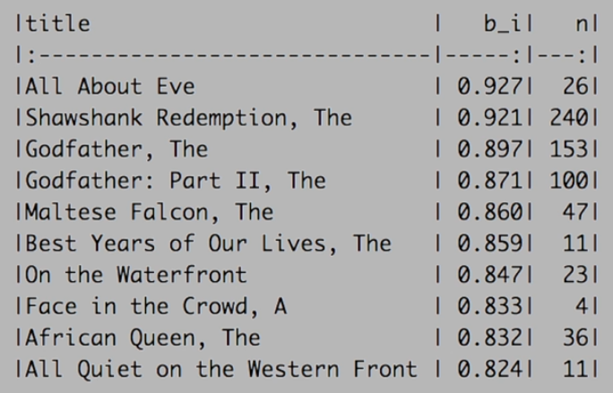

Note that the top five movies are now "All About Eve," "Shawshank Redemption," "The Godfather," "The Godfather II," and "The Maltese Falcons." This makes much more sense.

```{r}
left_join(movie_titles, by="movieId") %>%
  arrange(b_i) %>%
  select(title, b_i, n) %>%
  slice(1:10) %>%
  knitr::kable()
```

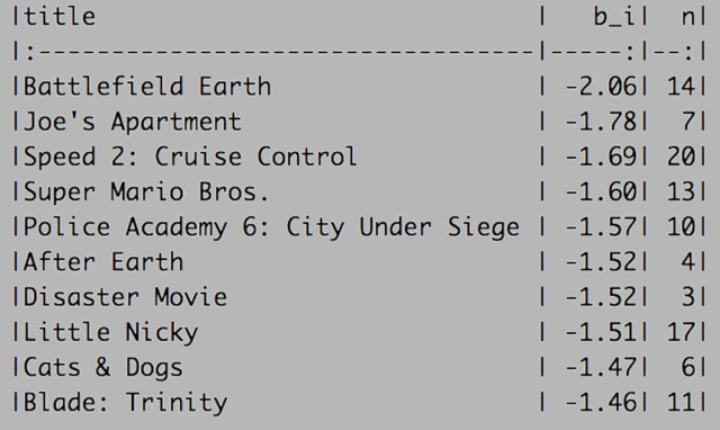

We can also look at the worst movies and the worst five are "Battlefield Earth," "Joe's Apartment," "Speed 2: Cruise
Control," "Super Mario Bros," and "Police Academy 6: City Under Siege." Again, this makes sense. So do we improve our results? We certainly do.

```{r}
predicted_ratings <- test_set %>% 
  left_join(movie_reg_avg, by="movieId") %>%
  mutate(pred = mu + b_i) %>%
  .$pred

model_3_rmse <- RMSE(predicted_ratings, test_set$rating)
rmse_results <- bind_rows(rmse_results, data_frame(method="Regularized Movie Effect Model", RMSE = model_3_rmse))

rmse_results %>% knitr::kable()
```

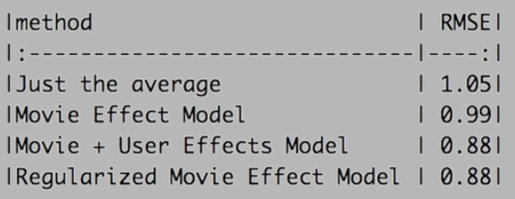

We get the residual mean squared error all the way down to 0.885 from 0.986. So this provides a very large improvement. Now note that lambda is a tuning parameter. We can use cross-validation to choose it. We can use this code to do this.


```{r}
lambdas <- seq(0,10,0.25)

mu <- mean(train_set$rating)
just_the_sum <- train_set %>%
  group_by(movieId) %>%
  summarize(s = sum(rating-mu), n_i = n())

rmses <- apply(lambdas, function(l){
  predicted_ratings <- test_set %>%
    left_join(just_the_sum, by="movieId") %>%
    mutate(b_i = s/(n_i + l)) %>%
    mutate(pred = mu + b_i) %>%
    .$pred
  return(RMSE(predicted_ratings, test_set$rating))
})

```

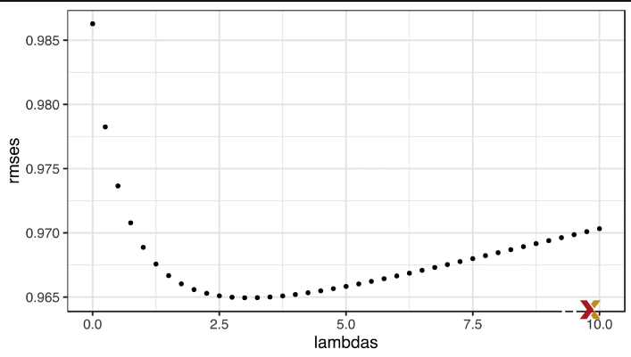

And we see why we picked 3.0 as lambda. One important point. **Note that we show this as an illustration and in practice, we should be using full cross-validation just on a training set without using the test set until the final assessment.**

We can also use regularization to estimate the user effect. The equation we would minimize would be this one now.

$$
\frac{1}{N} \Sigma_{u,i}\Sigma(y_{i,u} - \mu - b_i - b_u)^2 + \lambda(\Sigma_i b_i^2 + \Sigma_u b_u^2)
$$

It includes the parameters for the user effects as well. The estimates that minimize this can be found similarly to what we did previously. Here we again use cross-validation to pick lambda.
The code looks like this, and we see what lambda minimizes our equation.

```{r}
lambdas <- seq(0,10,0.25)

rmses <- sapply(lambdas, function(l){
  
  mu <- mean(train_set$rating)
  
  b_i <- train_set %>%
    group_by(movieId) %>%
    summarize(b_i = sum(rating - mu)/(n()+l))
  
  b_u <- train_set %>%
    left_join(b_i, by ="movieId") %>%
    group_by(userId) %>%
    summarize(b_u = sum(rating - b_i - mu)/(n()+l))
  
  predicted_ratings <- test_set %>%
    test_set %>%
    left_join(b_i, by = "movieId") %>%
    left_join(b_u, by = "userId") %>%
    mutate(pred = mu + b_i + b_u) %>%
    .$pred
  
  return(RMSE(predicted_ratings, test_set$rating))
})

```


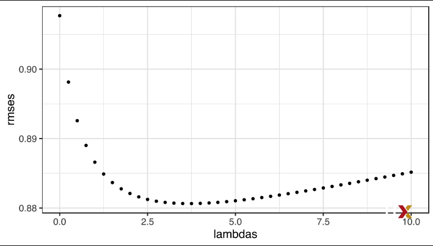

For the full model including movie and user effects,the optimal lambda is 3.75.

```{r}
lambda <- lambdas[which.min(rmses)]
lambda
```

And we can see that we indeed improved our residual mean squared error. Now it's 0.881.

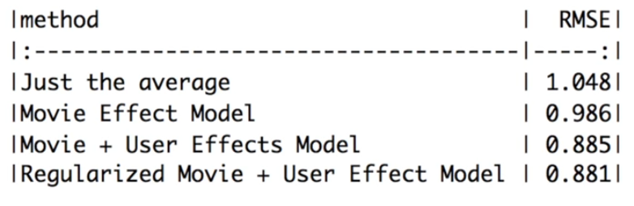

### Matrix Factorization

Matrix factorisation is a widely used concept in machine learning. **It is very much related to factor analysis, single value composition, and principal component analysis, or PCA.** Here we describe the concept in the context of movie recommendation systems.  

We have previously described the following model 

$$
Y_{u,i} = \mu + b_i + b_u + \epsilon_{u,i}
$$

which accounts for movie and movie differences through the parameters b_i, and user reviews or differences through parameters b_u. But this model leaves out an important source of variation related to the fact that groups of movies have similar rating patterns and groups of users have similar rating patterns as well. We will discover these patterns by studying the residuals obtained after fitting our model. These residuals.

$$
r_{u,i} = y_{u,i} - \hat{b}_i - \hat{b}_u
$$


To study these residuals, we will convert the data into a matrix so that each user gets a row and each movie gets a column. So y_u,i is the entry in row u and column i. User u, movie i. For illustration purposes, we will only consider a small subset of movies with many ratings and users that have rated many movies. We will use this code to generate our training data.

```{r}
train_small <- movielens %>%
  group_by(movieId) %>%
  filter(n() >= 50 | movieId == 3252) %>% # 3252 is "Scent of a Woman" used in this example
  ungroup() %>%
  group_by(userId) %>%
  filter(n() >= 50) %>%
  ungroup()

y <- train_small %>%
  select(userId, movieId, rating) %>%
  spread(movieId, rating) %>%
  as.matrix()
```

To facilitate exploration we add row names and column names.
```{r}
rownames(y) <- y[,1]
y <- y[,-1]

colnames(y) <- with(movie_titles, title[match(colnames(y), movieId)])

```

The column names will be the movie names. And we convert these residuals by removing the column and row averages. Here's the code.

```{r}
y <- sweep(y, 1, rowMeans(y, na.rm = TRUE))
y <- sweep(y, 2, colMeans(y, na.rm = TRUE))
```


OK, now. If the model we've been using describes all the signal and the extra ones are just noise, then the residuals for different movies should be independent of each other. But they are not. Here's an example.


Here's a plot of the residuals for The Godfather and The Godfather II. They're very correlated. This plot says that users that liked the godfather more than what the model expects them to based on the movie and user effects also like The Godfather II more than expected. The same is true for The Godfather and Goodfellas. You can see it in this plot.

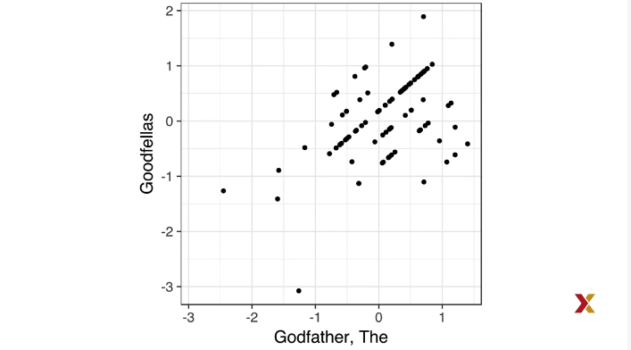


Although not as strong, there still is a correlation. We see a correlation between other movies as well. For example, here's a correlation between You've Got Mail and Sleepless in Seattle. 


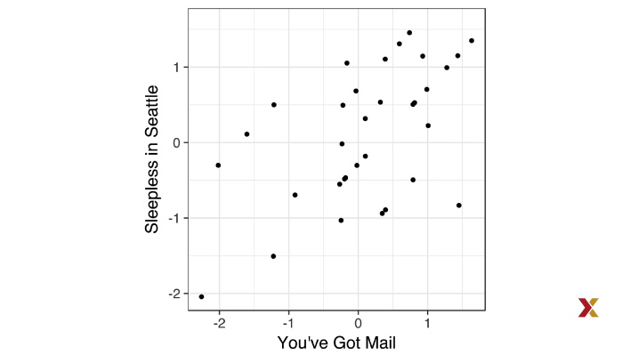

We can see a pattern. If we look at the pairwise correlation for these five movies, 


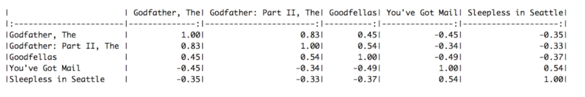

we can see that there's a positive correlation between the gangster movies Godfathers and Goodfellas, and then there's a positive correlation between the romantic comedies You've Got Mail and Sleepless in Seattle. We also see a negative correlation between the gangster movies and the romantic comedies. This means that users that like gangster movies a lot tend to not like romantic comedies and vise versa. This result tells us that there is structure in the data that the model does not account for. So how do we model this? Here is where we use matrix factorization. We're going to define factors.
Here's an illustration of how we could use some structure to predict the residuals.  

Suppose the residuals look like this. This is a simulation. 

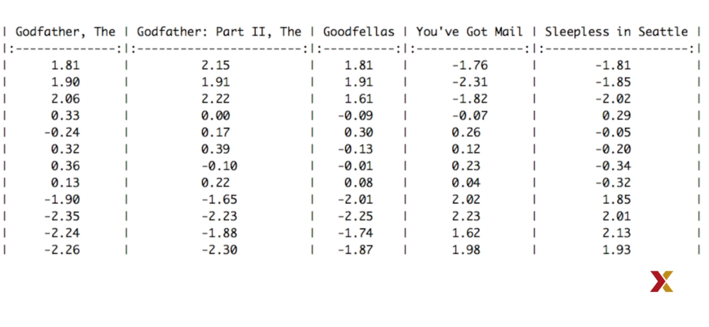


There seems to be a pattern here. It's based on what we saw with the real data. There's a gangster movie effect and there's a romantic comedy effect. In fact, we see a very strong correlation pattern, which we can see here. 

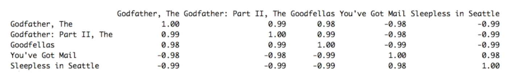

This structure could be explained using the following coefficients. 

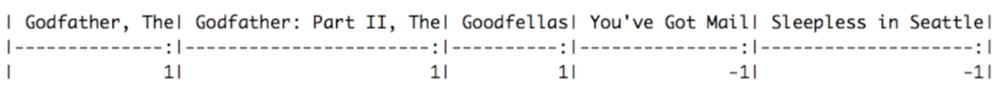

We assign a 1 to the gangster movies and a minus one to the romantic comedies. In this case, we can narrow down movies to two groups, gangster and romantic comedy.  

Note that we can also reduce the users to three groups, those that like gangster movies but hate romantic comedies, the reverse, and those that don't care.

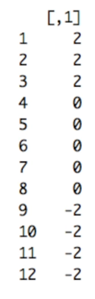


The main point here is that we can reconstruct this data that has 60 values with a couple of vectors totaling 17 values. Those two vectors we just showed can be used to form the matrix with 60 values. We can model the 60 residuals with the 17 parameter model like this.

$$
r_{u,i} \approx p_uq_i
$$


And this is where the factorization name comes in. We have a matrix r and we factorized it into two things, the vector p,
and the vector q. Now we should be able to explain much more of the variance if we use a model like this one.  

$$
Y_{u,i} = \mu + b_i + b_u + p_uq_i + \epsilon_{i,j}

$$


Now the structure in our movie data seems to be much more complicated than gangster movie versus romantic comedies. We have other factors.  

For example, and this is a simulation, let's suppose we had the movie Scent of a Woman, and now the data looks like this.

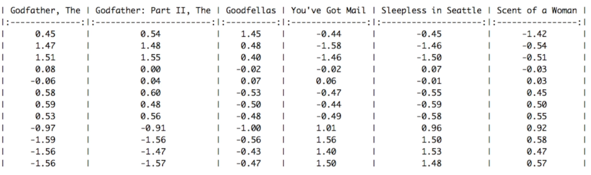

Now we see another factor, a factor that divides users into those that love, those that hate, and those that don't care for Al Pacino. The correlation is a bit more complicated now. We can see it here.

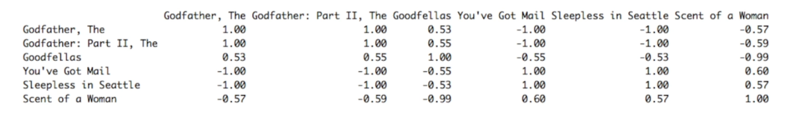

Now to explain the structure, we need two factors. Here they are.

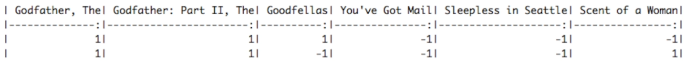

The first one divides gangster movies from romantic comedies. The second factor divide Al Pacino movies and non Al Pacino movies. And we also have two sets of coefficients to describe the users. You can see it here.

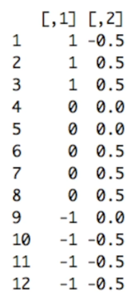

The model now has more parameters, but still less than the original data So we should be able to fit this model using, for example, the least squares method.

$$
Y{u,i} = \mu + b_i + b_u + p_{u,1}q_{1,i} + p_{u,2}q_{2,i} + \epsilon_{i,j}
$$

However, for the Netflix challenge, they used regularization, and they penalize not just the user and movie effects, but also large values of the factors p or q. Now does this simulation match the actual data? Here are the correlation we get for the movies we just showed, but using the actual data.

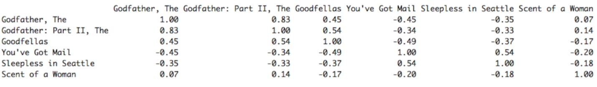

Notice that the structure is similar. However, if we want to find the structure using the data as opposed to constructing it ourselves as we did in the example, we need to fit models to data. So now we have to figure out how to estimate factors from the data as opposed to defining them ourselves. One way to do this is to fit models, but we can also use principle component analysis or equivalently, the singular value decomposition to estimate factors from data. And we're going to show that in the next video.

### SVD and PCA

The matrix factorization decomposition that we showed in the previous video that looks something like this 

$$
r_{u,i} \approx p_{u,1}q_{1,i} + p_{u,2}q_{2,i}
$$ 

is very much **related to singular value decomposition and PCA.**  

Singular value decomposition and principal component analysis are complicated concepts, but one way to understand them is to think of, for example, singular value decomposition as an algorithm that finds the vectors p and q that permit us to write the matrix of residuals r with m rows and n columns in the following way.

$$
r_{u,i} = p_{u,1}q_{1,i} + p_{u,2}q{2,i} + \dots + p_{u,m}q_{m,i}
$$

But with the added bonus that the variability of these terms is decreasing and also that the p's are uncorrelated to each other. The algorithm also computes these variabilities so that we can know how much of the matrix's total variability is explained as we add new terms. This may permit us to see that with just a few terms, we can explain most of the variability.  


Let's see an example with our movie data. To compute the decomposition, will make all the NAs zero. So we will write this code.

```{r}
y[is.na(y)] <- 0
y <- sweep(y, 1, rowMeans(y))
pca <- prcomp(y)
```

The vectors q are called the principal components and they are stored in this matrix.

```{r}
dim(pca$rotation)
# 454  292
```

While the p vectors, which are the user effects, are stored in this matrix.

```{r}
dim(pca$x)
# 292  292
```


The PCA function returns a component with the variability of each of the principal components and we can access it like this and plot it.

```{r}
plot(pca$sdev)
```


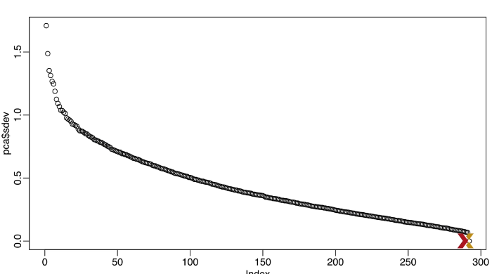

We can also see that just with a few of these principal components we already explain a large percent of the data. So for example, with just 50 principal components we're already explaining about half the variability out of a total of over 300 principal components.

```{r}
var_explaned <- cumsum(pca$sdev^2/sum(pca$sdev^2))
plot(var_explaned)
```

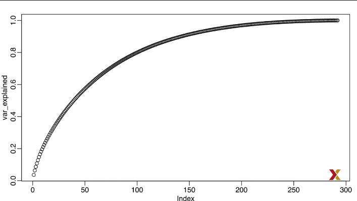

To see that the principal components are actually capturing something important about the data, we can make a plot of for example, the first two principal components, 

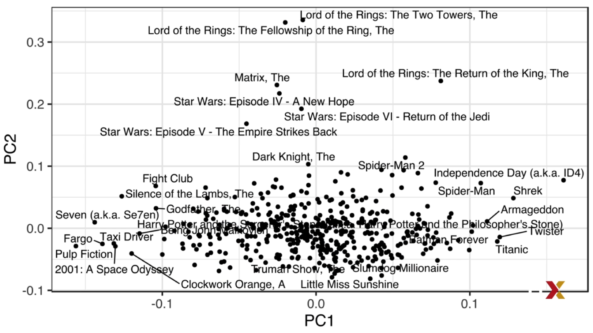

but now label the points with the movie that each one of those points is related to. Just by looking at the top three in each direction, we see meaningful patterns. The first principle component shows the difference between critically acclaimed movies on one side.

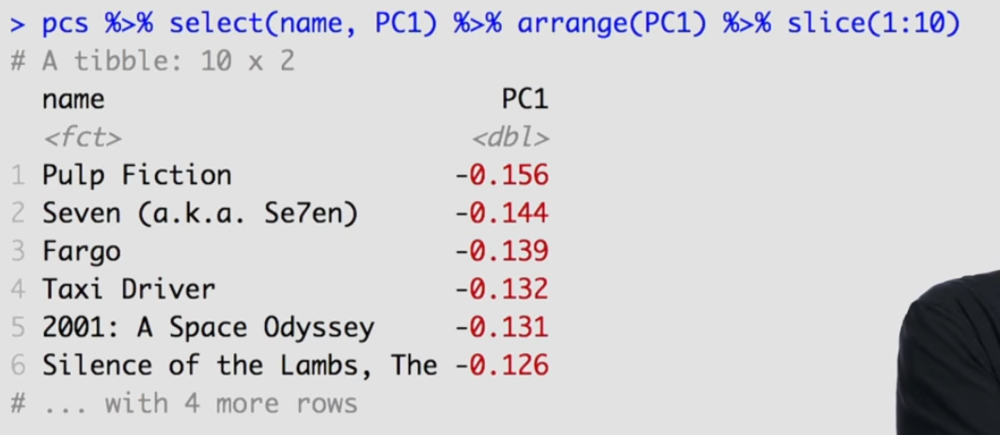

Here are the one extreme of the principal component.You can see Pulp Fiction, Seven, Fargo, Taxi Driver, and Hollywood blockbusters on the other.


So this principle component has critically acclaimed movies on one side and blockbusters on the other. It's separating out movies that have structure and they're determined by users that like these more than these and others that like these more than that.

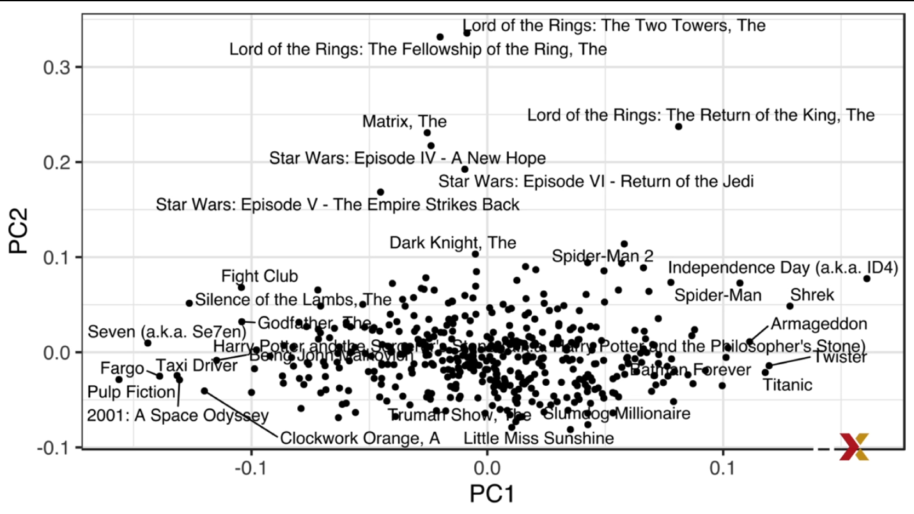

We can also see that the second principle component also seems to capture structure in the data. If we look at one extreme of this principle component, we see artsy independent films such as Little Miss Sunshine, the Truman Show, and Slumdog Millionaire.

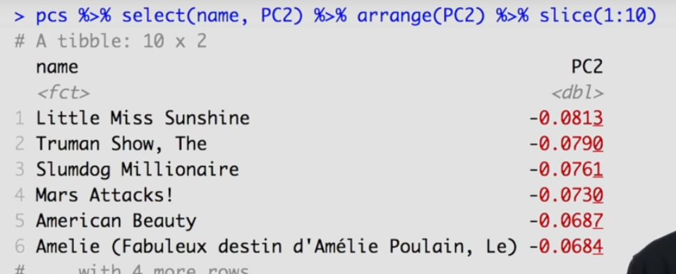

When we look at the other extreme, we see what I would call nerd favorites, The Lord of the Rings, Star Wars, The Matrix.

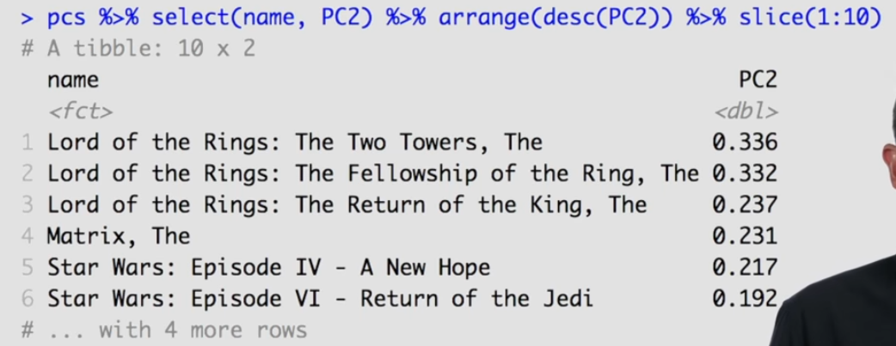

**So using principal components analysis, we have shown that a matrix factorization approach can find important structure in our data. Now to actually fit the matrix factorization model that we presented earlier that takes into account that there
is missing data, that there's missing cells in the matrix, is a bit more complicated. For those interested we recommend trying the recommended lab package which fits these models.**

