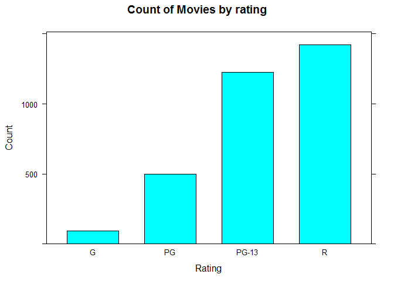
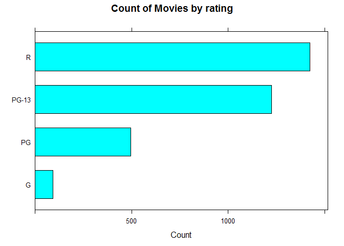
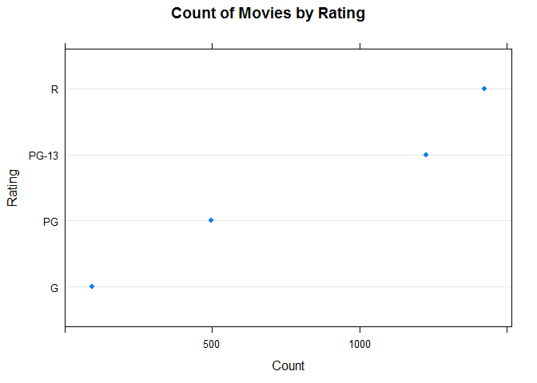
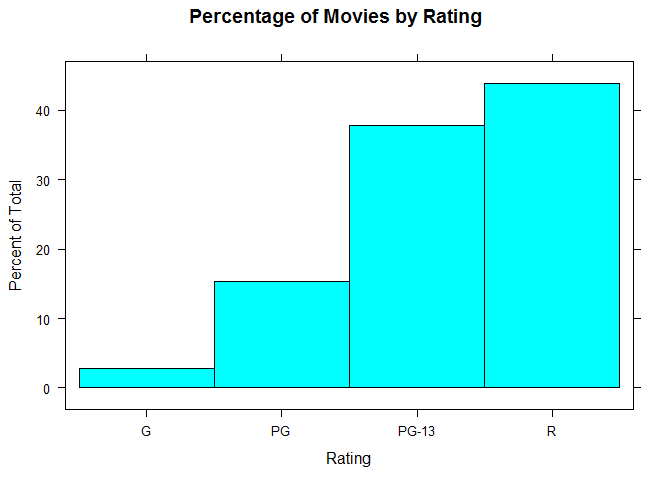

Visualizing one categorical Variable - Lattice
================

Environment setup
-----------------

``` r
library(lattice)
```

    ## Warning: package 'lattice' was built under R version 3.5.2

Load movie data from CSV file

``` r
movies <- read.csv("../data/Movies.csv")
```

Create frequency table of ratings

``` r
table <- table(movies$Rating)
ratings <- as.data.frame(table)
names(ratings)[1] <- "Rating"
names(ratings)[2] <- "Count"

print(ratings)
```

    ##   Rating Count
    ## 1      G    93
    ## 2     PG   497
    ## 3  PG-13  1225
    ## 4      R  1423

Frequency bar chart
-------------------

Create a frequency bar chart

``` r
barchart(
  x= Count ~ Rating,
  data = ratings,
  main = "Count of Movies by rating",
  xlab = "Rating"
)
```



Create a horizontal bar chart

``` r
barchart(
  x = Rating ~ Count,
  data = ratings,
  main = "Count of Movies by rating",
  xlab = "Count"
)
```



Cleveland dot plot
------------------

Create Cleveland dot plot

``` r
dotplot(
  x = Rating ~ Count,
  data = ratings,
  main = "Count of Movies by Rating",
  ylab = "Rating")
```



Histogram chart
---------------

*Lattice does not have pie chart*

Create a part-of-whole frequency bar chart

``` r
histogram(
  x = ~Rating,
  data = movies,
  main = "Percentage of Movies by Rating"
)
```


