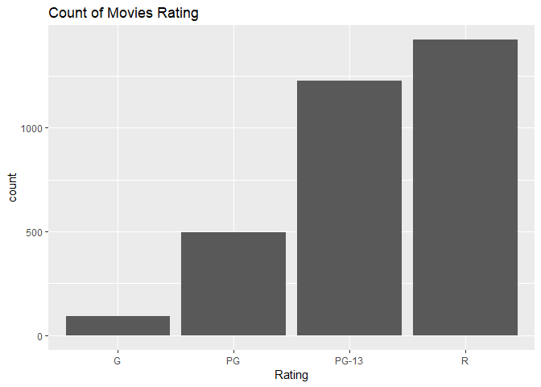
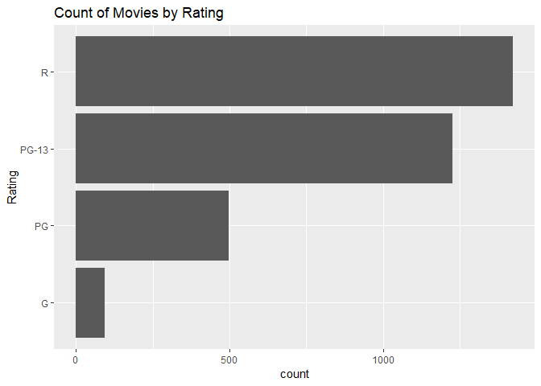
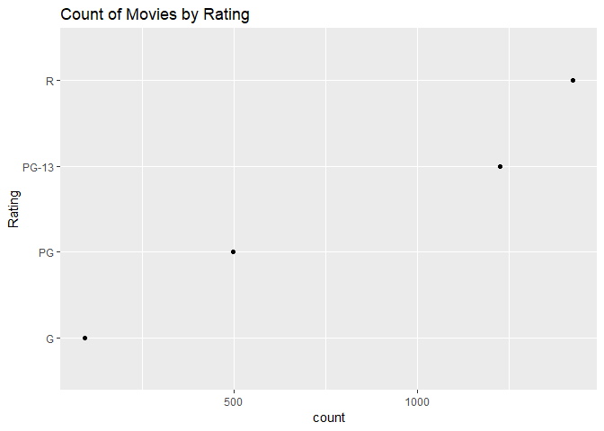
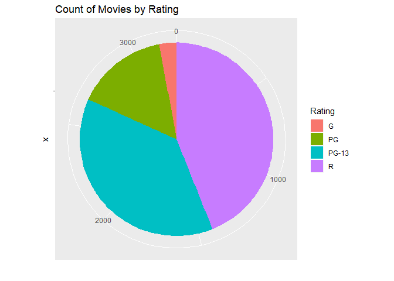
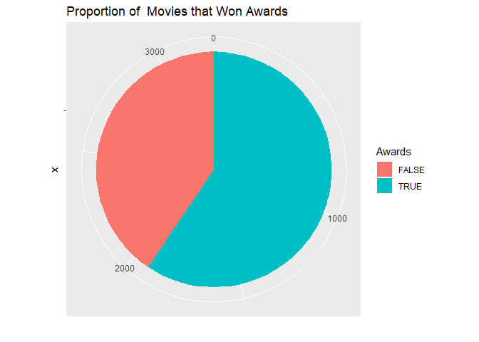

Visualizing one categorical Variable - GGPlot
================

Environment setup
-----------------

Loading library

``` r
library(ggplot2)
```

    ## Warning: package 'ggplot2' was built under R version 3.5.2

Load movie data from CSV file

``` r
movies <- read.csv("../data/Movies.csv")
```

Frequency chart
---------------

Create a frequency bar chart for rating

``` r
ggplot(
  data = movies,
  aes(x = Rating)) +
  geom_bar() +
  ggtitle("Count of Movies Rating")
```



Create a horizontal frequency bar chart for genre

``` r
ggplot(
  data= movies,
  aes(x = Rating)) + 
  geom_bar() +
  coord_flip() +
  ggtitle("Count of Movies by Rating")
```



Cleveland dot plot
------------------

Create cleveland dot plot

``` r
ggplot(
  data= movies,
  aes(x= Rating)) +
  geom_point(stat ="count") +
  coord_flip() +
  ggtitle("Count of Movies by Rating")
```



Pie chart
---------

Create a pie chart

``` r
ggplot(
  data = movies,
  aes(x="", fill = Rating)) + 
  geom_bar() + 
  coord_polar(theta = "y")+
  ggtitle("Count of Movies by Rating") +
  ylab("")
```



Create a pie chart of awards

``` r
ggplot(
  data=movies,
  aes(x="", fill=Awards)) +
  geom_bar() +
  coord_polar(theta = "y") +
  ggtitle("Proportion of  Movies that Won Awards") +
  ylab("")
```


