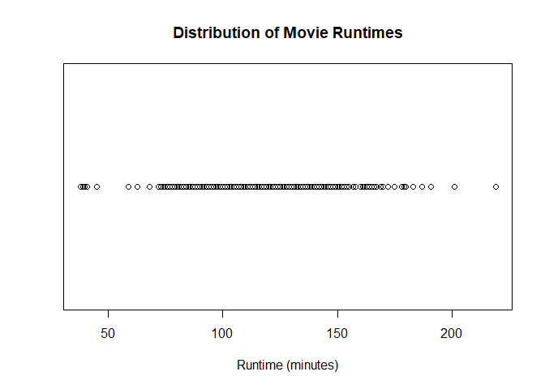
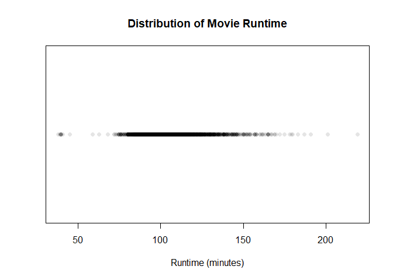
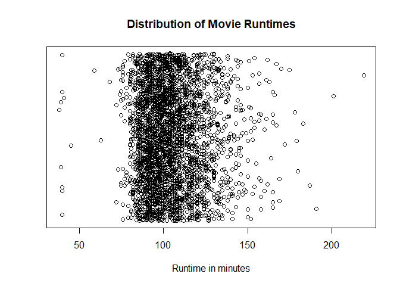
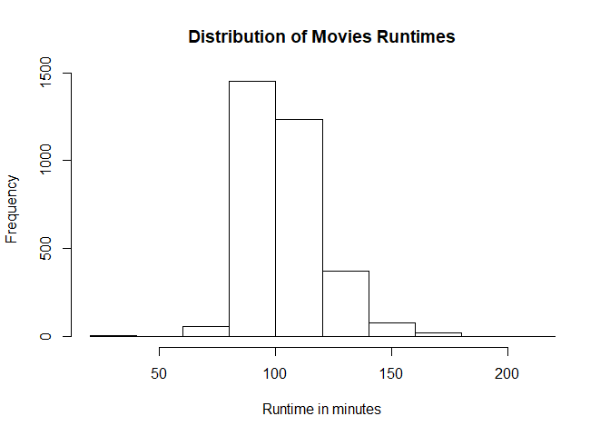
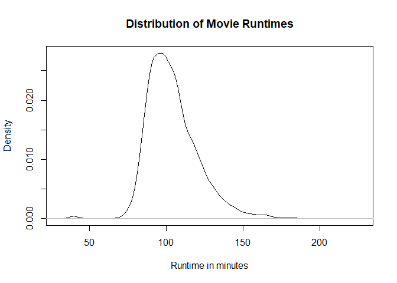
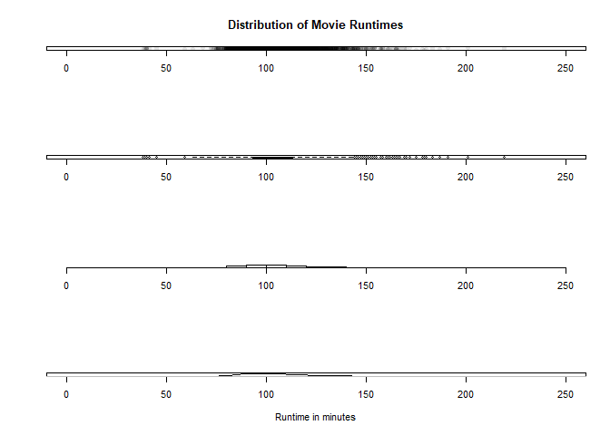

Visualizing One Numeric Variable
================

We are requested to answer these questions:

    1. What is the average movie runtime?
    2. Are there any outliers?
    3. How spread out are the movie runtimes?
    4. What is the shape of the runtime distribution?

Univariate visualizations of a quantitiative variable

Setup environment
-----------------

``` r
movies = read.csv("../data/Movies.csv")
```

Plot
----

Create a dot plot of runtime

``` r
plot(
  x = movies$Runtime,
  y = rep(0, nrow(movies)),
  main = "Distribution of Movie Runtimes",
  xlab = "Runtime (minutes)",
  ylab = "",
  yaxt = "n"
)
```



Creating the same previous plot, but now with alpha

``` r
plot(
  x = movies$Runtime,
  y = rep(0, nrow(movies)),
  main = "Distribution of Movie Runtime",
  xlab = "Runtime (minutes)",
  ylab = "",
  yaxt = "n",
  pch = 16,
  col = rgb(0,0,0,0.1))
```



Add jitter to dot plot, this assign each sample a random y value, so they are not overlap and you can see where the samples are concentrated.

``` r
plot(
  x = movies$Runtime,
  y= jitter(rep(0,nrow(movies))),
  main = "Distribution of Movie Runtimes",
  xlab = "Runtime in minutes",
  ylab = "",
  yaxt = "n")
```



Boxplot
-------

Create a boxplot of runtime

``` r
boxplot(
  x = movies$Runtime,
  horizontal = TRUE,
  main = "Distribution of Movie Runtimes",
  xlab = "Runtime in minutes"
)
```


Histogram
---------

Historgram of runtime

``` r
hist(
  x = movies$Runtime,
  main= "Distribution of Movie Runtimes",
  xlab = "Runtime in minutes"
)
```


Creating a more course-grain histogram

``` r
hist(
  x= movies$Runtime,
  main = "Distribution of Movies Runtimes",
  breaks = 10,
  xlab = "Runtime in minutes"
)
```



Creating a more fine-grain histogram

``` r
hist(
  x = movies$Runtime,
  main = "Distribution of Movies Runtimes",
  breaks = 30,
  xlab = "Runtime in minutes"
)
```


Density plot
------------

Creating a density plot of runtime

``` r
plot(
  x = density(movies$Runtime),
  main = "Distribution of Movie Runtimes",
  xlab = "Runtime in minutes"
)
```



All in one
----------

Create small multiples of all four

``` r
par(mfrow= c(4,1))

plot(
  x= movies$Runtime,
  y = jitter(rep(0,nrow(movies))),
  xlim = c(0,250),
  main = "Distribution of Movie Runtimes",
  xlab = "",
  ylab = "",
  yaxt = "n",
  pch = 16,
  col = rgb(0,0,0,0.1))

boxplot(
  x = movies$Runtime,
  ylim= c(0,250),
  horizontal = TRUE
)

hist(
  x= movies$Runtime,
  xlim = c(0,250),
  main = "",
  xlab = "",
  ylab = "",
  yaxt = "n")

plot(
  x = density(movies$Runtime),
  xlim = c(0,250),
  main = "",
  xlab = "Runtime in minutes",
  ylab = "",
  yaxt = "n")
```



Then you can reset multirow display

``` r
par(mfrow = c(1,1))
```
