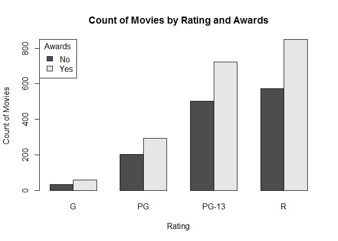
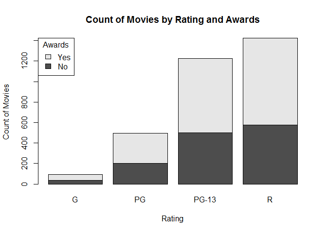
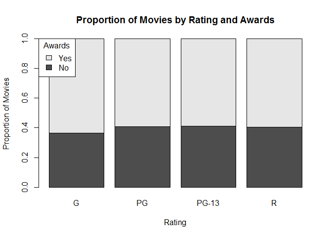
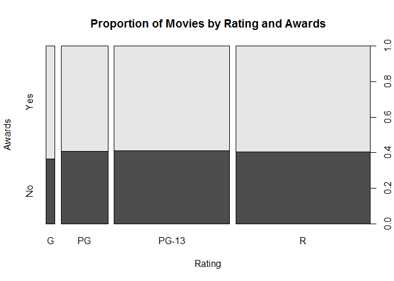
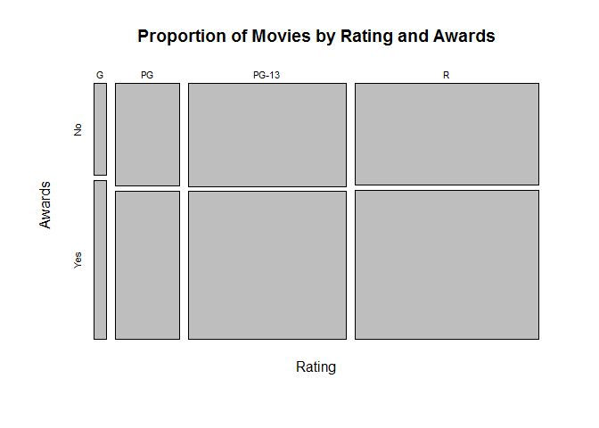

Visualizing Two Categorical Variables
================

We are requested to answer these questions:

    1. How many award-winning movies are in each rating category?
    2. What proportion of movies in each category have won awards?

Bivariate visualizations for two qualititative variables

Setup environment
-----------------

Load data and create a contingency table

``` r
movies <- read.csv("../data/Movies.csv")
awards <- table(movies$Awards,
                movies$Rating)
main_title <- "Count of Movies by Rating and Awards"
rating_title <- "Rating"
movies_title <- "Count of Movies"
print(awards)
```

    ##        
    ##           G  PG PG-13   R
    ##   FALSE  34 203   502 574
    ##   TRUE   59 294   723 849

Bar Chart
---------

### Grouped frequency bar chart

``` r
barplot(
  height = awards,
  beside = TRUE,
  main = main_title,
  xlab = rating_title,
  ylab = movies_title,
  legend = c("No","Yes"),
  args.legend = list(
    x = "topleft",
    title = "Awards"))
```



### Stacked Frequency bar chart

Create a stacked frequency bar chart

``` r
barplot(
  height = awards,
  main = main_title,
  xlab = rating_title,
  ylab = movies_title,
  legend =  c("No","Yes"),
  args.legend = list(
    x = "topleft",
    title="Awards"))
```



### 100% Stacked Frequency Bar Chart

Create a proportional Frequency table

``` r
proportions <- apply(awards, 2, function(x){x /sum(x)} )
head(awards)
```

    ##        
    ##           G  PG PG-13   R
    ##   FALSE  34 203   502 574
    ##   TRUE   59 294   723 849

``` r
head(proportions)
```

    ##        
    ##                 G        PG     PG-13         R
    ##   FALSE 0.3655914 0.4084507 0.4097959 0.4033732
    ##   TRUE  0.6344086 0.5915493 0.5902041 0.5966268

Create the bar chart.

``` r
barplot(
  height = proportions,
  main = "Proportion of Movies by Rating and Awards",
  xlab = rating_title,
  ylab = "Proportion of Movies",
  legend = c("No","Yes"),
  args.legend = list(
    x = "topleft",
    title = "Awards"))
```



### Spine Plot

We need to swamp the rows and columns for this chart.

``` r
awards <- table(
  movies$Rating,
  movies$Award)

colnames(awards) <- c("No", "Yes")

print(awards)
```

    ##        
    ##          No Yes
    ##   G      34  59
    ##   PG    203 294
    ##   PG-13 502 723
    ##   R     574 849

Create a spineplot

``` r
spineplot(
  x = awards,
  main = "Proportion of Movies by Rating and Awards",
  xlab = rating_title,
  ylab = "Awards")
```



### Mosaic plot

Creating Mosaic plot

``` r
mosaicplot(
  x = awards,
  main = "Proportion of Movies by Rating and Awards",
  xlab = rating_title,
  ylab = "Awards")
```


