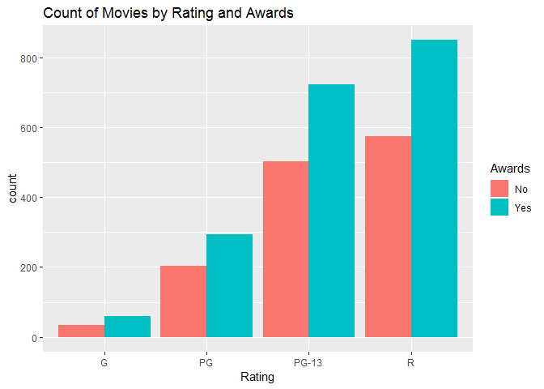
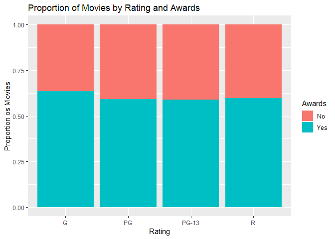

Visualizing Two Categorical Variables
================

We are requested to answer these questions:

    1. How many award-winning movies are in each rating category?
    2. What proportion of movies in each category have won awards?

Bivariate visualizations for two qualitiative variables

Setup environment
-----------------

Load data and create a contingency table

``` r
library(ggplot2)
movies <- read.csv("../data/Movies.csv")
awards <- table(
  movies$Rating,
  movies$Award)

colnames(awards) <- c("No", "Yes")

main_title <- "Count of Movies by Rating and Awards"
rating_title <- "Rating"
movies_title <- "Count of Movies"
print(awards)
```

    ##        
    ##          No Yes
    ##   G      34  59
    ##   PG    203 294
    ##   PG-13 502 723
    ##   R     574 849

Bar chart
---------

### Grouped frequency bar chart

Create a grouped frequency bar chart

``` r
ggplot(
  data = movies,
  aes(x = Rating, fill= Awards)) +
  geom_bar(position = "dodge") +
  ggtitle(main_title) +
  scale_fill_discrete(labels = c("No", "Yes"))
```



### Stacked frequency bar chart

``` r
ggplot(
  data = movies,
  aes(x = Rating, fill= Awards)) +
  geom_bar() +
  ggtitle(main_title) +
  scale_fill_discrete(labels=c("No","Yes"))
```


### Staked frequency bar chart

``` r
ggplot(
  data = movies,
  aes(x =Rating, fill= Awards)) +
  geom_bar(position="fill") + 
  ggtitle("Proportion of Movies by Rating and Awards") +
  ylab("Proportion os Movies") +
  scale_fill_discrete(labels=c("No","Yes"))
```



**NOTE**: *No spine plot or mosaic plot on GGPlot*
