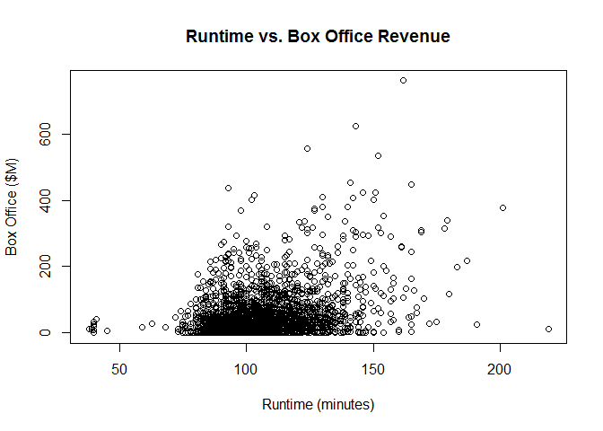
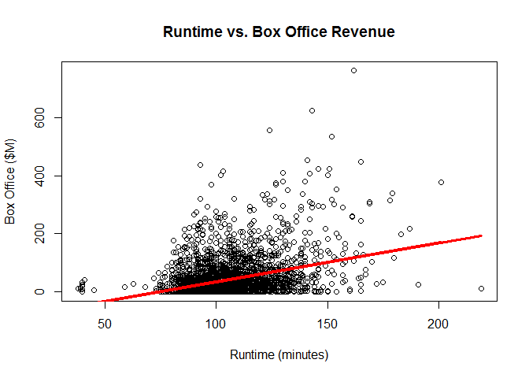
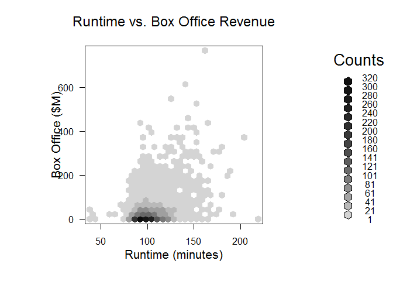
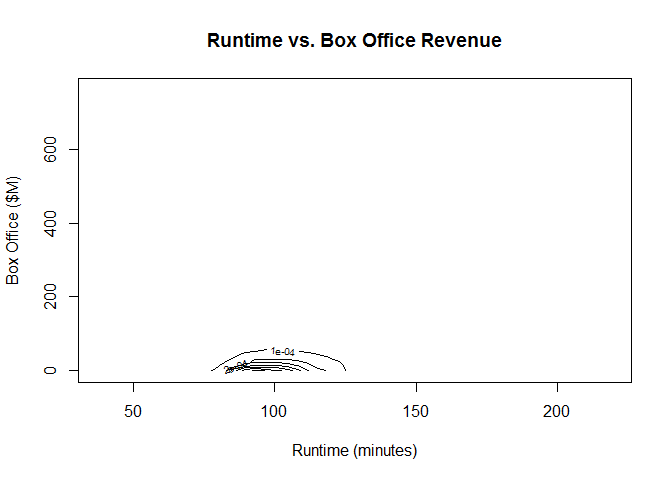
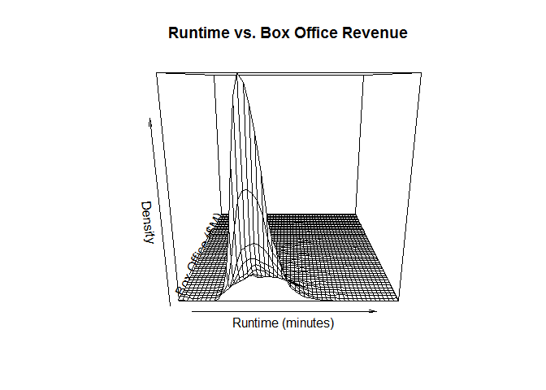
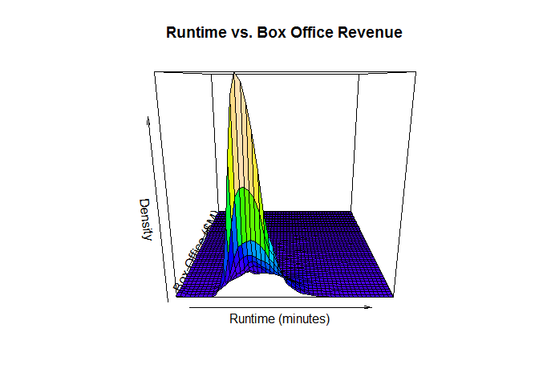
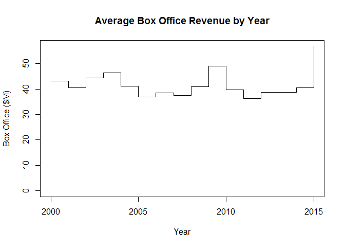

Visualizing Two Numeric Variables
================

We are requested to answer these questions:

    1. How are runtime and box-office revenue related?
    2. Has the average box-office revenue changed over time?

*Bivariate Visualization for two quantitiative variables* \#\# Setting up environment

``` r
movies <- read.csv('../data/Movies.csv')
main_label <- "Runtime vs. Box Office Revenue"
runtime_in_minutes_label <- "Runtime (minutes)"
box_office_label <- "Box Office ($M)"
density_label <- "Density"
```

Plots
-----

### Scatter plot

Create a scatterplot

``` r
plot(
  x = movies$Runtime,
  y = movies$Box.Office,
  main = main_label,
  xlab = runtime_in_minutes_label,
  ylab = box_office_label)
```



**Create a linear regression model**

``` r
model <- lm(movies$Box.Office ~ movies$Runtime)
```

Draw the linear regression line on the plot

``` r
plot(
  x = movies$Runtime,
  y = movies$Box.Office,
  main = main_label,
  xlab = runtime_in_minutes_label,
  ylab = box_office_label)

lines(
  x = movies$Runtime,
  y = model$fitted,
  col = "red",
  lwd = 3)
```



*As we can see there is a weak correlation between the two variables.*

### Heatmap

Now we need to install the package hexbin `install.packages("hexbin")`.

Now we load hexbin library

``` r
library(hexbin)
```

    ## Warning: package 'hexbin' was built under R version 3.5.2

Create a hexagonal binned frequency heatmap

``` r
hexbin <- hexbin(
  x = movies$Runtime,
  y = movies$Box.Office,
  xbins = 30,
  xlab = runtime_in_minutes_label,
  ylab = box_office_label)

plot(
  x = hexbin,
  main = main_label)
```



### MASS Package

For the following plots we need to create a 2D kernel density estimate using MASS, to install it we execute `install.packages("MASS")`

Now we load the library

``` r
library(MASS)
```

    ## Warning: package 'MASS' was built under R version 3.5.2

Now create a 2D kernel density estimation

``` r
density2d <- kde2d(
  x = movies$Runtime,
  y = movies$Box.Office,
  n = 50)
```

### Contour plot

Create a contour plot of density, as you can see for this scenario this visualizartion is not the best.

``` r
contour(
  x = density2d$x,
  y = density2d$y,
  z = density2d$z,
  main = main_label,
  xlab = runtime_in_minutes_label,
  ylab = box_office_label)
```



### Level plot of dentisty

Create a level plot of density, please note that this is not exactly the expected plot, but it close enough in the base library.

It is like density heatmap.

``` r
image(x = density2d$x,
      y = density2d$y,
      z = density2d$z,
      col =topo.colors(100),
      main = main_label,
      xlab = runtime_in_minutes_label,
      ylab = box_office_label)
```


### Mesh plot of density

Create a mesh plot of density

``` r
persp(
  x = density2d$x,
  y = density2d$y,
  z = density2d$z,
  main = main_label,
  xlab = runtime_in_minutes_label,
  ylab = box_office_label,
  zlab = density_label)
```



### Surface plot of density

Create surface plot of density

``` r
palette(topo.colors(100))

persp(
  x = density2d$x,
  y = density2d$y,
  z = density2d$z,
  col = cut(density2d$z,100),
  main = main_label,
  xlab = runtime_in_minutes_label,
  ylab = box_office_label,
  zlab = density_label)
```



Reset the color palette to default

``` r
palette("default")
```

### Load time series data

Load time series data

``` r
timeSeries <- read.csv("../data/Timeseries.csv")
```

Display the time series data

``` r
head(timeSeries)
```

    ##   Year Box.Office
    ## 1 2000   43.20957
    ## 2 2001   40.56887
    ## 3 2002   44.26228
    ## 4 2003   46.44941
    ## 5 2004   41.16540
    ## 6 2005   36.78063

### Step chart

Create a step chart

``` r
plot(
  x = timeSeries,
  type = "s",
  ylim = c(0, max(timeSeries$Box.Office)),
  main = "Average Box Office Revenue by Year",
  xlab = "Year",
  ylab = "Box Office ($M)")
```



### Line chart

Create a line chart

``` r
plot(
  x = timeSeries,
  type = "l",
  ylim = c(0, max(timeSeries$Box.Office)),
  main = "Average Box Office Revenue by Year",
  xlab = "Year",
  ylab = "Box Office ($M)")
```


### Area charts

Area charts are not easy to create on the base library, they will be included into lattice and ggplot exeamples.
