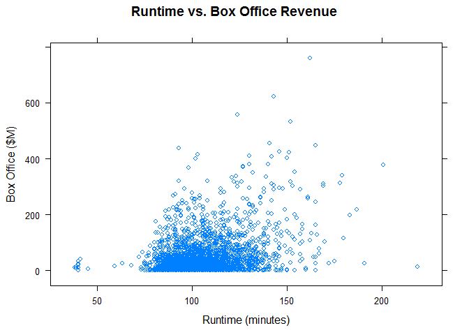
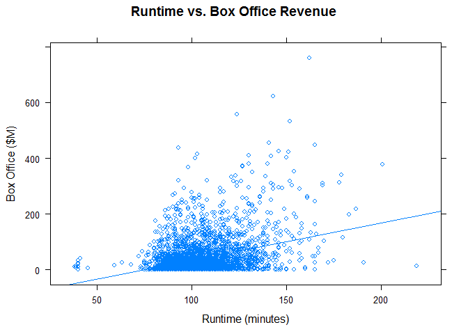
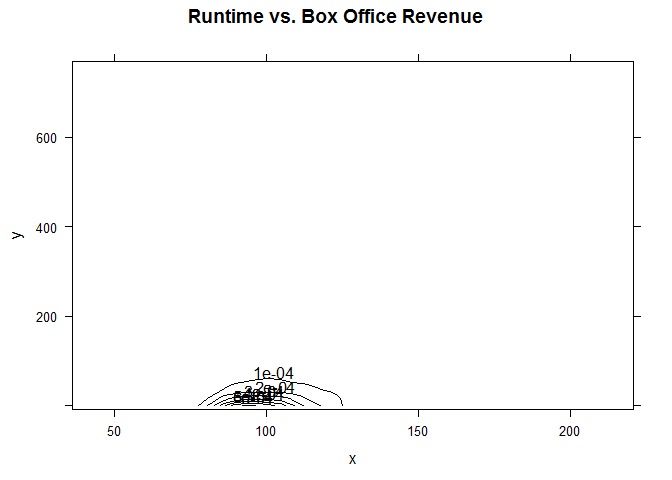
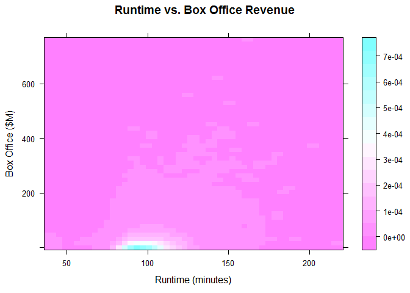
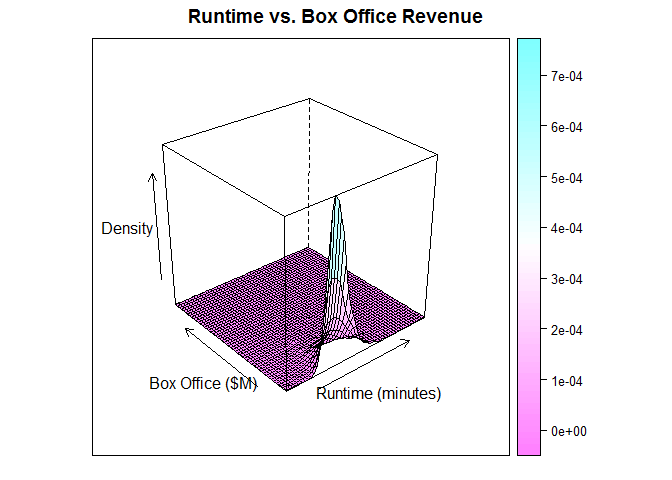
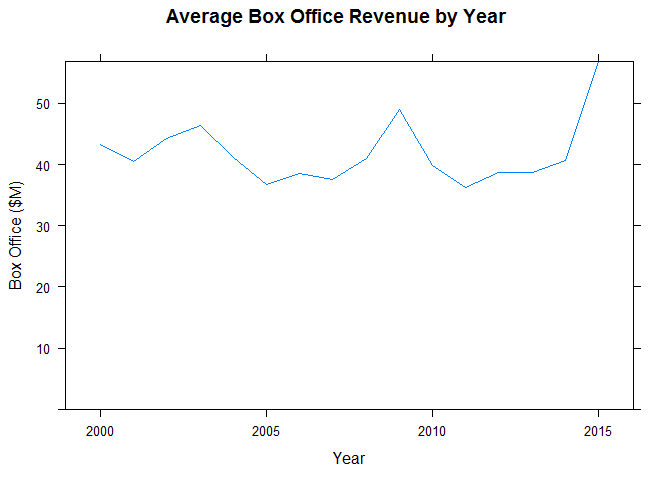
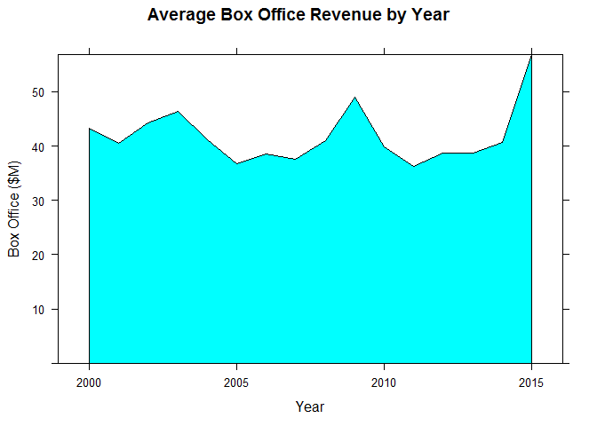

Visualizing Two Numeric Variables
================

We are requested to answer these questions:

    1. How are runtime and box-office revenue related?
    2. Has the average box-office revenue changed over time?

*Bivariate Visualization for two quantitiative variables* \#\# Setting up environment

``` r
library(lattice)
```

    ## Warning: package 'lattice' was built under R version 3.5.2

``` r
movies <- read.csv('../data/Movies.csv')
main_label <- "Runtime vs. Box Office Revenue"
runtime_in_minutes_label <- "Runtime (minutes)"
box_office_label <- "Box Office ($M)"
density_label <- "Density"
```

Plots
-----

### Scatter Plot

Create a scatterplot

``` r
xyplot(
  x = Box.Office ~ Runtime,
  data = movies,
  main = main_label,
  xlab = runtime_in_minutes_label,
  ylab = box_office_label)
```



#### Adding a regression line

``` r
xyplot(
  x = Box.Office ~ Runtime,
  data = movies,
  type = c("p","r"), # p stands for points and r stands for regression
  main = main_label,
  xlab = runtime_in_minutes_label,
  ylab = box_office_label)
```



### Load hexbin library

``` r
library(hexbin)
```

    ## Warning: package 'hexbin' was built under R version 3.5.2

### Hexagonal binned frequency heatmap

Create hexagonal binned frequency heatmap

``` r
hexbinplot(
  x = Box.Office ~ Runtime,
  data = movies,
  xbins = 30,
  main = main_label,
  xlab = runtime_in_minutes_label,
  ylab = box_office_label)
```


### Grid from our 2D kernel density estimate

#### MASS Package

For the following plots we need to create a 2D kernel density estimate using MASS, to install it we execute `install.packages("MASS")`

Now we load the library

``` r
library(MASS)
```

    ## Warning: package 'MASS' was built under R version 3.5.2

Now create a 2D kernel density estimation

``` r
density2d <- kde2d(
  x = movies$Runtime,
  y = movies$Box.Office,
  n = 50)
```

Create a grid from our 2D kernel density estimate, the data structure is a *data frame*

``` r
grid <- expand.grid(
  x = density2d$x,
  y = density2d$y)

grid$z <- as.vector(density2d$z)
```

Display the data frame

``` r
head(grid)
```

    ##          x        y            z
    ## 1 38.00000 0.000181 4.450259e-06
    ## 2 41.69388 0.000181 4.664723e-06
    ## 3 45.38776 0.000181 2.351411e-06
    ## 4 49.08163 0.000181 6.875285e-07
    ## 5 52.77551 0.000181 1.030530e-07
    ## 6 56.46939 0.000181 1.752748e-07

### Contour plot of density

Create a contour plot of density

``` r
contourplot(
  x = z ~ x* y,
  data = grid,
  main = main_label,
  xlab = 
)
```



### Level plot of density

Create a level plot of density

``` r
levelplot(
  x = z ~ x * y,
  data = grid,
  main = main_label,
  xlab = runtime_in_minutes_label,
  ylab = box_office_label)
```



### Mesh plot

Create mesh plot of density

``` r
wireframe(
  x = z ~ x * y,
  data = grid,
  main = main_label,
  xlab = runtime_in_minutes_label,
  ylab = box_office_label,
  zlab = density_label)
```


### Surface plot

Create surface plot of density

``` r
wireframe(
  x = z ~ x * y,
  data = grid,
  drape = TRUE,
  main = main_label,
  xlab = runtime_in_minutes_label,
  ylab = box_office_label,
  zlab = density_label)
```



### Load time series data

Load time series data

``` r
timeSeries <- read.csv("../data/Timeseries.csv")
```

Display the time series data

``` r
head(timeSeries)
```

    ##   Year Box.Office
    ## 1 2000   43.20957
    ## 2 2001   40.56887
    ## 3 2002   44.26228
    ## 4 2003   46.44941
    ## 5 2004   41.16540
    ## 6 2005   36.78063

### Step chart

Create a step chart

``` r
xyplot(
  x = Box.Office ~ Year,
  data = timeSeries,
  type = 's',
  ylim = c(0,max(timeSeries$Box.Office)),
  main = "Average Box Office Revenue by Year",
  xlab = "Year",
  ylab = box_office_label)
```


### Line chart

Create a line chart

``` r
 xyplot(
   x = Box.Office ~ Year,
   data = timeSeries,
   type = "l",
   ylim = c(0, max(timeSeries$Box.Office)),
   main = "Average Box Office Revenue by Year",
   xlab = "Year",
   ylab = box_office_label)
```



### Area chart

#### LatticeExtra library

We need to install "latticeExtra" library to create area charts.

Installation command `install.packages("latticeExtra")`

Loading the library

``` r
library("latticeExtra")
```

    ## Warning: package 'latticeExtra' was built under R version 3.5.2

    ## Loading required package: RColorBrewer

Area Chart

``` r
xyplot(
  x = Box.Office ~ Year,
  data = timeSeries,
  panel = panel.xyarea,
  ylim = c(0, max(timeSeries$Box.Office)),
  main = "Average Box Office Revenue by Year",
  xlab = "Year",
  ylab = box_office_label)
```


