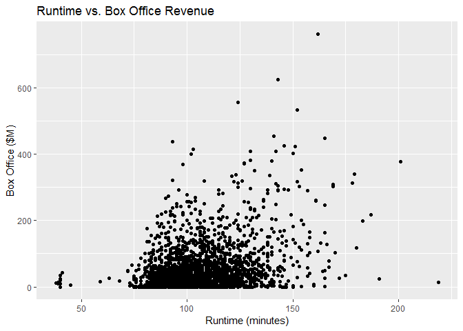
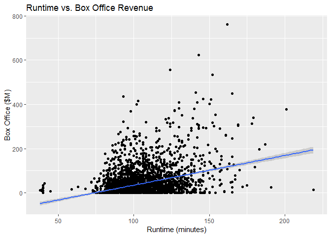
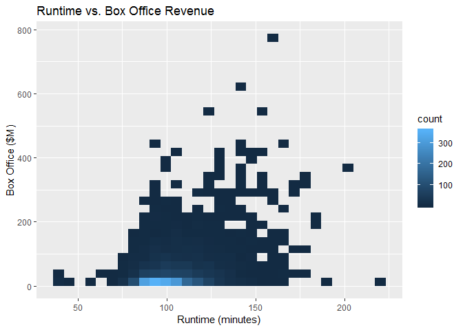
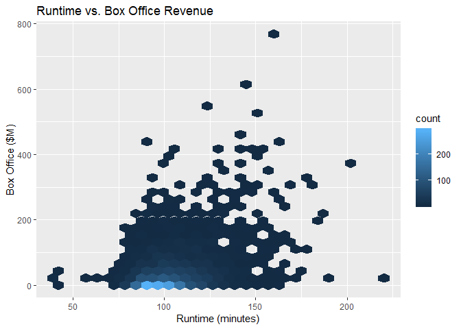
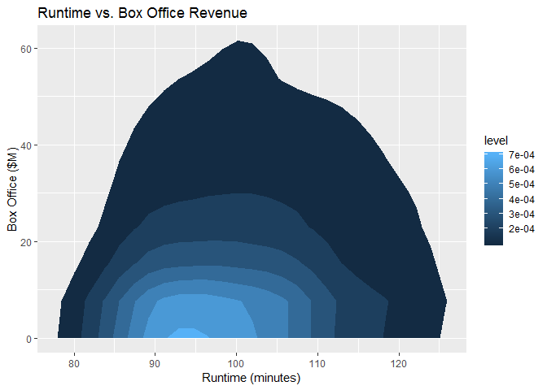
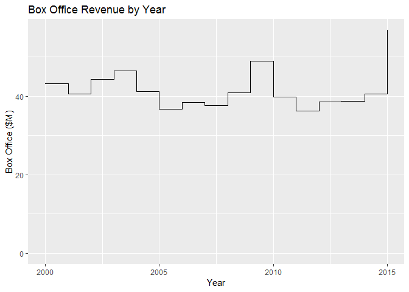
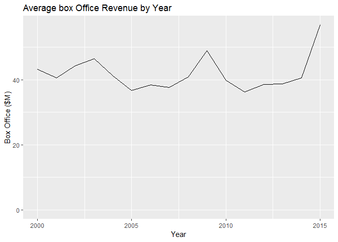
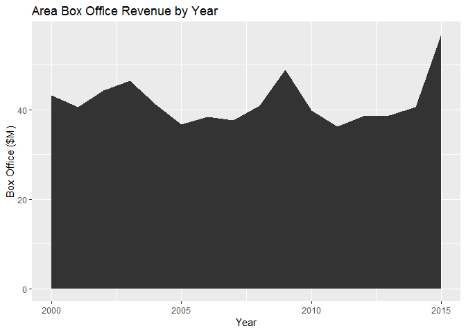

Visualizing Two Numeric Variables
================

We are requested to answer these questions:

    1. How are runtime and box-office revenue related?
    2. Has the average box-office revenue changed over time?

*Bivariate Visualization for two quantitiative variables* \#\# Setting up environment

``` r
library(ggplot2)
movies <- read.csv('../data/Movies.csv')
main_label <- "Runtime vs. Box Office Revenue"
runtime_in_minutes_label <- "Runtime (minutes)"
box_office_label <- "Box Office ($M)"
density_label <- "Density"
```

Plots
-----

### Scatterplot

Create scatterplot

``` r
ggplot(
  data = movies,
  aes(x= Runtime, y = Box.Office)) + 
  geom_point() +
  ggtitle(main_label) +
  xlab(runtime_in_minutes_label) +
  ylab(box_office_label)
```



### Linear regression

Adding linear regression

``` r
ggplot(
  data = movies,
  aes(x = Runtime, y = Box.Office)) + 
  geom_point() +
  geom_smooth(method = "lm") +
  ggtitle(main_label) +
  xlab(runtime_in_minutes_label) +
  ylab(box_office_label)
```



### Frequency heatmap

Create a frequency heatmap

``` r
ggplot(
  data = movies,
  aes(x =Runtime, y = Box.Office)) +
  stat_bin2d() +
  ggtitle(main_label) +
  xlab(runtime_in_minutes_label) +
  ylab(box_office_label)
```



### Hexagonal binned frequency heatmap

Create a hexagonal binned frequency heatmap

``` r
ggplot(
  data = movies,
  aes(x = Runtime, y = Box.Office)) +
  stat_binhex() +
  ggtitle(main_label) + 
  xlab(runtime_in_minutes_label) +
  ylab(box_office_label)
```

    ## Warning: package 'hexbin' was built under R version 3.5.2



### Contour plot

Create a contour plot of density

``` r
ggplot(
  data = movies,
  aes(x = Runtime, y = Box.Office)) +
  geom_density2d() +
  ggtitle(main_label) +
  xlab(runtime_in_minutes_label) + 
  ylab(box_office_label)
```


### Level plot

Create level plot

``` r
ggplot(
  data = movies,
  aes(x = Runtime, y = Box.Office)) +
  stat_density2d(aes(fill = ..level..), geom = "polygon") +
  ggtitle(main_label) +
  xlab(runtime_in_minutes_label) +
  ylab(box_office_label)
```



**Note:** *3D visualizations do not exist in ggplot*

### Step chart

create a step chart

#### Load time series

``` r
timeSeries <- read.csv("../data/TimeSeries.csv")
```

Step chart

``` r
ggplot(
  data = timeSeries,
  aes(x = Year, y = Box.Office)) +
  geom_step() +
  expand_limits(y = 0) + 
  ggtitle("Box Office Revenue by Year") +
  xlab("Year") +
  ylab(box_office_label)
```



### Line chart

Create line chart

``` r
ggplot(data = timeSeries,
       aes(x = Year, y = Box.Office)) +
  geom_line() +
  expand_limits(y = 0) + 
  ggtitle("Average box Office Revenue by Year") +
  xlab("Year") +
  ylab(box_office_label)
```



### Area chart

Create an area chart

``` r
ggplot(data= timeSeries,
       aes(x= Year, y = Box.Office)) +
  geom_area() +
  ggtitle("Area Box Office Revenue by Year") +
  xlab("Year") +
  ylab(box_office_label)
```


