Data Visualization - Qualitative Bivariate Analysis
================

Data Load
=========

Let's start by taking a look to our current dataset

``` r
library(tidyverse)
```

    ## Warning: package 'tidyverse' was built under R version 3.5.2

    ## -- Attaching packages ------------------------------------------------------------------------- tidyverse 1.2.1 --

    ## v ggplot2 3.0.0     v purrr   0.2.5
    ## v tibble  1.4.2     v dplyr   0.7.6
    ## v tidyr   0.8.1     v stringr 1.3.1
    ## v readr   1.1.1     v forcats 0.3.0

    ## -- Conflicts ---------------------------------------------------------------------------- tidyverse_conflicts() --
    ## x dplyr::filter() masks stats::filter()
    ## x dplyr::lag()    masks stats::lag()

``` r
library(dslabs)

load("rda/apps_dataset.rda")
load("rda/apps_categories_dataset.rda")
load("rda/apps_genres_dataset.rda")
load("rda/apps_versions_dataset.rda")
ds_theme_set()
```

Data Visualization
==================

Qualitative Bivariate Analysis
------------------------------

Qualitative Features:

    * Category
    * Installs (Install range)
    * Type (Free/Paid)
    * Content Rating
    * Genre

### Category vs Type

#### Grouped Frequency Bar Chart

``` r
options(scipen = 999) # Disabling Scientific notation
title <- "Count of Apps by Category and Type"
x_lab <- "Category"
y_lab <- "Count"
type_options = c("Free", "Paid")

apps_versions_dataset %>% 
  merge(apps_categories_dataset, by = "App") %>%
  ggplot(aes(x = Category, fill = Type)) +
  geom_bar(position = "dodge") +
  ggtitle(title)  +
  scale_fill_discrete(labels = type_options) +
  theme(
    axis.text.x = element_text( angle = 90, size = 8)) +
  xlab(x_lab) +
  ylab(y_lab)
```

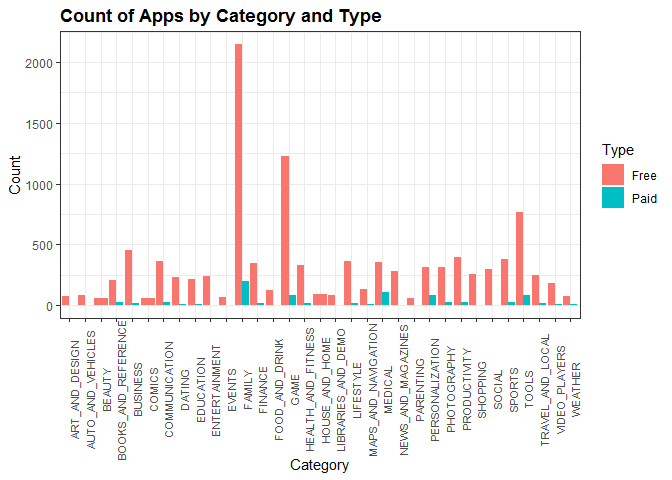

#### Stacked Frequency Bar Chart

``` r
apps_categories_dataset %>%
  merge(apps_versions_dataset, by = "App") %>%
  ggplot(aes(x = Category, fill = Type)) +
  geom_bar() +
  ggtitle(title) +
  scale_fill_discrete() +
  theme(
    axis.text.x =  element_text(angle = 90, size = 8)) +
  xlab(x_lab) +
  ylab(y_lab)
```

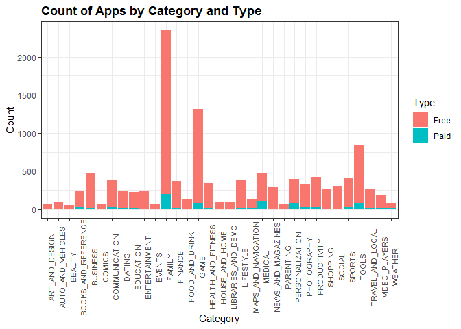

#### 100% Stacked Frequency Bar Chart

``` r
title <- "Proportion of Apps by Category and Type"

apps_categories_dataset %>%
  merge(apps_versions_dataset, by = "App") %>%
  ggplot(aes(x = Category, fill = Type)) +
  geom_bar(position = "fill") +
  scale_fill_discrete(labels = type_options) +
  ggtitle(title) +
  xlab(x_lab) +
  ylab(y_lab) +
  theme(
    axis.text.x = element_text(angle = 90, size = 8))
```

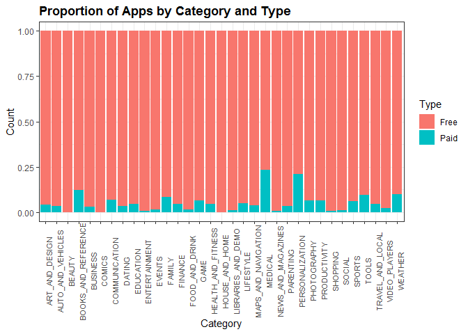

#### Spine Plot

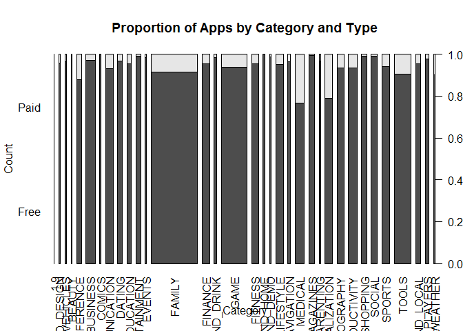

#### Mosaic Plot

``` r
par(las = 2) # 90 grades for x-axis
mosaicplot(x = data_tbl[,c("Paid","Free")],
           main = title,
           xlab = x_lab,
           ylab = y_lab) 
```

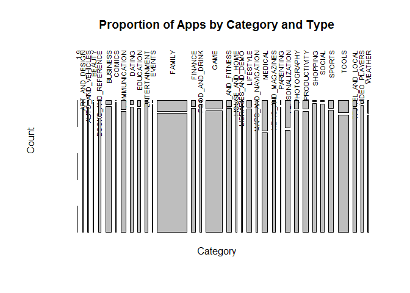

### Installs vs Type

#### Grouped Frequency Bar Chart

``` r
title <- "Count of Apps by Installs and Type"
x_lab <- "Installs"

apps_versions_dataset %>%
  ggplot(aes(x= Installs, fill = Type)) +
  geom_bar(position = "dodge") +
  scale_fill_discrete(labels = type_options) +
  ggtitle (title) +
  xlab(x_lab) +
  ylab(y_lab) +
  theme(
    axis.text.x = element_text(angle = 90))
```

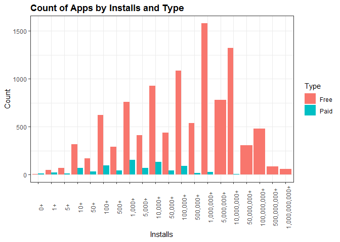

#### Stacked Frequency Bar Chart

``` r
apps_versions_dataset %>%
  ggplot(aes(x = Installs, fill = Type)) +
  geom_bar(position = "stack") +
  scale_fill_discrete(label = type_options) +
  ggtitle(title) +
  xlab(x_lab) +
  ylab(y_lab) +
  theme(
    axis.text.x = element_text(angle = 90))
```

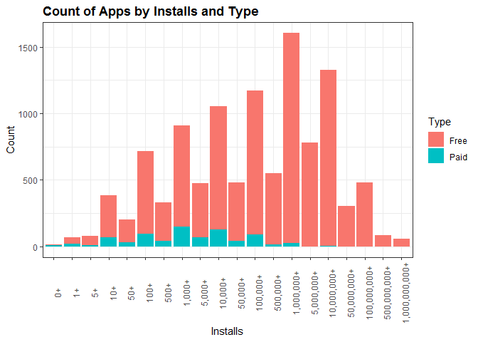

#### 100% Stacked Frequency Bar Chart

``` r
title <- "Proportion of Apps by Installs and Type"
apps_versions_dataset %>%
  ggplot(aes(x = Installs, fill = Type)) +
  geom_bar(position = "fill") +
  scale_fill_discrete(label = type_options) +
  ggtitle(title) +
  xlab(x_lab) +
  ylab(y_lab) +
  theme(
    axis.text.x = element_text(angle = 90))
```

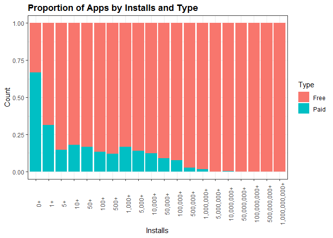

#### Spine Plot

``` r
data_tbl <- table(apps_versions_dataset$Installs, apps_versions_dataset$Type)
par(las = 2) # 90 grades for x-axis
spineplot(
  x = data_tbl[,c("Free","Paid")],
  main = title,
  xlab = x_lab,
  ylab = y_lab)
```

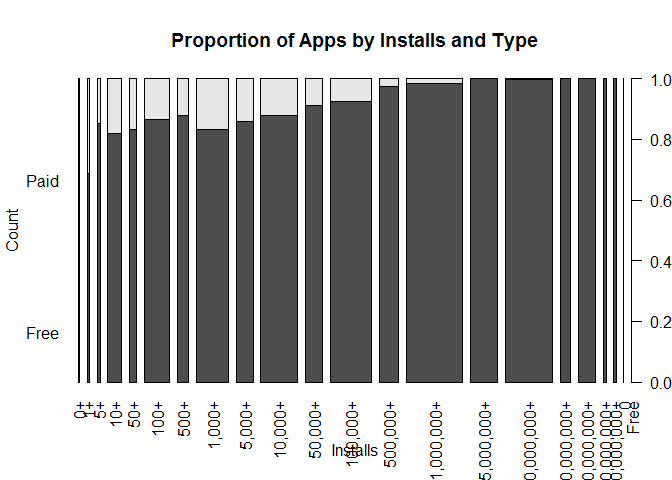

#### Mosaic Plot

``` r
par(las=2)
mosaicplot(
  x = data_tbl[,c("Free","Paid")],
  main = title,
  xlab  = x_lab,
  ylab = y_lab)
```

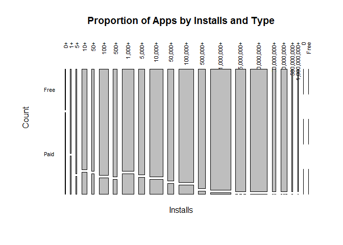

### Content Rating vs Type

#### Grouped Frequency Bar Chart

``` r
title <- "Count of Apps by Rating and Type"
x_lab <- "Content Rating"

apps_versions_dataset %>%
  ggplot(aes(x = Content.Rating, fill = Type)) +
  geom_bar(position = "dodge") +
  scale_fill_discrete(labels = type_options) +
  ggtitle(title) +
  xlab(x_lab) +
  ylab(y_lab) +
  theme(
    axis.text.x = element_text(angle =90))
```

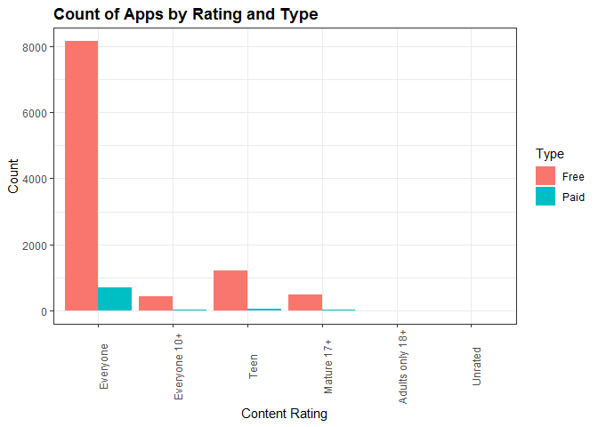

#### Stacked Frequency Bar Chart

``` r
apps_versions_dataset %>%
  ggplot(aes(x = Content.Rating, fill = Type)) +
  geom_bar(position = "stack") +
  scale_fill_discrete(labels = type_options) +
  ggtitle(title) +
  xlab (x_lab) +
  ylab (y_lab) +
  theme(
    axis.text.x = element_text(angle = 90))
```


#### 100% Stacked Frequency Bar Chart

``` r
title <- "Proportion of Apps by Content Rating and Type"

apps_versions_dataset %>%
  ggplot(aes(Content.Rating, fill = Type)) +
  geom_bar(position = "fill") +
  scale_fill_discrete(label = type_options) +
  ggtitle(title) +
  xlab(x_lab) +
  ylab(y_lab) +
  theme(
    axis.text.x = element_text(angle = 90))
```

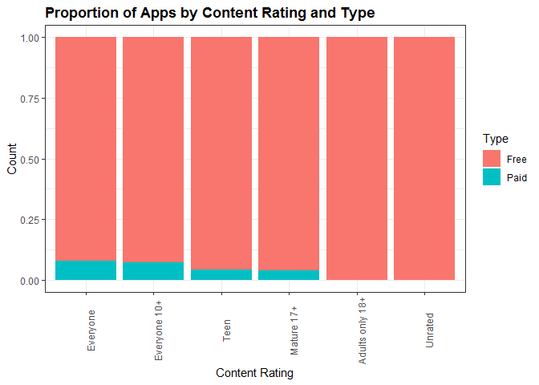

#### Spine Plot

``` r
data_tbl <- table(apps_versions_dataset$Content.Rating, apps_versions_dataset$Type)

par(las = 2)
spineplot(
  x = data_tbl[,c("Free","Paid")],
  main =title,
  xlab = x_lab, 
  ylab = y_lab
)
```

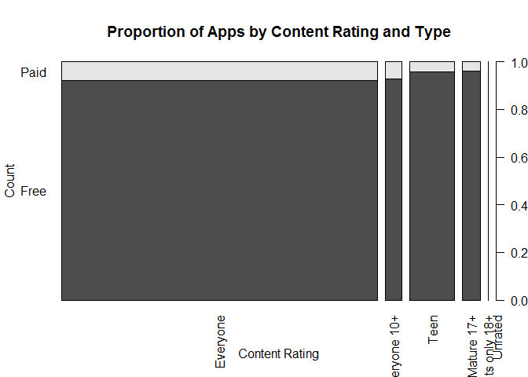

#### Mosaic Plot

``` r
par(las=2)
mosaicplot(x = data_tbl,
           main = title,
           xlab = x_lab,
           ylab = y_lab)
```

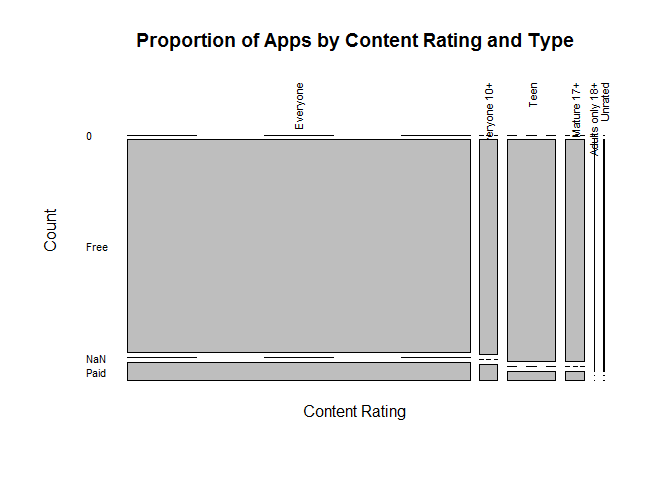

### Genre vs Type

#### Grouped Frequency Bar Chart

``` r
title <- "Count of Apps by Genre and Type"
x_lab <- "Genre"

apps_versions_dataset %>%
  merge(apps_genres_dataset, by = "App") %>%
  ggplot(aes(x = Genre, fill = Type)) +
  geom_bar(position = "dodge") +
  scale_fill_discrete(labels = type_options) +
  ggtitle(title) +
  xlab(x_lab) +
  ylab(y_lab) +
  theme(
    axis.text.x = element_text(angle = 90))
```

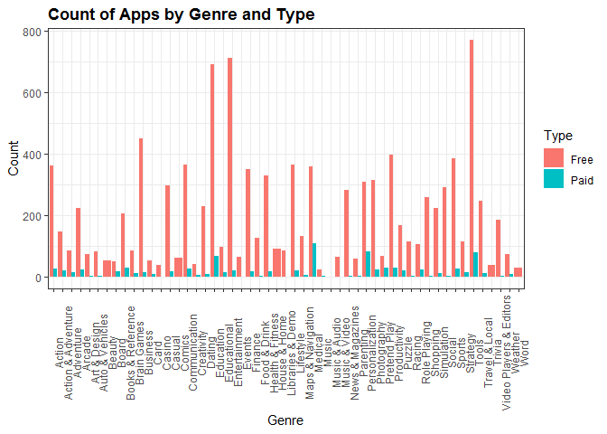

#### Stacked Frequency Bar Chart

``` r
apps_versions_dataset %>%
  merge(apps_genres_dataset, by = "App")  %>%
  ggplot(aes(x = Genre, fill = Type)) +
  geom_bar(position = "stack") +
  scale_fill_discrete(labels = type_options) +
  ggtitle(title) +
  xlab(x_lab) +
  ylab(y_lab) +
  theme(
    axis.text.x = element_text(angle = 90))
```

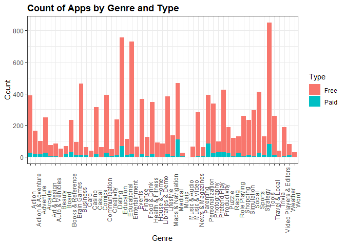

#### 100% Stacked Frequency Bar Chart

``` r
title <- "Proportion of Apps by Genre and Type"

apps_versions_dataset %>%
  merge(apps_genres_dataset) %>%
  ggplot(aes(x = Genre, fill= Type)) +
  geom_bar(position = "fill") +
  scale_fill_discrete(labels = type_options)+
  xlab(x_lab) +
  ylab(y_lab) +
  ggtitle(title) +
  theme(
    axis.text.x = element_text(angle= 90))
```

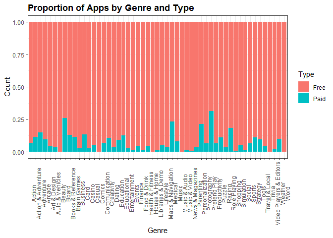

#### Spine Plot

``` r
data_tbl <- apps_versions_dataset %>% merge(apps_genres_dataset, by = "App") %>% select(Genre, Type)
data_tbl <- table(data_tbl$Genre, data_tbl$Type)
par(las=2)
spineplot(
  x = data_tbl[,type_options],
  main = title,
  xlab = x_lab,
  ylab = y_lab)
```

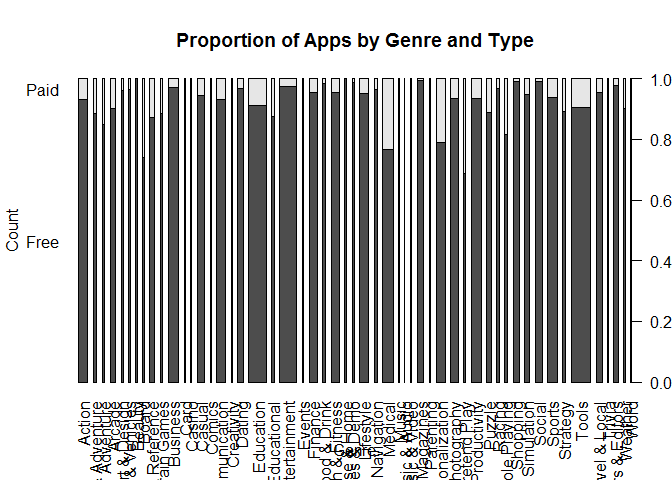

#### Mosaic Plot

``` r
par(las=2)
mosaicplot(
  x = data_tbl[,type_options],
  main = title ,
  xlab = x_lab,
  ylab = y_lab)
```

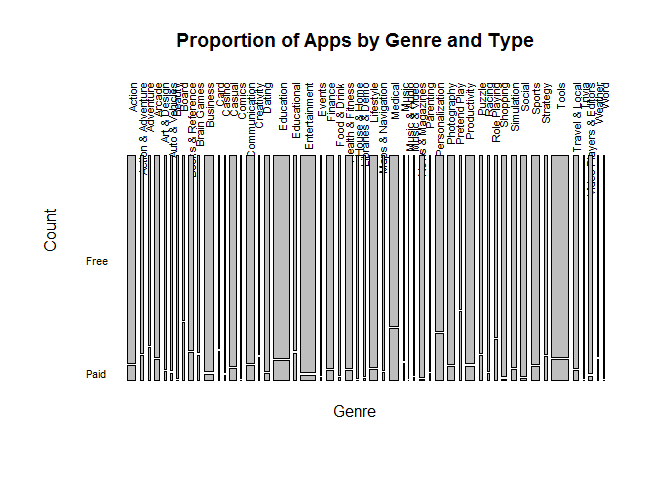
