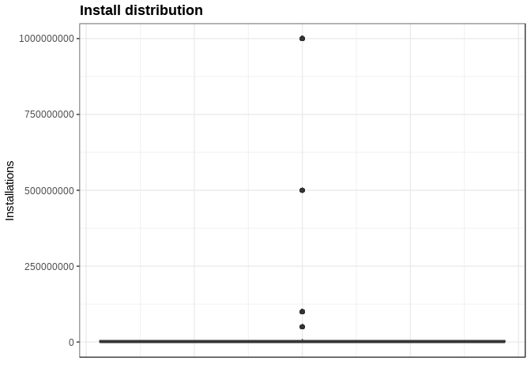
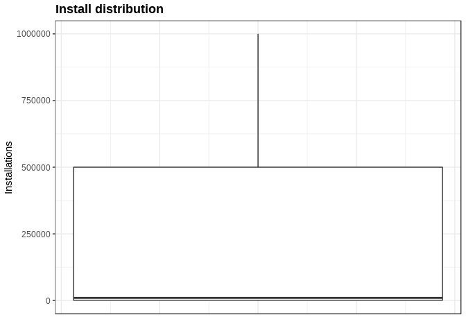
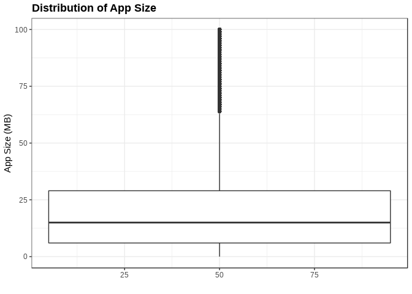

Google Play Apps
================

Data Visualization of Google Play Apps
======================================

Dataset Description
-------------------

Dataset downloaded from: <https://www.kaggle.com/lava18/google-play-store-apps>

Loading the dataset

``` r
library(tidyverse)
library(ggplot2)
library(lattice)
library(latticeExtra)
library(lubridate)
library(dslabs)

ds_theme_set()
apps_dataset_original = read.csv("../../data/googleplaystore.csv", header = TRUE, sep = ",")

#class(apps_dataset)
head(as.tibble(apps_dataset_original))
```

    ## # A tibble: 6 x 13
    ##   App   Category Rating Reviews Size  Installs Type  Price Content.Rating
    ##   <fct> <fct>     <dbl> <fct>   <fct> <fct>    <fct> <fct> <fct>         
    ## 1 Phot… ART_AND…    4.1 159     19M   10,000+  Free  0     Everyone      
    ## 2 Colo… ART_AND…    3.9 967     14M   500,000+ Free  0     Everyone      
    ## 3 U La… ART_AND…    4.7 87510   8.7M  5,000,0… Free  0     Everyone      
    ## 4 Sket… ART_AND…    4.5 215644  25M   50,000,… Free  0     Teen          
    ## 5 Pixe… ART_AND…    4.3 967     2.8M  100,000+ Free  0     Everyone      
    ## 6 Pape… ART_AND…    4.4 167     5.6M  50,000+  Free  0     Everyone      
    ## # … with 4 more variables: Genres <fct>, Last.Updated <fct>,
    ## #   Current.Ver <fct>, Android.Ver <fct>

Data wrangling
--------------

Let's confirm the column types are correct and also the values.

### App Feature

From previous point, we can see the App column, which contains app names, is factor data type, we need to change it to character.

``` r
apps_dataset_original = read.csv("../../data/googleplaystore.csv", header = TRUE, sep = ",", as.is = c("App","Current.Ver"))

head(as.tibble(apps_dataset_original))
```

    ## # A tibble: 6 x 13
    ##   App   Category Rating Reviews Size  Installs Type  Price Content.Rating
    ##   <chr> <fct>     <dbl> <fct>   <fct> <fct>    <fct> <fct> <fct>         
    ## 1 Phot… ART_AND…    4.1 159     19M   10,000+  Free  0     Everyone      
    ## 2 Colo… ART_AND…    3.9 967     14M   500,000+ Free  0     Everyone      
    ## 3 U La… ART_AND…    4.7 87510   8.7M  5,000,0… Free  0     Everyone      
    ## 4 Sket… ART_AND…    4.5 215644  25M   50,000,… Free  0     Teen          
    ## 5 Pixe… ART_AND…    4.3 967     2.8M  100,000+ Free  0     Everyone      
    ## 6 Pape… ART_AND…    4.4 167     5.6M  50,000+  Free  0     Everyone      
    ## # … with 4 more variables: Genres <fct>, Last.Updated <fct>,
    ## #   Current.Ver <chr>, Android.Ver <fct>

Removing extra spaces to App feature

``` r
apps_dataset_original %>% 
  mutate(App = str_trim(App))
```

#### Incorrect record

In a later analysis has been detected a broken record, but since this affects to the rest of conversions has been moved into this first steps.

``` r
apps_dataset_original %>%
  filter(Category == "1.9") %>%
  head()  
```

    ##                                       App Category Rating Reviews   Size
    ## 1 Life Made WI-Fi Touchscreen Photo Frame      1.9     19    3.0M 1,000+
    ##   Installs Type    Price Content.Rating            Genres Last.Updated
    ## 1     Free    0 Everyone                February 11, 2018       1.0.19
    ##   Current.Ver Android.Ver
    ## 1  4.0 and up

So we can see the Category feature is missing, and the rest of the values are shift to the left, so we can fix it, and the best option is to do it from the begining. So we need to find the best category, based on the app name.

``` r
apps_dataset_original %>% 
  filter(str_detect(App,"photo")) %>%
  select(Category) %>%
  head()
```

    ##         Category
    ## 1 ART_AND_DESIGN
    ## 2         BEAUTY
    ## 3         DATING
    ## 4         EVENTS
    ## 5    PHOTOGRAPHY
    ## 6    PHOTOGRAPHY

"PHOTOGRAPHY" category seems to be the most properly for this app

``` r
col_number <- ncol(apps_dataset_original)
rows_indx <- apps_dataset_original[,1] == "Life Made WI-Fi Touchscreen Photo Frame"
apps_dataset_original[rows_indx,3:col_number]  <- apps_dataset_original[rows_indx,2:(col_number-1)]
```

    ## Warning in `[<-.factor`(`*tmp*`, iseq, value = structure(1L, .Label =
    ## c("", : invalid factor level, NA generated

``` r
apps_dataset_original[rows_indx,2] <- "PHOTOGRAPHY"

apps_dataset_original %>%
  filter(App == "Life Made WI-Fi Touchscreen Photo Frame") %>%
  head()  
```

    ##                                       App    Category Rating Reviews Size
    ## 1 Life Made WI-Fi Touchscreen Photo Frame PHOTOGRAPHY      1      19 3.0M
    ##   Installs Type Price Content.Rating Genres      Last.Updated Current.Ver
    ## 1   1,000+ Free     0       Everyone   <NA> February 11, 2018           1
    ##   Android.Ver
    ## 1  4.0 and up

Now Genres feature has NA,let's see if we can set any that makes sense

``` r
apps_dataset_original %>% filter(Category == "PHOTOGRAPHY")%>% select(Genres) %>% distinct(Genres)
```

    ##        Genres
    ## 1 Photography
    ## 2        <NA>

So for Category = "PHOTOGRAPHY" we must set Genres = "Photography"

``` r
apps_dataset_original[rows_indx,10] <- "Photography"
apps_dataset_original[rows_indx,3] <- 1.9
apps_dataset_original %>%
  filter(App == "Life Made WI-Fi Touchscreen Photo Frame") %>%
  head()  
```

    ##                                       App    Category Rating Reviews Size
    ## 1 Life Made WI-Fi Touchscreen Photo Frame PHOTOGRAPHY    1.9      19 3.0M
    ##   Installs Type Price Content.Rating      Genres      Last.Updated
    ## 1   1,000+ Free     0       Everyone Photography February 11, 2018
    ##   Current.Ver Android.Ver
    ## 1           1  4.0 and up

``` r
#levels(apps_dataset_original$Genres)
```

### Split Data into Different Dataframes

After some previous data exploratory analysis, I've determinined to split the data into different data frames, so it is reflecting tidy data

Data frames:

    1) Apps, it will contain:
      - App
    2) Apps_Versions, it will contain:
      - App
      - Rating
      - Reviews
      - Size
      - Installs
      - Type
      - Price   
      - Content.Rating  
      - Last.Updated    
      - Current.Ver
      - Andoid.Ver
    3) App_Genres, it will contain:
      - App
      - Genres
    4) App_Categories, it will contain:
      - App
      - Category

Then we will be able to create additional data

``` r
apps_dataset <- apps_dataset_original %>% 
  select(App) %>% distinct()

apps_versions_dataset <- apps_dataset_original %>%
  select(App,Current.Ver,Rating,Reviews, Size, Installs, Type, Price, Content.Rating,Last.Updated, Android.Ver)

apps_genres_dataset <- apps_dataset_original %>% 
  select(App, Genres)

apps_categories_dataset <- apps_dataset_original %>% 
  select(App,Category)
```

Now that we have our data split, we can start cleaning up

### Current Version Feature

It has been found that there are a lot of different app version formats, but we are not going to group by any means, mainly because it is not a general way to evaluate or analizing, each company set its own rules for this value.

Anyway, executing this code you can see all app version format that does not math the more general format: x.xxxx.xxxx.xxxx

``` r
varies <- "Varies with device"
pattern <- "^[0-9]{0,4}$|^[0-9]{0,4}\\.[0-9]{0,4}\\.?[0-9]{0,4}\\.?[0-9]{0,4}$"

# Viewing the records
apps_versions_dataset %>% 
  filter(!str_detect(Current.Ver,pattern) & Current.Ver != varies) %>%
  select(App, Current.Ver) %>%
  head()
```

    ##                                                           App
    ## 1                             Learn To Draw Kawaii Characters
    ## 2 ezETC (ETC balance inquiry, meter trial, real-time traffic)
    ## 3                                 ReadEra – free ebook reader
    ## 4                                          Google My Business
    ## 5                                             Plugin:AOT v5.0
    ## 6                                         ZOOM Cloud Meetings
    ##            Current.Ver
    ## 1                  NaN
    ## 2        2.20 Build 02
    ## 3         18.05.31+530
    ## 4     2.19.0.204537701
    ## 5 3.0.1.11 (Build 311)
    ## 6       4.1.28165.0716

### Rating Feature

Let's take a look at those features that contains NAs

``` r
colnames(apps_versions_dataset)[colSums(is.na(apps_versions_dataset)) > 0]
```

    ## [1] "Rating"

Let's confirm how many observations there are with NA

We see Rating column is numeric

``` r
class(apps_versions_dataset$Rating)
```

    ## [1] "numeric"

Therefore those recods are missing, it may be due to:

    * They are new and therefore there are no yet any rating
    * There may be a new version with no ratings yet.
    * Missing value
    * It may be around for a while and it has no download (or almost none)

``` r
apps_without_ratings <-  apps_versions_dataset %>% 
  filter(is.na(Rating)) %>%
  nrow()

sprintf("There are %d without ratings", apps_without_ratings)
```

    ## [1] "There are 1474 without ratings"

**So far we are going to keep the observations that no contains ratings**

Let's explore the Ratings... we are going to convert them in categorical data to see the values easily

``` r
apps_versions_dataset %>% 
  mutate(RatingTemp = round(Rating)) %>%
  filter(!is.na(RatingTemp)) %>%
  select(Rating, RatingTemp) %>%
  group_by(RatingTemp) %>%
  summarize()
```

    ## # A tibble: 5 x 1
    ##   RatingTemp
    ##        <dbl>
    ## 1          1
    ## 2          2
    ## 3          3
    ## 4          4
    ## 5          5

Previously I found a record that had some values shift to the right, the record had **Ratings of 19!!!** this is not expected, this is the record updated in the beginning of this file

Let take a closer look

Now I can see there is no rating out of range

``` r
apps_versions_dataset %>% 
  filter(Rating > 5.0 | Rating < 0) %>%
  count()
```

    ## # A tibble: 1 x 1
    ##       n
    ##   <int>
    ## 1     0

``` r
apps_versions_dataset %>%
  ggplot(aes(x= Rating))+
  coord_cartesian(xlim = c(0,6)) +
  geom_histogram(bins=5) + 
  ggtitle("Rating distribution")
```

    ## Warning: Removed 1474 rows containing non-finite values (stat_bin).


Taking a look at the proportion between those that don't have Ratings

``` r
apps_versions_dataset %>% 
  mutate(HasRating = !is.na(Rating)) %>%
  ggplot(aes(x ="", fill = HasRating)) +
  geom_bar() +
  coord_polar(theta = "y") +
  ggtitle("Proportion of Apps with Rating") +
  ylab("") +
  xlab("") +
  theme(axis.text.x = element_blank(),
        axis.ticks.x = element_blank())
```


### Reviews Feature

We see this feature is set as factor when it must be numeric

``` r
apps_versions_dataset %>%
  filter(is.na(as.numeric(Reviews))) %>%
  select(App)
```

    ## [1] App
    ## <0 rows> (or 0-length row.names)

So, Reviews contains only numeric entries, so we convert those explicit

``` r
apps_versions_dataset <- apps_versions_dataset %>% 
  mutate(Reviews = as.numeric(Reviews))

head(as.tibble(apps_versions_dataset))
```

    ## # A tibble: 6 x 11
    ##   App   Current.Ver Rating Reviews Size  Installs Type  Price
    ##   <chr> <chr>        <dbl>   <dbl> <fct> <fct>    <fct> <fct>
    ## 1 Phot… 1.0.0          4.1    1183 19M   10,000+  Free  0    
    ## 2 Colo… 2.0.0          3.9    5924 14M   500,000+ Free  0    
    ## 3 U La… 1.2.4          4.7    5681 8.7M  5,000,0… Free  0    
    ## 4 Sket… Varies wit…    4.5    1947 25M   50,000,… Free  0    
    ## 5 Pixe… 1.1            4.3    5924 2.8M  100,000+ Free  0    
    ## 6 Pape… 1.0            4.4    1310 5.6M  50,000+  Free  0    
    ## # … with 3 more variables: Content.Rating <fct>, Last.Updated <fct>,
    ## #   Android.Ver <fct>

The Reviews feature is now numeric, let's check if there are NAs

``` r
na_counter <-sum(is.na(apps_versions_dataset[,4]))
sprintf("There are %d Reviews with NA", na_counter)
```

    ## [1] "There are 0 Reviews with NA"

So we are done with this feature.

``` r
apps_versions_dataset %>%
  group_by(Content.Rating) %>%
  summarize(count = n(), max = max(Reviews), min = min(Reviews))
```

    ## # A tibble: 6 x 4
    ##   Content.Rating  count   max   min
    ##   <fct>           <int> <dbl> <dbl>
    ## 1 Adults only 18+     3  5213  2233
    ## 2 Everyone         8715  6002     1
    ## 3 Everyone 10+      414  5994     1
    ## 4 Mature 17+        499  5993     1
    ## 5 Teen             1208  5999     1
    ## 6 Unrated             2   453     2

``` r
max_value <- max(apps_versions_dataset$Reviews)
min_value <- min(apps_versions_dataset$Reviews)
sprintf("Max Reviews %d, Min Reviews %d", max_value, min_value)
```

    ## [1] "Max Reviews 6002, Min Reviews 1"

Let's take a quick view to the current data, sowe may see any unexpected value

``` r
apps_versions_dataset %>%
  ggplot(aes(x = Reviews, y = Reviews)) +
  geom_boxplot() +
  ggtitle("Review Distribution") +
  xlab("") +
  ylab("Number of Reviews") +
  theme(
    axis.text.x = element_blank(),
    axis.ticks.x = element_blank()
  )
```

    ## Warning: Continuous x aesthetic -- did you forget aes(group=...)?


### Install Feature

We may need to keep it as factor, but we also will need it as numeric, so we are creating a second column with those values

We need to fix an incorrect value for Installs, it's "0" when it should be "0+", also two factors are not needed : "0" and "Free".

``` r
apps_versions_dataset %>% 
  group_by(Installs) %>%
  select(Installs, App) %>%
  summarize(count = n())
```

    ## # A tibble: 21 x 2
    ##    Installs       count
    ##    <fct>          <int>
    ##  1 0                  1
    ##  2 0+                14
    ##  3 1,000,000,000+    58
    ##  4 1,000,000+      1579
    ##  5 1,000+           908
    ##  6 1+                67
    ##  7 10,000,000+     1252
    ##  8 10,000+         1054
    ##  9 10+              386
    ## 10 100,000,000+     409
    ## # … with 11 more rows

``` r
# Fixing invalid entry 0
apps_versions_dataset$Installs[apps_versions_dataset$Installs == "0"] <- "0+"
```

I need to remove: **",","+" **

``` r
options(scipen = 999) # Disabling scientific notation
apps_versions_dataset <- apps_versions_dataset %>% 
  mutate(InstallsNumeric = str_replace_all(Installs, "[,*+$]", "")) %>%
  mutate(InstallsNumeric = as.integer(InstallsNumeric))

na_counter <- apps_versions_dataset %>% 
    filter(is.na(InstallsNumeric)) %>%
    count()

sprintf("There are %d NAs", sum(na_counter))
```

    ## [1] "There are 0 NAs"

``` r
summary(apps_versions_dataset$InstallsNumeric)
```

    ##       Min.    1st Qu.     Median       Mean    3rd Qu.       Max. 
    ##          0       1000     100000   15462913    5000000 1000000000

There are no NA, it used to be due to the incorrect observation fixed at the beginning... But the current distribution is really odd

``` r
apps_versions_dataset %>% select(Installs,InstallsNumeric) %>% head()
```

    ##      Installs InstallsNumeric
    ## 1     10,000+           10000
    ## 2    500,000+          500000
    ## 3  5,000,000+         5000000
    ## 4 50,000,000+        50000000
    ## 5    100,000+          100000
    ## 6     50,000+           50000

``` r
apps_versions_dataset %>%
  ggplot(aes(x=50, y = InstallsNumeric)) +
  geom_boxplot() +
  ggtitle("Install distribution") +
  xlab("") +
  ylab("Installations") +
  theme(
    axis.text.x = element_blank(),
    axis.ticks.x = element_blank())
```



The outliers are really affecting our current box plot view...let's remove those in order for usto be the main data.

``` r
apps_versions_dataset %>%
  filter(InstallsNumeric <=1000000) %>%
  ggplot(aes(x=50, y = InstallsNumeric)) +
  geom_boxplot() +
  ggtitle("Install distribution") +
  xlab("") +
  ylab("Installations") +
  theme(
    axis.text.x = element_blank(),
    axis.ticks.x = element_blank())
```



After taking a comparisson between Installations and InstallationNumeric columns, we can see the numbers are correct, and the distribution is really long. We will analyse later in depth

We also need to sort the levels to something that makes more sense to us.

``` r
levels_sorted <- c("0+","1+","5+","10+","50+","100+","500+","1,000+","5,000+","10,000+","50,000+","100,000+","500,000+","1,000,000+","5,000,000+","10,000,000+","50,000,000+","100,000,000+","500,000,000+","1,000,000,000+","0","Free")

apps_versions_dataset$Installs <- factor(apps_versions_dataset$Installs,levels = levels_sorted)
```

### Price Feature

The price feature is set as factor, we need to convert it to numeric

``` r
apps_versions_dataset %>%
  filter(is.na(as.numeric(Price))) %>%
  group_by(Type) %>%
  select(Type) %>%
  summary()
```

    ## Warning: Factor `Type` contains implicit NA, consider using
    ## `forcats::fct_explicit_na`

    ##    Type  
    ##  0   :0  
    ##  Free:0  
    ##  NaN :0  
    ##  Paid:0

There are no NAs

Let's validate there are no format characters

``` r
apps_versions_dataset %>%
  filter(str_detect(Price,pattern = "[a-zA-Z,$]")) %>%
  select(Price) %>%
  head()
```

    ##   Price
    ## 1 $4.99
    ## 2 $4.99
    ## 3 $4.99
    ## 4 $4.99
    ## 5 $3.99
    ## 6 $3.99

There are format characters, so we need to clean up

``` r
apps_versions_dataset <- apps_versions_dataset %>% 
  mutate(PriceNumeric = as.numeric(str_replace_all(Price,pattern = "[a-zA-Z,$]","")))
```

**Is there any Free application with Price different from 0?**

``` r
apps_versions_dataset %>%  filter(Type == 'Free' & Price != '0') %>% count()
```

    ## # A tibble: 1 x 1
    ##       n
    ##   <int>
    ## 1     0

**there is none**

**Is there any not free application but the price is 0?**

``` r
apps_versions_dataset %>%  filter(Type != 'Free' & Price == '0') %>% count()
```

    ## # A tibble: 1 x 1
    ##       n
    ##   <int>
    ## 1     1

**There is detected one incorrect Type observation, it was missing Free for price = 0**, so this is why the line below is there.

``` r
apps_versions_dataset %>%  filter(Type != 'Free' & Price == '0')
```

    ##                         App        Current.Ver Rating Reviews
    ## 1 Command & Conquer: Rivals Varies with device    NaN       1
    ##                 Size Installs Type Price Content.Rating  Last.Updated
    ## 1 Varies with device       0+  NaN     0   Everyone 10+ June 28, 2018
    ##          Android.Ver InstallsNumeric PriceNumeric
    ## 1 Varies with device               0            0

We didn't get any NA message when converting the Price column, but we are going to double check

``` r
apps_versions_dataset %>%
  filter(is.na(PriceNumeric)) %>%
  count()
```

    ## # A tibble: 1 x 1
    ##       n
    ##   <int>
    ## 1     0

Let's check what is the max and min prices (for min we are expecting 0)

``` r
apps_versions_dataset %>%  
  select(PriceNumeric) %>%
  summary(PriceNumeric) 
```

    ##   PriceNumeric    
    ##  Min.   :  0.000  
    ##  1st Qu.:  0.000  
    ##  Median :  0.000  
    ##  Mean   :  1.027  
    ##  3rd Qu.:  0.000  
    ##  Max.   :400.000

### Type Feature

It has no specified the Type, so since the price is 0, we can assume the category is Free

``` r
apps_versions_dataset %>%  filter(Type == 'NaN')
```

    ##                         App        Current.Ver Rating Reviews
    ## 1 Command & Conquer: Rivals Varies with device    NaN       1
    ##                 Size Installs Type Price Content.Rating  Last.Updated
    ## 1 Varies with device       0+  NaN     0   Everyone 10+ June 28, 2018
    ##          Android.Ver InstallsNumeric PriceNumeric
    ## 1 Varies with device               0            0

There is only one Type = "NaN", so we can fix it,since the Price = 0, we can set it Free.

``` r
apps_versions_dataset$Type[apps_versions_dataset$Type == "NaN"] <- "Free"
apps_versions_dataset %>%  filter(Type == 'NaN' | App == "Command & Conquer: Rivals")
```

    ##                         App        Current.Ver Rating Reviews
    ## 1 Command & Conquer: Rivals Varies with device    NaN       1
    ##                 Size Installs Type Price Content.Rating  Last.Updated
    ## 1 Varies with device       0+ Free     0   Everyone 10+ June 28, 2018
    ##          Android.Ver InstallsNumeric PriceNumeric
    ## 1 Varies with device               0            0

### Last updated Feature

We also need to set the dates in a valid format

Let's see if there are more than one format

``` r
pattern = "[a-zA-Z]{3,9}\\s[0-9]{1,2},\\s[0-9]{4}"

match_counter <- apps_versions_dataset %>% filter(str_detect(as.character(Last.Updated), pattern =  pattern)) %>% count()
sprintf("Matching %d of %d", sum(match_counter), nrow(apps_versions_dataset))
```

    ## [1] "Matching 10841 of 10841"

So all dates seem to be in the same format, so we can convert.

``` r
apps_versions_dataset <- apps_versions_dataset %>%
  mutate(Last.UpdatedDate = mdy(Last.Updated))

head(as.tibble(apps_versions_dataset$Last.UpdatedDate))
```

    ## # A tibble: 6 x 1
    ##   value     
    ##   <date>    
    ## 1 2018-01-07
    ## 2 2018-01-15
    ## 3 2018-08-01
    ## 4 2018-06-08
    ## 5 2018-06-20
    ## 6 2017-03-26

### Content Rating Feature

``` r
apps_versions_dataset %>%
  select (Content.Rating, App) %>%
  group_by(Content.Rating) %>%
  summary(count = count(App))
```

    ##          Content.Rating     App           
    ##                 :   0   Length:10841      
    ##  Adults only 18+:   3   Class :character  
    ##  Everyone       :8715   Mode  :character  
    ##  Everyone 10+   : 414                     
    ##  Mature 17+     : 499                     
    ##  Teen           :1208                     
    ##  Unrated        :   2

``` r
apps_versions_dataset$Content.Rating <-factor(apps_versions_dataset$Content.Rating,levels=  c("Everyone","Everyone 10+","Teen","Mature 17+","Adults only 18+","Unrated"))

apps_versions_dataset %>%
  select (Content.Rating, App) %>%
  group_by(Content.Rating) %>%
  summary(count = count(App))
```

    ##          Content.Rating     App           
    ##  Everyone       :8715   Length:10841      
    ##  Everyone 10+   : 414   Class :character  
    ##  Teen           :1208   Mode  :character  
    ##  Mature 17+     : 499                     
    ##  Adults only 18+:   3                     
    ##  Unrated        :   2

### Genres Feature

One app can have more than one genre, and the genres are recorded in the same value split by comas, so we need to extract all of them and create the relationship.

**Note: It has been validated that the max number of Genres per apps is 2**

``` r
apps_genres_dataset <- apps_genres_dataset %>%
  mutate (Genres = as.character(Genres)) %>%
  mutate (Genres.Original = Genres)

apps_genres_dataset %>% 
  select(Genres) %>%
  filter(!str_detect(Genres,"^[a-zA-Z\\s\\&]{0,100}$|^[a-zA-Z\\s\\&]{0,100};[a-zA-Z\\s\\&]{0,100}$")) %>%
  count()
```

    ## # A tibble: 1 x 1
    ##       n
    ##   <int>
    ## 1     0

It seems all genres are in the format:

    * Single genre: only the text
    * Double genre: genres separated by ";"

We need to split the genres, so we have one per row

``` r
apps_genres_dataset <- apps_genres_dataset %>%
  separate(Genres, c("Genre1","Genre2"),";") %>%
  gather("Genres", Genre,  `Genre1`:`Genre2`) %>%
  select(App, Genre, Genres.Original, -(Genres)) %>%
  filter(!is.na(Genre)) %>%
  distinct()
```

    ## Warning: Expected 2 pieces. Missing pieces filled with `NA` in 10343 rows
    ## [1, 3, 4, 6, 7, 8, 9, 11, 12, 13, 14, 15, 16, 17, 18, 19, 20, 21, 22,
    ## 23, ...].

### Category Feature

Taking a look to the Category Feature

``` r
apps_categories_dataset %>% 
  select(Category) %>%
  distinct() 
```

    ##               Category
    ## 1       ART_AND_DESIGN
    ## 2    AUTO_AND_VEHICLES
    ## 3               BEAUTY
    ## 4  BOOKS_AND_REFERENCE
    ## 5             BUSINESS
    ## 6               COMICS
    ## 7        COMMUNICATION
    ## 8               DATING
    ## 9            EDUCATION
    ## 10       ENTERTAINMENT
    ## 11              EVENTS
    ## 12             FINANCE
    ## 13      FOOD_AND_DRINK
    ## 14  HEALTH_AND_FITNESS
    ## 15      HOUSE_AND_HOME
    ## 16  LIBRARIES_AND_DEMO
    ## 17           LIFESTYLE
    ## 18                GAME
    ## 19              FAMILY
    ## 20             MEDICAL
    ## 21              SOCIAL
    ## 22            SHOPPING
    ## 23         PHOTOGRAPHY
    ## 24              SPORTS
    ## 25    TRAVEL_AND_LOCAL
    ## 26               TOOLS
    ## 27     PERSONALIZATION
    ## 28        PRODUCTIVITY
    ## 29           PARENTING
    ## 30             WEATHER
    ## 31       VIDEO_PLAYERS
    ## 32  NEWS_AND_MAGAZINES
    ## 33 MAPS_AND_NAVIGATION

There are no more than one Category per row, so there is no need to split the values as it was done for Genres

We only need to remove the duplicated entries.

``` r
apps_categories_dataset <- apps_categories_dataset %>% 
  select(App,Category) %>%
  distinct()
```

### Size Feature

This feature seems to be useful if we use it as numeric, anyway we need to remove the 'M' character, but we are not sure if there are other measurement units, such as GB, KB, etc.

``` r
apps_versions_dataset %>% 
  mutate(SizeNumeric = as.numeric(Size)) %>%
  filter(is.na(SizeNumeric)) %>% 
  select(Size, SizeNumeric) %>% head(n = 30)
```

    ## [1] Size        SizeNumeric
    ## <0 rows> (or 0-length row.names)

**Interesting** the conversion does not fail, but the converted values are not the expected ones. so we are going to proceed to remove all non numeric characters, following this convention:

    * All values measure using M, will get rid of M, and converted
    * All values measure using k, will get rid of k, and converted into M scale
    * All values measure using +, will get rid of +, and as kept into M scale
    * 'Varies with device' will be set as NA

Those conventions were determined after some data exploration, you can see in the code below all we have remove

``` r
pattern <- "(M[a-zA-Z]+)|([a-jl-zA-LN-Z])"

apps_versions_dataset %>% filter(str_detect(Size, pattern = pattern) & Size != 'Varies with device') %>%
  select(App, Size) %>% 
  group_by(Size) %>%
  summary()
```

    ## Warning: Factor `Size` contains implicit NA, consider using
    ## `forcats::fct_explicit_na`

    ##      App                 Size  
    ##  Length:0           1,000+ :0  
    ##  Class :character   1.0M   :0  
    ##  Mode  :character   1.1M   :0  
    ##                     1.2M   :0  
    ##                     1.3M   :0  
    ##                     1.4M   :0  
    ##                     (Other):0

So We have detected that also k is added to the app size measurement, the observation is added to the previous list

#### Create new Size column with the numeric type only

``` r
apps_versions_dataset <- apps_versions_dataset %>%
  mutate(SizeNumeric = case_when(
    !is.na(Size) & str_detect(Size,"M$") ~ as.numeric(str_replace(Size,"M$","")),
    !is.na(Size) & str_detect(Size,"k$") ~  round(as.numeric(str_replace(Size,"k$",""))/1024,3),
    Size == "Varies with device" ~ mean(NA),
    TRUE ~ as.numeric(NA)))
```

    ## Warning in eval_tidy(pair$rhs, env = default_env): NAs introduced by
    ## coercion

    ## Warning in eval_tidy(pair$rhs, env = default_env): NAs introduced by
    ## coercion

We may consider to set the average size for those apps set as "Varies with device"... let's see what is the proportion.

``` r
proportion_of_size <- sum(str_detect(apps_versions_dataset$Size,"^Varies with device$"))/nrow(apps_versions_dataset)
sprintf("Proportion of Size set as 'Varies with device': %f", proportion_of_size)
```

    ## [1] "Proportion of Size set as 'Varies with device': 0.156351"

**This is the 15.6%, it is too high... I am going to fill out it with the mean according to its category**

\*\* ONE ISSUE TO REVIEW, AFTER MERGE we got 240+ records than expected\*\*

``` r
size_summary <-  apps_dataset %>% 
  merge(apps_categories_dataset, by = "App") %>%
  merge(apps_versions_dataset, by = "App") %>%
  filter(!str_detect(Size, "^Varies with device$")) %>%
  group_by(Category) %>%
  select(Category, SizeNumeric) %>%
  summarize(Mean=round(mean(SizeNumeric),3))

apps_versions_dataset <- apps_dataset %>%
  merge(apps_categories_dataset, by = "App") %>%
  merge(apps_versions_dataset, by = "App") %>%
  #distinct() %>%
  group_by(Category) %>%
  mutate(SizeNumeric = case_when(
    is.na(SizeNumeric) ~ mean(SizeNumeric[!is.na(SizeNumeric)]),
    TRUE ~ SizeNumeric)) %>%
  ungroup() %>%
  select(-c(Category))
  
# Validating
apps_versions_dataset %>%
  merge(apps_categories_dataset, by = "App") %>%
  filter(str_detect(Size,"^Varies with device$")) %>%
  group_by(Category) %>%
  select(Category,Size, SizeNumeric) %>%
  head(n=10)
```

    ## # A tibble: 10 x 3
    ## # Groups:   Category [7]
    ##    Category           Size               SizeNumeric
    ##    <fct>              <fct>                    <dbl>
    ##  1 GAME               Varies with device       44.9 
    ##  2 NEWS_AND_MAGAZINES Varies with device       13.0 
    ##  3 NEWS_AND_MAGAZINES Varies with device       13.0 
    ##  4 PERSONALIZATION    Varies with device       11.3 
    ##  5 TRAVEL_AND_LOCAL   Varies with device       24.7 
    ##  6 HEALTH_AND_FITNESS Varies with device       22.7 
    ##  7 HEALTH_AND_FITNESS Varies with device       22.7 
    ##  8 TOOLS              Varies with device        8.76
    ##  9 FAMILY             Varies with device       29.2 
    ## 10 GAME               Varies with device       44.9

Now let's see the current data

``` r
apps_dataset %>% 
  merge(apps_versions_dataset, by = "App") %>%
  ggplot(aes(x = SizeNumeric, y = SizeNumeric)) +
  geom_boxplot() +
  ggtitle("Distribution of App Size") +
  xlab("") +
  ylab("App Size (MB)")
```

    ## Warning: Continuous x aesthetic -- did you forget aes(group=...)?



``` r
  theme(
    axis.text.x = element_blank(),
    axis.ticks.x = element_blank())
```

    ## List of 2
    ##  $ axis.text.x : list()
    ##   ..- attr(*, "class")= chr [1:2] "element_blank" "element"
    ##  $ axis.ticks.x: list()
    ##   ..- attr(*, "class")= chr [1:2] "element_blank" "element"
    ##  - attr(*, "class")= chr [1:2] "theme" "gg"
    ##  - attr(*, "complete")= logi FALSE
    ##  - attr(*, "validate")= logi TRUE

**At first sight all app sizes seem to be ok, it is expeted to have some few very big apps.**

Record Counting
---------------

How many apps are there?

``` r
rows_total <- nrow(apps_dataset)
rows_without_na <- nrow(na.omit(apps_dataset))

sprintf("Total apps %d", rows_total)
```

    ## [1] "Total apps 9660"

``` r
sprintf("Total apps %d, removing na", rows_without_na)
```

    ## [1] "Total apps 9660, removing na"

Saving data locally to avoid continue processing it
---------------------------------------------------

``` r
save(apps_dataset, file = "rda/apps_dataset.rda")
save(apps_versions_dataset, file = "rda/apps_versions_dataset.rda")
save(apps_categories_dataset, file = "rda/apps_categories_dataset.rda")
save(apps_genres_dataset, file = "rda/apps_genres_dataset.rda")
```
