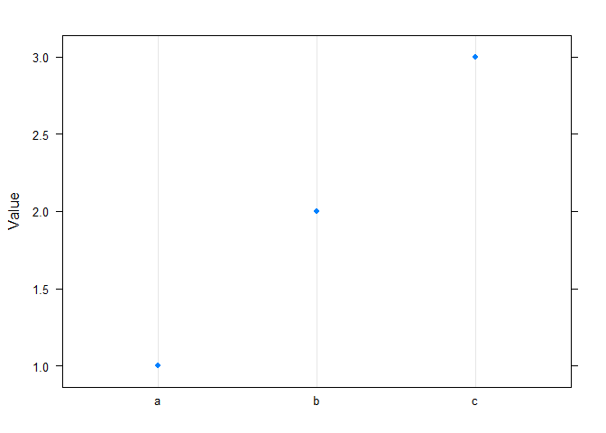
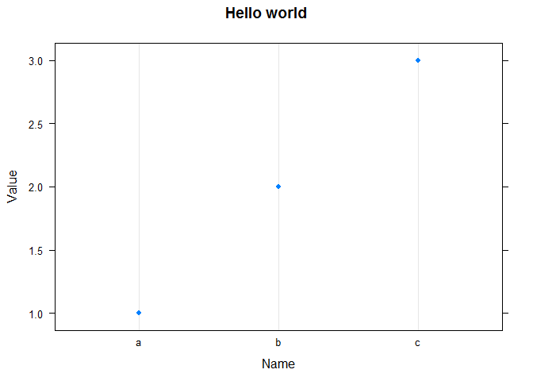
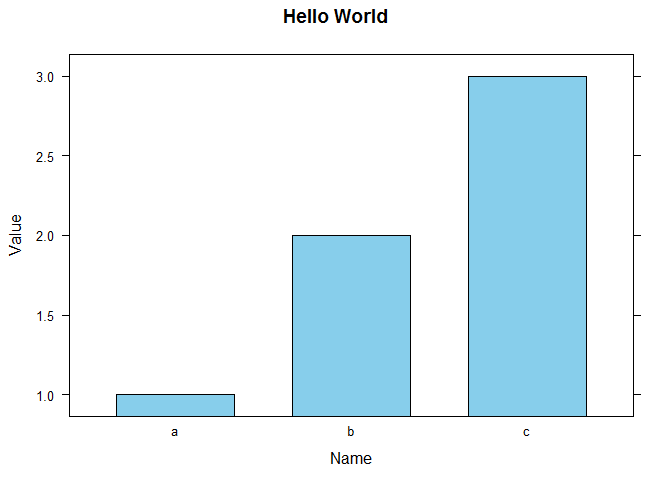

Chapter 1 - Lattice Chart
================

Demo using Lattice
------------------

### Installation process

Install the lattice package

`install.packages("lattice")`

Loading lattice package

``` r
library(lattice)
```

    ## Warning: package 'lattice' was built under R version 3.5.2

Create a data frame

``` r
df <- data.frame(
  Name = c("a","b","c"),
  Value = c(1,2,3))
```

### Plot

Plot with defaults

``` r
dotplot(
  x = Value ~ Name,
  data = df
)
```



Plot with parameters

``` r
dotplot(
  x = Value ~ Name,
  data = df,
  main="Hello world",
  xlab="Name",
  ylab="Value")
```



### Bar chart

Create a bar chart

``` r
barchart(
  x = Value ~ Name,
  data = df,
  col = "skyblue",
  main="Hello World",
  xlab="Name",
  ylab="Value")
```



### Help files

`?barchart`
`?formula`
