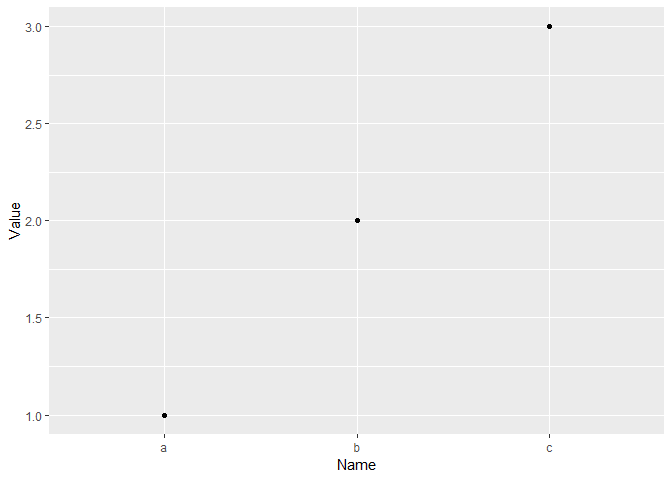
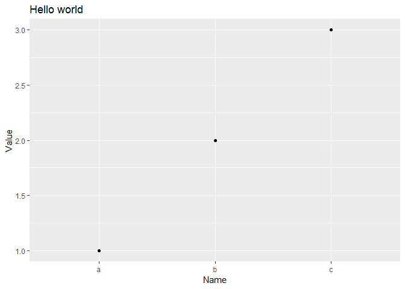
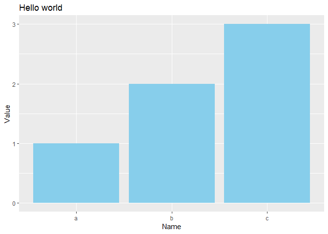

Chapter 1 - GGPlot Chart
================

Demo using GGPlot
-----------------

### Installation process

Install the ggplot2 package
`install.package(ggplot2)`

Load the ggplot2 package

``` r
library(ggplot2)
```

Create a data frame

``` r
df <- data.frame(
  Name = c("a","b","c"),
  Value = c(1,2,3))
```

### Plot

Plot with defaults

``` r
ggplot(
data = df,
  aes(
    x = Name,
    y = Value)) +
    geom_point()
```



Plot with parameters
*Note ggplot2 add layers to the chart*

``` r
ggplot(
  data = df,
  aes(
    x = Name,
    y = Value)) +
  geom_point() +
  ggtitle("Hello world") + 
  xlab("Name") +
  ylab("Value")
```



### Bar chart

Create a bar chart

``` r
ggplot(
  data = df,
  aes(
    x = Name,
    y = Value)) +
  geom_bar(
    stat = "identity",
    fill = "skyblue") +
  ggtitle("Hello world") +
  xlab("Name") +
  ylab("Value")
```



### Help files

`?ggplot`
`?aes`
`?geom_bar`
`?ggtitle`
