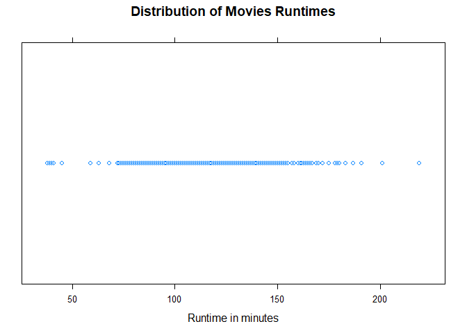
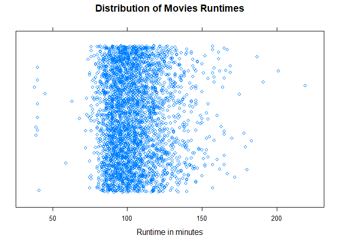

Visualizing One Numeric Variable
================

We are requested to answer these questions:

    1. What is the average movie runtime?
    2. Are there any outliers?
    3. How spread out are the movie runtimes?
    4. What is the shape of the runtime distribution?

Univariate visualizations of a quantitiative variable

Setup environment
-----------------

``` r
library(lattice)
movies = read.csv("../data/Movies.csv")
main_title <- "Distribution of Movies Runtimes"
x_lab = "Runtime in minutes"
```

Plot
----

Create dot plot for runtime

``` r
stripplot(
  x = ~Runtime,
  data = movies,
  main = main_title,
  xlab = x_lab)
```



Create dot plot with jitter

``` r
stripplot(
  x = ~Runtime,
  data = movies,
  main = main_title,
  xlab = x_lab,
  jitter = TRUE,
  amount = 0.5
)
```



Boxplot
-------

Create a box plot with lattice

``` r
bwplot(
  x = ~Runtime,
  data = movies,
  main = main_title,
  xlab = x_lab)
```


Histogram
---------

``` r
histogram(
  x = ~Runtime,
  data = movies,
  main = main_title,
  xlab = x_lab)
```


Density plot
------------

Creating a density plot

``` r
densityplot(
  x = ~Runtime,
  data = movies,
  main = main_title,
  xlab = x_lab)
```


All in one
----------

Create small multiples of all four **Note:** Not exactly lined up
**Note 2:** this chart looks betterin R script file, not well rendered here.

``` r
dot <- dotplot(
  x = ~Runtime,
  data = movies,
  main = main_title,
  x_lab = "")

print(
  x=dot,
  position = c(0,0.75,1,1),
  more = TRUE)

box <- bwplot(
  x= ~Runtime,
  data = movies,
  xlab = "")

print(
  x=box,
  position = c(0,0.5,1,0.75),
  more = TRUE)

hist <- histogram(
  x = ~Runtime,
  data =movies,
  xlab = "",
  ylab = "",
  scales = list(y = list(draw=FALSE)))

print(
  x = hist,
  position = c(0, 0.25, 1, 0.5),
  more = TRUE)


density <- densityplot(
  x= ~Runtime,
  data = movies,
  ylab = "",
  scales = list(y=list(draw = FALSE)))

print(
  x= density,
  postion = c(0,0,1,0.25))
```


