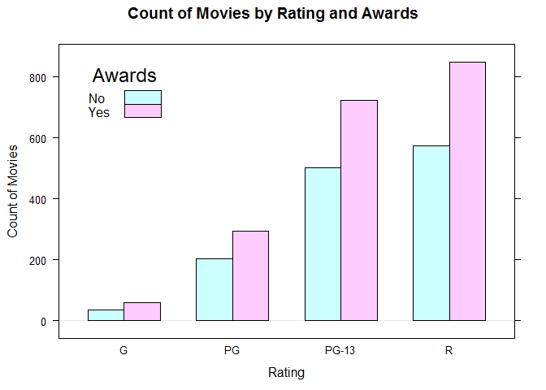
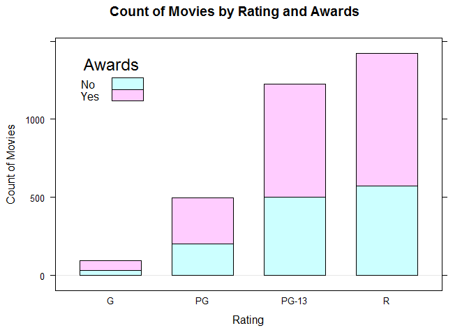

Visualizing Two Categorical Variables
================

We are requested to answer these questions:

    1. How many award-winning movies are in each rating category?
    2. What proportion of movies in each category have won awards?

Bivariate visualizations for two qualitiative variables

Setup environment
-----------------

Load data and create a contingency table

``` r
library(lattice)
```

    ## Warning: package 'lattice' was built under R version 3.5.2

``` r
movies <- read.csv("../data/Movies.csv")
awards <- table(
  movies$Rating,
  movies$Award)

colnames(awards) <- c("No", "Yes")

main_title <- "Count of Movies by Rating and Awards"
rating_title <- "Rating"
movies_title <- "Count of Movies"
print(awards)
```

    ##        
    ##          No Yes
    ##   G      34  59
    ##   PG    203 294
    ##   PG-13 502 723
    ##   R     574 849

Bar Chart
---------

### Grouped frequency bar chart

``` r
barchart(
  x = awards,
  stack = FALSE,
  horizontal = FALSE,
  main = main_title,
  xlab = rating_title,
  ylab = movies_title,
  auto.key = list(
    x = 0.05,
    y = 0.95,
    title = "Awards",
    text = c("No","Yes")))
```



### Stacked frequency bar chart

``` r
barchart(
  x = awards,
  horizontal = FALSE,
  stack = TRUE,
  main = main_title,
  xlab = rating_title,
  ylab = movies_title,
  auto.key = list(
    x = 0.05,
    y = 0.95,
    title = "Awards",
    text = c("No","Yes")
  )
)
```



### 100% Stacked Frequency Bar Chart

Creating the proportional frequency table

``` r
matrix <- apply(awards, 1, function(x){ x/sum(x)})
proportions <- t(matrix) # Transpose matrix
head(awards)
```

    ##        
    ##          No Yes
    ##   G      34  59
    ##   PG    203 294
    ##   PG-13 502 723
    ##   R     574 849

``` r
head(proportions)
```

    ##        
    ##                No       Yes
    ##   G     0.3655914 0.6344086
    ##   PG    0.4084507 0.5915493
    ##   PG-13 0.4097959 0.5902041
    ##   R     0.4033732 0.5966268

Create a 100% stacked frequency bar chart

``` r
barchart(
  x =proportions,
  stack = TRUE,
  horizontal = FALSE,
  main = "Proportion of Movies by Rating and Award",
  xlab = rating_title,
  ylab = "Proportion of Movies",
  auto.key = list(
    x = 0.70,
    y = 1.05,
    title = "Awards",
    columns = 2,
    text = c("No", "Yes"),
    background = "white"))
```


**NOTE**: *No spine plot or mosaic plot in lattice*
