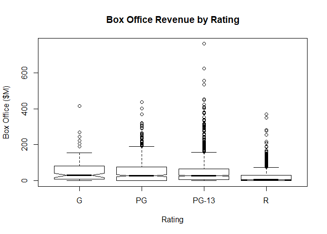

Visualizing both a categorical and a numeric variable
================

We are requested to answer:

    1. How does average box-office revenue compare across raings?
    2. How similar are the spreads of box-office revenue across ratings?
    3. How do their shapes compare?

*Bivariate visualizations for bith qualitiative and quantitiative bivariate variable*

Setting up environment
----------------------

``` r
movies <- read.csv("../data/Movies.csv")
main_label <- "Average Box-Office Revenue by Rating"
rating_label <- "Rating"
box_office_label <- "Box Office ($M)"
```

Plots
-----

### Bivariate bar graph

``` r
average <- tapply(
  movies$Box.Office,
  movies$Rating,
  mean)

print(average)
```

    ##        G       PG    PG-13        R 
    ## 55.47561 56.40439 54.56134 22.26118

``` r
barplot(
  height = average,
  main = main_label,
  xlab = rating_label,
  ylab = box_office_label
)
```


### Bivariate box plot

Create a bivariate box plot

``` r
main_label <- "Box Office Revenue by Rating"
plot(
  x = movies$Rating,
  y = movies$Box.Office,
  main = main_label,
  xlab = rating_label,
  ylab = box_office_label)
```


### Notched boxplot

Create a notched box plot

``` r
plot(
  x = movies$Rating,
  y = movies$Box.Office,
  notch = TRUE,
  main = main_label,
  xlab = rating_label,
  ylab = box_office_label)
```



### Violing plot

**There is no Violing plot on the base library**
