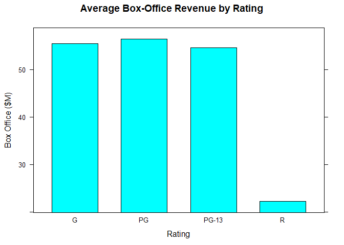
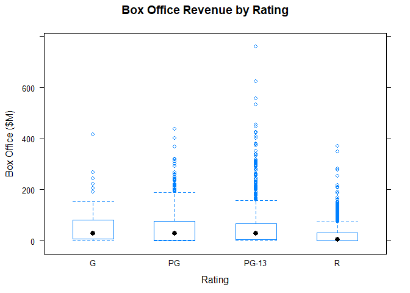
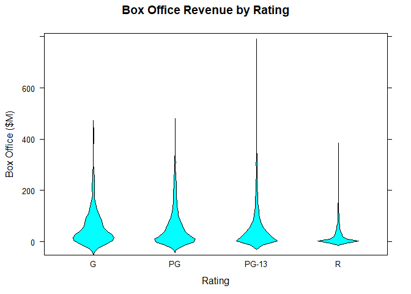

Visualizing both a categorical and a numeric variable
================

We are requested to answer:

    1. How does average box-office revenue compare across raings?
    2. How similar are the spreads of box-office revenue across ratings?
    3. How do their shapes compare?

*Bivariate visualizations for bith qualitiative and quantitiative bivariate variable*

Setting up environment
----------------------

``` r
movies <- read.csv("../data/Movies.csv")
main_label <- "Average Box-Office Revenue by Rating"
rating_label <- "Rating"
box_office_label <- "Box Office ($M)"
library(lattice)
```

Install dplyr library `install.packages("dplyr")`

``` r
library("dplyr")
```

    ## Warning: package 'dplyr' was built under R version 3.5.2

    ## 
    ## Attaching package: 'dplyr'

    ## The following objects are masked from 'package:stats':
    ## 
    ##     filter, lag

    ## The following objects are masked from 'package:base':
    ## 
    ##     intersect, setdiff, setequal, union

Plots
-----

Create table of average box office by rating

``` r
average  <- movies %>% 
  select(Rating, Box.Office) %>%
  group_by(Rating) %>%
  summarize(Box.Office = mean(Box.Office)) %>%
  as.data.frame()

print(average)
```

    ##   Rating Box.Office
    ## 1      G   55.47561
    ## 2     PG   56.40439
    ## 3  PG-13   54.56134
    ## 4      R   22.26118

### Bivariate Bar Chart

``` r
barchart(
  x = Box.Office ~ Rating,
  data = average,
  main = main_label,
  xlab = rating_label,
  ylab = box_office_label)
```



### Bivariate box plot

``` r
main_label <- "Box Office Revenue by Rating"
bwplot(
  x = Box.Office ~ Rating,
  data = movies,
  main = main_label,
  xlab = rating_label,
  ylab = box_office_label)
```



### Notched Box Plot

``` r
bwplot(
  x = Box.Office ~ Rating,
  data = movies,
  notch = TRUE,
  main = main_label,
  xlab = rating_label,
  ylab = box_office_label)
```


### Violing plot

``` r
bwplot(
  x = Box.Office ~ Rating,
  data = movies,
  panel = panel.violin,
  main = main_label,
  xlab = rating_label,
  ylab = box_office_label)
```


