Data Visualization - Quantitative Bivariate Analysis
================

Data Load
=========

Let's start by taking a look to our current dataset

``` r
library(tidyverse)
```

    ## Warning: package 'tidyverse' was built under R version 3.5.2

    ## -- Attaching packages ---------------------------------------------------------------------------------------------------------------------------------- tidyverse 1.2.1 --

    ## v ggplot2 3.1.0       v purrr   0.3.0  
    ## v tibble  2.0.1       v dplyr   0.8.0.1
    ## v tidyr   0.8.2       v stringr 1.4.0  
    ## v readr   1.3.1       v forcats 0.4.0

    ## Warning: package 'ggplot2' was built under R version 3.5.2

    ## Warning: package 'tibble' was built under R version 3.5.2

    ## Warning: package 'tidyr' was built under R version 3.5.2

    ## Warning: package 'readr' was built under R version 3.5.2

    ## Warning: package 'purrr' was built under R version 3.5.2

    ## Warning: package 'dplyr' was built under R version 3.5.2

    ## Warning: package 'stringr' was built under R version 3.5.2

    ## Warning: package 'forcats' was built under R version 3.5.2

    ## -- Conflicts ------------------------------------------------------------------------------------------------------------------------------------- tidyverse_conflicts() --
    ## x dplyr::filter() masks stats::filter()
    ## x dplyr::lag()    masks stats::lag()

``` r
library(dslabs)
```

    ## Warning: package 'dslabs' was built under R version 3.5.2

``` r
library(lattice)
library(lubridate)
```

    ## Warning: package 'lubridate' was built under R version 3.5.2

    ## 
    ## Attaching package: 'lubridate'

    ## The following object is masked from 'package:base':
    ## 
    ##     date

``` r
load("rda/apps_dataset.rda")
load("rda/apps_categories_dataset.rda")
load("rda/apps_genres_dataset.rda")
load("rda/apps_versions_dataset.rda")
ds_theme_set()
```

Data Visualization
==================

Quantitative Bivariate Analysis
-------------------------------

Quantitative Features:

    * Ratings
    * Reviews
    * Size (Numeric)
    * Price

Qualitative Features:

    * Category
    * Installs (Install range)
    * Type (Free/Paid)
    * Content Rating
    * Genre

### Content Rating vs Reviews

#### Bivariate Bar Chart

``` r
options(scipen = 999) # Disabling Scientific notation
ggplot <- apps_versions_dataset %>%
  ggplot(aes(x = Content.Rating, y = Reviews)) +
  ggtitle("Rating by Content Rating") +
  xlab("Content Rating") +
  ylab("Reviews")


ggplot +
  geom_bar(stat = "identity") 
```

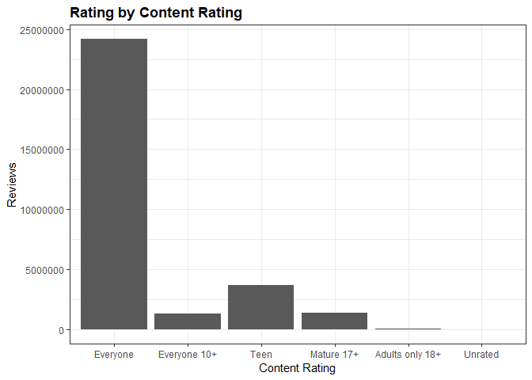

#### Boxplot

``` r
ggplot +
  geom_boxplot()
```

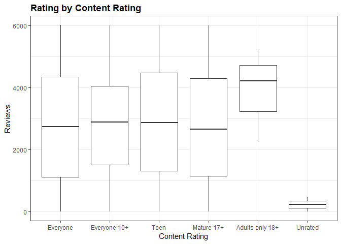

#### Notched Boxplot

``` r
ggplot +
  geom_boxplot(notch = TRUE)
```

    ## notch went outside hinges. Try setting notch=FALSE.
    ## notch went outside hinges. Try setting notch=FALSE.

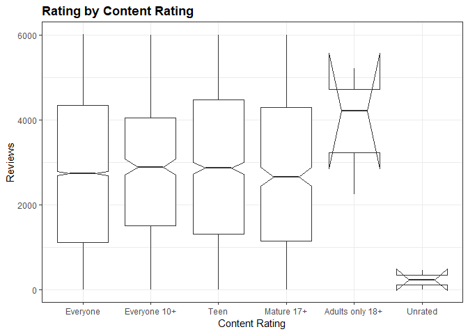

#### Violin Plot

``` r
ggplot +
  geom_violin()
```

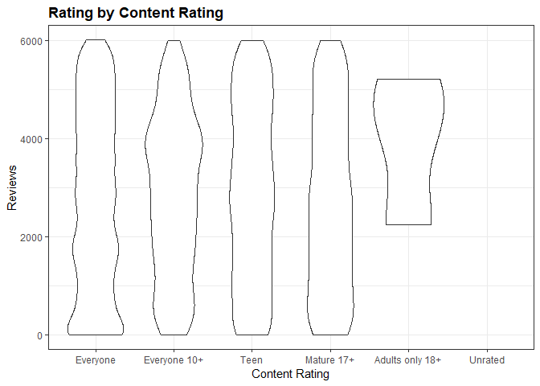

### Content Rating vs Price

#### Bivariate Bar Chart

``` r
ggplot <-  apps_versions_dataset %>%
  filter(Type == "Paid") %>%
  ggplot(aes(x = Content.Rating, y = PriceNumeric)) +
  ggtitle("Price by Content Rating") +
  xlab("Content Rating") +
  ylab("Price")


ggplot +
  geom_bar(stat = "identity")
```

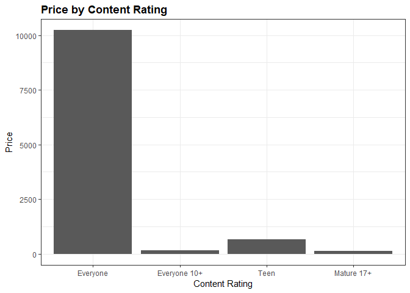

#### Box Plot

``` r
ggplot +
  geom_boxplot()
```

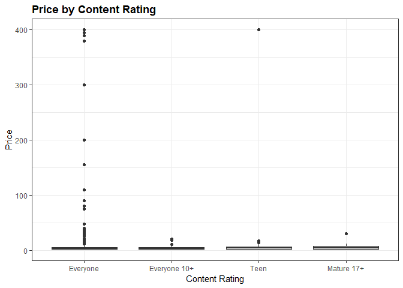

Removing some outliers

``` r
ggplot2 <-  apps_versions_dataset %>%
  filter(Type == "Paid" & PriceNumeric <= 50) %>%
  ggplot(aes(x = Content.Rating, y = PriceNumeric)) +
  ggtitle("Price by Content Rating") +
  xlab("Content Rating") +
  ylab("Price")
  
  ggplot2 +
    geom_boxplot()
```


#### Notched Box Plot

``` r
ggplot +
  geom_boxplot(notch =  TRUE)
```

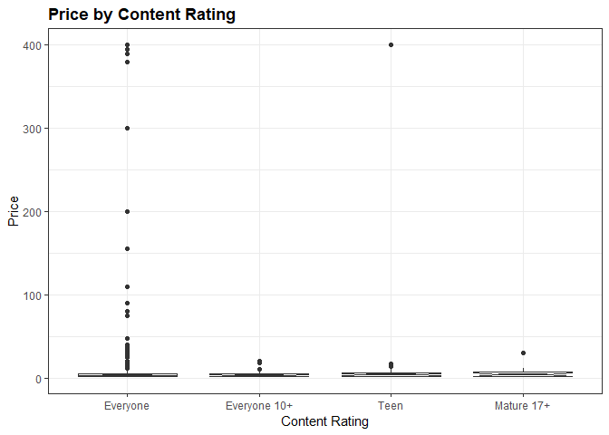

We remove some outliers

``` r
ggplot2 +
  geom_boxplot(notch = TRUE)
```

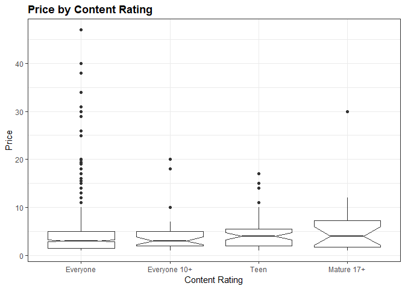

#### Violin Plot

``` r
ggplot +
  geom_violin()
```

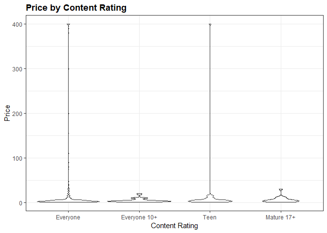

### Type vs Reviews

#### Bivariate Bar Chart

``` r
ggplot <- apps_versions_dataset %>%
  ggplot(aes(x = Type, y = Reviews)) +
  ggtitle("Reviews by Type") +
  xlab("Type") +
  ylab("Reviews")


ggplot +
  geom_bar(stat = "identity")
```

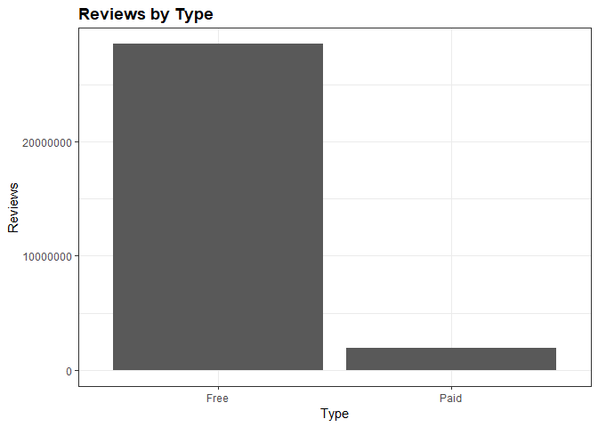

#### Box Plot

``` r
ggplot +
  geom_boxplot()
```


#### Notched Box Plot

``` r
ggplot +
  geom_boxplot(notch = TRUE)
```

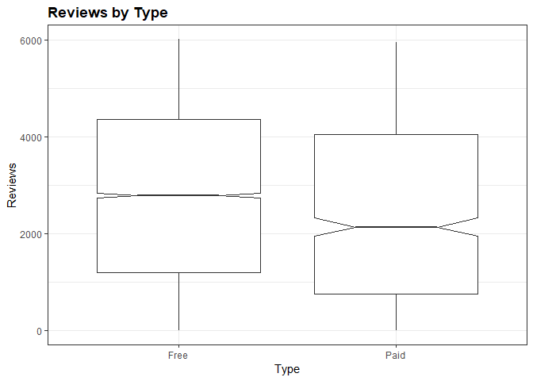

#### Violin Plot

``` r
ggplot +
  geom_violin()
```

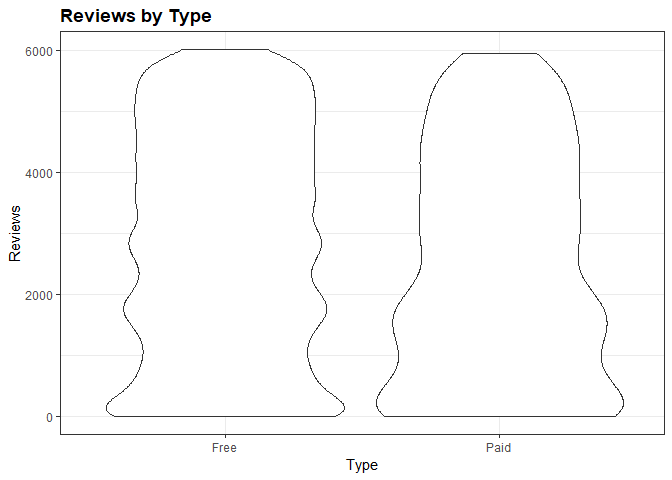
