Data Visualization - Qualitative Univariate Analysis
================

Data Load
=========

Let's start by taking a look to our current dataset

``` r
library(tidyverse)
```

    ## ── Attaching packages ───────────────────────────────────────────────────────────────────────────────────────────────────────────────── tidyverse 1.2.1 ──

    ## ✔ ggplot2 3.1.0       ✔ purrr   0.3.1  
    ## ✔ tibble  2.0.1       ✔ dplyr   0.8.0.1
    ## ✔ tidyr   0.8.3       ✔ stringr 1.4.0  
    ## ✔ readr   1.3.1       ✔ forcats 0.4.0

    ## ── Conflicts ──────────────────────────────────────────────────────────────────────────────────────────────────────────────────── tidyverse_conflicts() ──
    ## ✖ dplyr::filter() masks stats::filter()
    ## ✖ dplyr::lag()    masks stats::lag()

``` r
library(ggplot2)
library(dslabs)
library(forcats)

load("rda/apps_dataset.rda")
load("rda/apps_categories_dataset.rda")
load("rda/apps_genres_dataset.rda")
load("rda/apps_versions_dataset.rda")
ds_theme_set()
head(apps_dataset)
```

    ##                                                  App
    ## 1     Photo Editor & Candy Camera & Grid & ScrapBook
    ## 2                                Coloring book moana
    ## 3 U Launcher Lite – FREE Live Cool Themes, Hide Apps
    ## 4                              Sketch - Draw & Paint
    ## 5              Pixel Draw - Number Art Coloring Book
    ## 6                         Paper flowers instructions

Data Visualization
==================

So now our data is loaded, let's start by making questions that may fit on the course structure.

Qualitative Univariate Analysis
-------------------------------

**Questions to answer**

    * How many apps are in each app category?
    * How many apps are in each installation range?
    * What proportion of apps are paid apps?
    * How many apps are in each app content rating?
    * How many apps are in each app genre?
    * What proportion of apps are supporting the latest version?

### How many apps are in each app category?

#### Frequency chart

``` r
apps_categories_dataset %>% 
  ggplot(aes(x =fct_infreq(Category))) +
  geom_bar() +
  ggtitle("Count of Apps by Category") +
  xlab("Category") +
  ylab("Count") +
  theme(axis.text.x = element_text(angle = 90))
```

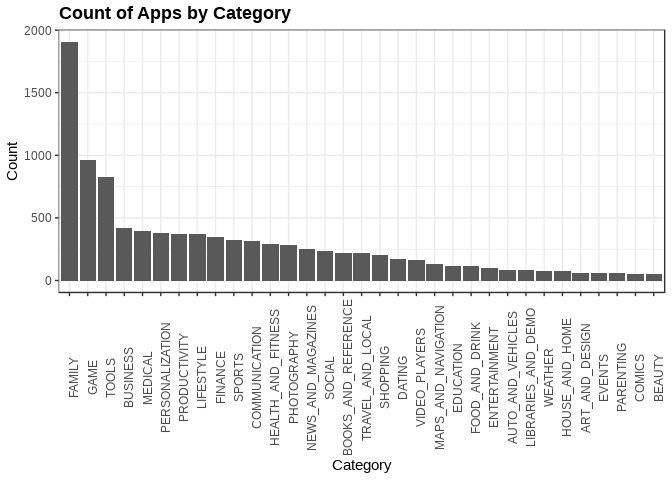

#### Horizontal frequency chart

We have too many categories, so it's a better approach to display the data horizontally

``` r
apps_categories_dataset %>% 
  ggplot(aes(x =fct_rev(fct_infreq(Category)))) +
  coord_flip() +
  geom_bar() +
  geom_text(aes(label = ..count.., hjust = -.05), stat = "count") +
  ggtitle("Count of Apps by Category") + 
  xlab("Count") +
  ylab("Category") +
  scale_y_continuous(limits = c(0,2050)) +
  theme(axis.text.x = element_text(angle = 90))
```

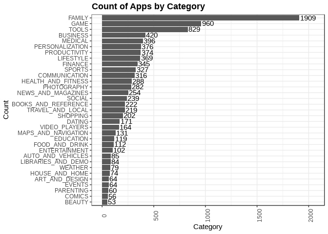

#### Cleveland plot

It is an alternative way to show the data, but horizontal bar chart is clearer

``` r
apps_categories_dataset %>%
  ggplot(aes(x =fct_rev(fct_infreq(Category)))) +
  geom_point(stat = "count") +
  coord_flip() +
  ggtitle("Count of Apps by Category") +
  xlab("Count") + 
  ylab("Category") +
  geom_text(aes(label = ..count.., hjust = -0.25), stat = "count") +
  scale_y_continuous(limits = c(0,2050))
```

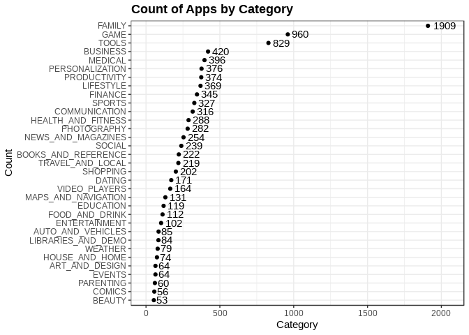

``` r
  theme(axis.text.x = element_text(angle = 90))
```

    ## List of 1
    ##  $ axis.text.x:List of 11
    ##   ..$ family       : NULL
    ##   ..$ face         : NULL
    ##   ..$ colour       : NULL
    ##   ..$ size         : NULL
    ##   ..$ hjust        : NULL
    ##   ..$ vjust        : NULL
    ##   ..$ angle        : num 90
    ##   ..$ lineheight   : NULL
    ##   ..$ margin       : NULL
    ##   ..$ debug        : NULL
    ##   ..$ inherit.blank: logi FALSE
    ##   ..- attr(*, "class")= chr [1:2] "element_text" "element"
    ##  - attr(*, "class")= chr [1:2] "theme" "gg"
    ##  - attr(*, "complete")= logi FALSE
    ##  - attr(*, "validate")= logi TRUE

#### Pie chart

*Disclamer: Pie chart is not a recomended way to display any data, and it must not be used in general, anyway, in very few scenarios may be useful.*

As we can see, this data visualization is not clear nor useful for this amount of categories, anyway, we can answer easily the question about what category has more apps.

``` r
apps_categories_dataset %>% 
  ggplot(aes(x = "", fill = Category)) +
  geom_bar() +
  coord_polar(theta = "y") +
  ggtitle("Count of Apps by Category") +
  ylab("") +
  xlab("") +
  theme(
    axis.text.x = element_blank(),
    axis.ticks.y = element_blank())
```

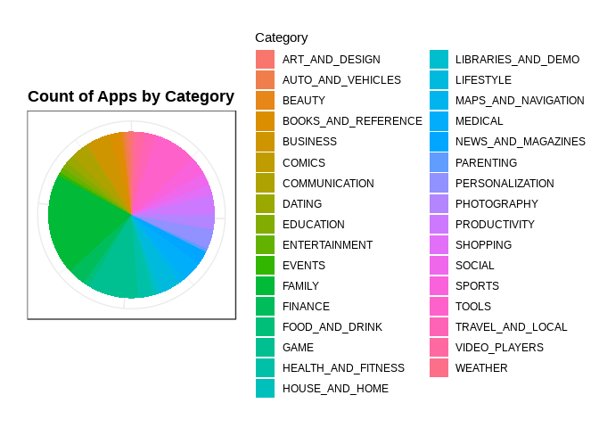

#### Answer

Question: **How many apps are in each app category?**

Answer, from bar chart we can see easily how many apps have each category, for instance,

    * What is the category with more apps?
      - Family, by far, with 1972 apps.
    * What is the category with less apps?      
      - Beauty, with 53 apps
    * What is the range of apps that a category has?
      - it is a wide range, 100 to 400.

### How many apps are in each installation range?

#### Frequency chart

``` r
apps_versions_dataset %>% 
  group_by(Installs) %>%
  select(Installs, App) %>%
  summarize(count = n())
```

    ## # A tibble: 20 x 2
    ##    Installs       count
    ##    <fct>          <int>
    ##  1 0+                15
    ##  2 1+                67
    ##  3 5+                82
    ##  4 10+              386
    ##  5 50+              205
    ##  6 100+             719
    ##  7 500+             330
    ##  8 1,000+           911
    ##  9 5,000+           477
    ## 10 10,000+         1055
    ## 11 50,000+          479
    ## 12 100,000+        1173
    ## 13 500,000+         551
    ## 14 1,000,000+      1604
    ## 15 5,000,000+       782
    ## 16 10,000,000+     1324
    ## 17 50,000,000+      307
    ## 18 100,000,000+     479
    ## 19 500,000,000+      86
    ## 20 1,000,000,000+    60

``` r
apps_versions_dataset %>% 
  ggplot(aes(x = Installs)) +
  ggtitle("Count of Apps by App Installs") +
  xlab("Installs") +
  ylab("Count") +
  geom_bar() +
  geom_text(aes(label=..count.., vjust= -.3), stat = "count") +
  theme(
    axis.text.x = element_text(angle = 90))
```

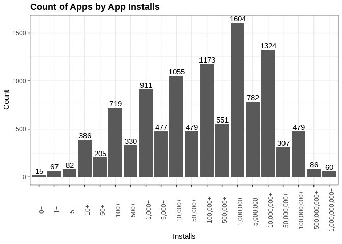

#### Horizontal frequency chart

This data is more clear if shown in horizontal orientation, due to the long number of installs levels

``` r
apps_versions_dataset %>%
  ggplot(aes(Installs), stat = "count") +
  geom_bar() +
  coord_flip() +
  ggtitle("Count of Apps by App Installs") +
  ylab("Count") +
  geom_text(aes(label = ..count.., hjust = -.1), stat = "count") +
  scale_y_continuous(limits = c(0,1650))
```

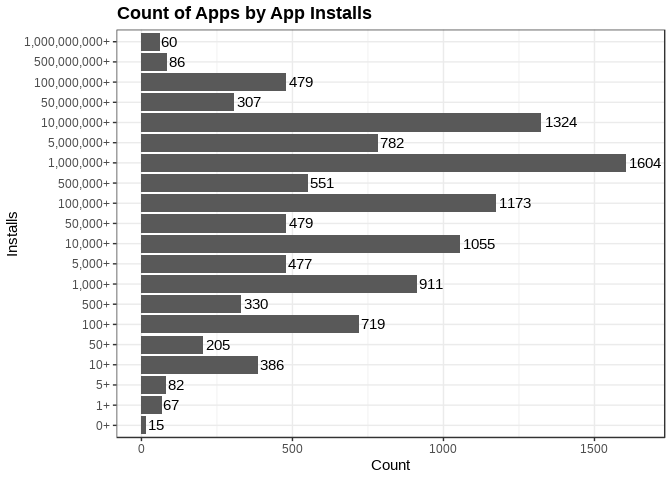

#### Cleveland plot

``` r
apps_versions_dataset %>%
  ggplot(aes(Installs)) +
  ggtitle("Count of Apps by App Installs") +
  geom_point(stat = "count") + 
  xlab("Installs") +
  ylab("Count") +
  coord_flip() +
  geom_text(aes(label = ..count.., vjust= -.1, hjust= -.2), stat="count") +
  scale_y_continuous(limits = c(0,1650))
```

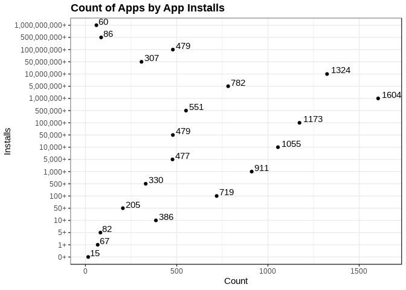

#### Pie chart

This visulization is also not the best for this data

``` r
apps_versions_dataset %>%
  ggplot(aes(x = "", fill = Installs)) +
  geom_bar() + 
  coord_polar(theta = "y") +
  ggtitle("Count of Apps by App Installs") +
  theme(
    axis.text.x = element_blank(),
    axis.ticks = element_blank())
```

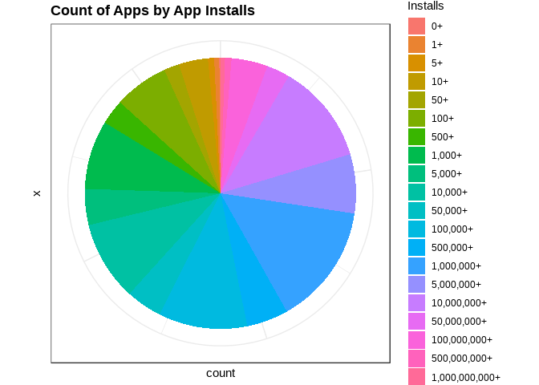

#### Answer

Question: *How many apps are in each installation range?*

Answer, from bar chart we can see easily how many apps have each app install, for instance,

    * What is the most common number of installation for an app?
      - We limit the answer to a big range, but it is because the range size we have, and we can tell it is between $1,000,000 and $5,000,000
    * Are there apps with no Installs?
      - We can say, yes, and the number of apps without Installs are 15, later we can try to see if they are recent or old.

### What proportion of apps are paid apps?

#### Frequency chart

``` r
apps_versions_dataset %>%
  ggplot(aes(x = Type)) +
  geom_bar() +
  ggtitle("Count of Apps by Type") +
  ylab("Count") +
  xlab("Type") 
```

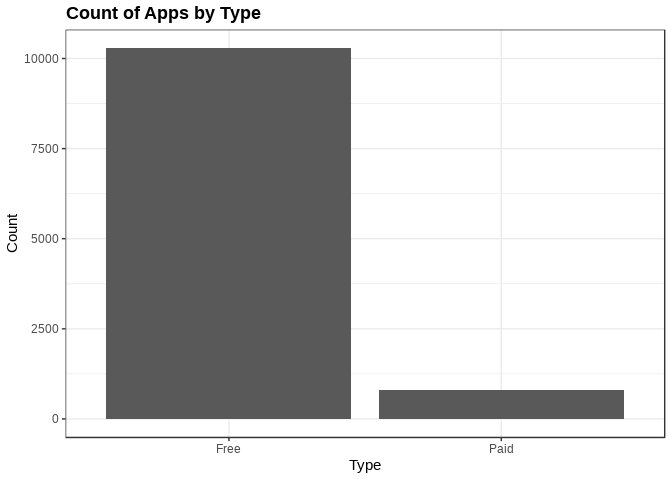

#### Horizontal frequency chart

In this case it is simpler to see the vertical orientation

``` r
apps_versions_dataset %>%
  ggplot(aes(Type)) +
  ggtitle("Count of Apps by Type")+ 
  xlab("Type") +
  ylab("Count") +
  coord_flip() +
  geom_bar()
```

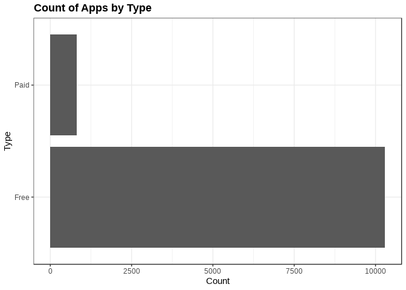

#### Cleveland plot

``` r
apps_versions_dataset %>% 
  ggplot(aes(x= Type)) +
  geom_point(stat="count") +
  coord_flip() +
  ggtitle("Count of App by Type") +
  xlab("Type") +
  ylab("Count") +
  geom_text(aes(label = ..count.., vjust=1.5),stat = "count")
```

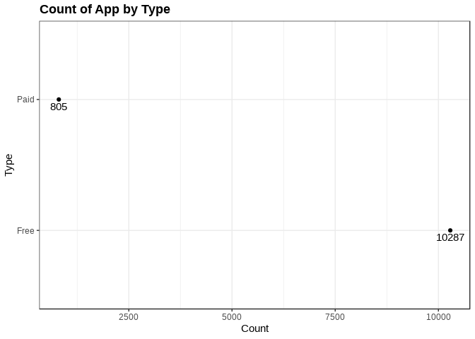

#### Pie chart

In this case this chart can give a quick look to the relationship between the app types

``` r
apps_versions_dataset %>%
  ggplot(aes(x = "", fill=Type)) +
  geom_bar() +
  coord_polar(theta = "y") +
  ggtitle("Count of App by Type") + 
  xlab("") +
  ylab("") +
  theme(
    axis.text.x = element_blank(),
    axis.ticks = element_blank())
```

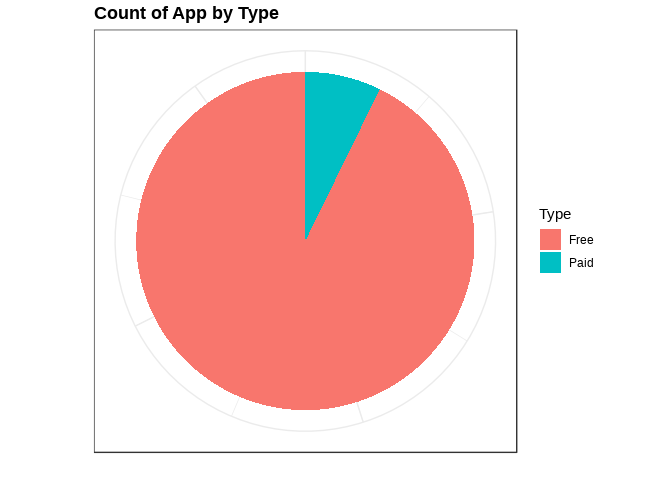

#### Answer

Question: *What proportion of apps are paid apps?*

Answers :

    * What proportion of apps are paid apps?
    - Free apps are predominant app types, less than 10% of apps are paid apps.

### How many apps are in each app content rating?

#### Frequency bar

``` r
apps_versions_dataset %>%
  ggplot(aes(Content.Rating)) +
  geom_bar() +
  ggtitle("Count of Apps by Content Rating") +
  xlab("Content Ratings") + 
  ylab("Count")
```

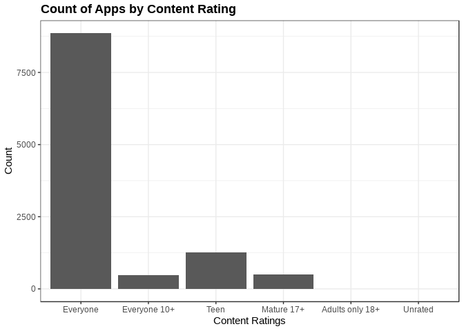

#### Horizontal frequency bar

``` r
apps_versions_dataset %>%
  ggplot(aes(Content.Rating)) +
  geom_bar() +
  ggtitle ("Count of Apps by App Content Ratings") +
  xlab("Content Rating") +
  ylab("Count") +
  coord_flip() + 
  geom_text(aes(label = ..count.., hjust = -.1), stat = "count") +
  scale_y_continuous(limits = c(0,9000))
```

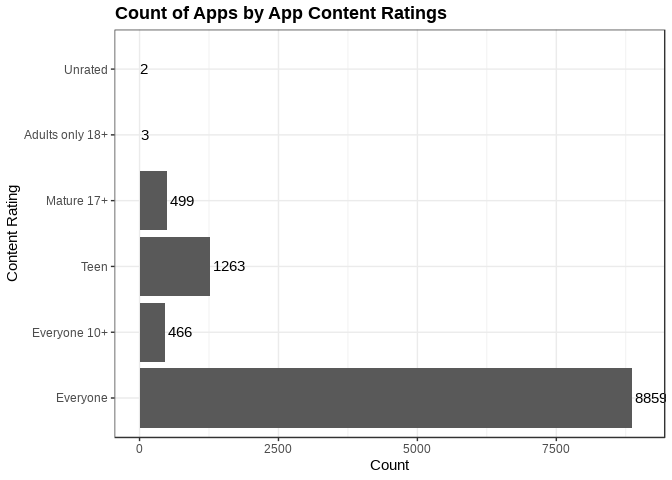

#### Cleveland plot

``` r
apps_versions_dataset %>%
  ggplot(aes(x=Content.Rating)) +
  geom_point(stat = "count") +
  xlab("Content Rating") +
  ylab("Count") +
  coord_flip() +
  ggtitle("Count of Apps by App Content Rating") + 
  geom_text(aes(label = ..count.., vjust = -1), stat = "count")
```

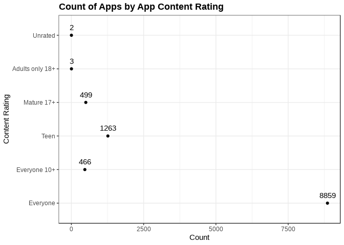

#### Pie chart

``` r
apps_versions_dataset %>%
  ggplot(aes(x= "", fill = Content.Rating)) +
  geom_bar() +
  coord_polar(theta = "y") +
  ggtitle("Count of Apps by App Content Rating") +
  xlab("") +
  ylab("") +
  theme(
    axis.text.x = element_blank(),
    axis.ticks.x = element_blank())
```

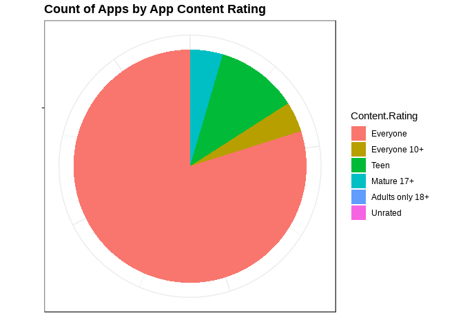

#### Answer

Question *How many apps are in each app rating?*

Now we can tell easly how many apps are in each content rating, and also what are the most/less popular. Answer

    * How many apps are in each app rating?
      We can easly see the data from the chart.
    * What is the content rating with more apps?
      - Everyone
    * what is the content rating with less apps?
      - Unrated and Adults Only 18+

### How many apps are in each app genre?

As you can see from the first frequency bar, the chart is not what we expected and also this is mainly to the fact that one app can be related to more than one Genre.

#### Frequency chart

``` r
apps_genres_dataset %>% 
  ggplot(aes(Genre)) +
  geom_bar() +
  xlab("Genres") +
  ylab("Count") +
  ggtitle("Count of Apps by App Genre") +
  theme(
    axis.text  = element_text(angle = 90))
```

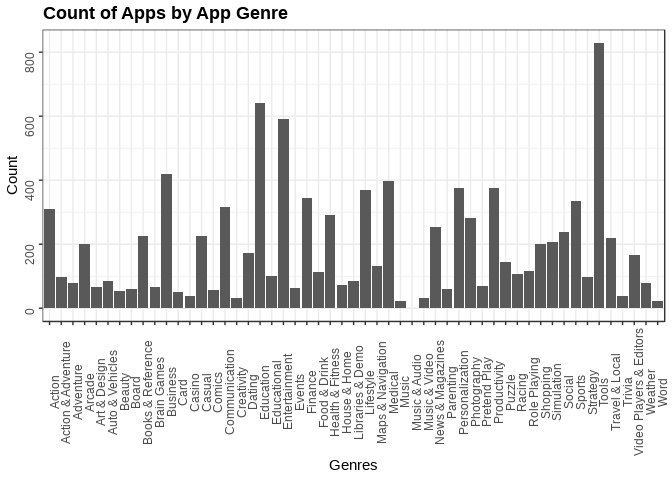

#### Horizontal frequency chart

``` r
apps_genres_dataset %>%
  ggplot(aes(x= Genre)) +
  geom_bar() +
  xlab("Genres") +
  ylab("Count") +
  ggtitle("Count of Apps by Genre") +
  coord_flip() +
  geom_text(aes(label = ..count.., hjust=-.1), stat="count")
```

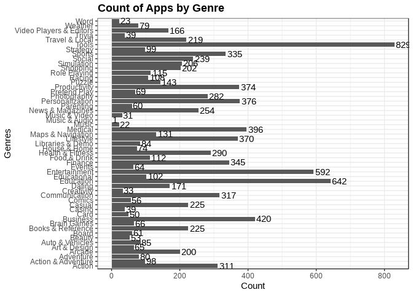

#### Cleveland plot

``` r
apps_genres_dataset %>%
  ggplot(aes(x = Genre)) +
  ggtitle("Count of Apps by Genre") +
  xlab("Genre") +
  ylab("Count") +
  geom_point(stat="count") +
  coord_flip() +
  geom_text(aes(label = ..count.., hjust =-.15), stat="count")
```

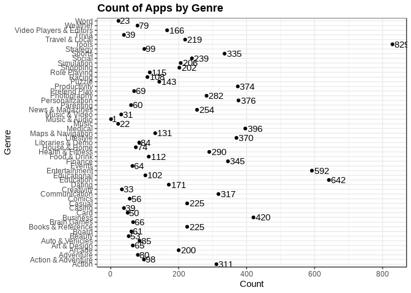

#### Pie chart

*Definitelly it is not useful at all.*

``` r
apps_genres_dataset %>%
  ggplot(aes(x = "", fill = Genre)) +
  geom_bar() +
  coord_polar(theta = "y") +
  ggtitle("Count of Apps by Genre") +
  xlab("") +
  ylab("") +
  theme(
    axis.text.x = element_blank(),
    axis.ticks.x = element_blank())
```

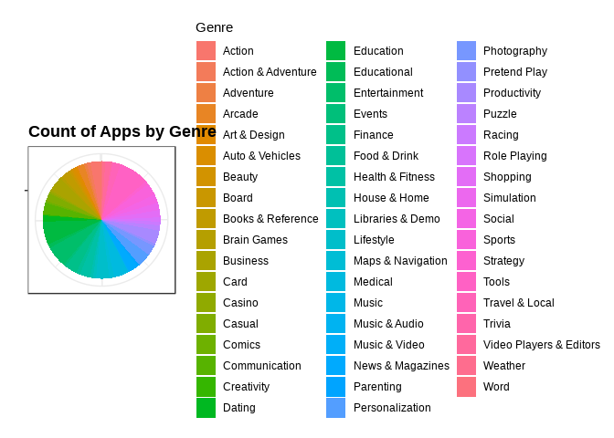

#### Answer

Question *How many apps are in each app genre?*

Answer

    * We can get the data directly from the charts, also we can get the genre that contains more/less apps.
