Data Visualization - Quantitative Univariate Analysis
================

Data Load
=========

Let's start by taking a look to our current dataset

``` r
library(tidyverse)
```

    ## Warning: package 'tidyverse' was built under R version 3.5.2

    ## -- Attaching packages --------------------------------------------------------------------------------------------------- tidyverse 1.2.1 --

    ## v ggplot2 3.0.0     v purrr   0.2.5
    ## v tibble  1.4.2     v dplyr   0.7.6
    ## v tidyr   0.8.1     v stringr 1.3.1
    ## v readr   1.1.1     v forcats 0.3.0

    ## -- Conflicts ------------------------------------------------------------------------------------------------------ tidyverse_conflicts() --
    ## x dplyr::filter() masks stats::filter()
    ## x dplyr::lag()    masks stats::lag()

``` r
library(ggplot2)
library(dslabs)
library(forcats)
library(lattice)
```

    ## Warning: package 'lattice' was built under R version 3.5.2

``` r
library(lubridate)
```

    ## 
    ## Attaching package: 'lubridate'

    ## The following object is masked from 'package:base':
    ## 
    ##     date

``` r
load("rda/apps_dataset.rda")
load("rda/apps_categories_dataset.rda")
load("rda/apps_genres_dataset.rda")
load("rda/apps_versions_dataset.rda")
ds_theme_set()
```

Data Visualization
==================

So now our data is loaded, let's start by making questions that may fit on the course structure.

Quantitative Univariate Analysis
--------------------------------

### Rating Feature Analysis

Setting up initial variables

``` r
title <- "Distribution of App Ratings"
x_lab <- "Ratings"
y_lab <- "Count"
```

#### Dot Plot

As pointed out in this [link](https://ggplot2.tidyverse.org/reference/geom_dotplot.html) :

*When binning along the x axis and stacking along the y axis, the numbers on y axis are not meaningful, due to technical limitations of ggplot2. You can hide the y axis, as in one of the examples, or manually scale it to match the number of dots.*

So we also specify the y axis scale and the dot size, so we can display an approximation to the real distribution.

``` r
apps_versions_dataset %>%
  filter(!is.na(Rating)) %>%
  ggplot(aes(x = Rating, stat = "Count")) +
  geom_dotplot(binwidth = .1, dotsize = .018) +
  ggtitle(title) +
  xlab(x_lab) +
  ylab(y_lab) +
  scale_y_continuous(limits = c(-1, 1200))
```

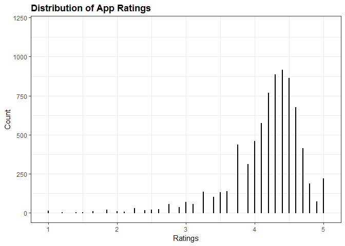

So we create it using Lattice

``` r
apps_versions_dataset %>%
 stripplot(x= ~ Rating,
           main = title,
           xlab = x_lab) 
```

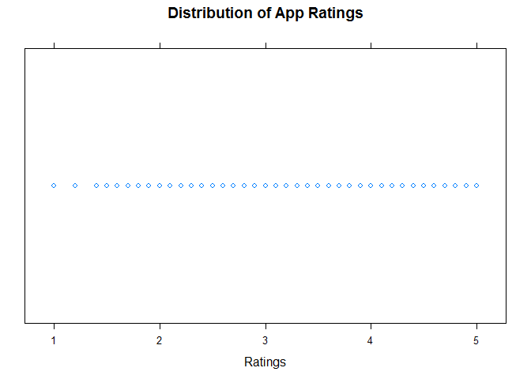

#### Dot Plot Jitter

``` r
apps_versions_dataset %>%
  stripplot( x= ~Rating,
             main = title,
             xlab = x_lab,
             jitter = TRUE,
             amount = 3)
```

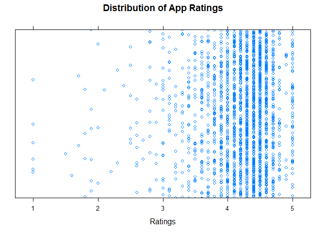

#### Violin dot plot

``` r
apps_versions_dataset %>%
  filter(!is.na(Rating)) %>%
  ggplot(aes(x = Rating, stat="count")) +
  geom_dotplot(
    binwidth = .1,
    dotsize = 0.02,
    stackdir = "center") +
  ggtitle(title) +
  xlab(x_lab)
```

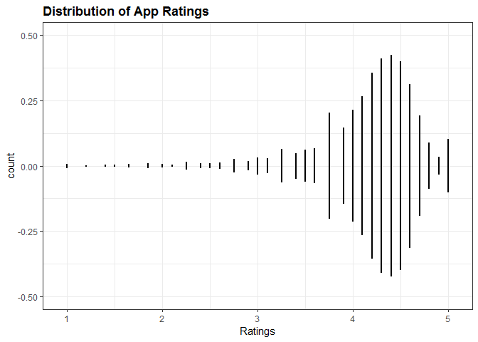

#### Boxplot

``` r
apps_versions_dataset %>%
  filter(!is.na(Rating)) %>%
  ggplot(aes(x = Rating, y=Rating)) +
  geom_boxplot() +
  ggtitle(title) +
  xlab("") + 
  ylab(x_lab) +
  theme(
    axis.text.x = element_blank(),
    axis.ticks.x = element_blank())
```

    ## Warning: Continuous x aesthetic -- did you forget aes(group=...)?

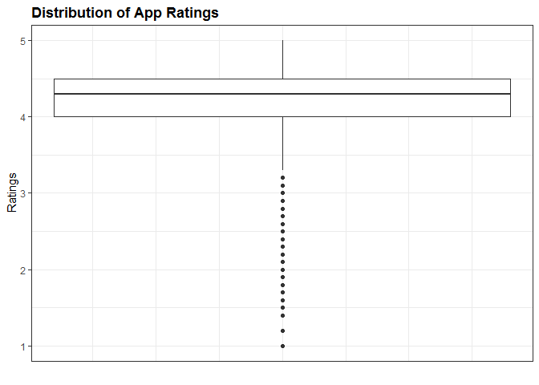

#### Histogram

``` r
apps_versions_dataset %>%
  filter(!is.na(Rating)) %>%
  ggplot(aes(x = Rating)) +
  geom_histogram(binwidth = .1) +
  ggtitle(title) +
  xlab(x_lab) + 
  ylab(y_lab)
```

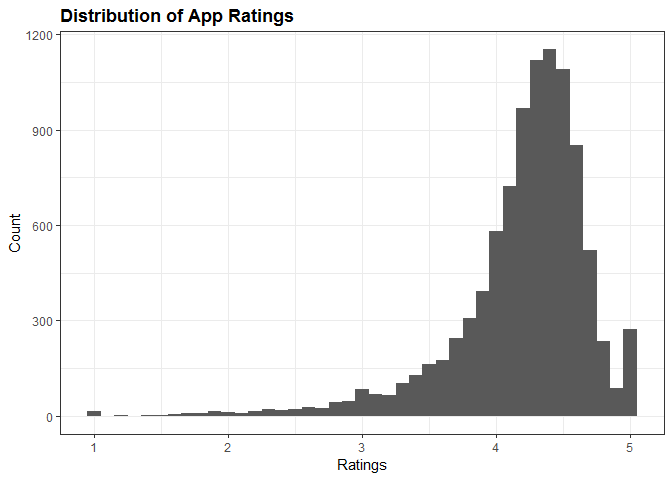

#### Density Plot

``` r
apps_versions_dataset %>%
  filter(!is.na(Rating)) %>%
  ggplot(aes(x=Rating)) +
  geom_density() +
  ggtitle(title) +
  xlab(x_lab) +
  ylab(y_lab)
```

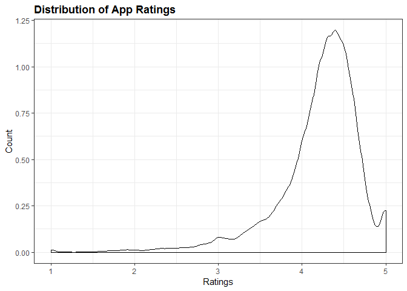

#### Questions/Answers

There is information we can get from the previous chart.

    * This is a left-skewed distribution
    * About ratings we can tell:
       - Most of the apps have ratings between 4 and 4.7
       - Very few apps have rating of 1, which is the less rating value
       - There are some apps with rating of 5, they are few if compared against the total, but much more significant than those with rating of 1
       - Most of the apps have good ratings

### Reviews Feature Analysis

#### Dot Plot

``` r
title <- "Distribution of Reviews"
x_lab <- "Reviews"

apps_versions_dataset %>%
  ggplot(aes( x= Reviews, stat="count")) +
  geom_dotplot(binwidth = 10) +
  ggtitle(title) +
  xlab(x_lab) +
  ylab(y_lab) 
```

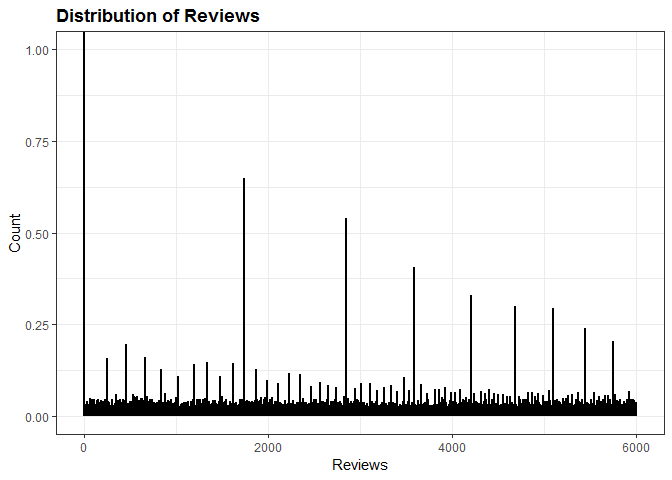

``` r
apps_versions_dataset %>%
  stripplot(
    x = ~ Reviews,
    main = title,
    xlab = x_lab)
```

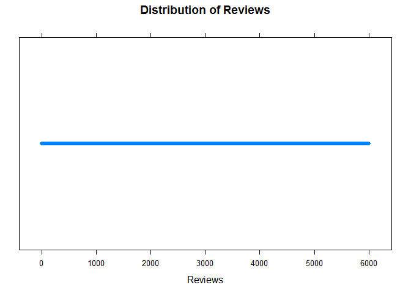

#### Dot Plot Jitter

``` r
apps_versions_dataset %>%
  stripplot( 
    x = ~Reviews,
    main = title,
    xlab = x_lab,
    jitter = TRUE,
    amount = .3)
```

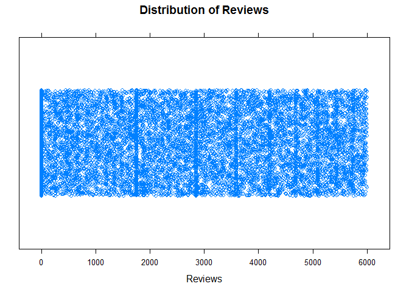

#### Violin Plot

``` r
apps_versions_dataset %>%
  ggplot(aes(x=Reviews, stat = "count")) +
  geom_dotplot(binwidth = 10, stackdir = "center") +
  ggtitle(title) +
  xlab(x_lab) +
  ylab(y_lab)
```

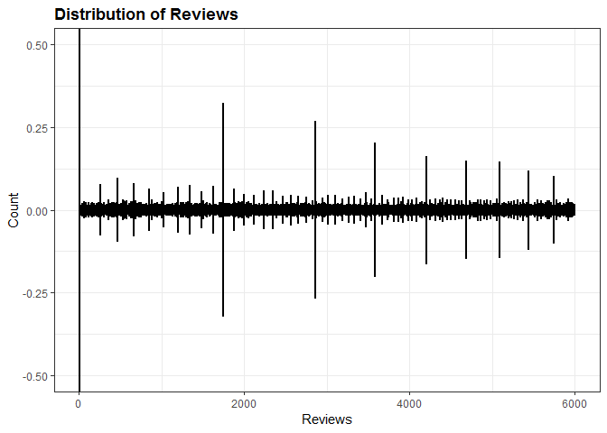

#### Box Plot

``` r
apps_versions_dataset %>%
  ggplot(aes(x = Reviews, y = Reviews)) +
  ggtitle(title) +
  ylab(x_lab) +
  xlab("") +
  geom_boxplot() +
  theme(
    axis.text.x = element_blank(),
    axis.ticks.x = element_blank())
```

    ## Warning: Continuous x aesthetic -- did you forget aes(group=...)?

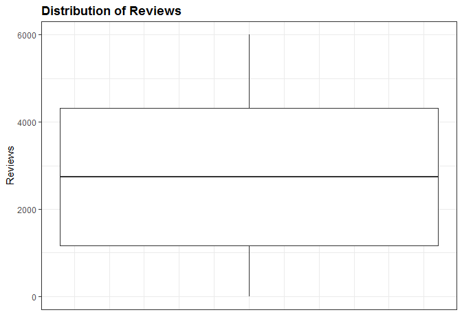

#### Histogram

``` r
apps_versions_dataset %>%
  filter(!is.na(Rating)) %>%  
  ggplot(aes(x = Reviews)) +
  geom_histogram(binwidth = 200) +
  ggtitle(title) +
  xlab(x_lab) + 
  ylab(y_lab)
```

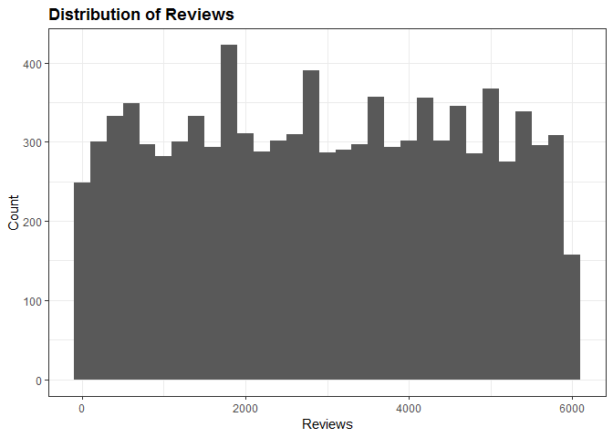

#### Density

``` r
apps_versions_dataset %>%
  filter(!is.na(Rating)) %>%  
  ggplot(aes(x = Reviews)) +
  geom_density() +
  ggtitle(title) +
  xlab(x_lab) +
  ylab(y_lab)
```

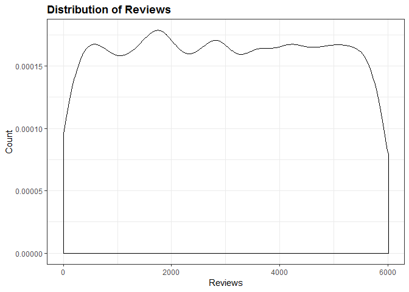

#### Questions/Answers

There is information we can get from the previous chart.

    * This is not a normal distribution
    * Most of the data can be gotten easier from Box Plot
    * About Reviews feature
       - We can see that there is a  number of apps without Rating
       - Most of the apps have reviews between  1600 and 4200

### App Size Analysis

#### Dot Plot

``` r
title <- "Distribution of App Size"
x_lab <- "App Size"

apps_versions_dataset %>%
  ggplot(aes(x = SizeNumeric, stat = "count")) +
  geom_dotplot(binwidth = .2) +
  ggtitle(title) +
  xlab(x_lab) +
  ylab(y_lab)
```

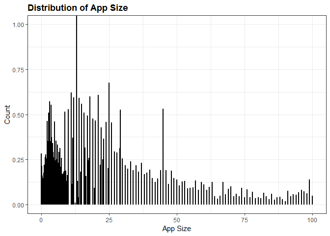

``` r
apps_versions_dataset %>%
  stripplot(x = ~ SizeNumeric,
            main= title,
            xlab = x_lab) 
```

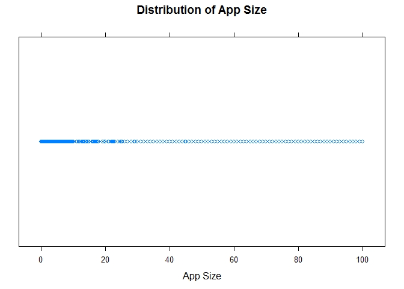

#### Dot Plot Jitter

``` r
apps_versions_dataset %>%
  stripplot(x = ~SizeNumeric,
            main =title,
            xlab = x_lab,
            jitter = TRUE, 
            amount = 2)
```

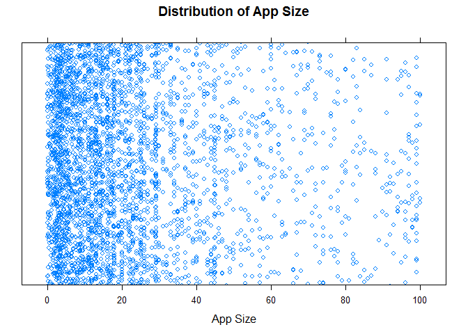

#### Violin Plot

``` r
apps_versions_dataset  %>% 
  ggplot(aes(x = SizeNumeric, stat = "count"))  +
  geom_dotplot(binwidth = .2, stackdir = "center") +
  ggtitle(title) + 
  xlab(x_lab) +
  ylab(y_lab)
```

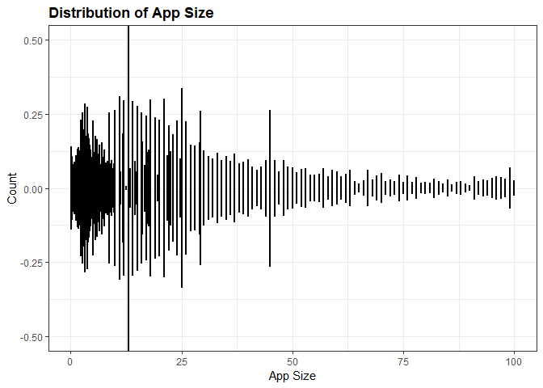

#### Box Plot

``` r
apps_versions_dataset %>%
  ggplot(aes(x = SizeNumeric, y = SizeNumeric)) +
  geom_boxplot() +
  ggtitle(title) +
  ylab(x_lab) +
  xlab("")
```

    ## Warning: Continuous x aesthetic -- did you forget aes(group=...)?

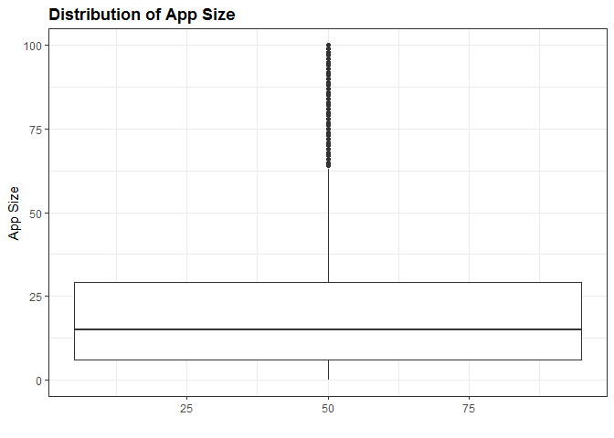

#### Histogram

``` r
apps_versions_dataset %>%
  ggplot(aes(x=SizeNumeric)) +
  geom_histogram(binwidth = 2) +
  ggtitle(title) +
  xlab(x_lab) +
  ylab(y_lab)
```

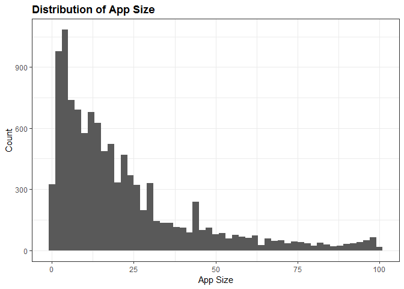

#### Density

``` r
apps_versions_dataset %>%
  ggplot(aes(x = SizeNumeric)) +
  geom_density() +
  ggtitle(title) +
  xlab(x_lab) +
  ylab(y_lab)
```

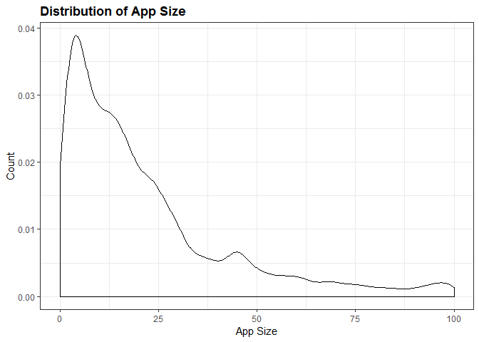

#### Questions/Answers

There is information we can get from the previous chart.

    * We can see the distribution is right-skewsed
    * About data:
       - The size of most apps are 30MB or less.
       - There are really few apps which size is bigger than 100 MB, event than 50 MB

### App Price Feature

#### Dot Plot

``` r
title <- "Distribution of App Price"
x_lab <- "Price"

apps_versions_dataset %>%
  ggplot(aes(x=PriceNumeric, stat="count")) +
  geom_dotplot(binwidth = 1) +
  ggtitle(title) +
  xlab(x_lab) +
  ylab(y_lab)
```

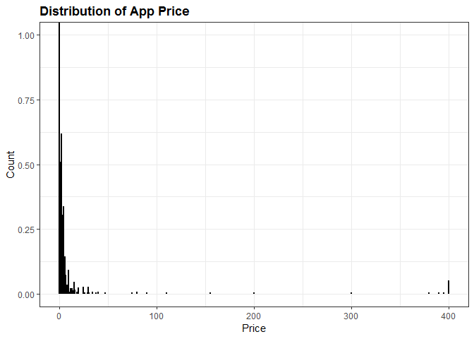

``` r
apps_versions_dataset %>%
  stripplot(
    x = ~ PriceNumeric,
    main = title,
    xlab = x_lab) 
```

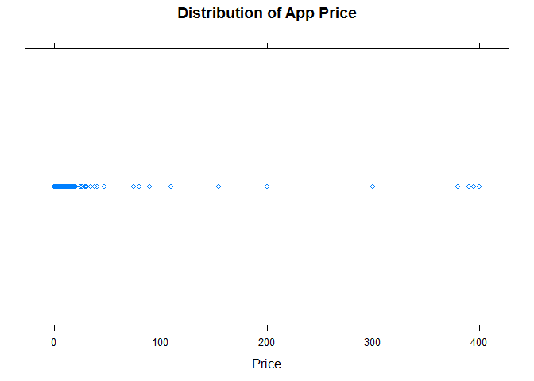

#### Dot Plot Jitter

``` r
apps_versions_dataset %>%
  stripplot( x = ~ PriceNumeric,
             main = title,
             xlab = x_lab, 
             jitter = TRUE,
             amount = .5)
```

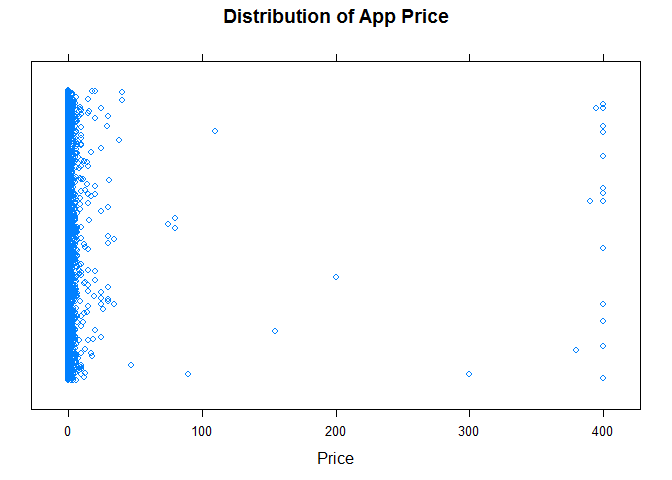

#### Violin Plot

``` r
apps_versions_dataset %>%
  ggplot(aes(x = PriceNumeric)) +
  geom_dotplot(binwidth = 2, stackdir = "center") +
  ggtitle(title) +
  xlab(x_lab)
```

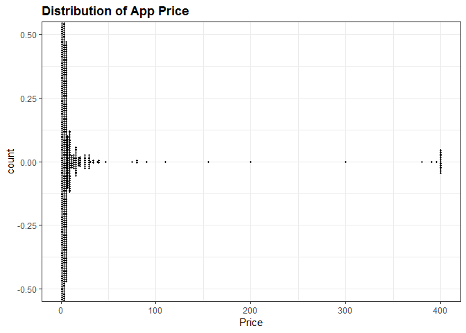

#### Box Plot

``` r
apps_versions_dataset %>%
  ggplot(aes(x = PriceNumeric, y = PriceNumeric)) +
  geom_boxplot() +
  ggtitle(title) +
  ylab(x_lab) +
  xlab("")
```

    ## Warning: Continuous x aesthetic -- did you forget aes(group=...)?

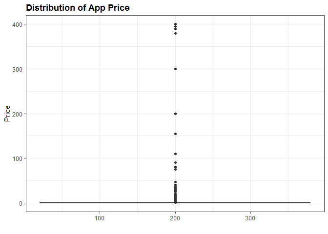

#### Histogram

``` r
apps_versions_dataset %>%
  ggplot(aes(x = PriceNumeric)) +
  geom_histogram(binwidth = 10) +
  ggtitle(title) +
  xlab(x_lab) +
  ylab(y_lab) +
  geom_text(aes(label = ..count.., vjust = -1.8), stat = "count")
```

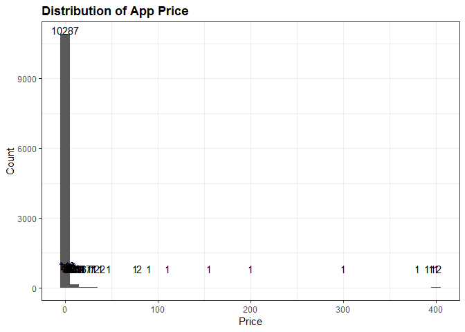

#### Density

``` r
apps_versions_dataset %>%
  ggplot(aes(x = PriceNumeric)) +
  geom_density() +
  xlab(x_lab) +
  ylab(y_lab) +
  ggtitle(title)
```

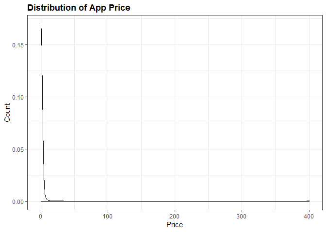

#### Questions/Answers

There is information we can get from the previous chart.

    * Most of the apps are free, or really cheap.
       - The most popular business model is ads.
    * There are some few expensive apps, up to $400 USD.

### Installation Feature Analysis

#### Dot Plot

``` r
options(scipen = 999) # Disabling Scientific notation
title <-  "Distribution of App Installations"
xlab <- "Installations"
apps_versions_dataset %>%
  ggplot(aes(x = InstallsNumeric, stat = "count")) +
  geom_dotplot(binwidth = 100000) +
  ggtitle(title) +
  xlab(x_lab) +
  ylab(y_lab)
```

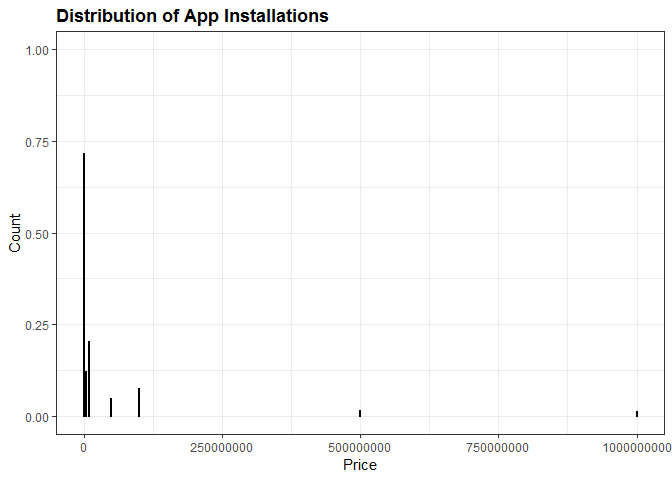

``` r
apps_versions_dataset %>%
  stripplot(x = ~ InstallsNumeric,
            main = title,
            xlab = x_lab)
```

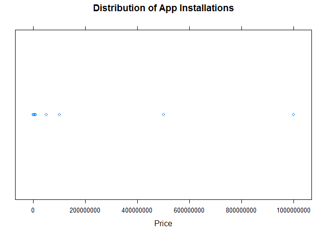

#### Dot Plot Jitter

``` r
apps_versions_dataset %>%
  stripplot(x = ~ InstallsNumeric,
          jitter = TRUE,
          amount = 1,
          xlab = x_lab,
          main = title)
```

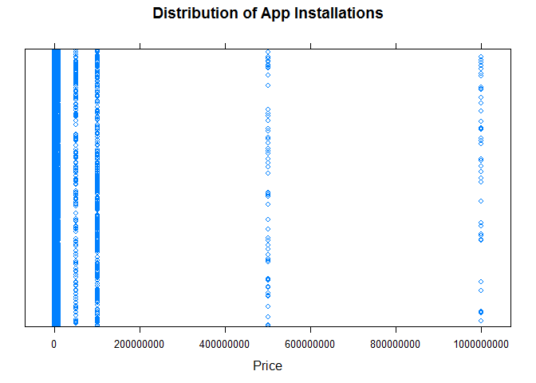

#### Violin Plot

``` r
apps_versions_dataset %>%
  ggplot(aes(x = InstallsNumeric, stat = "count")) +
  geom_dotplot(stackdir = "center", binwidth = 100000) +
  ggtitle(title) +
  xlab(x_lab) +
  ylab(y_lab)
```

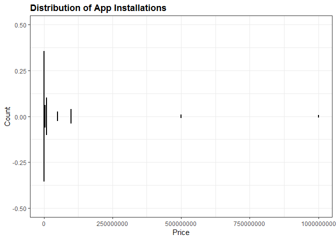

#### Box Plot

``` r
apps_versions_dataset %>%
  ggplot(aes(x = InstallsNumeric, y = InstallsNumeric)) +
  geom_boxplot() +
  ggtitle(title) +
  xlab("") +
  ylab(x_lab) +
  theme(
    axis.text.x = element_blank(),
    axis.ticks.x = element_blank())
```

    ## Warning: Continuous x aesthetic -- did you forget aes(group=...)?

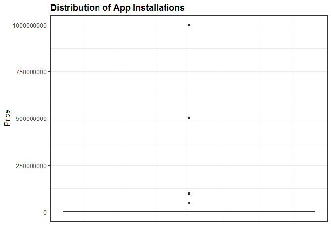

Removing Outliers

``` r
apps_versions_dataset %>%
  filter(InstallsNumeric <= 750000) %>%
  ggplot(aes(x = InstallsNumeric, y = InstallsNumeric)) +
  geom_boxplot() +
  ggtitle(title) +
  xlab("") +
  ylab(x_lab) +
  theme(
    axis.text.x = element_blank(),
    axis.ticks.x = element_blank())
```

    ## Warning: Continuous x aesthetic -- did you forget aes(group=...)?

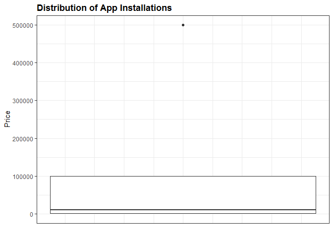

#### Histogram

``` r
apps_versions_dataset %>%
  ggplot(aes(x = InstallsNumeric)) +
  ggtitle(title) +
  xlab(x_lab) + 
  ylab(y_lab) +
  geom_histogram()
```

    ## `stat_bin()` using `bins = 30`. Pick better value with `binwidth`.

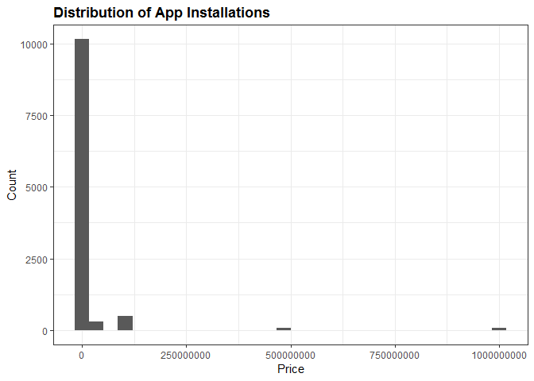

#### Density

``` r
apps_versions_dataset %>%
  ggplot(aes(x = InstallsNumeric)) +
  geom_density() +
  ggtitle(title) +
  xlab(x_lab) +
  ylab(y_lab)
```

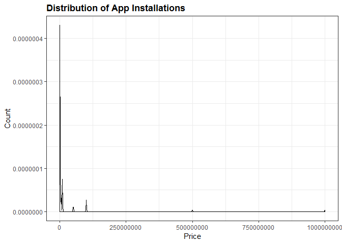

#### Questions/Answers

There is information we can get from the previous chart.

    * There are really few apps that are popular, 1,000,000,000 downloads
    * Most of the apps have less than 100,000 downloads.

### Last Updated Date Feature Analysis

#### Dot Plot

``` r
title <- "Distribution of App Last Update Over Time"
x_lab <- "Last Updated Date"

  apps_versions_dataset %>%
  ggplot(aes(x = Last.UpdatedDate, stat = "count")) +
  geom_dotplot(binwidth = 3, dotsize = 1) +
  ggtitle(title) +
  xlab(x_lab) +
  ylab(y_lab)
```

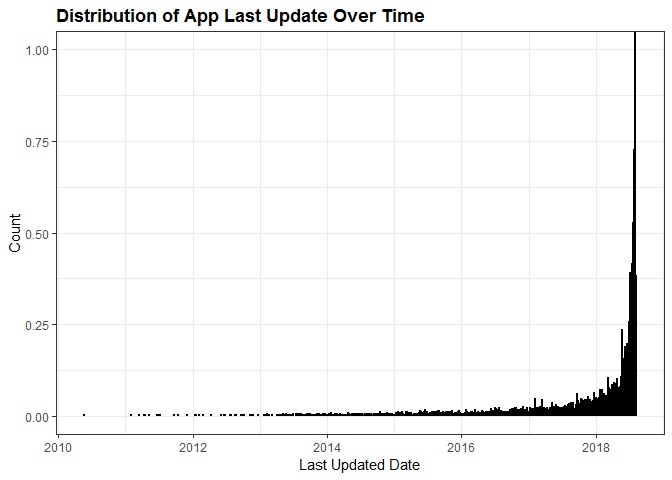

``` r
apps_versions_dataset %>%
  stripplot(x = ~Last.UpdatedDate,
            main = title,
            xlab = x_lab)
```

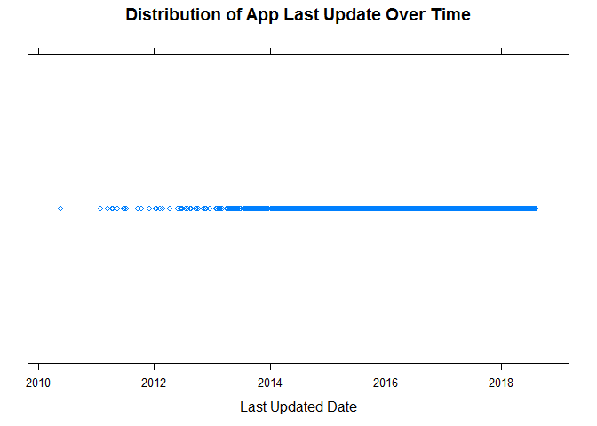

#### Dot Plot Jitter

``` r
apps_versions_dataset %>%
  stripplot(
    x = ~ Last.UpdatedDate,
    main = title,
    xlab = x_lab,
    amount = 4,
    jitter = TRUE)
```

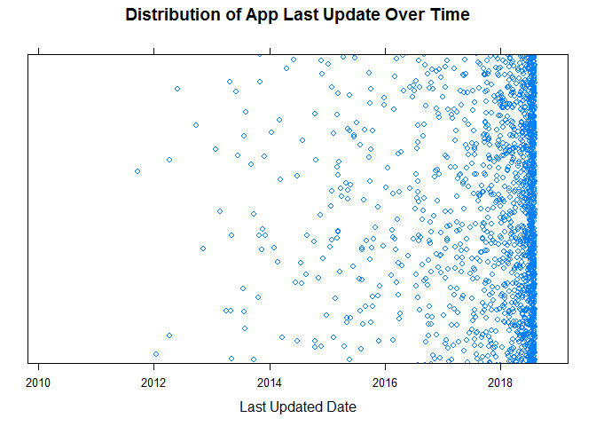

#### Violin Plot

``` r
apps_versions_dataset %>%
  ggplot(aes(x = Last.UpdatedDate, stat ="count")) +
  geom_dotplot(binwidth = 3, dotsize =  1, stackdir = "center") +
  ggtitle(title) +
  xlab(x_lab) +
  ylab(y_lab)
```

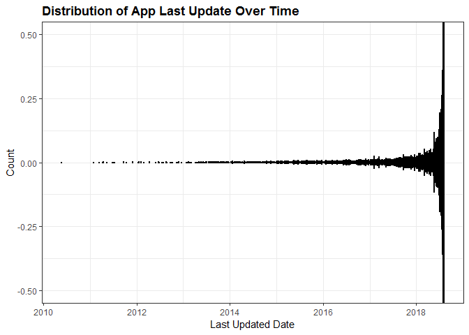

#### Box Plot

``` r
apps_versions_dataset %>%
  ggplot(aes(x =Last.UpdatedDate, y = Last.UpdatedDate)) +
  ggtitle(title) +
  xlab("") +
  ylab(x_lab) +
  geom_boxplot()
```

    ## Warning: Continuous x aesthetic -- did you forget aes(group=...)?

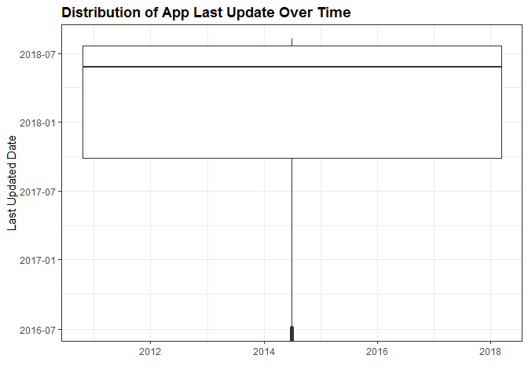

#### Histogram

``` r
apps_versions_dataset %>%
  ggplot(aes(x = Last.UpdatedDate, stat="count")) +
  geom_histogram(bins = 100) +
  ggtitle(title) +
  xlab(x_lab) 
```

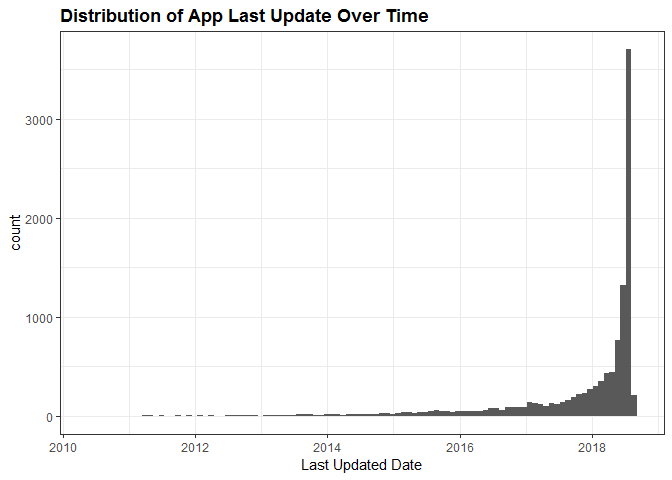

#### Density

``` r
apps_versions_dataset %>%
  ggplot(aes(x = Last.UpdatedDate)) +
  geom_density() +
  ggtitle(title) +
  xlab(x_lab) + 
  ylab(y_lab)
```

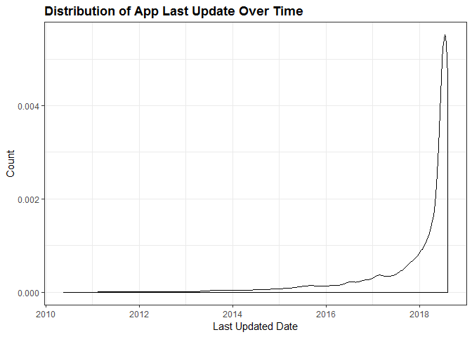

#### Questions/Answers

There is information we can get from the previous chart.

    * This is an exponential distribution
    * About data:
      - We can tell that all the apps are being updated on 2018, and surely there are more brand new apps in the store from this year than any other previous year.
      - We know that this is only a sample, and the data may not be treusty to make some assumptions.
