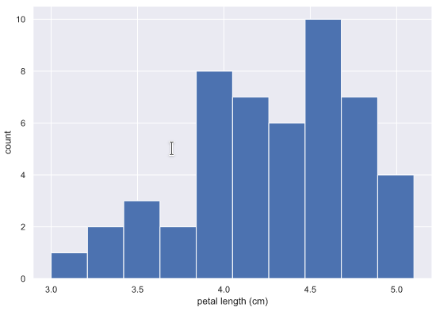

# Histograms


## Description

> A diagram consisting of rectangles whose area is proportional to the frequency of a variable and whose width is equal to the class interval.

## Highlights

### Bins 

* Number of bins is important, a default value is 10. 
* Choosing too many or too few bins can affect the way you see the data
* A rule for choosing the number of bins is to use the **square root of the number of samples**


Python Code snipet to set number of bins based on the edges

```python
bin_edges = [0,10,20,30,40,50,60,70,80,90,100]
plt.hist(df["column"], bins=bin_edges)
```

Python Code snipet to set number of bins based on the edges

```python
plt.hist(df["column"], bins=10)
```


## Python Libraries

* Matplotlib
* Seaborn

Seaborn has plots and predefined themes.

```python
import matplotlib.pyplot as plt
import seaborn as sns

sns.set()
_ = plt.hist(df["variable"])
_ = plt.xlabel("X axis label")
_ = plt.ylabel("Y axis label")
plt.show()
```



## Code Example

Python code snipet

```python
import matplotlib.pyplot as plt
_ = plt.hist(df["variable"])
_ = plt.xlabel("X axis label")
_ = plt.ylabel("Y axis label")
plt.show()
```

