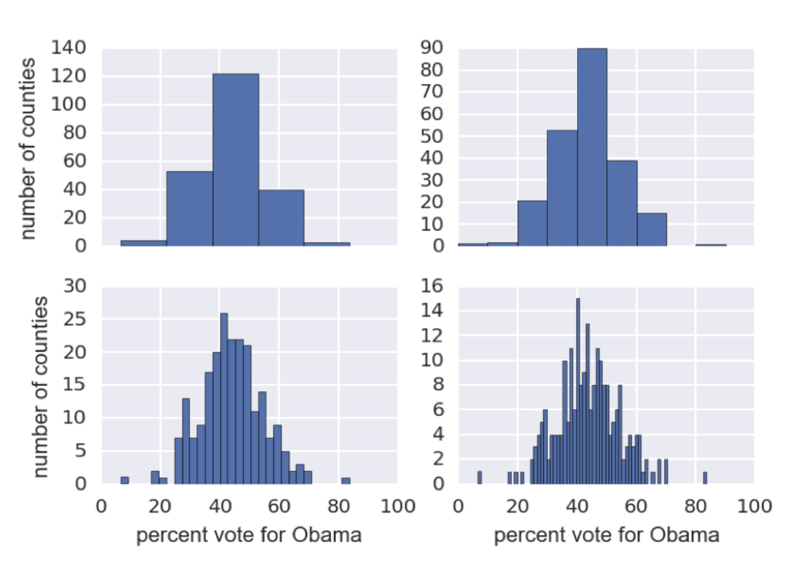
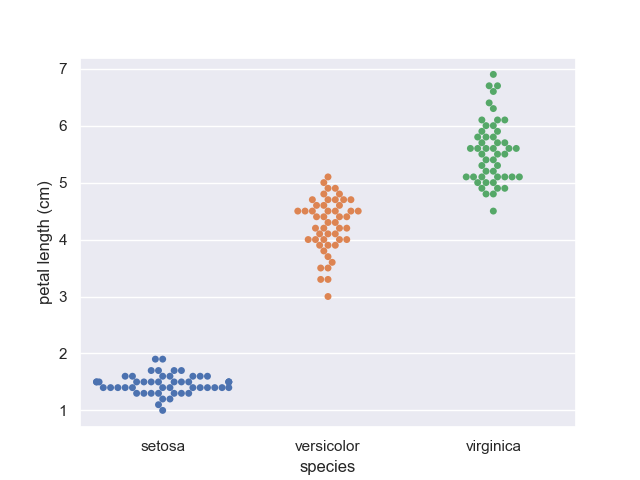
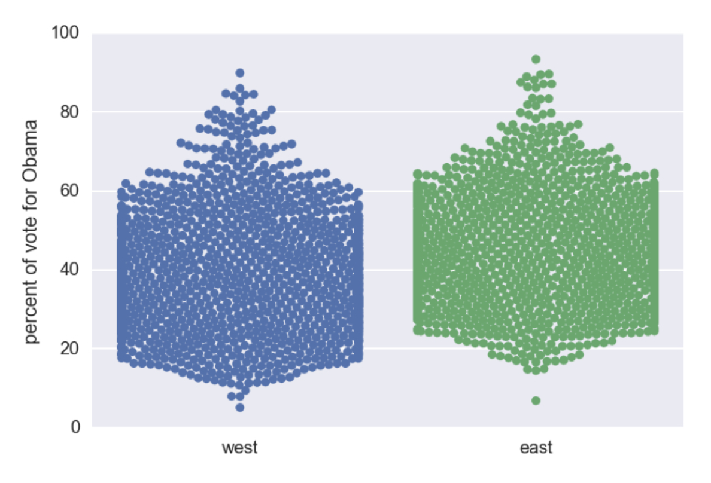
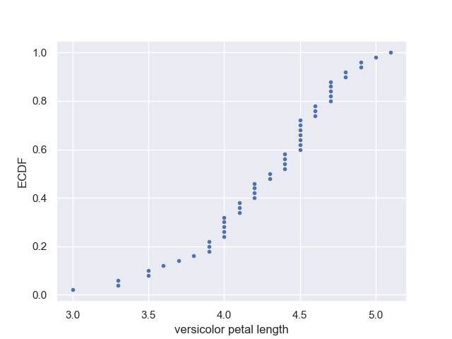
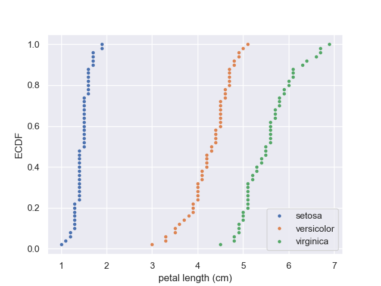
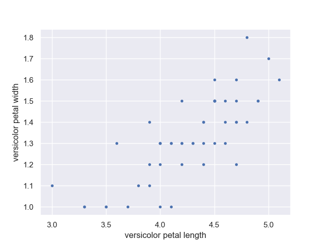

# Exploratory Data Analysis (EDA)

* The process of organizing, plotting, and summarizing a data set

## Graphical EDA 

### Histogram and Binning Bias

One of the most common graph is the Histogram, when the Histogram is used the same data may be interpreted differently depending of the number of bins... which ends up in **Binning Bias**. Also note we are not displaying the data but it is grouped in the bins.



### Bee Swarm Plot

In contrast, this chart displays every single data as a point.



But it is not the best option when we have a lot of data that is overlapping.



### Empirical Cumulative Distribution Function (ECDF)

This chart let us easily compare the percentage vs the feature we are measuring.



For instance we can see:
* 80% of the versicolor petals are 4.7 cm length or more
* 20% of the versicolor petals are below 4.0 cm length 

Highlights

* X must be sorted
* Y is the corresponding percentage

It can be used to compare




# Boxplot

When the number of data is too large and the bee swarm is too cluttered, box plit are great alternative.


# Correlation

We also need to check if there is any correlation between two properties

Here we check the correlation between the hight and width of the petals, and we see a positive correlation




We can calculate the Covariace

```python
np.cov(versicolor_petal_length, versicolor_petal_width)

# [[0.22081633 0.07310204]
# [0.07310204 0.03910612]]
```

and also using Pearson's Correlation

```python
corr_mat = np.corrcoef(versicolor_petal_length, versicolor_petal_width)

# 0.7866680885228169
```