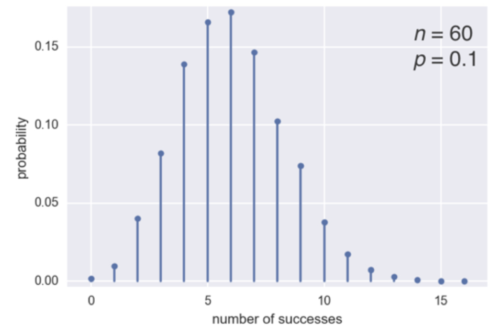
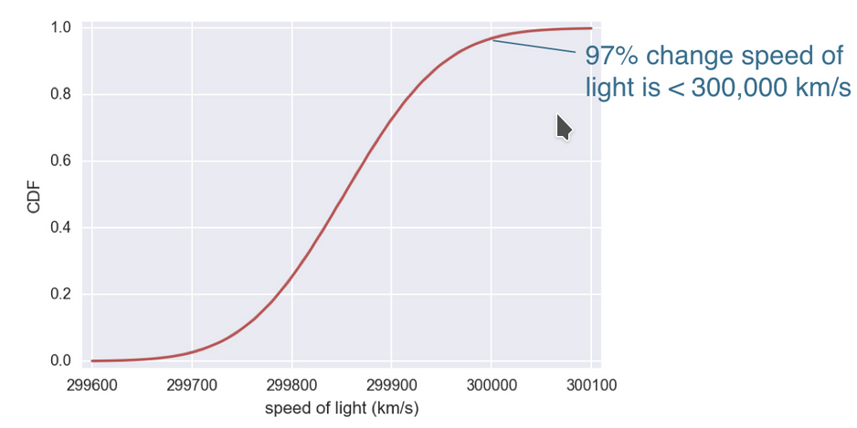
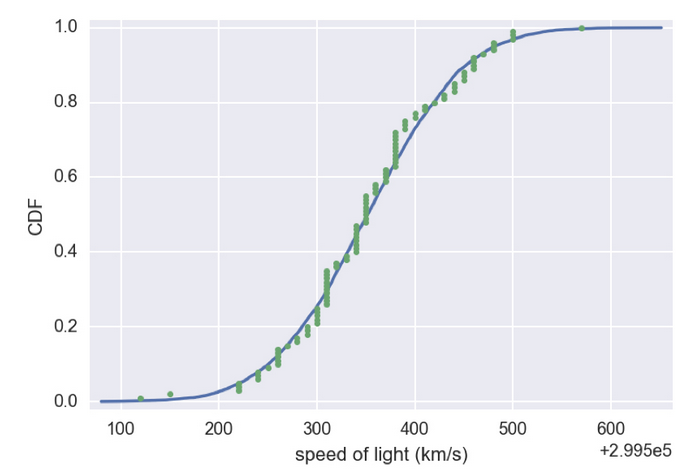

# Probability mass function (PMF)

* The set of probabilities of discrete outcomes

## Discrete Uniform PMF

> Discrete value, is one of n predefined possible values, for instance a dice can get only 1, ... ,6, and all have the same probability of success.

# Probability of distribution

* A mathematical description of outcomes

## Discrete Uniform distribution

The outcome of rolling a single fair die is

* Discrete
* Uniformly distributed


### Binomial Distribution

The probability density for the binomial distribution is

<!-- $P(N) = \binom{n}{N}p^N(1-p)^{n-N}$ --> ,

where n is the number of trials, p is the probability of success, and N is the number of successes.

When estimating the standard error of a proportion in a population by using a random sample, the normal distribution works well unless the product p*n <=5, where p = population proportion estimate, and n = number of samples, in which case the binomial distribution is used instead. For example, a sample of 15 people shows 4 who are left handed, and 11 who are right handed. Then p = 4/15 = 27%. 0.27*15 = 4, so the binomial distribution should be used in this case.

* The number r of successes in n Bernoulli trials with probability p of success, is Binomially distributed.
* The number r of heads in 4 coin flips with probability 0.5 of heads, is Binomially distributed.


Sampling from the Binomial distribution


```python
# Samples are drawn from a binomial distribution with specified parameters, n trials and p probability of success where n an integer >= 0 and p is in the interval [0,1]. (n may be input as a float, but it is truncated to an integer in use)

np.random.binomial(4, 0.5)

# We can specify number of samples
np.random.binomial(4, 0.5, size=10)
```


## The Binomial PMF
So doing an example

```python
samples = np.random.binomial(60, 0.1, size=10000)
```



> Note: In Python it's not too easy create that chart, but we can use teh Binomial CDF instead

## The Binomial CDF

```python
import matplotlib.pyplot as plt
import seaborn as sns

sns.set()

x, y = ecdf(samples)
_ = plt.plot(x, y, marker=".", linestyle="none")
plt.margins(0.02)
_ = plt.xlabel("number of successes")
_ = plt.ylabel("CDF")
plt.show()
```


<<<<<<< HEAD
=======

## Probability Density Function (PDF)

* Continous analog to the PMF
* Mathematical description of the relative likelihood of observing a value of a continuous variable


The probability of occurence is the area under the curve


We also can make reference of the Normal CDF


And we can see the probability in this way


## Normal Distribution

* Describe a continous variable whose PDF has a single symmetric peak


> The mean and standard deviation of the Normal Distribution ARE NOT the same than the ones calculated by the data!!!

Thinking of the example of light speed mesurement we can see that it looks like a Normal Distribution, but we will have **bias**


 so it is better to compare the ECDF against the theorical CDF of the normal distribution

 ```python
import numpy as np
mean = np.mean(speed_of_light)
std = np.std(speed_of_light)
samples = np.random.normal(mean, std, size = 10000)
x, y = ecdf(speed_of_light)
x_theor, y_theor = ecdf(sample)

plt.plot(x_theor, y_theor)
plt.plot(x, y, marker=".", linestyle="none")
plt.xlabel("speed of light in km/s")
plt.ylabel("CDF")
plt.show()
 ```




Removing Bias we can see that the mesurement is approximatelly a Normal Distribution
>>>>>>> 915d80ed462f3653f4ed44332e31f7ced0ee6bbc
