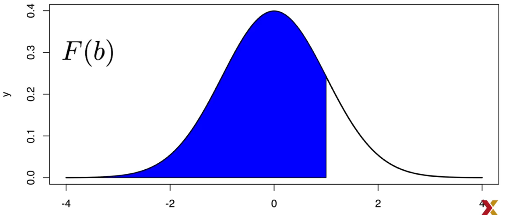
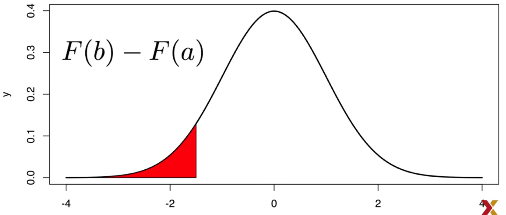
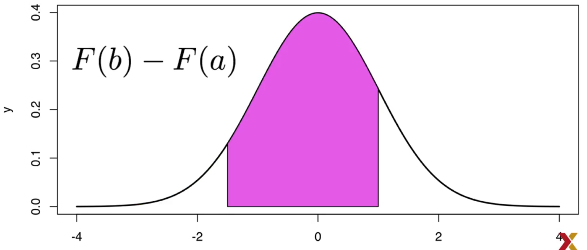

# Continuous Probability

We can use the [Cumulative Distribution Function](../statistics/distributions/ecdf.md)

> The ECDF can be used to get the Probablity Distribition for Continous probability

## Example

An example for this probability is when we are gathering the heights of a population or sample.

```r
library(tidiverse)
library(dslabs)
data(heights)
x <- heights %>% filter(sex=="Male") %>% .$height

# ECDF
F <- function(a) mean(x <= a)

```

### Probability Case 1

What is the chance that a student is taller than 70.5 inches?

The answer is the proportion of students that are taller than 70.5.

```r
1 - F(70)
# 0.3768473
```

### Probability Case 2

What is the probability of a student's height is between A and B.

So we need to take the density of B 



Then we take the density of A 



And we get the difference 



## Code Example

The Cumulative Distribution Function in R

```r
pnorm()
```


Where:

* a is the average (mean)
* s is the standard deviation

So now we dont need to know the entire population since we know the data is distributed as a Normal distribution, so we can calculate the theoreticl distribution by knowing the Mean and Standard Deviation.

So following with the heights example

What is the probability of a student to have a height of 70.5 or more

```r
1 - pnorm(70.5, mean(x), sd(x))
```

We can compare the results of the data vs the theoretical distribution, and the results are really close

```r
mean(x <= 68.5) - mean(x <= 67.5)
#0.114532

pnorm(68.5, mean(x), sd(x))) - pnorm(67.5, mean(x), sd(y)))
#0.1031077

```

## Discretization

> There are cases where the estimated and real probability is not close, it may pass **on some intervals**.

```r
mean(x <= 70.9) - mean(x <= 70.1)
#0.02216749

pnorm(70.9, mean(x), sd(x)) - pnorm(70.1, mean(x), sd(x)
# 0.08359562

```

This may be related to the data gathered and some students round the values to the neares number... *70*

## Probability Density

> For continuous probability getting the probability of a single value is not defined, but there is a theorethical definition which has similar interpretation, it has to do with the **Probability Density**

 <!-- $F(a)=Pr(X\leq a)=\int_{-\infty}^af(x)dx$ --> 


 ### Code

The density distribution function for a normal distribution.

 ```r
dnorm(x)
 ```