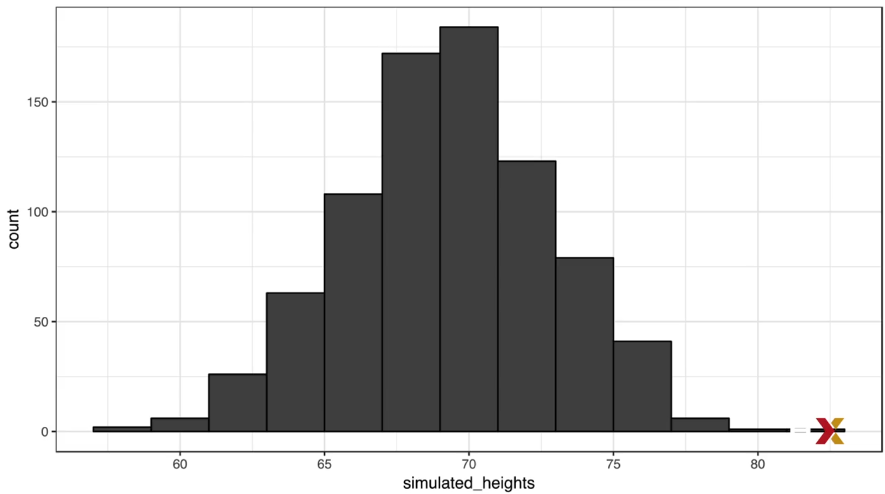

# Monte Carlo Simulation

By using the computer, we can mimic a large enough samples, so we can determine the limits and tendency.

```r
beads <- rep(c("red", "blue"), times = c(2,3))
# beads "red", "red", "blue", "blue", "blue"
sample(beads, 1)
# blue

# So if we want to simulate this event 10000 times
B <- 10000
events <- replicate(B, sample(beads, 1)) 

tab <- table(events)
tab
# events
# blue   red
# 5962   4038

prop.table(tab) #proportion table
# events
# blue   #red
# 0.5962 0.4038


# Sample function has the option to select how many picks, example without replacement (default)
sample(beads, 5) # This will return all the beads in the beads collection

# Sample with replacement
sample(beads, 5, replacement=TRUE)

# So we can OMIT the replicate function by doing this
sample(beads, B, replacement=TRUE)

```

## Monte Carlo Simulation Using Normally Distributed Variables

```r
rnorm(size=0, avg=0, std=1)
```

### Example

```r
x <- heights %>% filter(sex == "Male") %>% .$height
n <- length(x)
avg <- mean(x)
s <- sd(x)
simulated_heights <- rnorm(n, avg, s)
```

It looks normal distributed, because we model it like that.



We can model scenarios to get the max height for a man with this code.

```r
B <- 10000
tallest <- replicate(B, {
    simulated_data <- rnorm(800, avg, s)
    max(simulated_data)
})

mean(tallest >= 7*12)
#0.019
```
