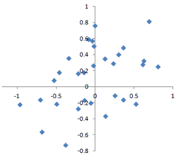
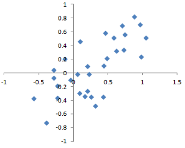

# Random Sampling And Sample Bias

* **Sample** is a subset of data from a larger data set (Population).

* **Random Sampling** is a process in which each available member of the population being sampled has an equal chance of being chosen for the sample at each draw. The sample that results is called *simple random sample*.

* **Sample with replacement** is where the observations are put back in the population.

* **Sample without replacement** is where the observations are not put back in the population.

> Data quality often matters more than data quantity, that is, completeness, consistency of format, cleanliness, and accuracy of individual data points.

* **Bias**, systematic error.

* **Sample bias**, a sample that misrepresents the population.

* **Stratified sampling** is when the population is diveded into strata and randomly sampling from each strata.

* **Statum** (pl. strata) is a homogeneous subgroup of a population with common characteristics.

## Bias

Statistical bias refers to measurement or sampling errors that are systematic and produced by the measurement or sampling process. *An important distinction should be made between errors due to random chance and errors due to bias*.

## Example

Consider the physical process of a gun shooting at a target.

**Unbiased process**

An unbiased process will produce error, but it is random and does not tend strongly in any direction.

A bias process will produce error too, but there will be a tendency as shown below

## Random Selection

> Proper definition of an accessible population is key.

### Stratified sampling

In  stratified  sampling, the population is divided up into  strata, and random samples are taken from each stratum. Political pollsters might seek to learn the electoral preferences of whites, blacks, and Hispanics. A simple random sample taken from the population would yield too few blacks and Hispanics, so those strata could be overweighted in stratified sampling to yield equivalent sample sizes.

### Size vs Quality

In the era of big data, it is sometimes surprising that smaller is better.  Time and effort spent on random sampling not only reduces bias but also allows greater attention to data exploration and data quality. For example, missing data and outliers may contain useful information. It might be prohibitively expensive to track down missing values or evaluate outliers in millions of records, but doing so in a sample of several thousand records may be feasible. Data plotting and manual inspection bog down if there is too much data.

When  are  massive amounts of data needed?

The classic scenario for the value of big data is when the data is not only big but sparse as well. Consider the search queries received by Google, where columns are terms, rows are individual search queries, and cell values are either 0 or 1, depending on whether a query contains a term. The goal is to determine the best predicted search destination for a given query. There are over 150,000 words in the English language, and Google processes over one trillion queries per year. This yields a huge matrix, the vast majority of whose entries are “0.”

