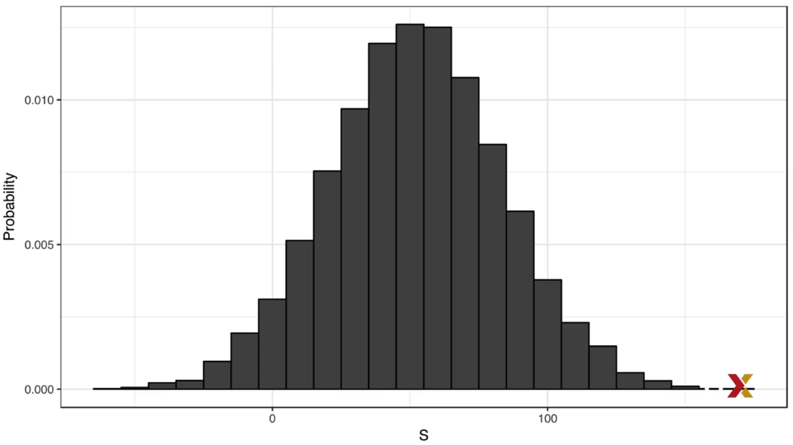
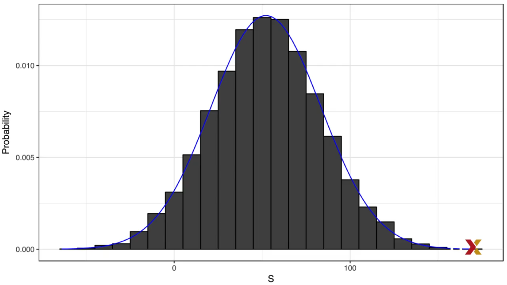

# Sample Models

> The random variable is represented by **S**

## Notation

> Upper case is used to denote **Random numbers**
> Lower case is used to denote **Observed values**

For instance


Where: 

X : Random variable, i.e. any number in a die roll
x : Arbitrary value, i.e. the number we see

So 

## Description

Taking the cassino game total winning can be represented by **S**

We have the next rulette game:

* 18 Red
* 18 Black
* 2 Green

Representing the scenario

```r
colors <- rep(c("Black", "Red", "Green"), c(18,18,2))
```

Now let's simulate the cassino cases:

* Black, then cassino wins $1
* Red, then cassino lose $1

We can simulate the result 1000 like this:

```r
n <- 1000
X <- sample(ifelse(color=="Red",-1,1), n, replace= TRUE)
X[1:10]
# 1, -1, -1, -1, 1, 1, -1, 1, 1, 1
```

Since we know the proportion, we can calculate the result in one single value.

```r
X <- sample((c(-1,1), n, replace = TRUE, prob=c(9/19,10/19)))
S <- sum(X)
S
#346
```

> This is the **Sampling Model**

If the code is executed several times, you'll see it changes everytime.

```r
# 346
...
# 470
...
# 598
...
# 732
```

> This is because S is a **Random Variable**

## Probability Distribution of the Random Variable

The Probability Distribution of the Random Variable: *probability of the observed value falling in any given interval.*

So if we want to know if we are going to loose money, we need to look for the probability of S < 0

So we define the CDF


Where:

* -F is the random variable distribution function

```r
n <- 1000
B <- 10000
S <- replicate(B, {
        X <- sample(c(-1,1), n, replace=TRUE, prob=c(9/19, 10/19))
        sum(X)
    })

# So the question is:
mean(S <= a) 
# 0.046
```

This is the histogram of the distribution



This looks like a normal distribution, so we can model it

```r
mean(S)
# 52.5386
sd(S)
#31.74741
```

We can compare both by using this code

```r
s <- seq(min(S), max(S), length= 100)
normal_density <- data.frame (s= s, f=dnorm(s, mean(s), sd(s)))
data.frames (S= S) %>% ggplot(aes(S, ..density..)) +
    geom_histogram(color="black", binwidth=10) +
    ylab("Probability") +
    geom_line (data=normal_density, mapping=aes(s,f), color="blue")
```



> The average/mean is referred as the  **Expected Value** and the standard deviation as the **Standard Error**

Theorical Statistics provides a way to derive a distribution of a random variable defined as independent draws from a urn, in this example we can show that  follows what is known as [Binomial Distribution](../statistics/distributions/binomial_distribution.md)

That means we don't need to run Monte Carlo Simulations nor use the normal aproximation to know the probability distribution of this, this is only for ilustrative proposes.
