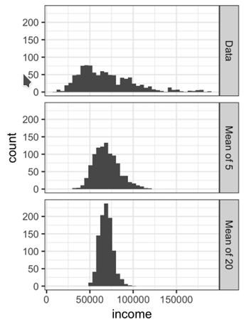

# Sampling Distribution of a Statistic

It refers to the distribution of a sample statistic over many samples drawn from the same population.

* **Sample statistic**, a metric calculated for a sample of data drawn from a larger population.
* **Data distribution**, it's the frequency distribution of individual  values  in a data set.
* **Sampling distribution** it's the frequency distribution of a  sample statistic  over many samples or resamples.

**It is important to distinguish between the distribution of the individual data points, known as  the data distribution, and the distribution of a sample statistic, known as the  sampling distribution.**

The distribution of a sample statistic such as the mean is likely to be more regular and bell-shaped than the distribution of the data itself. The larger the sample the statistic is based on, the more this is true. Also, the larger the sample, the narrower the distribution of the sample statistic.



R Code

```r
library(ggplot2) 
# take a simple random sample
 samp_data  <-  data.frame(income=sample(loans_income,  1000), type='data_dist') 
 # take a sample of means of 5 values
 samp_mean_05  <-  data.frame( income  =  tapply(sample(loans_income,  1000*5), rep(1:1000,  rep(5,  1000)),  FUN=mean), type  =  'mean_of_5') 
 # take a sample of means of 20 values 
 samp_mean_20  <-  data.frame( income  =  tapply(sample(loans_income,  1000*20), rep(1:1000,  rep(20,  1000)),  FUN=mean), type  =  'mean_of_20') # bind the data.frames and convert type to a factor 
 income  <-  rbind(samp_data,  samp_mean_05,  samp_mean_20) income$type  =  factor(income$type, levels=c('data_dist',  'mean_of_5',  'mean_of_20'), labels=c('Data',  'Mean of 5',  'Mean of 20')) 
 # plot the histograms
 ggplot(income,  aes(x=income))  + geom_histogram(bins=40)  + facet_grid(type  ~  .)
```

Python Code

```python
import  pandas  as  pd
import  seaborn  as  sns

sample_data = pd.DataFrame({ 'income':  loans_income.sample(1000), 'type':  'Data', })

sample_mean_05 = pd.DataFrame({ 'income':  [loans_income.sample(5).mean()  for _ in  range(1000)], 'type':  'Mean of 5', })

sample_mean_20 = pd.DataFrame({ 'income':  [loans_income.sample(20).mean()  for _ in  range(1000)], 'type':  'Mean of 20', })

results = pd.concat([sample_data,  sample_mean_05,  sample_mean_20])

g = sns.FacetGrid(results,  col='type',  col_wrap=1,  height=2,  aspect=2)
g.map(plt.hist,  'income',  range=[0,  200000],  bins=40)
g.set_axis_labels('Income',  'Count')
g.set_titles('{col_name}')
```
