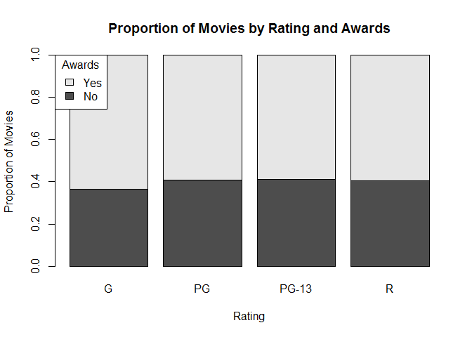

# 100% Stacked Frequency Bar Chart

it is pretty much the same than Grouped frequency bar chart, but we stretch the bar to fill the whole area.

## It Measures

* Relative frequency
* One variable

## Environment Setup


Load data and create a contingency table

``` r
movies <- read.csv("../data/Movies.csv")
awards <- table(movies$Awards,
                movies$Rating)
main_title <- "Count of Movies by Rating and Awards"
rating_title <- "Rating"
movies_title <- "Count of Movies"
print(awards)
```

    ##        
    ##           G  PG PG-13   R
    ##   FALSE  34 203   502 574
    ##   TRUE   59 294   723 849


## Core R Library

``` r
proportions <- apply(awards, 2, function(x){x /sum(x)} )
head(awards)
```

    ##        
    ##           G  PG PG-13   R
    ##   FALSE  34 203   502 574
    ##   TRUE   59 294   723 849

``` r
head(proportions)
```

    ##        
    ##                 G        PG     PG-13         R
    ##   FALSE 0.3655914 0.4084507 0.4097959 0.4033732
    ##   TRUE  0.6344086 0.5915493 0.5902041 0.5966268


``` r
barplot(
  height = proportions,
  main = "Proportion of Movies by Rating and Awards",
  xlab = rating_title,
  ylab = "Proportion of Movies",
  legend = c("No","Yes"),
  args.legend = list(
    x = "topleft",
    title = "Awards"))
```



## Lattice Library


``` r
matrix <- apply(awards, 1, function(x){ x/sum(x)})
proportions <- t(matrix) # Transpose matrix
head(awards)
```

    ##        
    ##          No Yes
    ##   G      34  59
    ##   PG    203 294
    ##   PG-13 502 723
    ##   R     574 849

``` r
head(proportions)
```

    ##        
    ##                No       Yes
    ##   G     0.3655914 0.6344086
    ##   PG    0.4084507 0.5915493
    ##   PG-13 0.4097959 0.5902041
    ##   R     0.4033732 0.5966268

Create a 100% stacked frequency bar chart

``` r
barchart(
  x =proportions,
  stack = TRUE,
  horizontal = FALSE,
  main = "Proportion of Movies by Rating and Award",
  xlab = rating_title,
  ylab = "Proportion of Movies",
  auto.key = list(
    x = 0.70,
    y = 1.05,
    title = "Awards",
    columns = 2,
    text = c("No", "Yes"),
    background = "white"))
```


## GGPlot Library


``` r
ggplot(
  data = movies,
  aes(x =Rating, fill= Awards)) +
  geom_bar(position="fill") + 
  ggtitle("Proportion of Movies by Rating and Awards") +
  ylab("Proportion os Movies") +
  scale_fill_discrete(labels=c("No","Yes"))
```


