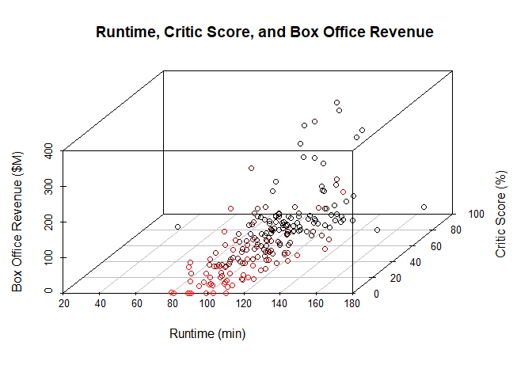
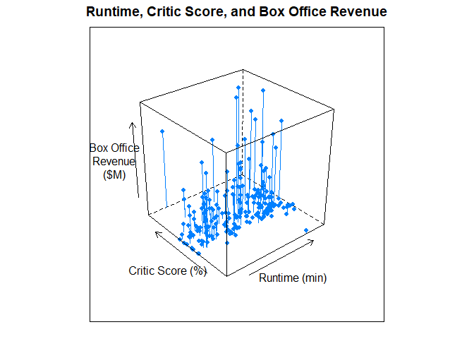

# 3D Scatter Plot

## Highlights

* Scatterplot
* Third-dimension
* Perspective enhacenments


## Environment Setup

``` r
library(tidyverse)
library(RColorBrewer)
library(scatterplot3d)

gradient <- brewer.pal(5, "YlOrRd")
palette(gradient)
movies <- read.csv("../data/movies.csv")
movies2014 <- movies[movies$Year == 2014,]

``` r
getSize <- function(values, scale){
  ratio <- values / max(values)
  size <- sqrt(ratio/pi)
  size * scale
}
```

## Core R Library


``` r
scatterplot3d(
  x = movies2014$Runtime,
  y = movies2014$Critic.Score,
  z = movies2014$Box.Office,
  main = "Runtime, Critic Score, and Box Office Revenue",
  xlab = "Runtime (min)",
  ylab = "Critic Score (%)",
  zlab = "Box Office Revenue ($M)",
  highlight.3d = TRUE)
```



## Lattice Library

``` r
cloud(
  x = Box.Office ~ Critic.Score * Runtime,
  data = movies2014,
  type = c("p","h"), # point and histagram
  pch = 16,
  main = "Runtime, Critic Score, and Box Office Revenue",
  xlab = "Runtime (min)",
  ylab = "Critic Score (%)",
  zlab = "Box Office\nRevenue\n($M)")
```


