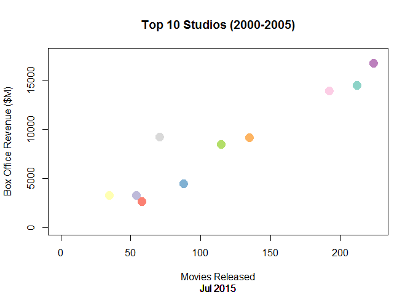

# Animations

## Highlights

* Illussion of motion
* Series of static images
* Display series of images
* Rapidly change images

## Environment Setup

``` r
library(RColorBrewer) 
palette <- brewer.pal(10, "Set3")

studios <- read.csv("../data/Studios.csv")
head(studios)
```

    ##   Period  Release                Studio Count Box.Office
    ## 1      1 May 2000 Warner Bros. Pictures     0          0
    ## 2      1 May 2000      20th Century Fox     0          0
    ## 3      1 May 2000    Universal Pictures     0          0
    ## 4      1 May 2000  Walt Disney Pictures     0          0
    ## 5      1 May 2000    Paramount Pictures     0          0
    ## 6      1 May 2000         Sony Pictures     0          0

## Using Animation to tell a Story

### Highlights

* Changes in value
* Movement over time
* Tell a story with data


``` r
# Get the last period data
period <- studios[studios$Period == 183,]

plot(
  x = period$Count,
  y = period$Box.Office,
  xlim = c(0,225),
  ylim = c(0, 17500),
  col = palette[as.integer(period$Studio)],
  pch = 19,
  cex = 2,
  main = "Top 10 Studios (2000-2005)",
  sub = period$Release,
  xlab = "Movies Released",
  ylab = "Box Office Revenue ($M)")
```



**Create animation function**

``` r
animate <- function(){
  for( i in 1:183){
    period <- studios[studios$Period == i,]
    plot(
      x = period$Count,
      y = period$Box.Office,
      xlim = c(0,225),
      ylim = c(0, 17500),
      col = palette[as.integer(period$Studio)],
      pch = 19,
      cex = 2,
      main = "Top 10 Studios (2000-2005)",
      sub = period$Release,
      xlab = "Movies Released",
      ylab = "Box Office Revenue ($M)")
    
    legend(
      x = "bottomright",
      as.character(levels(period$Studio)),
      col = palette[as.integer(period$Studio)],
      pch = 19,
      cex = 0.75)
  }
}
```

**Load animation package**

``` r
library(animation)
ffmpeg_path <- "H:/Program Files/ffmpeg/bin/ffmpeg.exe"
ffmpeg_opts <- "-r 15 -pix_fmt yuv420p"
# Animation parameters
ani.options(
  interval = 0.067,
  ani.width = 640,
  ani.height = 480)

# Save the animation as a video
saveVideo(
  expr = animate(),
  video.name = "../figs/Studio.mp4",
  ffmpeg = ffmpeg_path,
  other.opts = ffmpeg_opts)
```
[Play Studio Video](../../images/videos/Studio.mp4)

## Using Animation to Improve Perspective

### Highlights

* Change perspective
* See hidden data
* Rotate around y-axis
* Choose correct speed


``` r
library(lattice)
movies <- read.csv("../data/Movies.csv")
movies2014 <- movies[movies$Year == 2014,]

animate2 <- function(){
  for(i in 1:360){
    plot <- cloud(
      x = Box.Office ~Critic.Score * Runtime,
      data = movies2014,
      type = c("p","h"),
      pch = 16,
      main = "Runtime, Critic, and Box Office Revenue",
      xlab = "Runtime\n($)",
      ylab = "Critic\nScore\n(%)",
      zlab = "Box Office\nRevenue\n($M)",
      R.mat = diag(4), #Rotation matrix
      screen = list(
        z = i,
        y = 0,
        x = -60))

      #Draw Plot
      print(plot)
  }
}


saveVideo(
  expr = animate2(),
  video.name = "../figs/Cloud.mp4",
  ffmpeg = ffmpeg_path,
  other.opts = ffmpeg_opts)
```

[Play Cloud Video](../../images/videos/Cloud.mp4)

## Using Animation to Capture Attention

### Highlights

* Motion captures attention
* Calls out details
* Often a distraction
* Adds significant noise


``` r
library(ggplot2)
countries2 <- read.csv("../data/Countries2.csv")

animate3 <- function(){
  for(i in -180:180){
    plot <- ggplot(
      data = countries2) +
      borders(
        database = "world",
        colour = "gray60",
        fill = "grey90") +
      coord_map(
        projection = "ortho",
        orientation = c(0,i,0)) + 
      geom_polygon(
        aes(
          x = Longitude,
          y = Latitude,
          group = Group,
          fill = Count),
        color = "grey60") +
      scale_fill_gradient(
        low = "white",
        high = "red",
        guide = FALSE) +
      xlab("") +
      ylab("") +
      theme(
        panel.background = element_blank(),
        axis.title.x = element_blank(),
        axis.text.x = element_blank(),
        axis.ticks.x = element_blank(),
        axis.title.y = element_blank(),
        axis.text.y = element_blank(),
        axis.ticks.y = element_blank())
      
      print(plot)
  }
}

saveVideo(
  expr = animate3(),
  video.name = "../figs/Globe.mp4",
  ffmpeg = ffmpeg_path
)
```

[Play Globe Video](../../images/videos/Globe.mp4)