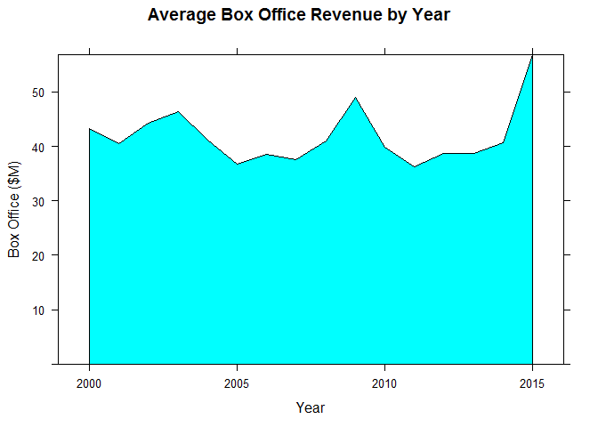

# Area chart

Similar to Line chart, but it displays the are unnderneath the line as solid color

## It Measures

Answer questions related to:

* Change over time
* Volume / summation

## Load time series data

Load time series data

``` r
timeSeries <- read.csv("../data/Timeseries.csv")
```

Display the time series data

``` r
head(timeSeries)
```

    ##   Year Box.Office
    ## 1 2000   43.20957
    ## 2 2001   40.56887
    ## 3 2002   44.26228
    ## 4 2003   46.44941
    ## 5 2004   41.16540
    ## 6 2005   36.78063


## Core R Library

> Area charts are not easy to create on the base library, they will be included into lattice and ggplot examples.

## Lattice Library

### LatticeExtra library

We need to install "**latticeExtra**" library to create area charts.

Installation command `install.packages("latticeExtra")`

Loading the library

``` r
library("latticeExtra")
```

    ## Warning: package 'latticeExtra' was built under R version 3.5.2

    ## Loading required package: RColorBrewer

Area Chart

``` r
xyplot(
  x = Box.Office ~ Year,
  data = timeSeries,
  panel = panel.xyarea,
  ylim = c(0, max(timeSeries$Box.Office)),
  main = "Average Box Office Revenue by Year",
  xlab = "Year",
  ylab = box_office_label)
```




## GGPlot Library


``` r
ggplot(data= timeSeries,
       aes(x= Year, y = Box.Office)) +
  geom_area() +
  ggtitle("Area Box Office Revenue by Year") +
  xlab("Year") +
  ylab(box_office_label)
```


